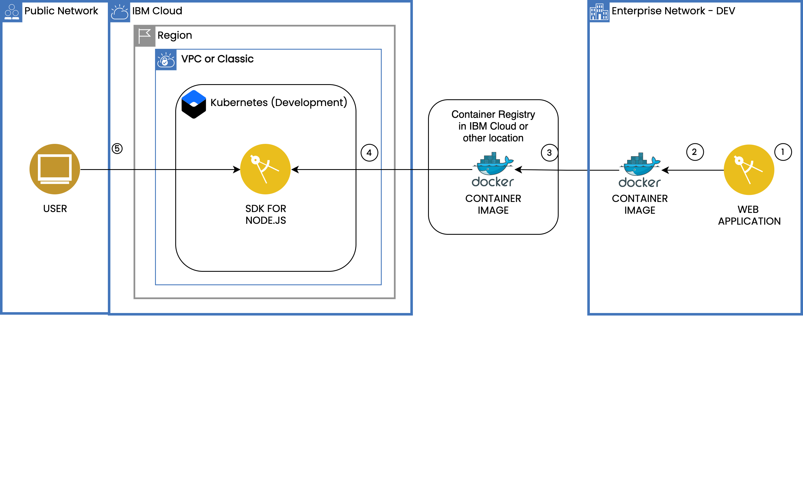
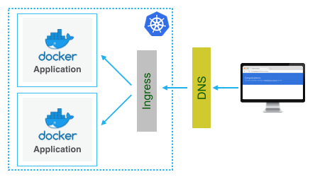

{:step: data-tutorial-type='step'}
{:shortdesc: .shortdesc}
{:new_window: target="_blank"}
{:codeblock: .codeblock}
{:screen: .screen}
{:tip: .tip}
{:pre: .pre}

# Scalable web application on Kubernetes
{: #scalable-webapp-kubernetes}
{: toc-content-type="tutorial"}
{: toc-services="containers, Registry, secrets-manager"}
{: toc-completion-time="2h"}

<!--##istutorial#-->
This tutorial may incur costs. Use the [Cost Estimator](https://{DomainName}/estimator/review) to generate a cost estimate based on your projected usage.
{: tip}

<!--#/istutorial#-->

This tutorial walks you through how to run a web application locally in a container, and then deploy it to a Kubernetes cluster created with [{{site.data.keyword.containershort_notm}}](https://{DomainName}/kubernetes/catalog/cluster). Optionaly you can build a container image and push the image to a private registry. Additionally, you will learn how to <!--##istutorial#-->bind a custom subdomain,<!--#/istutorial#--> monitor the health of the environment, and scale the application.
{: shortdesc}

Containers are a standard way to package apps and all their dependencies so that you can seamlessly move the apps between environments. Unlike virtual machines, containers do not bundle the operating system. Only the app code, run time, system tools, libraries, and settings are packaged inside containers. Containers are more lightweight, portable, and efficient than virtual machines.

For developers looking to kickstart their projects, the {{site.data.keyword.dev_cli_notm}} CLI enables rapid application development and deployment by generating template applications that you can run immediately or customize as the starter for your own solutions. In addition to generating starter application code, Docker container image and CloudFoundry assets, the code generators used by the dev CLI and web console generate files to aid deployment into [Kubernetes](https://kubernetes.io/) environments. The templates generate [Helm](https://github.com/kubernetes/helm) charts that describe the application’s initial Kubernetes deployment configuration, and are easily extended to create multi-image or complex deployments as needed.

## Objectives
{: #scalable-webapp-kubernetes-objectives}

* Deploy a web application to the Kubernetes cluster.
<!--##istutorial#-->
* Bind a custom subdomain.
<!--#/istutorial#-->
* Monitor the logs and health of the cluster.
* Scale Kubernetes pods.

{: caption="Architecture diagram" caption-side="bottom" class="center" }
{: style="text-align: center;"}

1. A developer downloads or clones a starter web application.
1. Optionally build the application to produce a container image.
1. Optionally the image is pushed to a namespace in the {{site.data.keyword.registrylong_notm}}.
1. The application is deployed to a Kubernetes cluster.
1. Users access the application.

<!--##istutorial#-->
## Before you begin
{: #scalable-webapp-kubernetes-prereqs}

This tutorial requires:
* {{site.data.keyword.cloud_notm}} CLI,
   * {{site.data.keyword.containerfull_notm}} plugin (`kubernetes-service`),
* `kubectl` to interact with Kubernetes clusters,
* `Helm 3` to deploy charts.

You will find instructions to download and install these tools for your operating environment in the [Getting started with tutorials](https://{DomainName}/docs/solution-tutorials?topic=solution-tutorials-tutorials) guide.

Note: To avoid the installation of these tools you can use the [{{site.data.keyword.cloud-shell_short}}](https://{DomainName}/shell) from the {{site.data.keyword.cloud_notm}} console.
{: tip}

In addition, make sure you:
- [set up a registry namespace](/docs/Registry?topic=Registry-registry_setup_cli_namespace#registry_namespace_setup)
- and [understand the basics of Kubernetes](https://kubernetes.io/docs/tutorials/kubernetes-basics/).

## Create a Kubernetes cluster
{: #scalable-webapp-kubernetes-create_kube_cluster}
{: step}

{{site.data.keyword.containershort_notm}} delivers powerful tools by combining Docker and Kubernetes technologies, an intuitive user experience, and built-in security and isolation to automate the deployment, operation, scaling, and monitoring of containerized apps in a cluster of compute hosts.

The major portion of this tutorial can be accomplished with a **Free** cluster. Two optional sections relating to Kubernetes Ingress and custom subdomain require a **Standard** cluster.

A minimal cluster with one (1) zone, one (1) worker node and the smallest available size (**Flavor**) is sufficient for this tutorial.

- Create the Kubernetes **version 1.19+** cluster:
   - For Kubernetes on VPC infrastructure, you are required to create a VPC and subnet(s) prior to creating the Kubernetes cluster. You may follow the instructions provided under the [Creating a standard VPC cluster in the console](https://{DomainName}/docs/containers?topic=containers-clusters#clusters_vpcg2_ui).
   - For Kubernetes on Classic infrastructure follow the [Creating a standard classic cluster](https://{DomainName}/docs/containers?topic=containers-clusters#clusters_standard) instructions.
{: #create_cluster}

<!--#/istutorial#-->

<!--##isworkshop#-->
<!--

## Start a new {{site.data.keyword.cloud-shell_notm}}
{: #scalable-webapp-kubernetes-3}
{: step}
1. From the {{site.data.keyword.cloud_notm}} console in your browser, select the account where you have been invited.
1. Click the button in the upper right corner to create a new [{{site.data.keyword.cloud-shell_short}}](https://{DomainName}/shell).

-->
<!--#/isworkshop#-->

## Clone a starter application
{: #scalable-webapp-kubernetes-clone_application}
{: step}

In this section, you will clone a GitHub repo with a simple Helm-based [NodeJS](https://nodejs.dev) starter application with a landing page and two endpoints to get started. You can always extend the starter application based on your requirement.

1. On a terminal, run the below command to clone the [GitHub repository](https://github.com/IBM-Cloud/kubernetes-node-app/) to your machine:
   ```sh
   git clone https://github.com/IBM-Cloud/kubernetes-node-app
   ```
   {: pre}

2. Change to the application directory,
   ```sh
   cd kubernetes-node-app
   ```
   {: pre}

This starter application code contains all the necessary configuration files for local development and deployment to Kubernetes.

## Deploy application to cluster using helm chart
{: #scalable-webapp-kubernetes-deploy}
{: step}

### Deploy the application with Helm 3
{: #scalable-webapp-kubernetes-9}

The container image for the application as already been built and pushed to a public Container Registry. In this section you will deploy the starter application using [Helm](https://helm.sh/). Helm helps you manage Kubernetes applications through Helm Charts, which helps define, install, and upgrade even the most complex Kubernetes application.

Note: If you wish to build and push the application to your own container registry you can use the Docker CLI to do so. The Dockerfile is provided in the repository and images can be pushed to the {{site.data.keyword.registryshort_notm}} or any other container registry.  
{: tip}


1. Define an environment variable named `MYPROJECT` and set the name of the application by replacing the placeholder with your initials:
   ```sh
   export MYPROJECT=<your-initials>kubenodeapp
   ```
   {: pre}

1. Identify your cluster:

   ```bash
   ibmcloud ks cluster ls
   ```
   {: pre}

1. Initialize the variable with the cluster name

   ```bash
   export MYCLUSTER=<CLUSTER_NAME>
   ```
   {: pre}

1. Initialize the `kubectl` cli environment

   ```bash
   ibmcloud ks cluster config --cluster $MYCLUSTER
   ```
   {: pre}
   
   For more information on gaining access to your cluster and to configure the CLI to run kubectl commands, check the [CLI configure](/docs/containers?topic=containers-cs_cli_install#cs_cli_configure) section
   {: tip}

1. You can either use the `default` Kubernetes namespace or create a new namespace for this application. 
   1. If you wish to use the `default` Kubernetes namespace, run the below command to set an environment variable
      ```sh
      export KUBERNETES_NAMESPACE=default
      ```
      {: pre}

   2. If you want to create a new Kubernetes namespace, follow the steps mentioned under [Copying an existing image pull secret](/docs/containers?topic=containers-registry#copy_imagePullSecret) and [Storing the image pull secret in the Kubernetes service account for the selected namespace](/docs/containers?topic=containers-registry#store_imagePullSecret) sections of the Kubernetes service documentation. Once completed, run the below command 
      ```sh
      export KUBERNETES_NAMESPACE=<KUBERNETES_NAMESPACE_NAME>
      ```
      {: pre}

1. Change to the chart directory under your starter application directory:
   ```sh
   cd chart/kubernetesnodeapp
   ```
   {: pre}

1. Install the Helm chart:
   ```sh
   helm<!--##isworkshop#--><!--3--><!--#/isworkshop#--> install $MYPROJECT --namespace $KUBERNETES_NAMESPACE . --set image.repository=icr.io/solution-tutorials/tutorial-scalable-webapp-kubernetes
   ```
   {: pre}

### View the application
{: #scalable-webapp-kubernetes-12}

1. List the Kubernetes services in the namespace:
   ```sh
   kubectl get services -n $KUBERNETES_NAMESPACE
   ```
   {: pre}

1. Locate the service `kubernetesnodeapp` linked to your application.
1. Make note of the the public port the service is listening on. The port is a 5-digit number(e.g., 31569) under `PORT(S)`.
1. Identify a public IP of a worker node with the command below:
   ```sh
   ibmcloud ks workers --cluster $MYCLUSTER
   ```
   {: pre}

1. For VPC the IP addresses of the clusters are private to the VPC. These will not be accessable from your desktop but can be accessed by opening the **Web Terminal** from the Kubernetes cluster console UI.  See [Using the Kubernetes web terminal in your web browser](https://{DomainName}/docs/containers?topic=containers-cs_cli_install#cli_web)
1. Access the application at `http://worker-ip-address:portnumber/`:
   ```sh
   curl http://<worker-ip-address>:<portnumber>
   ```
   {: pre}

## Use the IBM-provided domain for your cluster
{: #scalable-webapp-kubernetes-ibm_domain}
{: step}

In the previous step, the application was accessed with a not standard port. The service was exposed by way of Kubernetes NodePort feature.

Paid clusters come with an IBM-provided domain. This gives you a better option to expose applications with a proper URL and on standard HTTP/S ports.

Use Ingress to set up the cluster inbound connection to the service.

{: class="center"}
{: style="text-align: center;"}

1. Identify your IBM-provided **Ingress domain**
   ```sh
   ibmcloud ks cluster get --cluster $MYCLUSTER
   ```
   {: pre}

   to find
   ```yaml
   Ingress subdomain: mycluster.us-south.containers.appdomain.cloud
   Ingress secret:    mycluster
   ```
   {: screen}

2. Define environment variables `INGRESS_SUBDOMAIN` and `INGRESS_SECRET` to hold the values 
   ```sh
   export INGRESS_SUBDOMAIN=<INGRESS_SUBDOMAIN_FROM_ABOVE_STEP>
   export INGRESS_SECRET=<INGRESS_SECRET>
   ```
   {: pre}

3. Change to your starter application directory and run the below bash command to create an Ingress file `ingress-ibmdomain.yaml` pointing to the IBM-provided domain with support for HTTP and HTTPS. 

   ```sh
   ./ingress.sh ibmdomain_https
   ```
   {: pre}

   The file is generated from a template file `ingress-ibmdomain-template.yaml` under yaml-templates folder by replacing all the values wrapped in the placeholders (`$`) with the appropriate values from the environment variables.
4. Deploy the Ingress
   ```sh
   kubectl apply -f ingress-ibmdomain.yaml
   ```
   {: pre}

5. Open your application in a browser at `https://<nameofproject>.<ingress-sub-domain>/` or run the below command to see the HTTP output
   ```sh
   curl -I https://$MYPROJECT.$INGRESS_SUBDOMAIN
   ```
   {: pre}

<!--##istutorial#-->
## Use your own custom subdomain
{: #scalable-webapp-kubernetes-custom_domain}
{: step}

This section requires you to own a custom domain. You will need to create a `CNAME` subdomain record pointing to the IBM &lt;ingress-sub-domain&gt; for the cluster.  If your domain is `example.com` then the subdomain will be `kubenodeapp.example.com` or something like `abckubeapp.example.com`

### with HTTP
{: #scalable-webapp-kubernetes-15}

1. Create an environment variable pointing to your custom subdomain:
   ```sh
   export CUSTOM_SUBDOMAIN=<my-custom-subdomain.com>
   ```
   {: pre}

1. Create an Ingress file `ingress-customdomain-http.yaml` pointing to your domain from the template file `ingress-customdomain-http-template.yaml`:
   ```sh
   ./ingress.sh customdomain_http
   ```
   {: pre}

1. Deploy the Ingress
   ```sh
   kubectl apply -f ingress-customdomain-http.yaml
   ```
   {: pre}

1. Access your application at `http://<my-custom-subdomain.com>/`

### with HTTPS
{: #scalable-webapp-kubernetes-16}

If you were to try to access your application with HTTPS at this time `https://<my-custom-subdomain.com>/`, you will likely get a security warning from your web browser telling you the connection is not private. You would also get a 404 as the Ingress just configured would not know how to direct HTTPS traffic.

In this section we will use {{site.data.keyword.secrets-manager_short}}.  With {{site.data.keyword.secrets-manager_short}}, you can create, lease, and centrally manage secrets that are used in IBM Cloud services or your custom-built applications. Secrets are stored in a dedicated {{site.data.keyword.secrets-manager_short}} instance and you can use built in features to monitor for expiration, schedule or manually rotate your secrets. In this tutorial, we will use a Kubernetes Operator to retrieve the TLS certificate from {{site.data.keyword.secrets-manager_short}} and inject into a Kubernetes secret.

You can use an existing instance if you already have one or create a new one by following the steps outlined in [Creating a {{site.data.keyword.secrets-manager_short}} service instance](https://{DomainName}/docs/secrets-manager?topic=secrets-manager-create-instance&interface=ui). If creating a new instance, you can enhance the security of your secrets at rest by integrating with the {{site.data.keyword.keymanagementserviceshort}} instance created earlier.

Now, import your certificate into the {{site.data.keyword.secrets-manager_short}} instance.

1. Access the {{site.data.keyword.secrets-manager_short}} service instance from the [Resource List](https://{DomainName}/resources) Under **Services and software**.
2. Click on **Secrets** in the left navigation.
3. Click **Add** and then **TLS certificates**.
4. You can select either **Import certificate** or **Order certificate**. Detailed steps are available in the [Adding SSL or TLS certificates](https://{DomainName}/docs/secrets-manager?topic=secrets-manager-certificates&interface=ui) topic.  If you selected to import a ceritificate, make sure to upload the certificate, private key and intermediate certificate files using the **Add file** button for each.
5. Locate the entry for the imported or ordered certificate and click on it.
   * Verify the domain name matches your custom domain. If you uploaded a wildcard certificate, an asterisk is included in the domain name.
   * Click the **copy** symbol next to the certificate's **ID**.
   * Create an environment variable pointing to the certificate ID:

   ```sh
   export CERTIFICATE_ID=<certificate ID>
   ```
   {: pre}

6. In {{site.data.keyword.secrets-manager_short}}, certificates that you import to the service are imported certificates (imported_cert). Certificates that you order through {{site.data.keyword.secrets-manager_short}} from a third-party certificate authority are public certificates (public_cert). This information is needed in the helm chart you will be using later on to configure the ingress.  Select and run the command that is appropriate for your selection in the previous step.  
   ```sh
   export CERTIFICATE_TYPE=imported_cert
   ```
   {: pre}

   or 

   ```sh
   export CERTIFICATE_TYPE=public_cert
   ```
   {: pre}

7. Click on **Endpoints** in the left navigation.
8. Locate the **Public** endpoint for the **Vault API**.
   * Create an environment variable pointing to the endpoint:

   ```sh
   export SECRETS_MANAGER_URL=<public endpoint>
   ```
   {: pre}

In order to access the {{site.data.keyword.secrets-manager_short}} service instance from your cluster, we will use the [External Secrets Operator](https://external-secrets.io/) and configure a service ID and API key for it.  

1. Create a service ID and set it as an environment variable.
   ```sh
   export SERVICE_ID=`ibmcloud iam service-id-create kubernetesnodeapp-tutorial --description "A service ID for scalable-webapp-kubernetes tutorial." --output json | jq -r ".id"`; echo $SERVICE_ID
   ```
   {: codeblock}

2. Assign the service ID permissions to read secrets from {{site.data.keyword.secrets-manager_short}}.
   ```sh
   ibmcloud iam service-policy-create $SERVICE_ID --roles "SecretsReader" --service-name secrets-manager
   ```
   {: codeblock}

3. Create an API key for your service ID.
   ```sh
   export IBM_CLOUD_API_KEY=`ibmcloud iam service-api-key-create kubernetesnodeapp-tutorial $SERVICE_ID --description "An API key for scalable-webapp-kubernetes tutorial." --output json | jq -r ".apikey"`
   ```
   {: codeblock}

4. Create a secret in your cluster for that API key.
   ```sh
   kubectl -n $KUBERNETES_NAMESPACE create secret generic kubernetesnodeapp-api-key --from-literal=apikey=$IBM_CLOUD_API_KEY
   ```
   {: codeblock}
   
5. Run the following commands to install the External Secrets Operator.
   ```sh
   helm repo add external-secrets https://charts.external-secrets.io
   ```
   {: codeblock}

   ```sh   
   helm install external-secrets external-secrets/external-secrets
   ```
   {: codeblock}

6. Create an Ingress file `ingress-customdomain-https.yaml` pointing to your domain from the template `ingress-customdomain-https-template.yaml`:
   ```sh
   ./ingress.sh customdomain_https
   ```
   {: pre}

7. Deploy the Ingress:
   ```sh
   kubectl apply -f ingress-customdomain-https.yaml
   ```
   {: pre}

8. Validate the secret was created:
   ```sh
   kubectl get secret kubernetesnodeapp-certificate -n $KUBERNETES_NAMESPACE
   ```
   {: pre}

9. Access your application at `https://<my-custom-subdomain.com>/`.
<!--#/istutorial#-->

## Monitor application health
{: #scalable-webapp-kubernetes-monitor_application}
{: step}

1. To check the health of your application, navigate to [clusters](https://{DomainName}/kubernetes/clusters) to see a list of clusters and click on your cluster.
2. Click **Kubernetes Dashboard** to launch the dashboard in a new tab.
3. Select **Nodes** on the left pane, click the **Name** of the nodes and see the **Allocation Resources** to see the health of your nodes.
4. To review the application logs from the container, select **Pods**, **pod-name**, click **View logs** in the action menu in the upper right
5. To exec into the container select **Exec into** in the action menu

## Scale Kubernetes pods
{: #scalable-webapp-kubernetes-scale_cluster}
{: step}

As load increases on your application, you can manually increase the number of pod replicas in your deployment. Replicas are managed by a [ReplicaSet](https://kubernetes.io/docs/concepts/workloads/controllers/replicaset/). To scale the application to two replicas, run the following command:

```sh
kubectl scale deployment kubernetesnodeapp-deployment --replicas=2
```
{: pre}

After a shortwhile, you will see two pods for your application in the Kubernetes dashboard (or with `kubectl get pods`). The Ingress controller in the cluster will handles the load balancing between the two replicas.

With Kubernetes, you can enable [horizontal pod autoscaling](https://kubernetes.io/docs/tasks/run-application/horizontal-pod-autoscale/) to automatically increase or decrease the number of instances of your apps based on CPU.

To create an autoscaler and to define your policy, run the below command
```sh
kubectl autoscale deployment kubernetesnodeapp-deployment --cpu-percent=5 --min=1 --max=5
```
{: pre}

Once the autoscaler is successfully created, you should see
`horizontalpodautoscaler.autoscaling/<deployment-name> autoscaled`

## Remove resources
{: #scalable-webapp-kubernetes-0}
{: step}

* Delete the resources applied:
   <!--##istutorial#-->
   ```sh
   kubectl delete -f ingress-customdomain-https.yaml
   kubectl delete -f ingress-customdomain-http.yaml
   kubectl delete -f ingress-ibmdomain.yaml
   ```
   {: pre}

   <!--#/istutorial#-->
   <!--##isworkshop#-->
   <!--
   ```sh
   kubectl delete -f ingress-ibmdomain.yaml
   ```
   {: pre}

   -->
   <!--#/isworkshop#-->
* Delete the Kubernetes artifacts created for this application:
   ```sh
   helm<!--##isworkshop#--><!--3--><!--#/isworkshop#--> uninstall $MYPROJECT --namespace $KUBERNETES_NAMESPACE
   ```
   {: pre}

<!--##istutorial#-->  
* Delete the Kubernetes secret:
   ```sh
   kubectl -n $KUBERNETES_NAMESPACE delete secret kubernetesnodeapp-api-key 
   ```
   {: pre}

* Delete the External Secrets Operator:
   ```sh
   helm uninstall external-secrets
   ```
   {: pre}

* Delete the service ID:

   ```sh
   ibmcloud iam service-id-delete $SERVICE_ID
   ```
   {: pre}

* Delete the cluster.
<!--#/istutorial#-->

## Related content
{: #scalable-webapp-kubernetes-20}

* [{{site.data.keyword.containerlong_notm}}](https://{DomainName}/docs/containers)
* [Continuous Deployment to Kubernetes](https://{DomainName}/docs/solution-tutorials?topic=solution-tutorials-continuous-deployment-to-kubernetes#continuous-deployment-to-kubernetes)
* [Scaling a deployment](https://kubernetes.io/docs/concepts/workloads/controllers/deployment/#scaling-a-deployment)
* [Horizontal Pod Autoscaling](https://kubernetes.io/docs/tasks/run-application/horizontal-pod-autoscale-walkthrough/)
