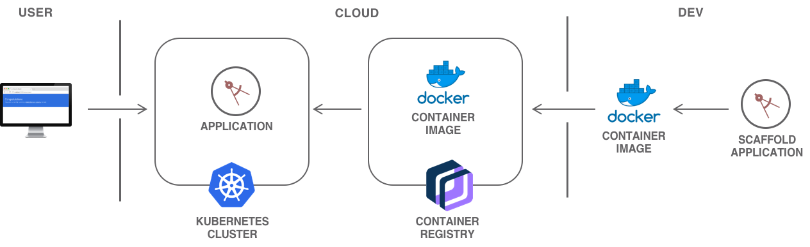

---


copyright:
  years: 2017
lastupdated: "2017-09-28"

---

{:shortdesc: .shortdesc}
{:new_window: target="_blank"}
{:codeblock: .codeblock}
{:screen: .screen}
{:tip: .tip}
{:pre: .pre}

# Scalable web application on Kubernetes
This tutorial is a walkthrough of how to scaffold a Java web application, run it locally in a container and then deploy it to a IBM Cloud Kubernetes cluster. Additionally, bind a custom domain, monitor the health of the environment and scale.

## Objectives
* Create a Kubernetes cluster
* Scaffold a starter Java application
* Deploy application to cluster
* Bind custom domain
* Monitor cluster health
* Scale Kubernetes pods



## Before you begin
{: #prereqs}

* [Container registry with namespace configured](https://console.bluemix.net/docs/services/Registry/registry_setup_cli_namespace.html).
* [IBM Cloud Developer Tools](https://github.com/IBM-Bluemix/ibm-cloud-developer-tools) - Script to install docker, kubectl, helm, bx cli and required plugins.
* [Basic understanding of Kubernetes](https://kubernetes.io/docs/tutorials/kubernetes-basics/)


## Create a Kubernetes cluster

{: #create_kube_cluster}

1. Create a Kubernetes cluster from the [Bluemix Catalog](https://console.bluemix.net/containers-kubernetes/launch). You will create a **free** cluster of type **Lite** and still be able to follow the guide and skip the appropriate sections. To bind a custom domain, You must create a **Paid** cluster of type **Standard**.

  **Note:** For the ease of use, Check the configuration details like Number of CPUs, Memory and Number of Worker Nodes you will be getting under Lite and Standard plans.

   
2. Check the status of your **Cluster** and **Worker Nodes** and wait for them to be **ready**.

In the next step, you will configure **kubectl** to point to your newly created cluster going forward.

### Configure kubectl and helm

[kubectl](https://kubernetes.io/docs/user-guide/kubectl-overview/) is a a command line tool to interact with a Kubernetes cluster.

1. Use `bx login` to login interactively. Provide the Organization (Org), Region and Space under which the cluster is created. You can reconfirm the details by running `bx target` command.
2. Once the cluster is ready, retrieve the cluster configuration
   ```
   bx cs cluster-config <cluster-name>
   ```
   {: pre}
3. Copy and paste the **export** command to set the KUBECONFIG environment variable as directed. To verify whether the KUBECONFIG environment variable is set properly or not, run this command
  `echo $KUBECONFIG`

4. Check that the `kubectl` command is correctly configured
   ```
   kubectl cluster-info
   ```
   {: pre}
5. [Helm](https://helm.sh/) helps you manage Kubernetes applications through Helm Charts — Helm Charts helps you define, install, and upgrade even the most complex Kubernetes application. Initialize Helm in your cluster.

   ```
   helm init
   ```
   {: pre}

## Create a Java starter application

{: #create_application}

The `bx dev` tooling greatly cuts down on development time by generating application starters with all the necessary boilerplate, build and configuration code, so that you can start coding business logic faster.

1. Start the `bx dev` wizard.
   ```
   bx dev create
   ```
   {: pre}
2. Select `Web App` > `Basic Web` > `Java - MicroProfile / JavaEE`.
3. Enter a name for your project.
4. Enter unique hostname for your project.
   > The hostname will be used if you deploy your application as a Cloud Foundry app <hostname>.mybluemix.net
5. Select **n** to skip adding services.


This will generate a starter application complete with the code and all the necessary configuration files for local development, and deployment to cloud on CloudFoundry or Kubernetes. For an overview of the files generated, see [Project Contents Documentation](https://console.bluemix.net/docs/cloudnative/java_project_contents.html).


### Build the Java application

You can build and run the application as you normally would using `mvn` for local development.  You can also build a docker image and run the application in a container to ensure consistent execution locally and on the cloud. Use the steps below to build your docker image.

1. Ensure your local Docker engine is started.
   ```
   docker ps
   ```
   {: pre}
2. Change to the generated project directory.
   ```
   cd <project name>
   ```
   {: pre}
3. Build the application.
   ```
   bx dev build
   ```
   {: pre}

   > This might take a few minutes to run as all the application dependencies are downloaded and a *Docker image* is built which contains your application and all the required environment.

### Run the Java application locally

1. Run the container.
   ```
   bx dev run
   ```
   {: pre}

   > This will use your local Docker engine to run the docker image built by the previous step.
2. Once your container starts, visit http://localhost:9080/[nameofproject]
  

## Deploy application to cluster

{: #deploy}

In this section, we will first push the Docker image to the IBM Cloud private container registry, and then create a Kubernetes deployment pointing to that image.

1. Find your **namespace** by listing all the namespace in the registry.
   ```
   bx cr namespaces
   ```
   {: pre}
   If you have a namespace, make note of the name for use later. If you don't have one, create it.

   ```
   bx cr namespace-add <name>
   ```
   {: pre}
2. Find the **Container Registry** information by running.
   ```
   bx cr info
   ```
   {: pre}
3. Deploy to your Kubernetes cluster:
   ```
   bx dev deploy -t container
   ```
   {: pre}
4. You will be prompted to enter **image name**.
   Image name will be in the following format: `<registry_url>/<namespace>/<projectname>`
   For example: `registry.ng.bluemix.net/mynamespace/myjavawebapp`
5. Next, you will be prompted to enter your **cluster name**.
6. Wait a few minutes for your application to be deployed.
7. Retrieve the **public IP** of your cluster workers.
   ```
   bx cs workers <your-cluster>
   ```
   {: pre}
   ```
   OK
   ID                                                 Public IP        Private IP      Machine Type   State    Status
   kube-dal12-cr4a8d8f9f64dedededededdwwdec69a72-w1   169.21.32.14   10.184.220.82   u1c.2x4        normal   Ready
   ```
   {: screen}
8. Retrieve the **port** assigned to your application.
   ```
   kubectl get services
   ```
   {: pre}
   and locate your service in the list:
   ```
   NAME                    CLUSTER-IP    EXTERNAL-IP   PORT(S)                         AGE
   myjavawebapp-service   10.10.10.17   <nodes>       9080:32321/TCP,9443:31555/TCP   2m
   kubernetes              10.10.10.1    <none>        443/TCP                         1d
   ```
   {: screen}
   alternatively you can use `kubectl describe service [service-name]`. In this example, the port is 32321.
9. Access the application
   `http://worker-ip-address:portnumber/nameofproject`


## Use the IBM-provided domain for your cluster

{: #ibm_domain}

In the previous step, the application was accessed with a not standard port. The service was exposed via Kubernetes NodePort feature.

Paid clusters come with an IBM-provided domain. This gives you a better option to expose applications with a proper URL and on standard HTTP/S ports.

Use Ingress to set up the cluster inbound connection to the service.


1. Identify your IBM-provided **Ingress domain**
   ```
   bx cs cluster-get <cluster-name>
   ```
   {: pre}
   to find
   ```
   Ingress subdomain:	mycluster.us-south.containers.mybluemix.net
   Ingress secret:		mycluster
   ```
   {: screen}
2. Create an Ingress file `ingress-ibmdomain.yml` pointing to your domain with support for HTTP and HTTPS. Use the following file as a template, replacing all the values wrapped in <> with the appropriate values from the above output.
   ```
   apiVersion: extensions/v1beta1
   kind: Ingress
   metadata:
     name: ingress-for-ibmdomain-http-and-https
   spec:
     tls:
     - hosts:
       -  <ingress-sub-domain>
       secretName: <ingress-secret>
     rules:
     - host: <ingress-sub-domain>
       http:
         paths:
         - path: /
           backend:
             serviceName: <service-name>
             servicePort: 9080
   ```
3. Deploy the Ingress

   ```
   kubectl apply -f ingress-ibmdomain.yml
   ```
   {: pre}
4. Access your application at `https://<ingress-sub-domain>/<nameofproject>`

## Use your own custom domain

{: #custom_domain}

To use your custom domain, you need to update your DNS records with either a CNAME record pointing to your IBM-provided domain or an A record pointing to the portable public IP address of the IBM-provided Ingress. Given a paid cluster comes with fixed IP addresses, an A record is a good option.

Refer to https://console.bluemix.net/docs/containers/cs_apps.html#custom_domain_cert

### with HTTP

1. Create an Ingress file `ingress-customdomain-http.yml` pointing to your domain:
   ```
   apiVersion: extensions/v1beta1
   kind: Ingress
   metadata:
     name: ingress-for-customdomain-http
   spec:
     rules:
     - host: <my-custom-domain.com>
       http:
         paths:
         - path: /
           backend:
             serviceName: <service-name>
             servicePort: 9080
   ```
2. Deploy the Ingress
   ```
   kubectl apply -f ingress-customdomain-http.yml
   ```
   {: pre}
3. Access your application at `http://<customdomain>/<nameofproject>`

### with HTTPS

If you were to try to access your application with HTTPS at this time `https://<customdomain>/<nameofproject>`, you will likely get a security warning from your web browser telling you the connection is not private. You would also get a 404 as the Ingress we just configured would not know how to direct HTTPS traffic.

1. Obtain a trusted SSL certificate for your domain. You'll need the certificate and the key:
  https://console.bluemix.net/docs/containers/cs_apps.html#custom_domain_cert
   > You can use [Let's Encrypt](https://letsencrypt.org/) to generate trusted certificate.
2. Save the cert and the key in base64 ascii format files.
3. Create a TLS secret to store the cert and the key
   ```
   kubectl create secret tls my-custom-domain-secret-name --cert=<custom-domain.cert> --key=<custom-domain.key>
   ```
   {: pre}
4. Create an Ingress file `ingress-customdomain-https.yml` pointing to your domain:
   ```
   apiVersion: extensions/v1beta1
   kind: Ingress
   metadata:
     name: ingress-customdomain-https
   spec:
     tls:
     - hosts:
       - <my-custom-domain.com>
       secretName: <my-custom-domain-secret-name>
     rules:
     - host: <my-custom-domain.com>
       http:
         paths:
         - path: /
           backend:
             serviceName: <service-name>
             servicePort: 9080
   ```
5. Deploy the Ingress
   ```
   kubectl apply -f ingress-customdomain-https.yml
   ```
   {: pre}
6. Access your application at `https://<customdomain>/<nameofproject>`

## Monitor application health

{: #monitor_application}

1. Use the **Kubernetes console** to watch your application health
   ```
   kubectl proxy
   ```
   {: pre}
   then access the console at http://127.0.0.1:8001/ui
2. Select **Nodes** and see the **Allocation Resources** to see the health of your nodes.
   

## Scale Kubernetes pods

{: #scale_cluster}

As load increase you can manually scale the number of pods in your application deployment.

To scale to 2 replicas, run the following command.

   ```
   kubectl scale deployment <nameofproject>-deployment --replicas=2
   ```
    {: pre}

Ingress will handle the load balancing between the two replicas.

Refer to Kubernetes documentation for manual and automatic scaling:

   * https://kubernetes.io/docs/concepts/workloads/controllers/deployment/#scaling-a-deployment
   * https://kubernetes.io/docs/tasks/run-application/horizontal-pod-autoscale-walkthrough/

## Further reading

* [IBM Container Service documentation](https://console.bluemix.net/docs/containers/cs_planning.html#cs_planning)
