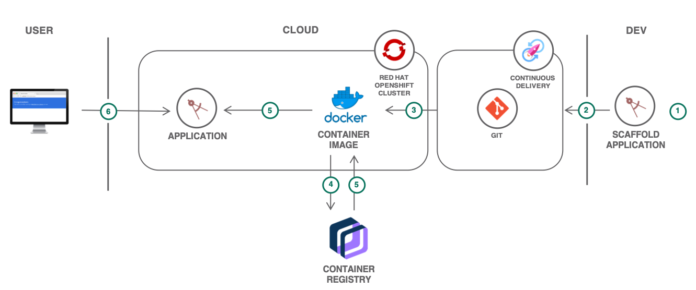

{{site.data.keyword.attribute-definition-list}}


# Scalable web application on {{site.data.keyword.openshiftshort}}
{: #scalable-webapp-openshift}
{: toc-content-type="tutorial"}
{: toc-services="openshift, containers, Registry"}
{: toc-completion-time="2h"}

<!--##istutorial#-->
This tutorial may incur costs. Use the [Cost Estimator](/estimator) to generate a cost estimate based on your projected usage.
{: tip}

<!--#/istutorial#-->

This tutorial walks you through how to deploy an application to a [{{site.data.keyword.openshiftlong_notm}}](/kubernetes/catalog/about?platformType=openshift) cluster from a remote Git repository, expose the application on a route, monitor the health of the environment, and scale the application. Additionally, you will learn how to use a private container registry, deploy an application from a private Git repository and bind a custom domain to the application.
{: shortdesc}

With {{site.data.keyword.openshiftlong_notm}}, you can create Kubernetes clusters with worker nodes that come installed with the OpenShift Container Platform. For more information about the OpenShift Container Platform architecture, see the [{{site.data.keyword.redhat_openshift_notm}} docs](https://docs.openshift.com/container-platform/4.13/architecture/architecture.html){: external}. You get all the [advantages of a managed service](/docs/openshift?topic=openshift-responsibilities_iks) for your cluster.

## Objectives
{: #scalable-webapp-openshift-objectives}

* Deploy a web application to the {{site.data.keyword.openshiftlong_notm}} cluster.<!-- markdownlint-disable-line -->
<!--##istutorial#-->
* Bind a custom domain.<!-- markdownlint-disable-line -->
<!--#/istutorial#-->
* Monitor the logs and health of the cluster.
* Scale {{site.data.keyword.openshiftshort}} pods.


{: caption="Figure 1. Architecture diagram of the tutorial" caption-side="bottom"}
{: style="text-align: center;"}


1. The developer deploys a web application using the code from a remote Git repository. Optionally, the developer can also push the code to a private Git repository on {{site.data.keyword.Bluemix_notm}}.
2. A container image is built from the code.
3. The image is pushed to a local container registry that comes with the cluster or to a namespace in the {{site.data.keyword.registrylong_notm}}.
4. The application is deployed to a {{site.data.keyword.openshiftshort}} cluster by pulling the image.
5. Users access the application through a public route.

<!--##istutorial#-->
## Before you begin
{: #scalable-webapp-openshift-prereqs}

This tutorial requires:
* {{site.data.keyword.cloud_notm}} CLI,
   * {{site.data.keyword.containerfull_notm}} plugin (`kubernetes-service`),
   * (optional) {{site.data.keyword.registryshort_notm}} plugin (`container-registry`)
* Docker engine,
* `oc` to interact with {{site.data.keyword.openshiftshort}},
* `git` to clone the source code repository,
* (optional) {{site.data.keyword.cloud_notm}} GitLab configured with your **SSH key**. Check the instructions under the `Generate an SSH key pair` and `Add an SSH key to your GitLab account` sections of the [documentation here](https://us-south.git.cloud.ibm.com/help/user/ssh.md)

You will find instructions to download and install these tools for your operating environment in the [Getting started with tutorials](/docs/solution-tutorials?topic=solution-tutorials-tutorials) guide.

To avoid the installation of these tools, you can use the [{{site.data.keyword.cloud-shell_short}}](/shell) from the {{site.data.keyword.cloud_notm}} console. Use `oc version` to ensure the version of the {{site.data.keyword.openshiftshort}} CLI matches your cluster version (`4.13.x`). If they do not match, install the matching version by following [these instructions](/docs/solution-tutorials?topic=solution-tutorials-tutorials#getting-started-cloud-shell).
{: note}

In addition, make sure you [set up a registry namespace](/docs/Registry?topic=Registry-registry_setup_cli_namespace#registry_namespace_setup).
<!--#/istutorial#-->

<!--##isworkshop#-->
<!--
## Before you begin
{: #scalable-webapp-openshift-prereqs-workshop}

This tutorial requires:
* {{site.data.keyword.cloud_notm}} GitLab configured with your **SSH key**. Check the instructions under the `Generate an SSH key pair` and `Add an SSH key to your GitLab account` sections of the [documentation here](https://us-south.git.cloud.ibm.com/help/ssh/README)

## Start a new {{site.data.keyword.cloud-shell_notm}}
{: #scalable-webapp-openshift-2}
{: step}
1. From the {{site.data.keyword.cloud_notm}} console in your browser, select the account where you have been invited.
1. Click the button in the upper right corner to create a new [{{site.data.keyword.cloud-shell_short}}](/shell).
-->
<!--#/isworkshop#-->

<!--##istutorial#-->
<!--This section is identical in all openshift tutorials, copy/paste any changes-->
## Create an {{site.data.keyword.openshiftshort}} cluster
{: #scalable-webapp-openshift-create_openshift_cluster}
{: step}

With {{site.data.keyword.openshiftlong_notm}}, you have a fast and secure way to containerize and deploy enterprise workloads on Kubernetes clusters. {{site.data.keyword.openshiftshort}} clusters builds on Kubernetes container orchestration that offers consistency and flexibility for your development lifecycle operations.

In this section, you will provision a {{site.data.keyword.openshiftlong_notm}} cluster in one (1) zone with two (2) worker nodes:

1. Create an {{site.data.keyword.openshiftshort}} cluster from the [{{site.data.keyword.Bluemix}} catalog](/kubernetes/catalog/create?platformType=openshift).
2. Under **Infrastructure** choose **VPC** or **Classic**,
   - For {{site.data.keyword.openshiftshort}} on VPC infrastructure, you are required to create a VPC and one subnet prior to creating the cluster. Create or use an existing VPC keeping in mind the following requirements:
      - One subnet that can be used for this tutorial, take note of the subnet's zone and name.
      - A public gateway is attached to the subnet, for more details, see [Creating VPC clusters](/docs/openshift?topic=openshift-cluster-create-vpc-gen2&interface=ui).
3. Under **Location**,
   - For {{site.data.keyword.openshiftshort}} on VPC infrastructure
      - Uncheck the inapplicable zones and subnets.
      - In the desired zone verify the desired subnet name and if not present click the edit pencil to select the desired subnet name
   - For {{site.data.keyword.openshiftshort}} on Classic infrastructure:
      - Select a **Resource group**.
      - Select a **Geography**.
      - Select **Single zone** as **Availability**.
      - Choose a **Worker zone**.
      - For more details, see the [Creating classic clusters](/docs/openshift?topic=openshift-cluster-create-classic) instructions.
4. Set the **OpenShift version** to **4.13.x**.
5. Select your **OpenShift Container Platform (OCP) license**.      
6. Under **Worker pool**,
   - Select **4 vCPUs 16GB Memory** as the flavor.
   - Select **2** Worker nodes per data center for this tutorial (if you selected classic infrastructure: Leave **Encrypt local disk**).
7. Under **Cluster details**:
   - Set **Cluster name** to `myopenshiftcluster`.
   - Select a **Resource group** (if you selected VPC infrastructure).
8. Click **Create** to provision an {{site.data.keyword.openshiftshort}} cluster.

Take a note of the resource group selected above. This same resource group will be used for all resources in this lab.
{: note}

### Configure CLI
{: #scalable-webapp-openshift-4}

In this step, you'll configure `oc` to point to your newly created cluster. The [{{site.data.keyword.openshiftshort}} Container Platform CLI](https://docs.openshift.com/container-platform/4.13/cli_reference/openshift_cli/getting-started-cli.html){: external} exposes commands for managing your applications, as well as lower level tools to interact with each component of your system. The CLI is available using the `oc` command.

1. When the cluster is ready, click on **OpenShift web console** to open the console.
2. On the web console, from the dropdown menu in the upper right of the page, click **Copy Login Command** and then click the **Display Token** link.
3. **Copy** the text found under **Log in with this token**.
4. Once logged-in using the `oc login` command, run the command below to see all the namespaces in your cluster.
   ```sh
   oc get ns
   ```
   {: pre}

<!--#/istutorial#-->

<!--##isworkshop#-->
<!--
## Configure the access to your cluster
{: #scalable-webapp-openshift-access-cluster}
{: step}

In this step, you'll configure `oc` to point to the cluster assigned to you. The [{{site.data.keyword.openshiftshort}} Container Platform CLI](https://docs.openshift.com/container-platform/4.13/cli_reference/openshift_cli/getting-started-cli.html){: external} exposes commands for managing your applications, as well as lower level tools to interact with each component of your system. The CLI is available using the `oc` command.

1. Check the version of the {{site.data.keyword.openshiftshort}} CLI:
   ```sh
   oc version
   ```
   {: pre}

1. If the version does not match your cluster version, install the matching version by following [these instructions](/docs/solution-tutorials?topic=solution-tutorials-tutorials#getting-started-cloud-shell).
1. Navigate to your cluster from the [cluster list](/kubernetes/clusters?platformType=openshift) and click on the **Access** tab under the cluster name.
1. Open the **{{site.data.keyword.openshiftshort}} web console**.
1. From the dropdown menu in the upper right of the page, click **Copy Login Command**. Paste the copied command in your local terminal.
1. Once logged-in using the `oc login` command, run the command below to see all the namespaces in your cluster
   ```sh
   oc get ns
   ```
   {: pre}

-->
<!--#/isworkshop#-->

## Create a new {{site.data.keyword.openshiftshort}} application
{: #scalable-webapp-openshift-create_openshift_app}
{: step}

In this section, you will create a {{site.data.keyword.openshiftshort}} project and then deploy an application from a [GitHub repository](https://github.com/IBM-Cloud/openshift-node-app/){: external}. The code for this application is a simple [Node.js](https://nodejs.org/en){: external} landing page and two API endpoints to get started. You can always extend this application based on your own exploration requirements.

### Create a project
{: #scalable-webapp-openshift-create-project}

A Kubernetes namespace provides a mechanism to scope resources in a cluster. In {{site.data.keyword.openshiftshort}}, a project is a Kubernetes namespace with additional annotations.

1. Define an environment variable named `MYPROJECT` and set the application name by replacing `<your-initials>` with your own initials :
   ```sh
   export MYPROJECT=<your-initials>-openshiftapp
   ```
   {: pre}

2. Create a new project.
   ```sh
   oc new-project $MYPROJECT
   ```
   {: pre}

   After creating a project using the above command, you are automatically switched to that project and all commands that follow run in the context of that project. If you need to switch projects or go back into that project at a later stage, use the `oc project $MYPROJECT` command.
   {: tip}

### Deploy an application
{: #scalable-webapp-openshift-deploy-app}

With the `oc new-app` command you can create applications from source code in a local or remote Git repository.

1. Create an application using the `docker` build strategy to build a container image from a Dockerfile in the repo. _You are setting the application name to the project name for simplicity._
   ```sh
   oc new-app https://github.com/IBM-Cloud/openshift-node-app --name=$MYPROJECT --strategy=docker --as-deployment-config
   ```
   {: pre}

   If a Jenkins file exists in the root or specified context directory of the source repository when creating a new application, {{site.data.keyword.openshiftshort}} generates a `pipeline` build strategy. Otherwise, it generates a `source` build strategy. You can always override the build strategy by setting the `--strategy` flag.
   {: tip}

2. To check the builder container image creation and pushing to the internal {{site.data.keyword.openshiftshort}} Container Registry (OCR), run the command below.
   ```sh
   oc logs -f buildconfig/$MYPROJECT
   ```
   {: pre}

   Your cluster is set up with the internal {{site.data.keyword.openshiftshort}} Container Registry so that {{site.data.keyword.openshiftshort}} can automatically build, deploy, and manage your application lifecycle from within the cluster. 
   {: tip}

3. Wait until the build is successful and the image is pushed. You can check the status of deployment and service by running the command below.
   ```sh
   oc status
   ```
   {: pre}

### Access the application through IBM provided domain
{: #scalable-webapp-openshift-16}

To access the application, you need to create a route. A route announces your service to the world.

1. Create a route by running the command below in a terminal.
   ```sh
   oc expose service/$MYPROJECT
   ```
   {: pre}

2. You can access the application through an IBM provided domain. Run the command below to obtain the URL.
   ```sh
   oc get route/$MYPROJECT
   ```
   {: pre}

3. Copy the value for the hostname under **HOST/PORT** value and paste the URL in a browser to see your application in action at `http://<hostname>`. Make sure to use `http` in the URL. 

4. Set an environment variable pointing to the hostname.
   ```sh
   export HOST=<hostname>
   ```
   {: pre}

### Secure the default IBM provided domain route
{: #scalable-webapp-openshift-secure_default_route}

1. To create a secured HTTPS route encrypted with the default certificate for {{site.data.keyword.openshiftshort}}, you can use the `create route` command.
   ```sh
   oc create route edge $MYPROJECT-https --service=$MYPROJECT --port=3000
   ```
   {: pre}

2. For the HTTPS HOST URL, run `oc get routes`. Copy and paste the URL with HTTPS(`https://<HOST>`) next to the route _$MYPROJECT-https_ in a browser. This time you can use `https` in the URL.
   
## Monitor the app
{: #scalable-webapp-openshift-monitor_application}
{: step}

In this section, you will learn to monitor the health and performance of your application.
OpenShift Container Platform ships with a pre-configured and self-updating monitoring and alerting stack.

1. From a terminal, run the command with the route URL to generate a load. The command will endlessly send requests to the application.
   ```sh
   while sleep 1; do curl --max-time 2 -s http://$HOST/load/50; done
   ```
   {: pre}

2. In the **OpenShift web console**, switch to the **Administrator** view.
3. Under **Observe**, select **Metrics**.
4. In the expression box, enter the expression below, replace `<MYPROJECT>` by your project name and click **Run queries** to see the total container cpu usage in seconds in a graph.
   ```sh 
   sum(node_namespace_pod_container:container_cpu_usage_seconds_total:sum_irate{namespace="<MYPROJECT>"}) by (container)
   ```
   {: codeblock}
   
5. Under **Observe**, select **Dashboards**.
6. Click on the **Dashboard** dropdown and select **Kubernetes / Compute Resources / Namespace (Workloads)**.
7. Change **Namespace** to your project.
8. Set **Time Range** to **Last 5 minutes**.
9. Check the CPU and memory usage.
10. Stop the above script using `control+C`. 
11. For logging, you can use the in-built `oc logs` command. Check [viewing logs for a resource](https://docs.openshift.com/container-platform/4.13/cli_reference/openshift_cli/developer-cli-commands.html#oc-logs){: external} to learn about the usage of `oc logs`.

   You can also provision and use {{site.data.keyword.la_full_notm}} and {{site.data.keyword.mon_full_notm}} services for logging and monitoring your {{site.data.keyword.openshiftshort}} application. Follow the instructions mentioned in [this link](/docs/openshift?topic=openshift-health) to setup logging and monitoring add-ons to monitor cluster health.
   {: tip}

## Scale the app
{: #scalable-webapp-openshift-scaling_app}
{: step}

In this section, you will learn how to manually and automatically scale your application.

### Manual scaling
{: #scalable-webapp-openshift-25}

1. You can achieve manual scaling of your pods with `oc scale` command. The command sets a new size for a deployment configuration or replication controller
   ```sh
   oc scale dc/$MYPROJECT --replicas=2
   ```
   {: pre}

2. You can see a new pod being provisioned by running `oc get pods` command.
3. Rerun the [Monitoring](/docs/solution-tutorials?topic=solution-tutorials-scalable-webapp-openshift#scalable-webapp-openshift-monitor_application) step to see the updated metrics.

### Autoscaling
{: #scalable-webapp-openshift-24}

You can use a horizontal pod autoscaler (HPA) to specify how {{site.data.keyword.openshiftshort}} should automatically increase or decrease the scale of a deployment configuration(dc) or replication controller(rc), based on metrics collected from the pods that belong to that `dc` or `rc`.

1. Before you can setup autoscaling for your pods, you first need to set resource limits on the pods running in the cluster. Limits allows you to choose the minimum and maximum CPU and memory usage for a pod. You can set the limits and requests on a container using `oc set resources` command.
   ```sh
   oc set resources dc/$MYPROJECT --limits=cpu=250m,memory=512Mi --requests=cpu=100m,memory=256Mi
   ```
   {: pre}

   To verify, run `oc describe dc/$MYPROJECT` and look for `Limits` and `Requests`.
2. To create an autoscaler, you need to run the `oc autoscale` command with the lower(min) and upper(max) limits for the number of pods that can be set by the autoscaler and the target average CPU utilization (represented as a percent of requested CPU) over all the pods. For testing, let's set `--cpu-percent` to 5%.
   ```sh
   oc autoscale dc/$MYPROJECT \
    --min=1 \
    --max=5 \
    --cpu-percent=5
   ```
   {: pre}

4. Rerun the [Monitoring](/docs/solution-tutorials?topic=solution-tutorials-scalable-webapp-openshift#scalable-webapp-openshift-monitor_application) step to generate load on the application.
3. You can see new pods being provisioned by running `oc get pods --watch` command or by looking at the application in the web console.
5. Remove the auto scaler:
   ```sh
   oc delete hpa/$MYPROJECT
   ```
   {: pre}

## (Optional) Build and push the container image to {{site.data.keyword.registryshort_notm}}
{: #scalable-webapp-openshift-12}
{: step}

In this section, you will learn how to use a remote private {{site.data.keyword.registryshort_notm}} to store the created container images.

{{site.data.keyword.registrylong_notm}} provides a multi-tenant, highly available, scalable, and encrypted private image registry that is hosted and managed by {{site.data.keyword.IBM_notm}}. You can use {{site.data.keyword.registrylong_notm}} by setting up your own image namespace and pushing container images to your namespace.

1. To identify your {{site.data.keyword.registryshort_notm}} URL, run:
   ```sh
   ibmcloud cr region
   ```
   {: pre}

2. Define an environment variable named `MYREGISTRY` pointing to the registry such as:
   ```sh
   export MYREGISTRY=us.icr.io
   ```
   {: pre}

3. Pick one of your existing registry namespaces or create a new one. To list existing namespaces, use:
   ```sh
   ibmcloud cr namespaces
   ```
   {: pre}

   To create a new namespace:
   ```sh
   ibmcloud cr namespace-add <REGISTRY_NAMESPACE>
   ```
   {: pre}

4. Define an environment variable named `MYNAMESPACE` pointing to the registry namespace:
   ```sh
   export MYNAMESPACE=<REGISTRY_NAMESPACE>
   ```
   {: pre}

5. Define an environment variable name `API_KEY` pointing to an {{site.data.keyword.Bluemix_notm}} IAM API key:

   ```sh
   export API_KEY=<YOUR_API_KEY>
   ```
   {: pre}

   To create an API key, refer to this [link](/docs/Registry?topic=Registry-registry_access#registry_access_user_apikey_create).
   {: tip}

6. To automate access to your registry namespaces and to push the generated builder container image to {{site.data.keyword.registryshort_notm}}, create a secret:
   ```sh
   oc create secret docker-registry push-secret --docker-username=iamapikey --docker-password=$API_KEY --docker-server=$MYREGISTRY
   ```
   {: pre}

7. Copy and patch the image-pull secret from the `default` project to your project:
   ```sh
   oc get secret all-icr-io -n default -o yaml | sed 's/default/'$MYPROJECT'/g' | oc -n $MYPROJECT create -f -
   ```
   {: pre}

8. For the image pull secret to take effect, you need to add it in the `default` service account:
   ```sh
   oc secrets link serviceaccount/default secrets/all-icr-io --for=pull
   ```
   {: pre}

### Clone a sample application
{: #scalable-webapp-openshift-clone-web-app-code}

In this section, you will clone a GitHub repository which comes with a template file and a shell script to generate a `yaml` file from your previously created environment variables. The generated file is used to build a container image, push the image to the private container registry and deploy a new application.

1. In a terminal, run the command below to clone the GitHub repository to your machine:
   ```sh
   git clone https://github.com/IBM-Cloud/openshift-node-app
   ```
   {: pre}

2. Change to the application directory:
   ```sh
   cd openshift-node-app
   ```
   {: pre}

### Update the BuildConfig and Push the builder image to {{site.data.keyword.registryshort_notm}}
{: #scalable-webapp-openshift-13}

In this step, you run a script to update the sections of the `openshift.template.yaml` file and generate a new `yaml` file pointing to your {{site.data.keyword.registryshort_notm}} namespace.

1. Run the below bash script to update the placeholders in the `openshift.template.yaml` file and to generate **openshift_private_registry.yaml** file.
   ```sh
   ./generate_yaml.sh use_private_registry
   ```
   {: pre}

2. Run the export command from the output to set the existing `MYPROJECT` environment variable with the new application name. Run `echo $MYPROJECT` to see the new application name.
3. Optionally, check the generated `openshift_private_registry.yaml` file to see if all the placeholders are updated with the respective environment variables. The below are 3 places to do a quick check. _You can skip to the next section_.
4. **Optional** Locate the _ImageStream_ object with the **name** attribute set to your project (`$MYPROJECT`) and check whether the placeholders `$MYREGISTRY`,`$MYNAMESPACE`, and `$MYPROJECT` under `dockerImageRepository` definition of `spec` are updated
   ```yaml
   -
   apiVersion: image.openshift.io/v1
   kind: ImageStream
   metadata:
     annotations:
       openshift.io/generated-by: OpenShiftNewApp
     creationTimestamp: null
     labels:
       app: $MYPROJECT
       app.kubernetes.io/component: $MYPROJECT
       app.kubernetes.io/instance: $MYPROJECT
     name: $MYPROJECT
   spec:
     dockerImageRepository: $MYREGISTRY/$MYNAMESPACE/$MYPROJECT
     lookupPolicy:
       local: false
   status:
       dockerImageRepository: ""
   ```
   {: codeblock}

   An image stream and its associated tags provide an abstraction for referencing container images from within {{site.data.keyword.openshiftshort}} Container Platform

5. **Optional** Check the `spec` under `BuildConfig` section for the output set to kind `DockerImage` and placeholders under `name` updated.
   ```yaml
   spec:
     nodeSelector: null
     output:
       to:
         kind: DockerImage
         name: $MYREGISTRY/$MYNAMESPACE/$MYPROJECT:latest
       pushSecret:
         name: push-secret
   ```
   {: codeblock}

   A build is the process of transforming input parameters into a resulting object. Most often, the process is used to transform input parameters or source code into a runnable image. A `BuildConfig` object is the definition of the entire build process.

6. **Optional** Search for `containers`, check the `image` and `name`
   ```yaml
   containers:
   - image: $MYREGISTRY/$MYNAMESPACE/$MYPROJECT:latest
     name: $MYPROJECT
   ```
   {: codeblock}

7. If updated, **save** the YAML file.

### Deploy the application using the {{site.data.keyword.registrylong_notm}}
{: #scalable-webapp-openshift-deploy-app-priv-reg}

In this section, you will deploy the application to the cluster using the generated **openshift_private_registry.yaml** file. Once deployed, you will access the application by creating a route. 

1. Create a new OpenShift application along with a buildconfig(bc), deploymentconfig(dc), service(svc), imagestream(is) using the updated yaml.
   ```sh
   oc apply -f openshift_private_registry.yaml
   ```
   {: pre}

2. To check the builder container image creation and pushing to the {{site.data.keyword.registryshort_notm}}, run the command below.
   ```sh
   oc logs -f bc/$PRIVREG
   ```
   {: pre}

   In the logs, you should see the below message if the container image is pushed to the private container registry.
   ```sh
   Pushing image us.icr.io/mods15/vmac-openshift-app-registry:latest ...
   Getting image source signatures
   Copying blob sha256:9d038e1c7afbe92c29313557c02110e8fb796818ebb78441c68929381103a94b
   Copying blob sha256:61c671f49591a059c9b6728a9f84c16f5b00126470112ee9c9f9e01dbbfcc3ea
   Copying blob sha256:e2787650308235c87eff7d2b88c3ab217e84b74a3fa9696103bd46bb99068c7a
   Copying blob sha256:dcef409117430ed9906a59ad0a3ea0752061fbf8a9e544f4edd77667a25d85ae
   Copying blob sha256:a1f889dd610c6510c7fc091a51c247463f3cc9a7c67bdc397c9632168808f7d2
   Copying blob sha256:bd278801acd18ada10f43b732113a6fffc163011862ea6cde729f8dc59e64222
   Copying blob sha256:2d6c03ed5d15be86cdef7d9c0c9fea40a3f6b89662bca59680d037074f52bb38
   Copying blob sha256:fa2ef7f80d6fc9543f6eb472846931ed1cec2b5f776d1b67bcb1b9942e1a947e
   Copying blob sha256:ff5a4e4d3690ccc931900b63714d326cc53a58e644f8d0a4f06bf8c62f11c5c7
   Copying config sha256:01aa1ebb7be74529867106100c4e699ca2ae87f8242460771527f772e6a3d174
   Writing manifest to image destination
   Storing signatures
   Successfully pushed us.icr.io/mods15/vmac-openshift-app-registry@sha256:6847b889397704b9fb8c3122c84b505c3dc5f99a0669fb69f534d3504eec385d
   Push successful
   ```
   {: screen}

3. You can check the status of deployment and service.
   ```sh
   oc status
   ```
   {: pre}

4. Manually import the latest image stream to ensure the deployment takes place as soon as possible. 
   ```sh
   oc import-image $PRIVREG
   ```
   {: pre}
   
   You can also use the command if the deployment is taking more time, Refer to this [link](https://docs.openshift.com/container-platform/4.13/registry/index.html#registry-third-party-registries_registry-overview){: external} for more info.
   {: tip}

5. Expose the service to create a new route.
   ```sh
   oc expose service/$PRIVREG
   ```
   {: pre}

6. You can access the application through IBM provided domain. Run the command below to obtain the URL.
   ```sh
   oc get route/$PRIVREG
   ```
   {: pre}

7. Copy the value for the hostname under **HOST/PORT** value and paste the URL in a browser to see your application in action at `http://<hostname>`. Make sure to use `http` in the URL. 

   You should see the same application exposed on a different route and deployed using the container image stored in a private container registry.

## (Optional) Push the code to a private {{site.data.keyword.cloud_notm}} Git repository
{: #scalable-webapp-openshift-private-git-repo}
{: step}

In this step, you will create a private {{site.data.keyword.cloud_notm}} Git repository and push the sample application code. You will also learn how to automatically build and redeploy when the application is updated.

   You need to configure an SSH key for the push to be successful, review the instructions under the `Generate an SSH key pair` and `Add an SSH key to your GitLab account` sections of the [documentation here](https://us-south.git.cloud.ibm.com/help/user/ssh.md)
   {: important}

1. In a browser, open [{{site.data.keyword.cloud_notm}} Git](https://us-south.git.cloud.ibm.com).

   The link above is for `us-south` region. For other regions, run `ibmcloud regions` and replace `us-south` in the URL with region name.
   {: tip}

2. Click on **New project**, click on **Create blank project**, and then provide `openshiftapp` as the project name.
3. Set the **Visibility Level** to **Private**.
4. Under **Project Configuration** remove the check mark next to **Initialize repository with a README**.
5. Click **Create project**,
6. Follow the instructions under **Git global setup** and **Push an existing Git repository** sections to setup Git and to push the sample application code.
7. Once you push the code to the private repository, you should see the sample code in the project.

### Create a Git deploy token
{: #scalable-webapp-openshift-git-deploy-token}

In this section, you will create a Git deploy token to allow **read-only** access to your repository.

To generate a deploy token:
1. In the navigation panel of the Git repo page, click **Settings** > **Repository**.
2. Click on **Expand** next to **Deploy Tokens**.
   1. In the **Name** filed, type `foropenshift` and then select **read_repository** under **Scopes**. Finally click on **Create deploy token**.
   2. **Save** the generated **username** and **password** for future reference.
3. In the navigation panel, click on **Project overview** then click on **Clone** and copy **Clone with HTTPS** URL. Save the URL for future reference.
4. Define environment variables for the username, password and private Git repo URL to be used with the YAML file later in the tutorial
   ```sh
   export GIT_TOKEN_USERNAME=<PRIVATE_GIT_DEPLOY_TOKEN_USERNAME>
   export GIT_TOKEN_PASSWORD=<PRIVATE_GIT_DEPLOY_TOKEN_PASSWORD>
   export REPO_URL=<PRIVATE_GIT_REPO_URL>
   ```
   {: pre}

### Deploy a new application using the private registry and the code from private repository
{: #scalable-webapp-openshift-private-reg-repo}

1. Run the below bash script to update the placeholders in the `openshift.template.yaml` file and to generate **openshift_private_repository.yaml** file.
   ```sh
   ./generate_yaml.sh use_private_repository
   ```
   {: pre}

2. Run the export command from the output to set the existing `MYPROJECT` environment variable with new project name.
3. Additional to the private container registry placeholders, the script will also replace the `REPO_URL` under `BuildConfig` spec with the the environment variables you set in the above step,
   ```yaml
    source:
      git:
        uri: $REPO_URL
      type: Git
   ```
   {: codeblock}

4. Create a new openshift application along with a buildconfig(bc), deploymentconfig(dc), service(svc), imagestream(is) using the updated yaml
   ```sh
   oc apply -f openshift_private_repository.yaml
   ```
   {: pre}

5. You can check the builder logs.
   ```sh
   oc logs -f bc/$PRIVREPO
   ```
   {: pre}

6. You can check the status of deployment and service using.
   ```sh
   oc status
   ```
   {: pre}

6. Manually import the latest image stream to ensure the deployment takes place as soon as possible.
   ```sh
   oc import-image $PRIVREPO
   ```
   {: pre}

7. Expose the service to create a new route.
   ```sh
   oc expose service/$PRIVREPO
   ```
   {: pre}   


8. You can access the application through IBM provided domain. Run the command below to obtain the URL.
   ```sh
   oc get route/$PRIVREPO
   ```
   {: pre}

9. Copy the value for the hostname under **HOST/PORT** value and paste the URL in a browser to see your application in action at `http://<hostname>`. Make sure to use `http` in the URL. 

   A new application is deployed using the code from the private Git repo and the container image from the private registry namespace.

### Update the application and redeploy
{: #scalable-webapp-openshift-18}

In this step, you will automate the build and deploy process. Whenever you update the application and push the changes to the private repository, a new build runs generating a new version of the container image. This image is then deployed automatically.

1. You will create a new **GitLab** Webhook trigger. Webhook triggers allow you to trigger a new build by sending a request to the {{site.data.keyword.openshiftshort}} Container Platform API endpoint.You can define these triggers using GitHub, GitLab, Bitbucket, or Generic webhooks.
   ```sh
   oc set triggers bc $PRIVREPO --from-gitlab
   ```
   {: pre}

2. To add a webhook on the GitLab repository, you need a URL and a secret
   - For webhook GitLab URL,
     ```sh
     oc describe bc/$PRIVREPO | grep -A 1 "GitLab"
     ```
     {: pre}

   - For secret that needs to be passed in the webhook URL,
     ```sh
     oc get bc/$PRIVREPO -o yaml | grep -A 3 "\- gitlab"
     ```
     {: pre}

   - **Replace** `<secret>` in the webhook GitLab URL with the secret value under _gitlab_ in the above command output.
3. Open your private git repo in a browser using the Git repo HTTPS link then click on **Settings** and click **Webhooks**.
4. Paste the **URL**, select **Push events** as the **Trigger** and click on **Add webhook**. You should see `Webhook was created` message.
5. Update the ImagePolicy of the image stream to query {{site.data.keyword.registryshort_notm}} at a scheduled interval to synchronize tag and image metadata. This will update the `tags` definition
   ```sh
   oc tag $MYREGISTRY/$MYNAMESPACE/${PRIVREPO}:latest ${PRIVREPO}:latest --scheduled=true
   ```
   {: pre}

6. Open the cloned repository in an IDE to update the `h1` tag of local _public/index.html_ file and change it to `Congratulations! <insert your name>`.
7. Save and push the code to the repository.
   ```sh
    git add public/index.html
   ```
   {: pre}

   ```sh
    git commit -m "Updated with my name"
   ```
   {: pre}

   ```sh
    git push -u origin master
   ```
   {: pre}

8. You can check the progress of the build and deploy with `oc status` command. Once the deployment is successful, refresh the route HOST address to see the updated web app.

   Sometimes, the deployment may take up to 15 minutes to import the latest image stream. You can either wait or manually import using `oc import-image $PRIVREPO` command. Refer to this [link](https://docs.openshift.com/container-platform/4.13/registry/#registry-third-party-registries_registry-overview){: external} for more info.
   {: tip}


<!--##istutorial#-->
## (Optional) Use your own custom domain
{: #scalable-webapp-openshift-custom_domain}
{: step}

This section requires you to own a custom domain and to be able to modify the DNS records of the domain. You will need to create a `CNAME` record pointing to the IBM-provided domain.

Steps for setting up the CNAME record vary depending on your DNS provider. Under DNS Management/Zone of your domain, add a new `CNAME` record, set **Host(name)** to `openshiftapp` or any subdomain you like and set **Points to** to IBM-provided domain without HTTP or HTTPS
{: tip}

### With HTTP
{: #scalable-webapp-openshift-20}

1. Create a route exposing the service at a hostname by replacing `<HOSTNAME>` with your hostname(e.g.,www.example.com or openshiftapp.example.com), so that external clients can reach it by name.
   ```sh
   oc expose svc/$PRIVREPO --hostname=<HOSTNAME> --name=$PRIVREPO-domain --port=3000
   ```
   {: pre}

2. Access your application at `http://<HOSTNAME>/`

### With HTTPS
{: #scalable-webapp-openshift-21}

1. To create a secured HTTPS route, you can use your own certificate and key files from a CA like [Let's Encrypt](https://letsencrypt.org/){: external} or order through [{{site.data.keyword.secrets-manager_short}}](/docs/secrets-manager?topic=secrets-manager-certificates&interface=ui). Pass them with the `create route` command
   ```sh
   oc create route edge $PRIVREPO-httpsca --service=$PRIVREPO --cert=example.pem --key=example.key --hostname=<www.HOSTNAME> --port=3000
   ```
   {: pre}

   Here, you have used Edge termination. To learn about other secured routes and termination types like passthrough and re-encryption, run `oc create route --help` command)
   {: tip}
   
<!--#/istutorial#-->

## Remove resources
{: #scalable-webapp-openshift-cleanup}
{: step}

* Delete all resource objects specific to an application:
   ```sh
   oc delete all --selector app=$PRIVREPO
   oc delete all --selector app=$PRIVREG
   oc delete all --selector app=$MYPROJECT
   ```
   {: pre}

   To list the application names in the project, run `oc get svc | awk '{print $1}'` 
   {: tip}

* Delete the project:
   ```sh
   oc delete project $MYPROJECT
   ```
   {: pre}

* Delete the application repository:
   - In the navigation panel of the Git repository page, click **Settings** > **General**.
   - Click on **Expand** next to **Advanced**.
   - Click on **Delete project** and confirm the deletion of the project.

* Delete container image(s) from the {{site.data.keyword.registryshort_notm}}:
   - Using your browser, navigate to the repositories page for the [{{site.data.keyword.registryshort_notm}}](/registry/repos).
   - Select the image(s) created as part of this tutorial and delete them.


<!--##istutorial#-->
* Delete the cluster you created.

<!--#/istutorial#-->

## Related content
{: #scalable-webapp-openshift-0}

* [{{site.data.keyword.openshiftlong_notm}}](/docs/openshift?topic=openshift-getting-started)
* [Horizontal Pod Autoscaling](https://docs.openshift.com/container-platform/4.13/nodes/pods/nodes-pods-autoscaling.html){: external}
* [Secured routes](https://docs.openshift.com/container-platform/4.13/networking/routes/secured-routes.html){: external}
