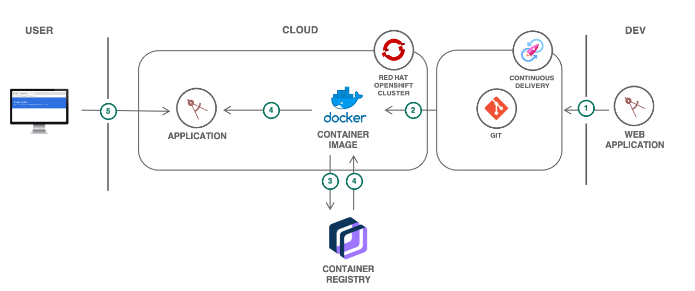

{:step: data-tutorial-type='step'}
{:shortdesc: .shortdesc}
{:new_window: target="_blank"}
{:codeblock: .codeblock}
{:screen: .screen}
{:tip: .tip}
{:pre: .pre}

# Scalable web application on {{site.data.keyword.openshiftshort}}
{: #scalable-webapp-openshift}
{: toc-content-type="tutorial"}
{: toc-services="openshift, containers, Registry"}
{: toc-completion-time="2h"}

<!--##istutorial#-->
This tutorial may incur costs. Use the [Cost Estimator](https://{DomainName}/estimator/review) to generate a cost estimate based on your projected usage.
{: tip}
<!--#/istutorial#-->

This tutorial walks you through how to scaffold a web application, run it locally in a container, push the scaffolded code to a private Git repository and then deploy it to a [{{site.data.keyword.openshiftlong_notm}}](https://{DomainName}/kubernetes/catalog/openshiftcluster) cluster. Additionally, you will learn how to expose the app on an {{site.data.keyword.openshiftshort}} route, bind a custom domain, monitor the health of the environment, and scale the application.
{:shortdesc}

With {{site.data.keyword.openshiftlong_notm}}, you can create {{site.data.keyword.containerlong_notm}} clusters with worker nodes that come installed with the {{site.data.keyword.openshiftlong_notm}} Container Platform orchestration software. You get all the [advantages of managed {{site.data.keyword.containerlong_notm}}](https://{DomainName}/docs/containers?topic=containers-responsibilities_iks) for your cluster infrastructure environment, while using the [{{site.data.keyword.openshiftshort}} tooling and catalog](https://docs.openshift.com/container-platform/4.4/welcome/index.html) that runs on Red Hat Enterprise Linux for your app deployments.

For developers looking to kickstart their projects, the {{site.data.keyword.dev_cli_notm}} CLI enables rapid application development and deployment by generating template applications that you can run immediately or customize as the starter for your own solutions.

## Objectives
{: #scalable-webapp-openshift-objectives}

* Scaffold a starter application.
* Deploy the application to the {{site.data.keyword.openshiftlong_notm}} cluster.
<!--##istutorial#-->
* Bind a custom domain.
<!--#/istutorial#-->
* Monitor the logs and health of the cluster.
* Scale {{site.data.keyword.openshiftshort}} pods.


<p style="text-align: center;">

  
</p>

1. A developer generates a starter application with {{site.data.keyword.dev_cli_notm}}.
2. The dev adds the generated starter kit code to a private Git repository on {{site.data.keyword.Bluemix_notm}}
3. A Docker container image is build from the code.
4. The image is pushed to a namespace in {{site.data.keyword.registrylong_notm}}.
5. The application is deployed to an {{site.data.keyword.openshiftshort}} cluster by pulling the image.
6. Users access the application.

## Before you begin
{: #scalable-webapp-openshift-prereqs}

This tutorial requires:
* {{site.data.keyword.cloud_notm}} CLI,
   * {{site.data.keyword.containerfull_notm}} plugin (`kubernetes-service`),
   * {{site.data.keyword.registryshort_notm}} plugin (`container-registry`),
   * `dev` plugin,
* a Docker engine,
* `oc` to interact with OpenShift,
* `git` to clone source code repository,
* {{site.data.keyword.cloud_notm}} GitLab configured with your **SSH key**. Follow the instructions [here](https://{DomainName}/docs/solution-tutorials?topic=solution-tutorials-getting-started#getting-started-common_gitlab)

<!--##istutorial#-->
You will find instructions to download and install these tools for your operating environment in the [Getting started with tutorials](https://{DomainName}/docs/solution-tutorials?topic=solution-tutorials-getting-started) guide.

Note: To avoid the installation of these tools you can use the [{{site.data.keyword.cloud-shell_short}}](https://{DomainName}/shell) from the {{site.data.keyword.cloud_notm}} console.
{:tip}
<!--#/istutorial#-->

In addition, make sure you [set up a registry namespace](https://{DomainName}/docs/services/Registry?topic=registry-registry_setup_cli_namespace#registry_namespace_setup).

<!--##isworkshop#-->
<!--
## Start a new {{site.data.keyword.cloud-shell_notm}}
{: #scalable-webapp-openshift-2}
{: step}
1. From the {{site.data.keyword.cloud_notm}} console in your browser, select the account where you have been invited.
1. Click the button in the upper right corner to create a new [{{site.data.keyword.cloud-shell_short}}](https://{DomainName}/shell).
-->
<!--#/isworkshop#-->

<!--##istutorial#-->
<!--This section is identical in all openshift tutorials, copy/paste any changes-->
## Create an {{site.data.keyword.openshiftshort}} cluster
{: #scalable-webapp-openshift-create_openshift_cluster}
{: step}

With {{site.data.keyword.openshiftlong_notm}}, you have a fast and secure way to containerize and deploy enterprise workloads in {{site.data.keyword.openshiftshort}} clusters. {{site.data.keyword.openshiftshort}} clusters build on Kubernetes container orchestration that offers consistency and flexibility for your development lifecycle operations.

In this section, you will provision a {{site.data.keyword.openshiftlong_notm}} cluster in one (1) zone with two (2) worker nodes:

1. Create an {{site.data.keyword.openshiftshort}} cluster from the [{{site.data.keyword.Bluemix}} catalog](https://{DomainName}/kubernetes/catalog/create?platformType=openshift).
2. Set the **Orchestration service** to **4.4.x version of {{site.data.keyword.openshiftshort}}**.
3. Select your OCP entitlement.
4. Under **Infrastructure** choose Classic or VPC
  - For Openshift on VPC infrastructure, you are required to create a VPC and one subnet prior to creating the Kubernetes cluster.  Create or inspect a desired VPC keeping in mind the following (see instructions provided under the [Creating a standard VPC Gen 2 compute cluster](https://{DomainName}/docs/openshift?topic=openshift-clusters#clusters_vpcg2)):
      - One subnet that can be used for this tutorial, take note of the subnet's zone and name
      - Public gateway is attached to the subnet
      - [Opening required ports in the default security group](https://{DomainName}/docs/containers?topic=containers-vpc-network-policy#security_groups)
  - Select the desired VPC
  - Select an existing **Cloud Object Storage** service or create one if required and then select
5. Under **Location**
  - For Openshift on VPC infrastructure
      - Select a **Resource group**
      - Uncheck the inapplicable zones
      - In the desired zone verify the desired subnet name and if not present click the edit pencil to select the desired subnet name
  - For Openshift on Classic infrastructure follow the [Creating a standard classic cluster](https://{DomainName}/docs/openshift?topic=openshift-clusters#clusters_standard) instructions.
      - Select a **Resource group**
      - Select a **Geography**
      - Select **Single zone** as **Availability**
      - Choose a **Datacenter**
6. Under **Worker pool**,
   - Select **4 vCPUs 16GB Memory** as the flavor
   - Select **2** Worker nodes per data center for this tutorial (classic only: Leave **Encrypt local disk**)
7. Under **Resource details**,Set **Cluster name** to **myopenshiftcluster**.
8. Click **Create** to provision an {{site.data.keyword.openshiftshort}} cluster.
Take a note of the resource group selected above.  This same resource group will be used for all resources in this lab.
{:note}

### Configure CLI
{: #scalable-webapp-openshift-4}

In this step, you'll configure `oc` to point to your newly created cluster. The [{{site.data.keyword.openshiftshort}} Container Platform CLI](https://docs.openshift.com/container-platform/4.4/cli_reference/openshift_cli/getting-started-cli.html) exposes commands for managing your applications, as well as lower level tools to interact with each component of your system. The CLI is available using the `oc` command.

1. When the cluster is ready, click on the **Access** tab under the cluster name and open the **OpenShift web console**.
1. From the dropdown menu in the upper right of the page, click **Copy Login Command**. Paste the copied command in your terminal.
1. Once logged-in using the `oc login` command, run the below command to see all the namespaces in your cluster
   ```sh
   oc get ns
   ```
   {:pre}
<!--#/istutorial#-->

<!--##isworkshop#-->
<!--
## Configure the access to your cluster
{: #scalable-webapp-openshift-access-cluster}
{: step}

In this step, you'll configure `oc` to point to the cluster assigned to you. The [{{site.data.keyword.openshiftshort}} Container Platform CLI](https://docs.openshift.com/container-platform/4.4/cli_reference/openshift_cli/getting-started-cli.html) exposes commands for managing your applications, as well as lower level tools to interact with each component of your system. The CLI is available using the `oc` command.

1. Navigate to your cluster from the [cluster list](https://{DomainName}/kubernetes/clusters?platformType=openshift) and click on the **Access** tab under the cluster name.
1. Open the **OpenShift web console**.
1. From the dropdown menu in the upper right of the page, click **Copy Login Command**. Paste the copied command in your local terminal.
1. Once logged-in using the `oc login` command, run the below command to see all the namespaces in your cluster
   ```sh
   oc get ns
   ```
   {:pre}
-->
<!--#/isworkshop#-->

## Generate a starter kit
{: #scalable-webapp-openshift-generate_starter_kit}
{: step}

The `ibmcloud dev` tooling greatly cuts down on development time by generating application starters with all the necessary boilerplate, build and configuration code so that you can start coding business logic faster.

### Using ibmcloud dev plugin
{: #scalable-webapp-openshift-7}

1. On a terminal, start the `ibmcloud dev` wizard by running the below command
   ```sh
   ibmcloud dev create
   ```
   {: pre}

   You may be asked to target a Cloud Foundry organization and a space. The organization and space would be used in case you decide to deploy the application to Cloud Foundry. This will not be used in this tutorial but the command requires them to be configured in any case.
   {:tip}
2. Select `Backend Service / Web App` then `Node` and select `Node.js Express App` to create a Node starter.
3. Enter a **unique name** for your application such as `<your-initials>-openshiftapp`.
4. Select the **resource group** where your cluster has been created.
5. Do not add additional services.
6. Do not add a DevOps toolchain, select **manual deployment**.
7. Select **Helm-based** deployment target.

This generates a starter application complete with the code and all the necessary configuration files for local development and deployment to cloud on Cloud Foundry or {{site.data.keyword.containershort_notm}}.

### Push the code to a Private IBM Cloud Git repo
{: #scalable-webapp-openshift-8}

In this step, you will create a private IBM Cloud Git repository and push the generated code.

   You need to configure an SSH key for the push to be successful,check the instructions [here](https://{DomainName}/docs/solution-tutorials?topic=solution-tutorials-getting-started#getting-started-common_gitlab).
   {:tip}

1. On a browser, open [IBM Cloud Git](https://us-south.git.cloud.ibm.com)

   The link above is for `us-south` region. For other regions, run `ibmcloud regions` and replace `us-south` in the URL with region name.
   {:tip}
2. Click on **New project** and provide `openshiftapp` as the project name.
3. Set the visibility level to **Private** and click **Create project**
4. Follow the instructions under *Git global setup* and *Push an existing folder* sections to setup Git and to import the code you have generated with `ibmcloud dev`.
5. Once you push the code to the private repository, you should see the scaffolded code in the project.

### Create a Git deploy token
{: #scalable-webapp-openshift-9}

In this section, you will create a Git deploy token to allow **read-only** access to your repository.

To generate a deploy token:
1. On the left pane of the Git repo page, click **Settings** > **Repository**.
1. Click on **Expand** next to **Deploy Tokens**.
   1. Provide **foropenshift** as the **Name** then check **read_repository** checkbox and click **create deploy token**.
   2. **Save** the generated **username** and **password** for future reference.
2. On the left pane, click on **Project overview** then click **Details**, click on **Clone** and copy **Clone with HTTPS** URL. Save the URL for future reference.

## Create a new {{site.data.keyword.openshiftshort}} application
{: #scalable-webapp-openshift-create_openshift_app}
{: step}

In this section, you will generate a BuildConfig YAML file and update the file with Private registry details to push the generated builder Docker image to {{site.data.keyword.registryshort_notm}}.

### Generate a build configuration yaml file
{: #scalable-webapp-openshift-11}

A Kubernetes namespace provides a mechanism to scope resources in a cluster. In {{site.data.keyword.openshiftshort}}, a project is a Kubernetes namespace with additional annotations.

1. Define an environment variable named `MYPROJECT` set with the name of the application you generated in the previous section:
   ```sh
   export MYPROJECT=<your-initials>-openshiftapp
   ```
   {:pre}
2. If you are not on the directory of generated code, change to the directory.
   ```sh
   cd $MYPROJECT
   ```
   {: pre}
3. Create a new OpenShift project
   ```sh
   oc new-project $MYPROJECT
   ```
   {:pre}
4. Generate a yaml file `openshift.yaml` in the same folder as your starter kit code by replacing the placeholders and running the below command
   ```sh
   oc new-app https://<GIT_TOKEN_USERNAME>:<GIT_TOKEN_PASSWORD>@<REPO_URL_WITHOUT_HTTPS> --name=$MYPROJECT --strategy=docker -o yaml > openshift.yaml
   ```
   {:pre}

   Replace `<REPO_URL_WITHOUT_HTTPS>` with the Git repository URL without `https://`.
   {:tip}

### Prepare the access to {{site.data.keyword.registryshort_notm}}
{: #scalable-webapp-openshift-12}

In this tutorial, a remote private {{site.data.keyword.registryshort_notm}} is used for persistent storage of created images.

1. To identify your {{site.data.keyword.registryshort_notm}} URL, run
   ```sh
   ibmcloud cr region
   ```
   {:pre}
1. Define an environment variable named `MYREGISTRY` pointing to the URL such as:
   ```sh
   export MYREGISTRY=us.icr.io
   ```
   {:pre}
1. Pick one of your existing registry namespaces or create a new one. To list existing namespaces, use:
   ```sh
   ibmcloud cr namespaces
   ```
   {:pre}
   To create a new namespace:
   ```sh
   ibmcloud cr namespace-add <REGISTRY_NAMESPACE>
   ```
   {:pre}
1. Define an environment variable named `MYNAMESPACE` pointing to the registry namespace:
   ```sh
   export MYNAMESPACE=<REGISTRY_NAMESPACE>
   ```
   {:pre}
1. Define an environment variable name `API_KEY` pointing to an {{site.data.keyword.Bluemix_notm}} IAM API key.
   For creating an API key, refer to this [link](https://{DomainName}/docs/services/Registry?topic=registry-registry_access#registry_api_key_create).
   {:tip}
1. To automate access to your registry namespaces and to push the generated builder container image to {{site.data.keyword.registryshort_notm}}, create a secret:
   ```sh
   oc create secret docker-registry push-secret --docker-username=iamapikey --docker-password=$API_KEY --docker-server=$MYREGISTRY
   ```
   {:pre}

### Update the BuildConfig and Push the builder image to {{site.data.keyword.registryshort_notm}}
{: #scalable-webapp-openshift-13}

In this step, you will update the generated BuildConfig section of the generated yaml to point to {{site.data.keyword.registryshort_notm}} namespace and push the generated builder image to {{site.data.keyword.registryshort_notm}}.

1. Edit the generated **openshift.yaml**.
1. Locate the *ImageStream* object with the **name** attribute set to your project (`$MYPROJECT`) and add a `dockerImageRepository` definition under `spec` replacing the placeholders `$MYPROJECT` and `$MYNAMESPACE` with the actual values identified in the previous steps:
   ```yaml
   -
   apiVersion: image.openshift.io/v1
   kind: ImageStream
   metadata:
     annotations:
       openshift.io/generated-by: OpenShiftNewApp
     creationTimestamp: null
     labels:
       app: <$MYPROJECT>
     name: <$MYPROJECT>
   spec:
     dockerImageRepository: <$MYREGISTRY>/<$MYNAMESPACE>/<$MYPROJECT>
     lookupPolicy:
       local: false
   status:
       dockerImageRepository: ""
   ```
   {:codeblock}
   An image stream and its associated tags provide an abstraction for referencing container images from within {{site.data.keyword.openshiftshort}} Container Platform
4. Update the `spec` under `BuildConfig` section by changing the output to kind `DockerImage` and adding a `pushSecret`
   ```yaml
   spec:
     nodeSelector: null
     output:
       to:
         kind: DockerImage
         name: '<$MYREGISTRY>/<$MYNAMESPACE>/<$MYPROJECT>:latest'
       pushSecret:
         name: push-secret
   ```
   {:codeblock}
   A build is the process of transforming input parameters into a resulting object. Most often, the process is used to transform input parameters or source code into a runnable image. A `BuildConfig` object is the definition of the entire build process.
5. Search for `containers` and update the image with
   ```yaml
   containers:
       -image: '<$MYREGISTRY>/<$MYNAMESPACE>/<$MYPROJECT>:latest'
       name: <$MYPROJECT>
   ```
   {:codeblock}
6. Save the YAML file.

## Deploy the application to cluster
{: #scalable-webapp-openshift-deploy_app_to_cluster}
{: step}

In this section, you will deploy the application to the cluster using the generated **openshift.yaml** file. Once deployed, you will access the application by creating a route. You will also learn how to automatically build and redeploy when the app is updated.

### Create the app using the updated yaml
{: #scalable-webapp-openshift-15}

1. Before creating the app, you need to copy and patch the image-pull secret from the `default` project to your project:
   ```sh
   oc get secret all-icr-io -n default -o yaml | sed 's/default/'$MYPROJECT'/g' | oc -n $MYPROJECT create -f -
   ```
   {:pre}

2. For the image pull secret to take effect, you need to add it in the `default` service account
   ```sh
   oc secrets link serviceaccount/default secrets/all-icr-io --for=pull
   ```
   {:pre}
3. Create a new openshift app along with a buildconfig(bc), deploymentconfig(dc), service(svc), imagestream(is) using the updated yaml
   ```sh
   oc create -f openshift.yaml
   ```
   {:pre}

4. To check the builder container image creation and pushing to the {{site.data.keyword.registryshort_notm}}, run the below command
   ```sh
   oc logs -f bc/$MYPROJECT
   ```
   {:pre}
5. Wait till the build is successful and the image is pushed. You can check the status of deployment and service using
   ```sh
   oc status
   ```
   {:pre}

   If the deployment is taking more time, manually import the latest image stream to ensure the deployment takes place as soon as possible with the command `oc import-image $MYPROJECT` .Refer this [link](https://docs.openshift.com/container-platform/4.4/registry/registry-options.html#registry-third-party-registries_registry-options) for more info.
   {:tip}

### Access the app through IBM provided domain
{: #scalable-webapp-openshift-16}
To access the app, you need to create a route. A route announces your service to the world.

1. Create a route by running the below command in a terminal
   ```sh
   oc expose service/$MYPROJECT --port=3000
   ```
   {:pre}
1. You can access the app through IBM provided domain. Run the below command for the URL
   ```sh
   oc get routes
   ```
   {:pre}
1. Copy the **HOST/PORT** value and paste the URL in a browser to see your app in action at `http://<HOST/PORT>`.

### Secure the default IBM provided domain route
{: #scalable-webapp-openshift-secure_default_route}

1. To create a secured HTTPS route encrypted with the default certificate for {{site.data.keyword.openshiftshort}}, you can use the `create route` command.
   ```sh
   oc create route edge $MYPROJECT-https --service=$MYPROJECT --port=3000
   ```
   {:pre}
1. For the HTTPS HOST URL, run `oc get routes`. Copy and paste the URL with HTTPS(`https://<HOST>`) next to the route *$MYPROJECT-https* in a browser.

### Update the app and redeploy
{: #scalable-webapp-openshift-18}
In this step, you will automate the build and deploy process. So that whenever you update the application and push the changes to the Private repo, a new build config is generated creating a build in turn generating a new version of the builder Docker image. This image will be deployed automatically.

1. You will create a new **GitLab** Webhook trigger. Webhook triggers allow you to trigger a new build by sending a request to the {{site.data.keyword.openshiftshort}} Container Platform API endpoint.You can define these triggers using GitHub, GitLab, Bitbucket, or Generic webhooks.
   ```sh
   oc set triggers bc $MYPROJECT --from-gitlab
   ```
   {:pre}
2. To add a webhook on the GitLab repository, you need a URL and a secret
   - For webhook GitLab URL,
     ```sh
     oc describe bc/$MYPROJECT | grep -A 1 "GitLab"
     ```
     {:pre}
   - For secret that needs to be passed in the webhook URL,
     ```sh
     oc get bc/$MYPROJECT -o yaml | grep -A 3 "\- gitlab"
     ```
     {:pre}
   - Replace `<secret>` in the webhook GitLab URL with the secret value under *gitlab* in the above command output.
3. Open your private git repo on a browser using the Git repo HTTPS link then click on **Settings** and click **Webhooks**.
4. Paste the **URL** and click **Add webhook**. Test the URL by clicking **Test** and selecting Push events. You should see `Hook executed successfully: HTTP 200` message. This triggers a new build.
5. Update the ImagePolicy of the image stream to query {{site.data.keyword.registryshort_notm}} at a scheduled interval to synchronize tag and image metadata. This will update the `tags` definition
   ```sh
   oc tag $MYREGISTRY/$MYNAMESPACE/${MYPROJECT}:latest ${MYPROJECT}:latest --scheduled=true
   ```
   {:pre}
6. Open the cloned repo in an IDE to update the `h1` tag of local *public/index.html* file and change it to `Congratulations! <YOUR_NAME>`.
7. Save and push the code to the repo
   ```sh
    git add public/index.html
    git commit -m "Updated with my name"
    git push -u origin master
   ```
   {:pre}
8. You can check the progress of the build and deploy with `oc status` command. Once the deployment is successful, refresh the route HOST address to see the updated web app.

   Sometimes, the deployment may take up to 15 minutes to import the latest image stream. You can either wait or manually import using `oc import-image $MYPROJECT` command. Refer this [link](https://docs.openshift.com/container-platform/4.4/registry/registry-options.html#registry-third-party-registries_registry-options) for more info.
   {:tip}

<!--##istutorial#-->
## Use your own custom domain
{: #scalable-webapp-openshift-custom_domain}
{: step}

This section requires you to own a custom domain and to be able to modify the DNS records of the domain. You will need to create a `CNAME` record pointing to the IBM-provided domain.

Steps for setting up the CNAME record vary depending on your DNS provider. Under DNS Management/Zone of your domain, add a new `CNAME` record, set **Host(name)** to `openshiftapp` or any subdomain you like and set **Points to** to IBM-provided domain without HTTP or HTTPS
{:tip}

### With HTTP
{: #scalable-webapp-openshift-20}
1. Create a route exposing the service at a hostname by replacing `<HOSTNAME>` with your hostname(e.g.,www.example.com or openshiftapp.example.com), so that external clients can reach it by name.
   ```sh
   oc expose svc/$MYPROJECT --hostname=<HOSTNAME> --name=$MYPROJECT-domain --port=3000
   ```
   {:pre}
2. Access your application at `http://<HOSTNAME>/`

### With HTTPS
{: #scalable-webapp-openshift-21}

1. To create a secured HTTPS route, you can either use your own certificate and key files from a CA like [Let's Encrypt](https://letsencrypt.org/) or order through [{{site.data.keyword.cloudcerts_long}}](https://{DomainName}/docs/services/certificate-manager?topic=certificate-manager-ordering-certificates). Pass them with the `create route` command
   ```sh
   oc create route edge $MYPROJECT-httpsca --service=$MYPROJECT --cert=example.pem --key=example.key --ca-cert=ca.pem --hostname=<www.HOSTNAME> --port=3000
   ```
   {:pre}

   Here, you have used Edge termination. To learn about other secured routes and termination types like passthrough and re-encryption, run `oc create route --help` command)
   {:tip}
<!--#/istutorial#-->

## Monitor the app
{: #scalable-webapp-openshift-monitor_application}
{: step}

In this section, you will learn to monitor the health and performance of your application.
{{site.data.keyword.openshiftshort}} Container Platform ships with a pre-configured and self-updating monitoring stack that is based on the [Prometheus](https://prometheus.io/) open source project and its wider eco-system. It provides monitoring of cluster components and ships with a set of [Grafana](https://grafana.com/) dashboards

1. To access the web UIs of Prometheus and Grafana along with Alertmanager, run the below command and make sure to prepend `https://` to the returned addresses(HOST). You cannot access web UIs using unencrypted connection. If prompted, click **Login with OpenShift** and authorize access by allowing selected permissions.
   ```sh
    oc get routes -n openshift-monitoring
   ```
   {:pre}
2. Run the following script which will endlessly send requests to the application, this will in turn generate data into Prometheus.
   ```sh
    while sleep 1; do curl --max-time 2 -s http://<APPLICATION_ROUTE_URL>; done
   ```
   {:pre}

3. In the expression box of Prometheus web UI, enter **`namespace:container_cpu_usage_seconds_total:sum_rate{namespace="<MYPROJECT>"}`** and click **Execute** to see the total container cpu usage in seconds on a Graph and a console.
4. Open the **Grafana** web UI URL on a browser.
5. On the Grafana **Home** page, click on **Kubernetes / Compute Resources / Namespace (Pods)** and Select
   - datasource: **Prometheus**
   - namespace: **`<MYPROJECT>`**
6. Check the CPU and memory usage.
7. For logging, you can use the in-built `oc logs` command.

  You can also provision and use {{site.data.keyword.la_full_notm}} and {{site.data.keyword.mon_full_notm}} services for logging and monitoring your {{site.data.keyword.openshiftshort}} application. Follow the instructions mentioned in [this link](https://{DomainName}/docs/openshift?topic=openshift-health) to setup LogDNA and Sysdig add-ons to monitor cluster health.
  {:tip}

## Scale the app
{: #scalable-webapp-openshift-scaling_app}
{: step}

In this section, you will learn how to autoscale and also manually scale your application.

### Autoscaling
{: #scalable-webapp-openshift-24}

You can use a horizontal pod autoscaler (HPA) to specify how {{site.data.keyword.openshiftshort}} should automatically increase or decrease the scale of a deployment configuration(dc) or replication controller(rc), based on metrics collected from the pods that belong to that `dc` or `rc`.

1. Before you can setup autoscaling for your pods, you first need to set resource limits on the pods running in the cluster. Limits allows you to choose the minimum and maximum CPU and memory usage for a pod. You can set the limits and requests on a container using `oc set resources` command.
   ```sh
   oc set resources dc/$MYPROJECT --limits=cpu=250m,memory=512Mi --requests=cpu=100m,memory=256Mi
   ```
   {:pre}
   To verify, run `oc describe dc/$MYPROJECT` and look for `Limits` and `Requests`.
2. To create an autoscaler, you need to run the `oc autoscale` command with the lower(min) and upper(max) limits for the number of pods that can be set by the autoscaler and the target average CPU utilization (represented as a percent of requested CPU) over all the pods. For testing, let's set `--cpu-percent` to 5%.
   ```sh
   oc autoscale dc/$MYPROJECT \
    --min=1 \
    --max=5 \
    --cpu-percent=5
   ```
   {:pre}
3. You can see new pods being provisioned by running `oc get pods --watch` command.
4. Rerun the [Monitoring](https://{DomainName}/docs/solution-tutorials?topic=solution-tutorials-scalable-webapp-openshift#scalable-webapp-openshift-monitor_application) step to see the updated logs for all the pods.

### Manual scaling
{: #scalable-webapp-openshift-25}

1. You can achieve manual scaling of your pods with `oc scale` command. The command sets a new size for a deployment configuration or replication controller
   ```sh
    oc scale dc/$MYPROJECT --replicas=2
   ```
   {:pre}
2. You can see a new pod being provisioned by running `oc get pods` command.
3. Rerun the [Monitoring](https://{DomainName}/docs/solution-tutorials?topic=solution-tutorials-scalable-webapp-openshift#scalable-webapp-openshift-monitor_application) step to see the updated logs for both the pods.

## Remove resources
{: #scalable-webapp-openshift-cleanup}
{: step}

* Delete all application resource objects:
   ```sh
   oc delete all --selector app=$MYPROJECT
   ```
   {:pre}
* Delete the project:
   ```sh
   oc delete project $MYPROJECT
   ```
   {:pre}
<!--##istutorial#-->
* Delete the cluster you created.
<!--#/istutorial#-->

## Related content
{: #scalable-webapp-openshift-0}

* [{{site.data.keyword.openshiftlong_notm}}](https://{DomainName}/docs/openshift?topic=openshift-why_openshift)
* [Horizontal Pod Autoscaling](https://docs.openshift.com/container-platform/4.4/nodes/pods/nodes-pods-autoscaling.html)
* [Secured routes](https://docs.openshift.com/container-platform/4.4/networking/routes/secured-routes.html)
