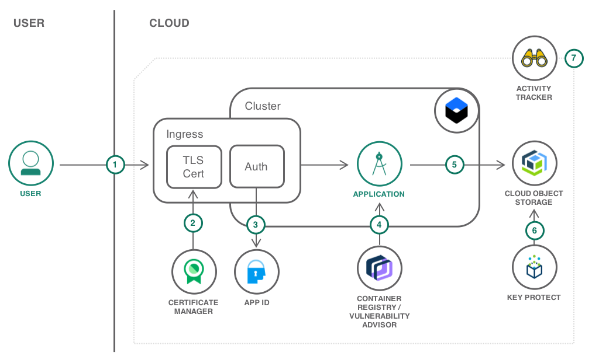

---
copyright:
  years: 2018
lastupdated: "2018-08-02"

---

{:java: #java .ph data-hd-programlang='java'}
{:shortdesc: .shortdesc}
{:new_window: target="_blank"}
{:codeblock: .codeblock}
{:screen: .screen}
{:tip: .tip}
{:pre: .pre}

# Leverage security services for a Kubernetes app
The solution features an app that enables groups of users to upload files to a common storage pool and provide access to those files via shareable links. The app is written in Node.js and deployed as Docker container to the {{site.data.keyword.containershort_notm}}. It leverages several security-related services and features to improve app security.
{:shortdesc}

## Objectives
{: #objectives}

* Makes statements on what developers will learn/achieve - not what will they do Solutions and Tasks
* Short and informational (do not use sentences)

## Services used
{: #services}

This tutorial uses the following runtimes and services:
* [{{site.data.keyword.containershort_notm}}](https://console.bluemix.net/containers-kubernetes/catalog/cluster)
* [{{site.data.keyword.registryshort}}](https://console.bluemix.net/containers-kubernetes/launchRegistryView)
* [{{site.data.keyword.appid_short}}](https://console.bluemix.net/catalog/services/AppID)
* [{{site.data.keyword.cloudant_short_notm}}](https://console.bluemix.net/catalog/services/cloudantNoSQLDB)
* [{{site.data.keyword.cos_short}}](https://console.bluemix.net/catalog/services/cloud-object-storage)
* [{{site.data.keyword.cloudaccesstrailshort}}](https://console.bluemix.net/catalog/services/activity-tracker)
* [{{site.data.keyword.keymanagementserviceshort}}](https://console.bluemix.net/catalog/services/key-protect)
* [{{site.data.keyword.cloudcerts_short}}](https://console.bluemix.net/catalog/services/certificate-manager)

This tutorial requires a [non-Lite account](https://console.bluemix.net/docs/account/index.html#accounts) and may incur costs. Use the [Pricing Calculator](https://console.bluemix.net/pricing/) to generate a cost estimate based on your projected usage.

## Architecture
{: #architecture}

intro sentence

<p style="text-align: center;">

  
</p>

1. The user connects to the application.
2. The certificate used for the secure connection is defined in Certificate Manager and used by the Kubernetes Ingress.
3. App ID secures the application and redirects the user to the authentication page. Users can sign up from there too.
4. The application is running in a Kubernetes cluster from an image stored in the Container Registry. The image is scanned for vulnerabilities.
5. Files uploaded by the user are stored in Cloud Object Storage.
6. The bucket where the files are stored is using a user-provided key to encrypt the data.
7. All activities related to managing the solution are logged by Activity Tracker.

## Before you begin
{: #prereqs}

* [Install all the necessary command line (CLI) tools by following](https://console.bluemix.net/docs/cli/index.html#overview)

## Create services
{: setup}

rough outline
* Prepare org and space
* Deploy Activity Tracker (no config necessary..?)
* create K8S cluster, takes a while...
* Deploy Key Protect
* create your own key (how?), import as root key into KP
* deploy COS (no config needed?)
* deploy Cloudant
* deploy App ID, config login page
* git clone the repo
* configure and push app: how much config can be done automatically? do this as container, push to registry, use vulnerability advisor as part of CR
* configure App ID, set redirect page (could be don from within code)
* optional: custom domain, deploy CM, deploy cert to cluster, config ingress


In this section, you will create the services required to ...

1. Login to {{site.data.keyword.cloud_notm}} via the command line and target your Cloud Foundry account. See [CLI Getting Started](https://console.bluemix.net/docs/cli/reference/bluemix_cli/get_started.html#getting-started). It assumes that you already have a Cloud Foundry organization and space created.
    ```bash
    ibmcloud login
    ```
    {: pre}
    ```bash
    ibmcloud target --cf
    ```
    {: pre}
2. Create an instance of [{{site.data.keyword.cloudaccesstrailshort}}](https://console.bluemix.net/catalog/services/activity-tracker) and name it **SKAActivityTracker**.
    ```bash
    ibmcloud service create accesstrail free SKAActivityTracker
    ```
    {: pre}
3. Create a new [{{site.data.keyword.containershort_notm}}](https://console.bluemix.net/containers-kubernetes/catalog/cluster) cluster. First, decide on an available zone within your region:
    ```bash
    ibmcloud ks zones
    ```
    {: pre}
    For the zone of your choice (**YOURZONE**) look up the VLAN identifiers for the public and private network:
    ```bash
    ibmcloud ks vlans --zone YOURZONE
    ```
    {: pre}
    Finally, create a cluster named **SKACluster** with 2 worker nodes and virtual, shared machines with 2 cores and 4 GB of RAM. Replace the VLAN IDs with the obtained values.
    ```bash
    ibmcloud ks cluster-create --name SKACluster --zone YOURZONE --machine-type u2c.2x4 --workers 2 --public-vlan PUBLIC-ID --private-vlan PRIVATE-ID
    ```
    {: pre}
4. Create an instance of [{{site.data.keyword.keymanagementserviceshort}}](https://console.bluemix.net/catalog/services/key-protect) and name it **SKAKeyProtect**. Replace **REGION** according to your {{site.data.keyword.Bluemix_notm}} region.
    ```bash
    ibmcloud resource service-instance-create SKAKeyProtect kms tiered-pricing REGION
    ```
    {: pre}
5. Create an instance of [{{site.data.keyword.cos_short}}](https://console.bluemix.net/catalog/services/cloud-object-storage). 
    ```bash
    ibmcloud resource service-instance-create SKAObjectStorage cloud-object-storage lite global
    ```
    {: pre}
6. Next, create an instance of [{{site.data.keyword.cloudant_short_notm}}](https://console.bluemix.net/catalog/services/cloudantNoSQLDB). 
    ```bash
    ibmcloud resource service-instance-create SKACloudant cloudantnosqldb lite REGION
    ```
    {: pre}
7. Finally, provision an instance of [{{site.data.keyword.appid_short}}](https://console.bluemix.net/catalog/services/AppID).
    ```bash
    ibmcloud resource service-instance-create SKAAppID appid graduated-tier REGION
    ```
    {: pre}


## Configure Services


## Solution Specific Section
{: #section_one}

Introductory statement that overviews the section

prepare the local cluster environment
1. Check that the provisioned cluster is ready. The cluster state should indicate **normal**.
   ```bash
   ibmcloud ks cluster-get SKACluster
   ```
   {: pre}
2. When the cluster is ready, retrieve the cluster configuration:
   ```bash
   ibmcloud ks cluster-config SKACluster
   ```
   {: pre}
3. Copy and paste the **export** command to set the KUBECONFIG environment variable as directed. To verify whether the KUBECONFIG environment variable is set properly or not, run the following command:
  `echo $KUBECONFIG`
4. Check that the `kubectl` command is correctly configured
   ```bash
   kubectl cluster-info
   ```
   {: pre}


5. Step 1 Click **This** and enter your name.

  This is a tip.
  {:tip}


## Another Solution Specific Section
{: #section_two}

Introductory statement that overviews the section

### Sub section

## Remove resources
{:removeresources}

Steps to take to remove the resources created in this tutorial

## Expand the tutorial

Want to add to or change this tutorial? Here are some ideas:
- idea with [link]() to resources to help implement the idea
- idea with high level steps the user should follow
- avoid generic ideas you did not test on your own
- don't throw up ideas that would take days to implement
- this section is optional

## Related content
{:related}

* [Secure Apps on IBM Cloud with Wildcard Certificates](https://www.ibm.com/blogs/bluemix/2018/07/secure-apps-on-ibm-cloud-with-wildcard-certificates/)
* more blogs
* and some more
