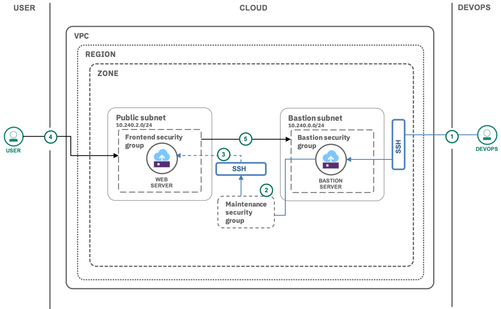

---
copyright:
  years: 2019
lastupdated: "2019-03-08"

---

{:java: #java .ph data-hd-programlang='java'}
{:swift: #swift .ph data-hd-programlang='swift'}
{:ios: #ios data-hd-operatingsystem="ios"}
{:android: #android data-hd-operatingsystem="android"}
{:shortdesc: .shortdesc}
{:new_window: target="_blank"}
{:codeblock: .codeblock}
{:screen: .screen}
{:tip: .tip}
{:pre: .pre}
{:important: .important}

# Secure management of VSI using Bastion server
{: #secure-management-vsi-bastion-server}

This tutorial walks you through on how a bastion VSI is deployed to securely access the other VSIs by SSH. Bastion servers or hosts are instances that sit within your public subnet and are typically accessed using SSH. Once remote connectivity has been established with the bastion host, it then acts as a **jump** server, allowing you to use SSH to log in to other instances (within private subnets) deeper within your VPC.

To reduce exposure of servers within the VPC you will create and use a bastion instance. Administrative tasks on the individual servers are going to be performed using SSH, proxied through the bastion. Access to the servers and regular internet access from the servers, e.g., for software installation, will only be allowed with a special maintenance security group attached to those servers.
{:shortdesc}

## Objectives
{: #objectives}

* Makes statements on what developers will learn/achieve - not what will they do Solutions and Tasks
* Short and informational (do not use sentences)

## Services used
{: #services}

This tutorial uses the following runtimes and services:  

- [{{site.data.keyword.vpc_full}}](https://{DomainName}/vpc/provision/vpc)  
- [{{site.data.keyword.vsi_is_full}}](https://{DomainName}/vpc/provision/vs)

This tutorial may incur costs. Use the [Pricing Calculator](https://{DomainName}/pricing/) to generate a cost estimate based on your projected usage.

## Architecture
{: #architecture}

  

1. The user does this
2. Then that

## Before you begin
{: #prereqs}

- Check for user permissions. Be sure that your user account has sufficient permissions to create and manage VPC resources. For a list of required permissions, see [Granting permissions needed for VPC users](/docs/infrastructure/vpc?topic=vpc-managing-user-permissions-for-vpc-resources#managing-user-permissions-for-vpc-resources).

- You need an SSH key to connect to the virtual servers. If you don't have an SSH key, see the [instructions for creating a key](/docs/infrastructure/vpc?topic=vpc-getting-started-with-ibm-cloud-virtual-private-cloud-infrastructure#prerequisites).

## Create a bastion security group
{: #bastion-security-group}

Let's create a security group and configure inbound rules to your bastion VSI.

1. Navigate to **Security groups** and click **New security group**. Enter **vpc-pubpriv-bastion-sg** as name and select your VPC. 
2. Now, create the following inbound rules by clicking **Add rule** in the inbound section. They allow SSH access and Ping (ICMP).
 
	**Inbound rule:**
	<table>
	   <thead>
	      <tr>
	         <td><strong>Source</strong></td>
	         <td><strong>Protocol</strong></td>
	         <td><strong>Value</strong></td>
	      </tr>
	   <tbody>
	      <tr>
	         <td>Any - 0.0.0.0/0</td>
	         <td>TCP</td>
	         <td>From: <strong>22</strong> To <strong>22</strong></td>
	      </tr>
         <tr>
            <td>Any - 0.0.0.0/0</td>
	         <td>ICMP</td>
	         <td>Type: <strong>8</strong>,Code: <strong>Leave empty</strong></td>
         </tr>
	   </tbody>
	</table>

   To enhance security further, the inbound traffic could be restricted to the company network or a typical home network. You could run `curl ipecho.net/plain ; echo` to obtain your network's external IP address and use that instead.
   {:tip }

### Create a bastion instance
With the subnet and security group already in place, next, create the bastion virtual server instance.

1. Under **VPC and subnets** select the **Subnets** tab, then select **vpc-pubpriv-bastion-subnet**.
2. Click on **Attached instances** and provision a **New instance** called **vpc-pubpriv-bastion-vsi** under your own VPC. Select Ubuntu Linux as your image and **c-2x4** (2 vCPUs and 4 GB RAM) as your profile.
3. Select a **Location** and make sure to later use the same location again.
4. To create a new **SSH key**, click **New key**
   * Enter **vpc-ssh-key** as key name.
   * Leave the **Region** as is.
   * Copy the contents of your existing local SSH key and paste it under **Public key**.  
   * Click **Add SSH key**.
5. Under **Network interfaces**, click on the **Edit** icon next to the Security Groups 
   * Make sure that **vpc-pubpriv-bastion-subnet** is selected as the subnet.
   * Uncheck the default security group and mark **vpc-pubpriv-bastion-sg**.
   * Click **Save**.
6. Click **Create virtual server instance**.
7. Once the instance is powered on, click on **vpc-pubpriv-bastion-vsi** and **reserve** a floating IP.

### Test your bastion

Once your bastion's floating IP address is active, try connecting to it using **ssh**:

   ```sh
   ssh -i ~/.ssh/<PRIVATE_KEY> root@<BASTION_FLOATING_IP_ADDRESS>
   ```
   {:pre}


### Create a security group for system maintenance

With access to the bastion working, continue and create the security group for maintenance tasks.

1. Navigate to **Security groups** and provision a new security group called **vpc-pubpriv-maintenance-sg** with the below outbound rules

   <table>
   <thead>
      <tr>
         <td><strong>Destination</strong></td>
         <td><strong>Protocol</strong></td>
         <td><strong>Value</strong> </td>
      </tr>
   </thead>
   <tbody>
      <tr>
         <td>Any - 0.0.0.0/0 </td>
         <td>TCP</td>
         <td>From: <strong>80</strong> To <strong>80</strong></td>
      </tr>
      <tr>
         <td>Any - 0.0.0.0/0</td>
         <td>TCP</td>
         <td>From: <strong>443</strong> To <strong>443</strong></td>
      </tr>
       <tr>
         <td>Any - 0.0.0.0/0 </td>
         <td>TCP</td>
         <td>From: <strong>53</strong> To <strong>53</strong></td>
      </tr>
      <tr>
         <td>Any - 0.0.0.0/0</td>
         <td>UDP</td>
         <td>From: <strong>53</strong> To <strong>53</strong></td>
      </tr>
   </tbody>
   </table>

   DNS server requests are addressed on port 53. DNS uses TCP for Zone transfer and UDP for name queries either regular (primary) or reverse. HTTP requests are n port 80 and 443.
   {:tip }

2. Next, add this **inbound** rule which allows SSH access from the bastion server.

   <table>
	   <thead>
	      <tr>
	         <td><strong>Source</strong></td>
	         <td><strong>Protocol</strong></td>
	         <td><strong>Value</strong> </td>
	      </tr>
	   </thead>
	   <tbody>
	     <tr>
	         <td>Type: <strong>Security Group</strong> - Name: <strong>vpc-pubpriv-bastion-sg</strong></td>
	         <td>TCP</td>
	         <td>From: <strong>22</strong> To <strong>22</strong></td>
	      </tr>
	   </tbody>
	</table>

1. Create the security group.
3. Navigate to **All Security Groups for VPC**, then select **vpc-pubpriv-bastion-sg**.
4. Finally, edit the security group and add the following **outbound** rule.

   <table>
	   <thead>
	      <tr>
	         <td><strong>Destination</strong></td>
	         <td><strong>Protocol</strong></td>
	         <td><strong>Value</strong> </td>
	      </tr>
	   </thead>
	   <tbody>
	     <tr>
	         <td>Type: <strong>Security Group</strong> - Name: <strong>vpc-pubpriv-maintenance-sg</strong></td>
	         <td>TCP</td>
	         <td>From: <strong>22</strong> To <strong>22</strong></td>
	      </tr>
	   </tbody>
	</table>


## Remove resources
{: #removeresources}

Steps to take to remove the resources created in this tutorial

## Expand the tutorial (this section is optional, remove it if you don't have content for it)

Want to add to or change this tutorial? Here are some ideas:
- idea with [link]() to resources to help implement the idea
- idea with high level steps the user should follow
- avoid generic ideas you did not test on your own
- don't throw up ideas that would take days to implement
- this section is optional

## Related content
{: #related}

* [Relevant links](https://blah)
