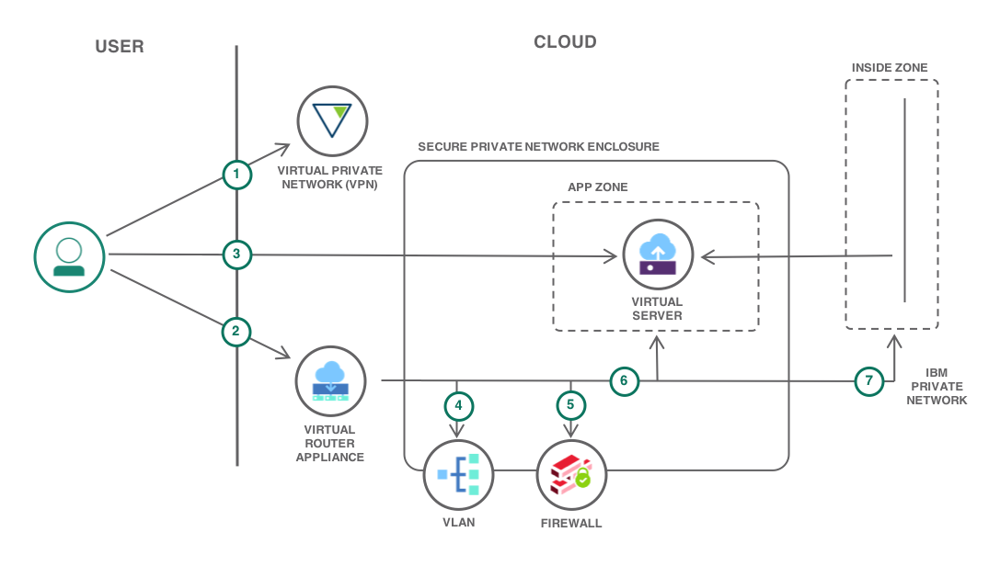
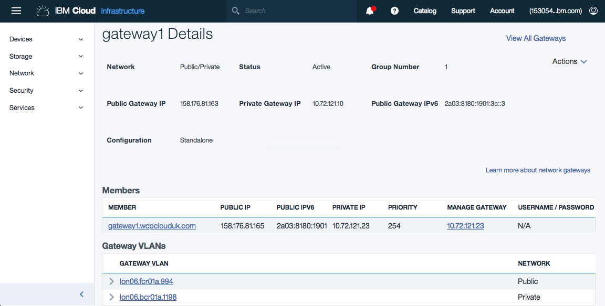
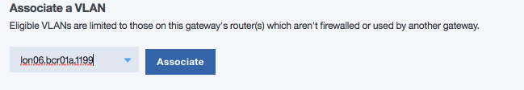
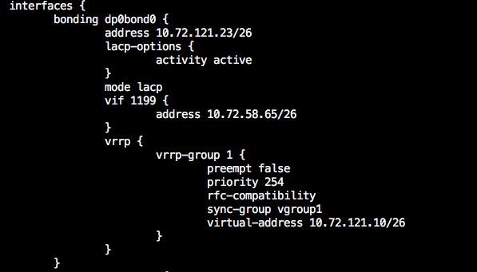

{:java: #java .ph data-hd-programlang='java'}
{:swift: #swift .ph data-hd-programlang='swift'}
{:ios: #ios data-hd-operatingsystem="ios"}
{:android: #android data-hd-operatingsystem="android"}
{:shortdesc: .shortdesc}
{:new_window: target="_blank"}
{:codeblock: .codeblock}
{:screen: .screen}
{:tip: .tip}
{:pre: .pre}

# Isolating workloads with a secure private network
{: #secure-network-enclosure}

The need for isolated and secure private network environments is central to the IaaS application deployment model on public cloud. Firewalls, VLANs, routing, and VPNs are all necessary components in the creation of isolated private environments. This isolation enables virtual machines and bare-metal servers to be securely deployed in complex multi-tier application topologies while proving protection from risks on the public internet.

This tutorial highlights how a [Virtual Router Appliance](https://{DomainName}/docs/virtual-router-appliance?topic=virtual-router-appliance-faqs-for-ibm-virtual-router-appliance#what-is-vra-) (VRA) can be configured on the {{site.data.keyword.Bluemix_notm}} to create a secure private network (enclosure). The VRA provides in a single self-managed package, a firewall, VPN gateway, Network Address Translation (NAT) and enterprise-grade routing. In this tutorial, a VRA is used to show how an enclosed, isolated network environment can be created on the {{site.data.keyword.Bluemix_notm}}. Within this enclosure application topologies can be created, using the familiar and well known technologies of IP routing, VLANs, IP subnets, firewall rules, virtual and bare-metal servers.
{:shortdesc}

This tutorial is a starting point for classic networking on the {{site.data.keyword.Bluemix_notm}} and should not be considered a production capability as is. Additional capabilities that might be considered are:
* [{{site.data.keyword.BluDirectLink}}](https://{DomainName}/docs/direct-link?topic=direct-link-get-started-with-ibm-cloud-direct-link#get-started-with-ibm-cloud-direct-link)
* [Hardware firewall appliances](https://{DomainName}/docs/fortigate-10g?topic=fortigate-10g-exploring-firewalls#exploring-firewalls)
* [IPsec VPN](https://{DomainName}/catalog/infrastructure/ipsec-vpn) for secure connectivity to your data center.
* High Availability with clustered VRAs and dual uplinks.
* Logging and auditing of security events.

## Objectives
{: #objectives}

* Deploy a Virtual Router Appliance (VRA)
* Define VLANs and IP subnets to deploy virtual machines and bare-metal servers
* Secure the VRA and enclosure with firewall rules

## Services used
{: #products}

This tutorial uses the following runtimes and services:
* [Virtual Router Appliance](https://{DomainName}/catalog/infrastructure/virtual-router-appliance)

This tutorial may incur costs. The VRA is only available on a monthly pricing plan.

## Architecture
{: #architecture}

 

1. Configure VPN
2. Deploy VRA
3. Create Virtual Server
4. Route access through VRA
5. Configure enclosure firewall
6. Define APP zone
7. Define INSIDE zone

## Before you begin
{: #prereqs}

### Configure the VPN access

In this tutorial, the network enclosure created is not visible on the public internet. The VRA and any servers will only be accessible through the private network, and you will use your VPN for connectivity.

1. [Ensure your VPN Access is enabled](/docs/iaas-vpn?topic=VPN-getting-started#enable-user-vpn-access).

     You should be a **Master User** to enable VPN access or contact a master user for access.
     {:tip}
2. Obtain your VPN Access credentials by selecting your user in the [Users list](https://{DomainName}/iam#/users).
3. Log in to the VPN through [the web interface](https://www.softlayer.com/VPN-Access) or use a VPN client for [Linux](/docs/iaas-vpn?topic=VPN-setup-ssl-vpn-connections), [macOS](/docs/iaas-vpn?topic=iaas-vpn-connect-ssl-vpn-mac-osx) or [Windows](/docs/iaas-vpn?topic=VPN-connect-ssl-vpn-windows7).

   For the VPN client, use the FQDN of a single data center VPN access point from the [VPN web access page](https://www.softlayer.com/VPN-Access), of the form *vpn.xxxnn.softlayer.com* as the gateway address.
   {:tip}

### Check account permissions

Contact your infrastructure master user to get the following permissions:
- **Quick Permissions** - Basic User
- **Network** so that you can create and configure the enclosure (All Network Permissions are required)
- **Services** manage SSH Keys

### Upload SSH keys

Using the portal [Upload the SSH public key](https://{DomainName}/docs/ssh-keys?topic=ssh-keys-getting-started-tutorial#getting-started-tutorial) that will be used to access and administer the VRA and private network.

### Target data center

Choose an {{site.data.keyword.Bluemix_notm}} data center to deploy the secure private network.

### Order VLANs

To create the private enclosure in the target data center, the required private VLANs for servers must first be assigned. There is no charge for the first private and first public VLANs. Additional VLANs to support a multi-tier application topology are chargable.

To ensure that sufficient VLANs are available on the same data center router and can be associated with the VRA, you can order VLANs. For details, see [Ordering VLANs](https://{DomainName}/docs/vlans?topic=vlans-ordering-premium-vlans#order-vlans).

## Provision Virtual Router Appliance
{: #VRA}

The first step is to deploy a Virtual Router Appliance (VRA) that will provide IP routing and the firewall for the private network enclosure. The internet is accessible from the enclosure by an {{site.data.keyword.Bluemix_notm}}-provided public facing transit VLAN, a gateway and, optionally, a hardware firewall to create the connectivity from the public VLAN to the secure private enclosure VLANs. In this solution tutorial, a VRA provides this gateway and firewall for the perimeter.

1. From the catalog, select a [Gateway Appliance](https://{DomainName}/gen1/infrastructure/provision/gateway)
2. At the **Gateway Vendor** section, select AT&T. You can choose between "up to 20 Gbps" or "up to 2 Gbps" Uplink Speed.
3. At the **Hostname** section, enter a Hostname and a Domain for your new VRA.
4. If you check the **High Availability** check box, you get two VRA devices working in an active/backup setup using VRRP.
5. At the **Location** section, select the Location and the **Pod** in which you need your VRA.
6. Select Single Processor or Dual Processor. You get a list of Servers. Choose a Server by clicking its radio button.
7. Select the amount of **RAM**. For a production environment, it is recommended to use a minimum of 64GB of RAM. 8GB minimum for a test environment.
8. Select a **SSH Key** (optional). This SSH key will be installed on the VRA, so the user `vyatta` can be used to access the VRA with this key.
9. Hard Drive. Keep the default.
10. In the **Uplink Port Speeds** section, select the combination of speed, redundancy and private and/or public interfaces that meets your needs.
11. In the **Add-ons** section, keep the default. If you want to use IPv6 on the public interface, select IPv6 address.

In the right pane, you can see your **Order Summary**. Select the _I have read and agree to the Third-Party Service Agreements listed below:_ checkbox and then click the **Create** button. Your gateway will be deployed.

The [Device list](https://{DomainName}/classic/devices) will show the VRA almost immediately with a **Clock** symbol against it, indicating transactions are in progress on this device. Until the VRA creation is complete, the **Clock** symbol remains and, beyond viewing details, it is not possible to perform any configuration actions against device.
{:tip}

### Review deployed VRA

1. Inspect the new VRA. On the [Infrastructure Dashboard](https://{DomainName}/classic) Select **Network** in the left pane followed by **Gateway Appliances** to go to the [Gateway Appliances](https://{DomainName}/classic/network/gatewayappliances) page. Select the name of the newly created VRA in the **Gateway** column to proceed to the Gateway Details page. 

2. Make a note of the `Private` and `Public` IP addresses of the VRA for future use.

## Initial VRA setup
{: #initial_VRA_setup}

1. From your workstation, use the SSL VPN to log in to the VRA using the default **vyatta** account, accepting the SSH security prompts.
   ```bash
   SSH vyatta@<VRA Private IP Address>
   ```
   {: codeblock}

   If SSH prompts for a password, the SSH key was not included in the build. Access the VRA using the [web browser](https://{DomainName}/docs/virtual-router-appliance?topic=virtual-router-appliance-accessing-and-configuring-the-ibm-virtual-router-appliance#accessing-the-device-using-the-web-gui) using the `VRA Private IP Address`. The password is from the [Software Passwords](https://{DomainName}/classic/devices/passwords) page. On the **Configuration** tab, select the System/login/vyatta branch and add the desired SSH key.
   {:tip}

   Setup of the VRA requires the VRA to be placed into \[edit\] mode using the `configure` command. When in `edit` mode the prompt changes from `$` to `#`. After a successful VRA configuration change you can view your changes with the `compare` command and check your changes with the `validate` command. By committing a change with the `commit` command it will be applied to the running configuration, and automatically saved to the startup configuration.


   {:tip}
2. Enhance security by only allowing SSH login. Now that SSH login is successful using the private network, disable access via userid/password authentication.
   ```
   configure
   set service ssh disable-password-authentication
   commit
   exit
   ```
   {: codeblock}
   From this point in this tutorial, it is assumed that all VRA commands are entered at the `edit` prompt after using the `configure` command.
3. Review the initial configuration.
   ```
   show
   ```
   {: codeblock}

   The VRA is pre-configured for the {{site.data.keyword.Bluemix_notm}} IaaS environment. This includes the following:
   - NTP server
   - Name servers
   - SSH
   - HTTPS web server
   - Default time-zone US/Chicago
4. Set the local time zone as required. Auto-complete with the tab key will list the potential time zone values.
   ```
   set system time-zone <timezone>
   ```
   {: codeblock}
5. Set the ping behavior. Ping is not disabled to aid in routing and firewall troubleshooting.
   ```
   set security firewall all-ping enable
   set security firewall broadcast-ping disable
   ```
   {: codeblock}
6. Enable stateful firewall operation. By default, the VRA firewall is stateless.
   ```
   set security firewall global-state-policy icmp
   set security firewall global-state-policy udp
   set security firewall global-state-policy tcp
   ```
   {: codeblock}
7. Commit and automatically save your changes to the startup configuration.
   ```
   commit
   ```
   {: codeblock}

## Order the first virtual server
{: #order_virtualserver}

A virtual server is created at this point to aid in diagnosis of VRA configuration errors. Successful access to the VSI is validated over the {{site.data.keyword.Bluemix_notm}} private network before access to it is routed via the VRA in a later step.

1. Order a [virtual server](https://{DomainName}/catalog/infrastructure/virtual-server-group).
2. Select **Public Virtual Server** and continue.
3. On the order page:
   - Set **Billing** to **Hourly**.
   - Set the *VSI Hostname* and *Domain name*. This domain name is not used for routing and DNS but should align with your network naming standards.
   - Set **Location** to the same as the VRA.
   - Set **Profile** to **C1.1x1**
   - Add the **SSH Key** you specified earlier.
   - Set **Operating System** to **CentOS 7.x - Minimal**
   - In **Uplink Port Speeds**, the network interface must be changed from the default of *public and private* to only specify a **Private Network Uplink**. This ensures that the new server has no direct access to the Internet, and access is controlled by the routing and firewall rules on the VRA.
   - Set **Private VLAN** to the VLAN number of the private VLAN ordered earlier.
4. Select the checkbox to accept the 'Third-Party' service agreements, then click **Create**.
5. Monitor for completion on the [Devices](https://{DomainName}/classic/devices) page or via email.
6. Make note of the *Private IP address* of the VSI for a later step and that under the **Network** section on the **Device Details** page that the VSI is assigned to the correct VLAN. If not, delete this VSI and create a new VSI on the correct VLAN.
7. Verify successful access to the VSI via the {{site.data.keyword.Bluemix_notm}} private network using ping and SSH from your local workstation over the VPN.
   ```bash
   ping <VSI Private IP Address>
   SSH root@<VSI Private IP Address>
   ```
   {: codeblock}

## Route VLAN access through the VRA
{: #routing_vlan_via_vra}

The private VLAN(s) for the virtual server are associated by the {{site.data.keyword.Bluemix_notm}} management system to this VRA. At this stage, the VSI is still accessible via the IP routing on the {{site.data.keyword.Bluemix_notm}} private network. You will now route the the subnet via the VRA to create the secure private network and validate by confirming that the VSI is now not accessible.

1. Proceed to the Gateway Details for the VRA via the [Gateway Appliances](https://{DomainName}/classic/network/gatewayappliances) page and locate the **Associated VLANs** section on the lower half of the page. The associated VLAN will be listed here.
2. If you want to add additional VLANs at this time, navigate to the **Associate a VLAN** section. The drop-down box, *Select VLAN* should be enabled and you can select other provisioned VLANs. 

   If no eligible VLAN is shown, no VLANs are available on the same router as the VRA. This will require you to [order a VLAN](/docs/vlans?topic=vlans-ordering-premium-vlans) to request a private VLAN on the same router as the VRA.
   {:tip}
3. Select the VLAN that you want to associate with the VRA and click **Save**. Initial VLAN association can take a couple of minutes to complete. After completion, the VLAN is shown under the **Associated VLANs** heading.

At this stage, the VLAN and associated subnet are not protected or routed via the VRA, and the VSI is accessible via the {{site.data.keyword.Bluemix_notm}} Private network. The status of VLAN is shown as *Bypassed*.

4. Select **Actions** in the right column, then **Route VLAN** to route the VLAN/Subnet via the VRA. This takes a few minutes. A screen refresh will show it is *Routed*.
5. Select the [VLAN name](https://{DomainName}/classic/network/vlans/) to view the VLAN details. The provisioned VSI can be seen as well as the assigned Primary IP Subnet. Make a note of the Private VLAN Number &lt;nnnn&gt; (1199 in this example) as this will be used in a later step.

   For proper identification of a VLAN, check [VLAN identification](/docs/infrastructure/vlans?topic=vlans-about-vlans#vlan-identification)
   {:tip}
6. Select the [subnet](https://{DomainName}/classic/network/subnets) to see the IP subnet details. Make a note of the subnet network, gateway addresses and CIDR (/26) as these are required for further VRA configuration. To find the gateway address, you might need to select page 2 or 3.
7. Validate the that the subnet/VLAN is routed to the VRA and the VSI is **NOT** accessible via the management network from your workstation using ping.
   ```bash
   ping <VSI Private IP Address>
   ```
   {: codeblock}

This completes setup of the VRA via the {{site.data.keyword.Bluemix_notm}} console. The additional work to configure the enclosure and IP routing is now performed directly on the VRA via SSH.

## Configure IP routing and secure enclosure
{: #vra_setup}

When the VRA configuration is committed, the running configuration is changed and the changes are automatically saved to the startup configuration.

If you want to return to a previous working configuration, by default, the last 20 commit points can be viewed, compared, or restored.  See the [Vyatta Network OS Basic System Configuration Guide](https://{DomainName}/docs/virtual-router-appliance?topic=virtual-router-appliance-supplemental-vra-documentation#supplemental-vra-documentation) for details on  committing and saving the configuration.
   ```bash
   show system commit
   rollback n
   compare
   ```
   {: codeblock}

### Configure VRA IP routing

Configure the VRA virtual network interface to route to the new subnet from the {{site.data.keyword.Bluemix_notm}} private network.

1. Log in to the VRA by SSH.
   ```bash
   SSH vyatta@<VRA Private IP Address>
   ```
   {: codeblock}
2. Create a new virtual interface with the private VLAN number, subnet gateway IP address, and CIDR recorded in the earlier steps. The CIDR will typically be `/26`.
   ```
   set interfaces bonding dp0bond0 vif <VLAN ID> address <Subnet Gateway IP>/<CIDR>
   commit
   ```
   {: codeblock}

   It is critical that the **`<Subnet Gateway IP>`** address is used. This is typically one of the first addresses in the subnet range. Entering an invalid gateway address results in the error `Configuration path: interfaces bonding dp0bond0 vif xxxx address [x.x.x.x] is not valid`. Correct the command and re-enter. You can look it up at **Network > IP Management > Subnets**. Click the subnet you need to know the gateway address. The second entry in the list (with the description **Gateway**) is the IP address to enter as <Subnet Gateway IP>/<CIDR>.
   {: tip}

3. List the new virtual interface (vif):
   ```
   show interfaces
   ```
   {: codeblock}

   This is an example interface configuration showing vif `1199` and the subnet gateway address.
   
4. Validate the VSI is once again accessible via the management network from your workstation.
   ```bash
   ping <VSI Private IP Address>
   ```
   {: codeblock}

   If the VSI is not accessible, check the VRA IP routing table is configured as expected. Delete and recreate the route if required. To run a show command in configuation mode, you can use the run command:
   ```bash
    run show ip route <Subnet Gateway IP>
   ```
   {: codeblock}

This completes the IP routing configuration.

### Configure secure enclosure

The secure private network enclosure is created through configuration of zones and firewall rules. Review the VRA documentation on [firewall configuration](https://{DomainName}/docs/virtual-router-appliance?topic=virtual-router-appliance-manage-your-ibm-firewalls#manage-firewalls) before proceeding.

Two zones are defined:
   - INSIDE:  The IBM private network and the IBM management network
   - APP:  The user VLAN and subnet within the private network enclosure

1. Define firewalls and defaults.
   ```
   configure
   set security firewall name APP-TO-INSIDE default-action drop
   set security firewall name APP-TO-INSIDE default-log

   set security firewall name INSIDE-TO-APP default-action drop
   set security firewall name INSIDE-TO-APP default-log
   commit
   ```
   {: codeblock}

   If a set command is accidentally run twice, you receive a message *'Configuration path xxxxxxxx is not valid. Node exists'*. This can be ignored. To change an incorrect parameter, it is necessary to first delete the node with 'delete security xxxxx xxxx xxxxx'.
   {:tip}
2. Create the {{site.data.keyword.Bluemix_notm}} private network resource group. This address group defines the {{site.data.keyword.Bluemix_notm}} private networks that can access the enclosure and the networks that can be reached from the enclosure. Two sets of IP addresses need access to and from the secure enclosure. These IP addresses are the SSL VPN data centers and the {{site.data.keyword.Bluemix_notm}} Service Network (backend/private network). [{{site.data.keyword.Bluemix_notm}} IP Ranges](https://{DomainName}/docs/hardware-firewall-dedicated?topic=hardware-firewall-dedicated-ibm-cloud-ip-ranges#ibm-cloud-ip-ranges) provides the full list of IP ranges that are allowed.
   - Define the SSL VPN address of the data center(s) you are using for VPN access. From the SSL VPN section of {{site.data.keyword.Bluemix_notm}} IP ranges, select the VPN access points for your data center or DC cluster. This example shows the VPN address ranges for the {{site.data.keyword.Bluemix_notm}} London data centers.
     ```
     set resources group address-group ibmprivate address 10.2.220.0/24
     set resources group address-group ibmprivate address 10.200.196.0/24
     set resources group address-group ibmprivate address 10.3.200.0/24
     ```
     {: codeblock}
   - Define the address ranges for the {{site.data.keyword.Bluemix_notm}} ‘Service Network (on backend/private network)’ for WDC04, DAL01 and your target data center. The example here is WDC04 (two addresses), DAL01 and LON06.
     ```
     set resources group address-group ibmprivate address 10.3.160.0/20
     set resources group address-group ibmprivate address 10.201.0.0/20
     set resources group address-group ibmprivate address 10.0.64.0/19
     set resources group address-group ibmprivate address 10.201.64.0/20
     commit
     ```
     {: codeblock}
3. Create the APP zone for the user VLAN and subnet and the INSIDE zone for the {{site.data.keyword.Bluemix_notm}} private network. Assign the previously created firewalls. Zone definition uses the VRA network interface names to identify the zone associated with each VLAN. The command to create the APP zone requires that you specify the VLAN ID of the VLAN associated with the VRA created earlier. This is highlighted as `<VLAN ID>`.
   ```
   set security zone-policy zone INSIDE description "IBM Internal network"
   set security zone-policy zone INSIDE default-action drop
   set security zone-policy zone INSIDE interface dp0bond0
   set security zone-policy zone INSIDE to APP firewall INSIDE-TO-APP

   set security zone-policy zone APP description "Application network"
   set security zone-policy zone APP default-action drop

   set security zone-policy zone APP interface dp0bond0.<VLAN ID>
   set security zone-policy zone APP to INSIDE firewall APP-TO-INSIDE
   ```
   {: codeblock}
4. Commit the configuration. Then, from your workstation, verify using ping that the firewall is now denying traffic via the VRA to the VSI:
   ```
   commit
   ```
   {: codeblock}

   ```bash
   ping <VSI Private IP Address>
   ```
   {: codeblock}
5. Define firewall access rules for UDP, TCP and ICMP.
   ```
   set security firewall name INSIDE-TO-APP rule 200 protocol icmp
   set security firewall name INSIDE-TO-APP rule 200 icmp type 8
   set security firewall name INSIDE-TO-APP rule 200 action accept
   set security firewall name INSIDE-TO-APP rule 200 source address ibmprivate

   set security firewall name INSIDE-TO-APP rule 100 action accept
   set security firewall name INSIDE-TO-APP rule 100 protocol tcp
   set security firewall name INSIDE-TO-APP rule 100 source address ibmprivate

   set security firewall name INSIDE-TO-APP rule 110 action accept
   set security firewall name INSIDE-TO-APP rule 110 protocol udp
   set security firewall name INSIDE-TO-APP rule 110 source address ibmprivate
   commit

   set security firewall name APP-TO-INSIDE rule 200 protocol icmp
   set security firewall name APP-TO-INSIDE rule 200 icmp type 8
   set security firewall name APP-TO-INSIDE rule 200 action accept
   set security firewall name APP-TO-INSIDE rule 200 destination address ibmprivate

   set security firewall name APP-TO-INSIDE rule 100 action accept
   set security firewall name APP-TO-INSIDE rule 100 protocol tcp
   set security firewall name APP-TO-INSIDE rule 100 destination address ibmprivate

   set security firewall name APP-TO-INSIDE rule 110 action accept
   set security firewall name APP-TO-INSIDE rule 110 protocol udp
   set security firewall name APP-TO-INSIDE rule 110 destination address ibmprivate
   commit
   ```
   {: codeblock}
6. Validate firewall access.
   - Confirm INSIDE-TO-APP firewall is now allowing ICMP and UPD/TCP traffic from your local machine.
     ```bash
     ping <VSI Private IP Address>
     SSH root@<VSI Private IP Address>
     ```
     {: codeblock}
   - Confirm the APP-TO-INSIDE firewall is allowing ICMP and UPD/TCP traffic. Log in to the VSI using SSH and ping one of the {{site.data.keyword.Bluemix_notm}} name servers at 10.0.80.11 and 10.0.80.12.
     ```bash
     SSH root@<VSI Private IP Address>
     [root@vsi  ~]# ping 10.0.80.11
     ```
     {: codeblock}
7. Validate continued access to the VRA management interface via SSH from your workstation. If access is maintained, review and save the configuration. Otherwise, a reboot of the VRA will return back to a working configuration.
   ```bash
   SSH vyatta@<VRA Private IP Address>
   ```
   {: codeblock}

   ```
   show security
   ```
   {: codeblock}

### Debugging firewall rules

The firewall logs can be viewed from the VRA operational command prompt. In this configuration, only dropped traffic for each zone is logged to aid in diagnosis of firewall misconfiguration.

1. Review firewall logs for denied traffic. Periodic review of the logs will identify if servers in the APP zone are attempting to validly or erroneously contact services on the IBM network.
   ```
   show log firewall name INSIDE-TO-APP
   show log firewall name APP-TO-INSIDE
   ```
   {: codeblock}
2. If services or servers are not contactable and nothing is seen in the firewall logs, verify if the expected ping/ssh IP traffic is present on the VRA network interface from the {{site.data.keyword.Bluemix_notm}} private network or on the VRA interface to the VLAN using the `<VLAN ID>` from earlier.
   ```bash
   monitor interface bonding dp0bond0 traffic
   monitor interface bonding dp0bond0.<VLAN ID> traffic
   ```

## Secure the VRA
{: #securing_the_vra}

1. Apply VRA security policy. By default, policy-based firewall zoning does not secure access to the VRA itself. This is configured through Control Plane Policing (CPP). VRA provides a basic CPP rule set as a template. Merge it into your configuration:
   ```bash
   merge /opt/vyatta/etc/cpp.conf
   ```
   {: codeblock}

This creates a new firewall rule set named `CPP`. View the additional rules and commit in \[edit\] mode.
   ```
   show security firewall name CPP
   commit
   ```
   {: codeblock}
2. Securing public SSH access. Due to an outstanding issue at this time with the Vyatta firmware, it is not recommended to use `set service SSH listen-address x.x.x.x` to limit SSH administrative access over the public network. Alternatively, external access can be blocked via the CPP firewall for the range of public IP addresses used by the VRA public interface. The `<VRA Public IP Subnet>` used here is the same as the `<VRA Public IP Address>` with the last octet being zero (`x.x.x.0`).
   ```
   set security firewall name CPP rule 900 action drop
   set security firewall name CPP rule 900 destination address <VRA Public IP Subnet>/24
   set security firewall name CPP rule 900 protocol tcp
   set security firewall name CPP rule 900 destination port 22
   commit
   ```
   {: codeblock}
3. Validate VRA SSH administrative access over the IBM internal network. If access is lost to the VRA via SSH after performing commits, you can access the VRA via the KVM Console available at the Device Details page of the VRA via the Action menu.

This completes the setup of the secure private network enclosure protecting a single firewall zone containing a VLAN and subnet. Additional firewall zones, rules, virtual and bare-metal servers, VLANs and subnets can be added following the same instructions.

## Remove resources
{: #removeresources}

In this step, you will clean up the resources to remove what you created.

- Cancel any virtual servers or bare-metal servers
- Cancel the VRA

The VRA is on a monthly paid plan. Cancellation does not result in a refund. It is suggested to only cancel if this VRA will not be required again in the next month. If a dual VRA High-Availability cluster is required, this single VRA can be upgraded on the [Gateway Details](https://{DomainName}/classic/network/gatewayappliances/) page.
{:tip}

## Related content
{: #related}

- [IBM Virtual Router Appliance](https://{DomainName}/docs/virtual-router-appliance?topic=virtual-router-appliance-accessing-and-configuring-the-ibm-virtual-router-appliance#vra-basics)
- [Static and Portable IP Subnets](https://{DomainName}/docs/subnets?topic=subnets-about-subnets-and-ips#about-subnets-and-ips)
- [IBM QRadar Security Intelligence Platform](http://www.ibm.com/support/knowledgecenter/SS42VS)
- [Vyatta documentation](https://{DomainName}/docs/virtual-router-appliance?topic=virtual-router-appliance-supplemental-vra-documentation#supplemental-vra-documentation)
