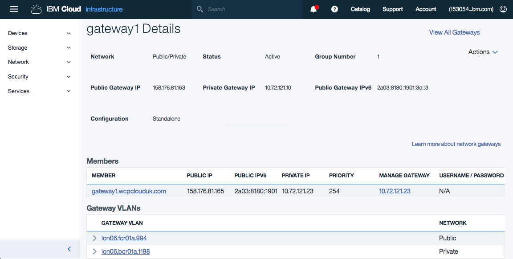
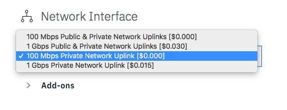
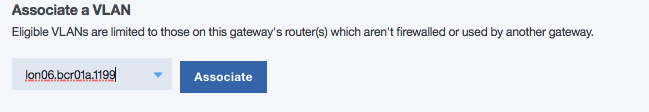

copyright:
  years: 2018
lastupdated: "2018-06-05"

---

{:java: #java .ph data-hd-programlang='java'}
{:swift: #swift .ph data-hd-programlang='swift'}
{:ios: #ios data-hd-operatingsystem="ios"}
{:android: #android data-hd-operatingsystem="android"}
{:shortdesc: .shortdesc}
{:new_window: target="_blank"}
{:codeblock: .codeblock}
{:screen: .screen}
{:tip: .tip}
{:pre: .pre}

# Secure Private Network on the IBM Cloud
Networking and security are major considerations for workloads deployed on public cloud. The need to create an isolated and secure private network environment is central to the IaaS model of application deployment. Firewalls, VLANS, routing and VPNs are all necessary components in creating an isolated private environment, within which virtual machines and bare-metal servers can be securely deployed in multi-tier application topologies, while proving protection from risks on the public internet.  

This tutorial highlights how a Virtual Router Appliance (VRA) <link> can be configured on the IBM Cloud to create a simple secure private network (enclosure). The enclosure creates an isolated network environment within which complex application topologies can be created, using the familiar and well known networking technologies IP routing, VLANs, IP subnets and firewall rules. 

This tutorial is a starting point for classic networking on the IBM Cloud and should not be considered a production capability as described here. Additional capabilities that might be considered are:
* Direct Link <link>
* Hardware firewall appliances (Shared and Dedicated) <link>
* Hardware VPN appliances <link>
* High Availability with clustered routers and dual uplinks <link>

Options are presented for enhancing the enclosure with the configuration of site-to-site VPN for secure data center connectivity and Network Address Translation (SNAT) for access to Internet services. 

{:shortdesc}

## Objectives
{: #objectives}

* Create a secure private network within which virtual machines and bare-metal servers can be deployed
* Deploy a Virtual Router Appliance (VRA)
* Configure VLANs and IP subnets
* Secure the VRA and enclosure
* Configure VRA firewall rules

## Services used
{: #services}

This tutorial uses the following service:
* [Virtual Router Appliance](https://console.bluemix.net/catalog/services/ServiceName)

This tutorial will incur costs. The VRA is only available on a monthly pricing plan. Use the [Pricing Calculator](https://console.bluemix.net/pricing/) to generate a cost estimate based on your projected usage.

## Architecture
{: #architecture}

intro sentence

<p style="text-align: center;">

  
</p>


1. The VRA is deployed
2. Initial VRA setup
2. Ordering the first server and VLAN
3. VRA configuration

## Before you begin
{: #prereqs}

### Configure the SoftLayer VPN

In this tutorial this network is not visible on the public Internet. The VRA and any servers will only be accessible via private IP addresses and you will use your SoftLayer VPN for connectivity. 

1. [Ensure your VPN Access is enabled](https://knowledgelayer.softlayer.com/procedure/getting-started-softlayer-vpn) and configured for SSL. 

     You should be a **Master User** to enable VPN access or contact your master user for access.
     {:tip}
2. Obtain your VPN Access credentials in [your profile page](https://control.softlayer.com/account/user/profile).
3. Log in to the VPN through [the web interface](https://www.softlayer.com/VPN-Access) or preferably use your local workstation with a VPN client for [Linux](https://knowledgelayer.softlayer.com/procedure/ssl-vpn-linux), [macOS](https://knowledgelayer.softlayer.com/procedure/ssl-vpn-mac-os-x-1010) or [Windows](https://knowledgelayer.softlayer.com/procedure/ssl-vpn-windows). 

Use the FQDN of a single data center VPN access point from the previous of the form *vpn.xxxnn.softlayer.com* as the Gateway address.{tip}

### Check account permissions

Contact your Infrastructure master user to get the following permissions:
- **Quick Permissions** - Basic User
- **Network** so that you can create and configure the enclosure, All Network Permissions are required. 
- **Services** manage SSH Keys

### Upload SSH keys
Via the portal [Upload the SSH public key](https://console.bluemix.net/docs/infrastructure/ssh-keys/index.html) that will be used to access and administer the VRA and private network.  

## Provision Virtual Router Appliance
{: VRA}
The first step is to deploy a VRA that will provide IP routing and the firewall for the private network enclosure. The internet is accessible from the enclosure by an IBM Cloud provided public facing transit VLAN, a gateway and optionally a hardware firewall create the connectivity from the public VLAN to the secure private enclosure VLANs. In this solution tutorial a Virtual Router Appliance (VRA) provides this gateway and firewall perimeter. 

1. Go to the catalog to create a [IBM Virtual Router Appliance](https://console.bluemix.net/catalog/infrastructure/virtual-router-appliance)
2. Click on **Create** to go to the **Gateway Appliances** page.  
3. On the top right of the page click **Order Gateway**
4. You will be redirected to the ordering screen where the target data center and the VRA Server type can be selected. 

For a production environment it is recommended to use at a minimum - Dual Intel Xeon E5-2620 v4 (16 Cores, 2.10 GHz) with 64GB of RAM.{tip}

   1. Select the target data center in the drop down at the top of the page
   2. Select the link under **STARTING PRICE PER MONTH** for the desired server type to host the VRA 
   3. RAM. Select 64GB minimum for production use
   4. Operating System. Select the only option
        - Virtual Router Appliance 5.x (up to 20Gbps) Subscription Edition (64 Bit) 
   5. Uplink Port Speeds. Take the default or if required select 1Gbps, 10Gbps  and redundant links
   6. Click **Add To Order**
   
5. You will be directed to the Checkout screen
 
   1. Validate or change the choices already made.   
   2. Add SSH Key under the **Advanced System Configuration** heading. Via the 'Server 1' drop down select the SSH key you specified earlier. 
   3. Set the VRA Hostname and Domain name. This domain name is not used for routing and DNS but should align with your network naming standards. 
   4. Click **Submit Order** 

6. Monitor for creation on the Devices page or via email. VRA creation may take a number of hours to complete. 

### Review deployed VRA

Inspect the new VRA. On the [Infrastructure Dashboard](https://control.bluemix.net) Select **Network** in the left hand pane followed by **Gateway Appliances** to go to the [Gateway Appliances](https://control.bluemix.net/network/gateways) page. Select the name of the newly created VRA in the **Gateway** column to proceed to the Gateway Details page. 



Record the Private and Public IP addresses of the VRA for future use.

## Initial VRA setup
Using the SSL VPN login to the VRA from your workstation using the default **vyatta** account accepting the SSH security prompts. To increase security, once SSH login is successful via the private network, public network access to the VRA is removed along with userid/password authentication. 

```
SSH vyatta@<VRA Private IP Address>
```
Setup of the VRA requires the VRA to be placed into [edit] mode using the `configure` or `conf` command. When in [edit] mode the prompt changes from $ to #. After successful VRA command execution a change can be committed to the running configuration with the `commit` command. Once you have verified that the configuration is working as intended, it can be saved permanently using the `save` command. To return to the Vyatta system command prompt $, type `exit`. 

If at any stage before the `save` command is entered, access is lost due to committing a configuration change, rebooting the VRA will return it back to the last save point, restoring access.{tip}

First disable standard user/password login:

```
vyatta@gateway1:-$ configure
[edit]
vyatta@gateway1# set service ssh disable-password-authentication
[edit]
vyatta@gateway1# commit
[edit]
vyatta@gateway1# save
[edit]
vyatta@gateway1# exit
vyatta@gateway1:-$ 
```
From this point in this tutorial it is assumed that all VRA commands are entered at the \[edit\] # prompt. 


The VRA is pre-configured for the IBM Cloud IaaS environment. This includes

- NTP server
- Name servers
- SSH
- HTTPS web server 
- Default time-zone US/Chicago

Set local time zone as required. Auto-complete with the tab key will list the potential time zone values

```
$ configure 
# set system time-zone **<timezone>**
# commit 
```

The following parameters should be configured:

```
# set security firewall all-ping enable
# set security firewall broadcast-ping disable
```

By default the VRA firewall is stateless. Stateful firewalls are used in this tutorial and set with the following commands. 

```
# set security firewall global-state-policy icmp
# set security firewall global-state-policy udp
# set security firewall global-state-policy tcp
# commit
```

Save the configuration

```
# save
```

To proceed with the creation of the private enclosure, user VLANs for the provisioning of virtual and bare-metal servers must be first assigned to the VRA.

### Ordering the first virtual server and VLAN
Order a [virtual server](https://console.bluemix.net/catalog/infrastructure/virtual-server-group) from the Compute category of the IBM cloud services catalog. This will create the first private user VLAN and IP subnet.  <Link to portable and static IPs>

1. Select ‘Public Virtual Server’. Click **Create**.

  On the Virtual Server ordering page specify:
  - Hostname
  - Domain
  - Location (Data Center same as the VRA)
  - Device Flavor – allow to default
  - SSH Key - key as uploaded earlier
  - Image – allow to default to CentOS
  - Network Interface. The network interface must be changed from the default of *public and private* to only specify a Private Network Uplink. This ensures that the new server has no direct access to the Internet, and access is controlled by the routing and firewall rules on the VRA.  



2. Click tick box to accept the Third-Party service agreements. 
3. Click **Provision**
4. Monitor for completion on the [Devices](https://control.bluemix.net/devices) page or via email. 
5. Make note of the *Private IP address* of the VSI for a later step. 
6. Verify access to the VSI via the IBM Cloud private network using `ping` and `SSH` from your local workstation over the VPN. 
   ```
   ping <VSI Private IP Address>
   SSH root@<VSI Private IP Address>
   ``` 

### Adding the user VLAN to the VRA
A private VLAN and IP Subnet will have been automatically provisioned by IBM Cloud for the virtual server and you will now route this via the VRA to create the secure private network. 

1. Proceed to the Gateway Details for the VRA via the [Gateway Appliances](https://control.bluemix.net/network/gateways) page. Locate the **Associate a VLAN** section on the lower half of the page. The drop down box, ‘Select VLAN’ should be enabled and if selected the newly provisioned VLAN can be selected. 



If no eligible VLAN is shown, the VSI has been created on a different frontend customer router to the VRA. This will require a [support ticket](https://control.bluemix.net/support/unifiedConsole/tickets/add) to be raised to request a private VLAN on the same router as the VRA and for this VLAN to be deleted.{tip}

2. If an eligible VLAN is shown, click **Associate** to tell IBM Cloud that the IP routing for this VLAN will now be manged by this VRA.

Initial VLAN association may take a couple of minutes to complete. Once completed the VLAN should be shown under the **Associated VLANs** heading. At this stage the VLAN and associated subnet are not protected or routed via the VRA and the VSI is accessible via the IBM Cloud Private network. The status of VLAN will be shown as *Bypassed*.{tip}

3. Route the VLAN/Subnet via the VRA by selecting **Actions** in the right hand column, then **Route VLAN**. Routing will take a few minutes, where upon a screen refresh will show it is Routed. 
4. Select the [VLAN name](https://control.bluemix.net/network/vlans/) to view the VLAN details. The provisioned VSI can be seen as well as the assigned Primary IP Subnet. Make a note of the Private VLAN ID <nnnn> (1199 in this example) as this will be used in a later step. 
6. Select the [subnet}(https://control.bluemix.net/network/subnets) to see the IP subnet details. Make a note of the subnet Network, Gateway addresses and CIDR (/26) as these are required for further VRA configuration. 

64 Primary IP addresses are provisioned on the private network and it may require selecting page 2 or 3 to find the required entries.{tip}

At this time the VSI is now inaccessible via the private or management networks as the internal VRA routing for this subnet has not been configured. A ping of the VSI should timeout if the VLAN has been successfully associated with the VRA and IP traffic for the subnet routed to the VRA.{tip}  

The additional work to configure the enclosure and routing is now performed directly on the VRA via SSH. 

## VRA setup

1. Configure the VRA virtual interface to route new subnet to the VLAN via the VRA. 

	SSH into the VRA: 

	```
	SSH vyatta@<VRA Private IP Address>
	```

2. Enter configuration mode to create a new virtual interface with the private VLAN ID, subnet gateway IP address and CIDR recorded in the earlier steps. The CIDR will typically be /26. 

	```
	$ configure
	# set interfaces bonding dp0bond0 vif <VLAN ID> address <Subnet Gateway IP>/<CIDR>
	# commit
	```

The show interfaces command will list the new virtual interface (vif): 

```
# show interfaces
```

```
interfaces {
	bonding dp0bond0 {
		address 10.72.121.23/26
	lacp-options {
		activity active
	}
	mode lacp
	vif 1199 {
		address 10.72.58.65/26
	}
	vrrp  ……
```

Now the private subnet is routed to the VLAN via the VRA, the VSI will once again be accessible via the management network. Validate by pinging the VSI at its private IP address.  

Committing the configuration, only changes the running configuration. It does not change the configuration used at boot time. If access is lost to the VRA due to a configuration change, rebooting the VRA (from the IBM Cloud UI) will return the VRA to the previous save of the default boot configuration file. This could be from some time previously. 

Only  save the configuration to the default system configuration file when you are satisfied that the changes perform the desired effect and do not affect operation or access to the VRA. Save the configuration to the default boot configuration file. 

If it is desired to return to a previous working configuration, by default the last 20 commit points can be viewed, compared or restored.  See the Vyatta Network OS
Basic System Configuration Guide for more details of commiting and saving the configuration.  

```
# show system commit 
# rollback n
# compare
```

### Configure secure enclosure

First basic deny all firewalls rules are defined.

```
$ configure
# set security firewall name APP-TO-INSIDE default-action drop
# set security firewall name APP-TO-INSIDE default-log

# set security firewall name INSIDE-TO-APP default-action drop
# set security firewall name INSIDE-TO-APP default-log
# commit
```

Create the firewall address group that defines the IBM Cloud private networks that can access the enclosure and the networks that can be reached from the enclosure. Initially two sets of IP addresses need access to and from the secure enclosure, these are the SSL VPN Data centers and on the IBM Cloud Service Network (backend/private network). The document  IBM Cloud IP Ranges provides full list of IP ranges that need to be allowed. SSL VPN address are for the data center you will VPN into and other data centers in the regional cluster. The first grouping below is the VPN address ranges for the IBM Cloud London data centers. From SSL VPN section of IBM Cloud IP Ranges select the VPN access points for your data center or DC cluster. 

```
# set resources group address-group ibmprivate address 10.2.220.0/24
# set resources group address-group ibmprivate address 10.200.196.0/24
# set resources group address-group ibmprivate address 10.3.200.0/24
```

The second set of required address ranges is the ‘Service Network (on backend/private network)’
for WDC04, DAL01 and your target data center. The example here is WDC04 (two addresses), DAL01 and LON06.
 
``` 
# set resources group address-group ibmprivate address 10.3.160.0/20
# set resources group address-group ibmprivate address 10.201.0.0/20
# set resources group address-group ibmprivate address 10.0.64.0/19
# set resources group address-group ibmprivate address 10.201.64.0/20
# commit
```

This is followed by the zones and assignment of the previously created firewall rules. Zone definition uses the VRA network interface names to identify the zone associated with each VLAN. The command to create the APP zone, requires the VLAN ID of the VLAN associated with the VRA earlier to be specified. This is highlighted below. 

```
# set security zone-policy zone INSIDE description "IBM Internal network"
# set security zone-policy zone INSIDE default-action drop
# set security zone-policy zone INSIDE interface dp0bond0
# set security zone-policy zone INSIDE to APP firewall INSIDE-TO-APP 

# set security zone-policy zone APP description "Application network"
# set security zone-policy zone APP default-action drop

# set security zone-policy zone APP interface dp0bond0.<VLAN ID> 
# set security zone-policy zone APP to INSIDE firewall APP-TO-INSIDE 
```

Only at this stage can the configuration be committed:

```
# commit
```

To verify that the firewall is now denying traffic, validate by pinging the VSI at its private IP address.  

The next step is to define access rules
```
# set security firewall name INSIDE-TO-APP rule 200 protocol icmp
# set security firewall name INSIDE-TO-APP rule 200 icmp type 8
# set security firewall name INSIDE-TO-APP rule 200 action accept 
# set security firewall name INSIDE-TO-APP rule 200 source address ibmprivate

# set security firewall name INSIDE-TO-APP rule 100 action accept 
# set security firewall name INSIDE-TO-APP rule 100 protocol tcp
# set security firewall name INSIDE-TO-APP rule 100 source address ibmprivate

# set security firewall name INSIDE-TO-APP rule 110 action accept 
# set security firewall name INSIDE-TO-APP rule 110 protocol udp
# set security firewall name INSIDE-TO-APP rule 110 source address ibmprivate
# commit

# set security firewall name APP-TO-INSIDE rule 200 protocol icmp
# set security firewall name APP-TO-INSIDE rule 200 icmp type 8
# set security firewall name APP-TO-INSIDE rule 200 action accept 
# set security firewall name APP-TO-INSIDE rule 200 destination address ibmprivate

# set security firewall name APP-TO-INSIDE rule 100 action accept 
# set security firewall name APP-TO-INSIDE rule 100 protocol tcp
# set security firewall name APP-TO-INSIDE rule 100 destination address ibmprivate

# set security firewall name APP-TO-INSIDE rule 110 action accept 
# set security firewall name APP-TO-INSIDE rule 110 protocol udp
# set security firewall name APP-TO-INSIDE rule 110 destination address ibmprivate
# commit
```

To validate the INSIDE-TO-APP firewall is now allowing ICMP and udp/tcp traffic, from your local machine ping the VSI at its private IP address and login using SSH. 

To validate the APP-TO-INSIDE firewall is allowing ICMP and udp/tcp traffic, ping one of the IBM Cloud name servers at 10.0.80.11 and 10.0.80.12. 

```
[root@vsi  ~]# ping 10.0.80.11 
```

Validate continued access to the VRA management interface via SSH is all is OK, review and save the configuration:

```
# show security  
# save
```

The firewall logs can be reviewed from the VRA operational command prompt. By default no logging of traffic is performed. In this configuration, only dropped traffic for each Zone is logged to aid in diagnosis of firewall misconfiguration.  

```
$ show log firewall name INSIDE-TO-APP
$ show log firewall name APP-TO-INSIDE
```

## Securing the VRA

By default policy based zoning does not secure access to the VRA itself. This is configured through Control Plane Policing (CPP). VRA provides a basic CPP rule set as template. You can merge it into your own configuration by running following command: 
# merge /opt/vyatta/etc/cpp.conf 
After this rule set is merged, a new firewall rule set named ‘CPP’ will be added.
Due to an outstanding defect it is not recommended to use ‘set service SSH listen-address x.x.x.x’ to limit SSH administrative access over the public network. Alternatively external access can be blocked via the CPP firewall for the range of public IP addresses used by the VRA public interface. The <VRA Public IP Subnet> is the same as the VRA Public IP with the last octet being zero (x.x.x.0)

```
# set security firewall name CPP rule 900 action drop
# set security firewall name CPP rule 900 destination address <VRA Public IP Subnet>/24
# set security firewall name CPP rule 900 protocol tcp
# set security firewall name CPP rule 900 destination port 22
# commit 
```

Validate VRA SSH administrative access over IBM Internal network. If access is lost check the parameters entered especially the VRA Public IP Subnet, the VRA can be rebooted from the IBM Cloud console and the previous saved configuration restored. If OK, save. 

```
# save
```

This completes initial setup of the secure enclosure. 


## Remove resources
{:removeresources}
Steps to take to remove the resources created in this tutorial. 

The VRA is on a monthly paid plan. Cancellation does not result in a refund. It is suggested to only cancel if this VRA will not be required again in the next month.{tip}
If a dual VRA High-Availability cluster is required, this single VRA can be upgraded to a xxxxxxxx.{tip}  

1. Cancel any virtual servers of bare-metal servers
2. Cancel the VRA

## Related content
{:related}
<VRA documentation>
<Static and Portable IP Subnets> 

* [Relevant links](https://blah)
