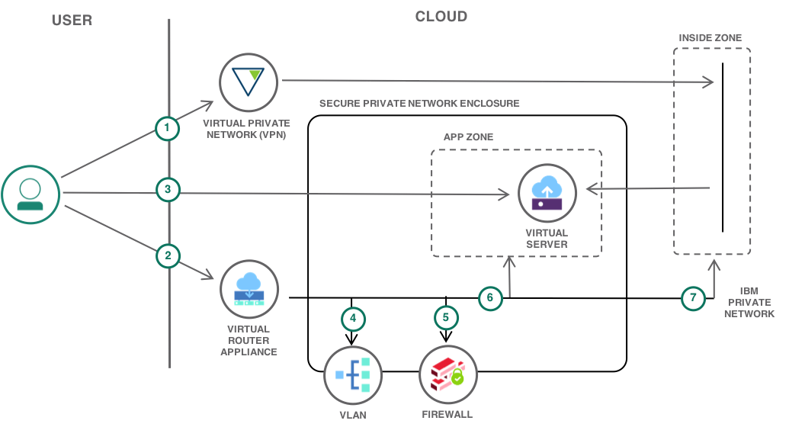
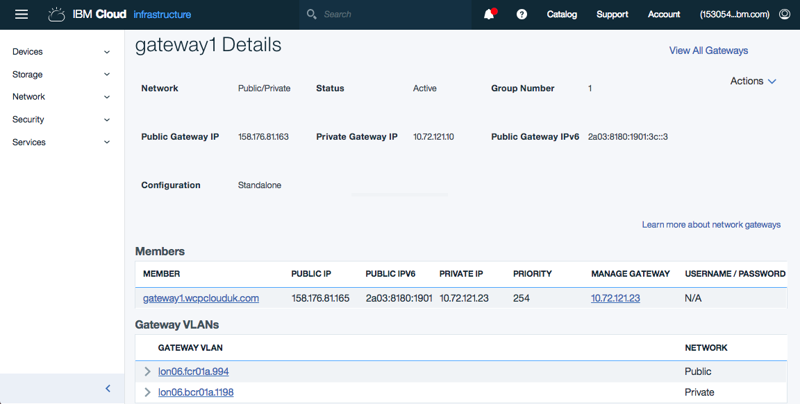
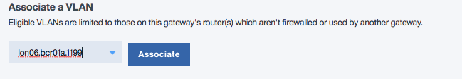

---
copyright:
  years: 2018
lastupdated: "2018-07-16"
---

{:java: #java .ph data-hd-programlang='java'}
{:swift: #swift .ph data-hd-programlang='swift'}
{:ios: #ios data-hd-operatingsystem="ios"}
{:android: #android data-hd-operatingsystem="android"}
{:shortdesc: .shortdesc}
{:new_window: target="_blank"}
{:codeblock: .codeblock}
{:screen: .screen}
{:tip: .tip}
{:pre: .pre}

# Secure Private Network on the {{site.data.keyword.Bluemix_notm}}
The need for isolated and secure private network environments is central to the IaaS application deployment model on public cloud. Firewalls, VLANs, routing, and VPNs are all necessary components in the creation of isolated private environments. This isolation enables virtual machines and bare-metal servers to be securely deployed in complex multi-tier application topologies while proving protection from risks on the public internet.  

This tutorial highlights how a [Virtual Router Appliance](https://console.bluemix.net/docs/infrastructure/virtual-router-appliance/faqs.html#what-is-vra-) (VRA) can be configured on the {{site.data.keyword.Bluemix_notm}} to create a secure private network (enclosure). The VRA Gateway Appliance provides in a single self-managed package, a firewall, VPN gateway, Network Address Translation (NAT) and enterprise-grade routing. In this tutorial, a VRA is used to show how an enclosed, isolated network environment can be created on the {{site.data.keyword.Bluemix_notm}}d. Within this enclosure application topologies can be created, using the familiar and well known technologies of IP routing, VLANs, IP subnets, firewall rules, virtual and bare-metal servers.  

{:shortdesc}

This tutorial is a starting point for classic networking on the {{site.data.keyword.Bluemix_notm}} and should not be considered a production capability as is. Additional capabilities that might be considered are:
* [Direct Link](https://console.bluemix.net/docs/infrastructure/direct-link/getting-started.html#get-started-with-ibm-cloud-direct-link)
* [Hardware firewall appliances](https://console.bluemix.net/docs/infrastructure/fortigate-10g/explore-firewalls.html)
* [IPSec VPN](https://console.bluemix.net/catalog/infrastructure/ipsec-vpn) for secure connectivity to your data center.
* High Availability with clustered VRAs and dual uplinks.
* Logging and auditing of security events.

## Objectives 

{: #objectives}

* Create a secure private network within which virtual machines and bare-metal servers can be deployed
* Deploy a Virtual Router Appliance (VRA)
* Configure VLANs and IP subnets
* Secure the VRA and enclosure
* Configure VRA firewall rules

## Services used
{: #products}

This tutorial uses the following {{site.data.keyword.Bluemix_notm}} services:
* [Virtual Router Appliance](https://console.bluemix.net/catalog/infrastructure/virtual-router-appliance)

**Attention:** This tutorial might incur costs. The VRA is only available on a monthly pricing plan. Use the [Pricing Calculator](https://console.bluemix.net/pricing/) to generate a cost estimate based on your projected usage.

## Architecture
{: #architecture}

<p style="text-align: center;">

  
</p>


1. Configure VPN
2. Deploy VRA 
3. Create Virtual Server
4. Add VLAN to VRA
5. Configure enclosure firewall


## Before you begin
{: #prereqs}

### Configure the SoftLayer VPN

In this tutorial the network enclosure created is not visible on the public Internet. The VRA and any servers will only be accessible via the private network, and you will use your SoftLayer VPN for connectivity. 

1. [Ensure your VPN Access is enabled](https://knowledgelayer.softlayer.com/procedure/getting-started-softlayer-vpn) and configured for SSL. 

     You should be a **Master User** to enable VPN access or contact your master user for access.
     {:tip}
2. Obtain your VPN Access credentials in [your profile page](https://control.softlayer.com/account/user/profile).
3. Log in to the VPN through [the web interface](https://www.softlayer.com/VPN-Access) or preferably use your local workstation with a VPN client for [Linux](https://knowledgelayer.softlayer.com/procedure/ssl-vpn-linux), [macOS](https://knowledgelayer.softlayer.com/procedure/ssl-vpn-mac-os-x-1010) or [Windows](https://knowledgelayer.softlayer.com/procedure/ssl-vpn-windows). 

For the VPN client use the FQDN of a single data center VPN access point from the [VPN web access page](https://www.softlayer.com/VPN-Access), of the form *vpn.xxxnn.softlayer.com* as the Gateway address.

{tip}

### Check account permissions

Contact your Infrastructure master user to get the following permissions:
- **Quick Permissions** - Basic User
- **Network** so that you can create and configure the enclosure, All Network Permissions are required. 
- **Services** manage SSH Keys

### Upload SSH keys

Via the portal [Upload the SSH public key](https://console.bluemix.net/docs/infrastructure/ssh-keys/index.html) that will be used to access and administer the VRA and private network.  

### Target data center

Choose a {{site.data.keyword.Bluemix_notm}} data center to deploy the secure private network. This tutorial assumes that the users account has no infrastructure, specifically no [VLANs](https://console.bluemix.net/docs/infrastructure/vlans/order-vlan.html#order-vlans) deployed in the target data center. 

When infrastructure and VLANs are deleted, it can take up for 5 days for the VLANs to be reclaimed. Any existing user VLANs used for virtual machines may not be accessible to the VRA when it is provisioned. {tip:}


## Provision Virtual Router Appliance

{: #VRA}
The first step is to deploy a VRA that will provide IP routing and the firewall for the private network enclosure. The internet is accessible from the enclosure by an {{site.data.keyword.Bluemix_notm}} provided public facing transit VLAN, a gateway and optionally a hardware firewall create the connectivity from the public VLAN to the secure private enclosure VLANs. In this solution tutorial a Virtual Router Appliance (VRA) provides this gateway and firewall perimeter. 

1. From the catalog select a [IBM Virtual Router Appliance](https://console.bluemix.net/catalog/infrastructure/virtual-router-appliance)

2. Click on **Create** to go to the **Gateway Appliances** page.  

3. On the top right of the page click **Order Gateway**.

4. On the ordering screen, the target data center and the VRA Server type can be selected. 

    For a production environment it is recommended to use at a minimum - Dual Intel Xeon E5-2620 v4 (16 Cores, 2.10 GHz) with 64GB of RAM. {tip}

    * Select the target data center in the drop down at the top of the page.
    * Select the link under **STARTING PRICE PER MONTH** for the desired server type to host the VRA.
    * RAM. Select option.
    * Operating System. Select the only option
        - Virtual Router Appliance 5.x (up to 20Gbps) Subscription Edition (64 Bit) 
    * Uplink Port Speeds. Take the default or if required select 1Gbps, 10Gbps  and redundant links.
    * Click **Add To Order**.

5. On the Checkout screen:

    * Validate or change the choices already made.   
    * Add SSH Key under the **Advanced System Configuration** heading. Via the 'Server 1' drop down, select the SSH key you specified earlier. 
    * Set the VRA Hostname and Domain name. This domain name is not used for routing and DNS but should align with your network naming standards. 
    * Click **Submit Order**.

6. Monitor for creation on the Devices page or via email. VRA creation may take a number of hours to complete. 

### Review deployed VRA

1. Inspect the new VRA. On the [Infrastructure Dashboard](https://control.bluemix.net) Select **Network** in the left-hand pane followed by **Gateway Appliances** to go to the [Gateway Appliances](https://control.bluemix.net/network/gateways) page. Select the name of the newly created VRA in the **Gateway** column to proceed to the Gateway Details page. 

2. Make a note of the `Private` and `Public IP` addresses of the VRA for future use.

## Initial VRA setup

{: #initial_VRA_setup}

1. From your workstation, via the SSL VPN, login to the VRA using the default **vyatta** account, accepting the SSH security prompts. 

    ```bash
    SSH vyatta@<VRA Private IP Address>
    ```

    {: codeblock}

    Setup of the VRA requires the VRA to be placed into \[edit\] mode using the `configure` or `conf` command. 

    When in `edit` mode the prompt changes from `$` to `#`. After successful VRA command execution a change can be committed to the running configuration with the `commit` command. Once you have verified that the configuration is working as intended, it can be saved permanently using the `save` command. To return to the Vyatta system command prompt `$`, type `exit`. 

    If at any stage before the `save` command is entered, access is lost due to committing a bad configuration change, rebooting the VRA will return it back to the last save point, restoring access.

    {: tip} 

2. To enhance security, now that SSH login is successful via the private network, userid/password authentication is disabled.

    ```
    configure
    set service ssh disable-password-authentication
    commit
    save
    exit
    ```
    {: codeblock}

    From this point in this tutorial it is assumed that all VRA commands are entered at the `edit` prompt, subsequent to entering `configure`. 

3. Review the initial configuration

    ```
    show
    ```

    {: codeblock}

    The VRA is pre-configured for the {{site.data.keyword.Bluemix_notm}} IaaS environment. This includes the following:

    - NTP server
    - Name servers
    - SSH
    - HTTPS web server 
    - Default time-zone US/Chicago

4. Set local time zone as required. Auto-complete with the tab key will list the potential time zone values

    ```
    set system time-zone <timezone>
    commit 
    ```
    {: codeblock}

5. Set ping behaviour. Ping is not disabled to aid in routing and firewall troubleshooting. 

    ```
    set security firewall all-ping enable
    set security firewall broadcast-ping disable
    ```
    {: codeblock}

6. Enable stateful firewall operation. By default the VRA firewall is stateless. 

    ```
    set security firewall global-state-policy icmp
    set security firewall global-state-policy udp
    set security firewall global-state-policy tcp
    commit
    ```
    {: codeblock}

7. Save the configuration

    ```
    save
    ```

    {: codeblock}

## Order the first virtual server and VLAN

{: #order_virtualserver_and_vlan}

To create the private enclosure, one or more user VLANs for the provisioning of virtual and bare-metal servers must be assigned to the VRA. There is no charge for the first private and first public VLANs. Additional VLANs to support a multi-tier application topology can be ordered via a [support ticket](https://console.bluemix.net/docs/infrastructure/vlans/order-vlan.html#order-vlans). Note only a limited number of VLANs available for a single client in a data center.  

When multiple user VLANs are present, prevision new virtual or bare-metal servers via the **Device** menu on the [Softlayer Dashboard](https://control.softlayer.com/). This dialog allows the target VLAN to be specified when a new device is provisioned.   

{tip:}

1. Order a [virtual server](https://console.bluemix.net/catalog/infrastructure/virtual-server-group) from the Compute category of the IBM cloud services catalog. This will create the first private user VLAN and primary IP subnet.  

2. Select `Public Virtual Server` and then click **Create**.

  On the Virtual Server ordering page specify:
  - Hostname
  - Domain
  - Location (Data Center same as the VRA)
  - Device Flavor – allow to default
  - SSH Key - key as uploaded earlier
  - Image – allow to default to CentOS
  - Network Interface. The network interface must be changed from the default of *public and private* to only specify a Private Network Uplink. This ensures that the new server has no direct access to the Internet, and access is controlled by the routing and firewall rules on the VRA.  

3. Click tick box to accept the `Third-Party` service agreements. 
4. Click **Provision**.
5. Monitor for completion on the [Devices](https://control.bluemix.net/devices) page or via email. 
6. Make note of the `Private IP address` of the VSI for a later step. 
7. Verify access to the VSI via the {{site.data.keyword.Bluemix_notm}} private network using `ping` and `SSH` from your local workstation over the VPN.

   ```bash
   ping <VSI Private IP Address>
   SSH root@<VSI Private IP Address>
   ```

   {: codeblock}

## Adding VLAN to the VRA

{: #adding_vlan_to_vra}

A private VLAN and primary IP Subnet will have been automatically provisioned by {{site.data.keyword.Bluemix_notm}} for the virtual server and you will now route this via the VRA to create the secure private network. 

1. Proceed to the Gateway Details for the VRA via the [Gateway Appliances](https://control.bluemix.net/network/gateways) page. Locate the **Associate a VLAN** section on the lower half of the page. The drop down box, ‘Select VLAN’ should be enabled and the newly provisioned VLAN can be selected. 

    If no eligible VLAN is shown, the VSI has been created on a different frontend customer router to the VRA. This will require a [support ticket](https://control.bluemix.net/support/unifiedConsole/tickets/add) to be raised to request a private VLAN on the same router as the VRA and for this VLAN to be deleted.

    {tip}

2. Click **Associate** to tell {{site.data.keyword.Bluemix_notm}} that the IP routing for this VLAN will now be manged by this VRA. Initial VLAN association may take a couple of minutes to complete. Once completed the VLAN should be shown under the **Associated VLANs** heading. 

At this stage the VLAN and associated subnet are not protected or routed via the VRA and the VSI is accessible via the {{site.data.keyword.Bluemix_notm}} Private network. The status of VLAN will be shown as *Bypassed*.{tip}

3. Select **Actions** in the right hand column, then **Route VLAN** to route the VLAN/Subnet via the VRA. This will take a few minutes. A screen refresh will show it is Routed. 

4. Select the [VLAN name](https://control.bluemix.net/network/vlans/) to view the VLAN details. The provisioned VSI can be seen as well as the assigned Primary IP Subnet. Make a note of the Private VLAN ID \<nnnn\> (1199 in this example) as this will be used in a later step. 

5. Select the [subnet](https://control.bluemix.net/network/subnets) to see the IP subnet details. Make a note of the subnet Network, Gateway addresses and CIDR (/26) as these are required for further VRA configuration. 64 Primary IP addresses are provisioned on the private network and it may require selecting page 2 or 3 to find the required entries.

6. Validate the that the subnet/VLAN is routed to the VRA and the VSI is not accessible via the management network from your workstation. The additional work to configure the enclosure and routing is now performed directly on the VRA via SSH. 

    ```bash
    ping <VSI Private IP Address>
    ```

    {: codeblock}

## VRA setup

{: #vra_setup}

When the VRA configuration is commited, only the running configuration is changed. It does not change the configuration used at boot time. If access is lost to the VRA due to a configuration change, rebooting the VRA from the {{site.data.keyword.Bluemix_notm}} dashboard will return the VRA to the previous save of the boot configuration file. This saved configuration could be from some time previously. 

Only save the configuration to the default system configuration file when you are satisfied that the changes perform the desired effect and do not affect operation or access to the VRA. 

If it is desired to return to a previous working configuration, by default the last 20 commit points can be viewed, compared or restored.  See the [Vyatta Network OS Basic System Configuration Guide](https://console.bluemix.net/docs/infrastructure/virtual-router-appliance/vra-docs.html#supplemental-vra-documentation) for more details of commiting and saving the configuration.  

   ```bash
show system commit 
rollback n
compare
   ```

{: codeblock}

### Configure VRA IP routing

Configure the VRA virtual network interface to route to the new subnet from the {{site.data.keyword.Bluemix_notm}} private network.  

1. Login to the VRA by SSH. 

    ```bash
    SSH vyatta@<VRA Private IP Address>
    ```
    {: codeblock}

2. Create a new virtual interface with the private VLAN ID, subnet gateway IP address and CIDR recorded in the earlier steps. The CIDR will typically be /26. 

    ```
    set interfaces bonding dp0bond0 vif <VLAN ID> address <Subnet Gateway IP>/<CIDR>
    commit
    ```
    {: codeblock}

3. List the new virtual interface (vif): 

    ```
    show interfaces
    ```

    This is an example interface configuration.

   


4. Validate the VSI is once again accessible via the management network from your workstation. 

    ````bash
    ping <VSI Private IP Address>
    ````

    {: codeblock}

### Configure secure enclosure

The secure private network enclosure is created though configuration of zones and firewall rules. 

Two zones are defined:

- INISDE:  The IBM private and management networks
- APP:  The user VLAN and subnet within the private network enclosure		


1. Define firewalls and defaults.

    ```
    configure
    set security firewall name APP-TO-INSIDE default-action drop
    set security firewall name APP-TO-INSIDE default-log
    
    set security firewall name INSIDE-TO-APP default-action drop
    set security firewall name INSIDE-TO-APP default-log
    commit
    ```
    {: codeblock}

2. Create the {{site.data.keyword.Bluemix_notm}} private network resource group. This address group defines the {{site.data.keyword.Bluemix_notm}} private networks that can access the enclosure and the networks that can be reached from the enclosure. Two sets of IP addresses need access to and from the secure enclosure, these are the SSL VPN Data centers and the {{site.data.keyword.Bluemix_notm}} Service Network (backend/private network). [{{site.data.keyword.Bluemix_notm}} IP Ranges](https://console.bluemix.net/docs/infrastructure/hardware-firewall-dedicated/ips.html) provides the full list of IP ranges that need to be allowed. 


    - Define the SSL VPN address of the data center(s) you are using for VPN access. From the SSL VPN section of {{site.data.keyword.Bluemix_notm}} IP Ranges select the VPN access points for your data center or DC cluster. The example here shows the VPN address ranges for the {{site.data.keyword.Bluemix_notm}} London data centers.
    
        ```
        set resources group address-group ibmprivate address 10.2.220.0/24
        set resources group address-group ibmprivate address 10.200.196.0/24
        set resources group address-group ibmprivate address 10.3.200.0/24
        ```
        {: codeblock}
    
    - Define the address ranges for the {{site.data.keyword.Bluemix_notm}} ‘Service Network (on backend/private network)’
      for WDC04, DAL01 and your target data center. The example here is WDC04 (two addresses), DAL01 and LON06.
    
      ```
      set resources group address-group ibmprivate address 10.3.160.0/20
      set resources group address-group ibmprivate address 10.201.0.0/20
      set resources group address-group ibmprivate address 10.0.64.0/19
      set resources group address-group ibmprivate address 10.201.64.0/20
      commit
        ```
      {: codeblock}

3. Create zones and assign previously created firewalls. Zone definition uses the VRA network interface names to identify the zone associated with each VLAN. The command to create the APP zone, requires the VLAN ID of the VLAN associated with the VRA earlier to be specified. This is highlighted below as \<VLAN ID\>.

    ```
    set security zone-policy zone INSIDE description "IBM Internal network"
    set security zone-policy zone INSIDE default-action drop
    set security zone-policy zone INSIDE interface dp0bond0
    set security zone-policy zone INSIDE to APP firewall INSIDE-TO-APP 
    
    set security zone-policy zone APP description "Application network"
    set security zone-policy zone APP default-action drop
    
    set security zone-policy zone APP interface dp0bond0.<VLAN ID> 
    set security zone-policy zone APP to INSIDE firewall APP-TO-INSIDE 
    ```
    {: codeblock}

4. Commit the configuration and from your workstation verify using ping that the firewall is now denying traffic via the VRA to the VSI: 

    ```
    commit
    ```
    {: codeblock}

    ```bash
    ping <VSI Private IP Address>
    ```
    {: codeblock}

5. Define firewall access rules for udp, tcp and icmp.

    ```
    set security firewall name INSIDE-TO-APP rule 200 protocol icmp
    set security firewall name INSIDE-TO-APP rule 200 icmp type 8
    set security firewall name INSIDE-TO-APP rule 200 action accept 
    set security firewall name INSIDE-TO-APP rule 200 source address ibmprivate
    
    set security firewall name INSIDE-TO-APP rule 100 action accept 
    set security firewall name INSIDE-TO-APP rule 100 protocol tcp
    set security firewall name INSIDE-TO-APP rule 100 source address ibmprivate
    
    set security firewall name INSIDE-TO-APP rule 110 action accept 
    set security firewall name INSIDE-TO-APP rule 110 protocol udp
    set security firewall name INSIDE-TO-APP rule 110 source address ibmprivate
    commit
    
    set security firewall name APP-TO-INSIDE rule 200 protocol icmp
    set security firewall name APP-TO-INSIDE rule 200 icmp type 8
    set security firewall name APP-TO-INSIDE rule 200 action accept 
    set security firewall name APP-TO-INSIDE rule 200 destination address ibmprivate
    
    set security firewall name APP-TO-INSIDE rule 100 action accept 
    set security firewall name APP-TO-INSIDE rule 100 protocol tcp
    set security firewall name APP-TO-INSIDE rule 100 destination address ibmprivate
    
    set security firewall name APP-TO-INSIDE rule 110 action accept 
    set security firewall name APP-TO-INSIDE rule 110 protocol udp
    set security firewall name APP-TO-INSIDE rule 110 destination address ibmprivate
    commit
    ```
    {: codeblock}

6. Validate firewall access. 

- Confirm INSIDE-TO-APP firewall is now allowing ICMP and udp/tcp traffic, from your local machine 

    ```bash
    ping <VSI Private IP Address>
    SSH root@<VSI Private IP Address>
    ```
    {: codeblock}

- Confirm the APP-TO-INSIDE firewall is allowing ICMP and udp/tcp traffic. Login to the VSI using SSH and ping one of the {{site.data.keyword.Bluemix_notm}} name servers at 10.0.80.11 and 10.0.80.12. 

    ```bash
    SSH root@<VSI Private IP Address>
    [root@vsi  ~]# ping 10.0.80.11 
    ```
    {: codeblock}

7. Validate continued access to the VRA management interface via SSH from your workstation. If access is maintained, review and save the configuration. Otherwise a reboot of the VRA will return back to a working configuration. 


    ```bash
    SSH vyatta@<VRA Private IP Address>
    ```
    {: codeblock}

   ```
   show security  
   save
   ```

   {: codeblock}

### Debugging firewall rules

The firewall logs can be viewed from the VRA operational command prompt. In this configuration, only dropped traffic for each Zone is logged to aid in diagnosis of firewall misconfiguration.  

1. Review firewall logs for denied traffic. Periodic review of the logs will identify if servers in the APP zone are attempting to validly or erroneously attempting to contact services on the IBM network. 

```
show log firewall name INSIDE-TO-APP
show log firewall name APP-TO-INSIDE
```

{: codeblock}

2. If services or servers are not contactable and nothing is seen in the firewall logs. Verify if the expected ping/ssh IP traffic is present on the VRA network interface from the {{site.data.keyword.Bluemix_notm}} private network or on the VRA interface to the VLAN using the \<VLAN ID\> from earlier. 

```bash
monitor interface bonding dp0bond0 traffic
monitor interface bonding dp0bond0.<VLAN ID> traffic
```

## Securing the VRA

{: #securing_the_vra}

1. Apply VRA security policy. By default policy based firewall zoning does not secure access to the VRA itself. This is configured through Control Plane Policing (CPP). VRA provides a basic CPP rule set as a template. Merge it into your configuration: 

```bash
merge /opt/vyatta/etc/cpp.conf 
```

{: codeblock}

This creates a new firewall rule set named `CPP`, view the additional rules and commit in \[edit\] mode. 

```
show security firewall name CPP
commit
```

{: codeblock}

2. Securing public SSH access. Due to an outstanding issue with the Vyatta firmware it is not recommended to use `set service SSH listen-address x.x.x.x` to limit SSH administrative access over the public network. Alternatively external access can be blocked via the CPP firewall for the range of public IP addresses used by the VRA public interface. The \<VRA Public IP Subnet\> used here is the same as the \<VRA Public IP Address\> with the last octet being zero (x.x.x.0). 

```
set security firewall name CPP rule 900 action drop
set security firewall name CPP rule 900 destination address <VRA Public IP Subnet>/24
set security firewall name CPP rule 900 protocol tcp
set security firewall name CPP rule 900 destination port 22
commit 
```

{: codeblock}

3. Validate VRA SSH administrative access over IBM Internal network. If access is lost to the VRA via SSH after performing commits, the previous working configuration can be restored by rebooting the VRA from the {{site.data.keyword.Bluemix_notm}} console. Check the parameters entered especially the address used for VRA Public IP Subnet. 

4. If OK, save. 

```
save
```

{: codeblock}

This completes setup of the secure private network enclosure. Additional tutorials in this series illustrate show the enclosure can be securely connected by VPN to a client data center and enabled to access services on the public internet. 


## Remove resources
{: #removeresources}

In this step, you will clean up the resources to remove what you created above.

The VRA is on a monthly paid plan. Cancellation does not result in a refund. It is suggested to only cancel if this VRA will not be required again in the next month. If a dual VRA High-Availability cluster is required, this single VRA can be upgraded on the [Gateway Details](https://control.bluemix.net/network/gateways/) page.

{tip}  

- Cancel any virtual servers or bare-metal servers
- Cancel the VRA
- Cancel any additional VLANs by support ticket. 

## Related content
{:related}
- [IBM Virtual Router Appliance](https://console.bluemix.net/docs/infrastructure/virtual-router-appliance/vra-basics.html#vra-basics)
- [Static and Portable IP Subnets](https://console.bluemix.net/docs/infrastructure/subnets/about.html)
- [IBM QRadar Security Intelligence Platform](http://www-01.ibm.com/support/knowledgecenter/SS42VS)
- [Vyatta documentation](https://console.bluemix.net/docs/infrastructure/virtual-router-appliance/vra-docs.html#supplemental-vra-documentation)
