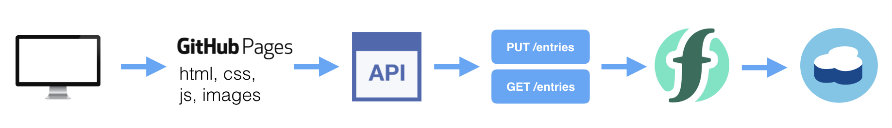
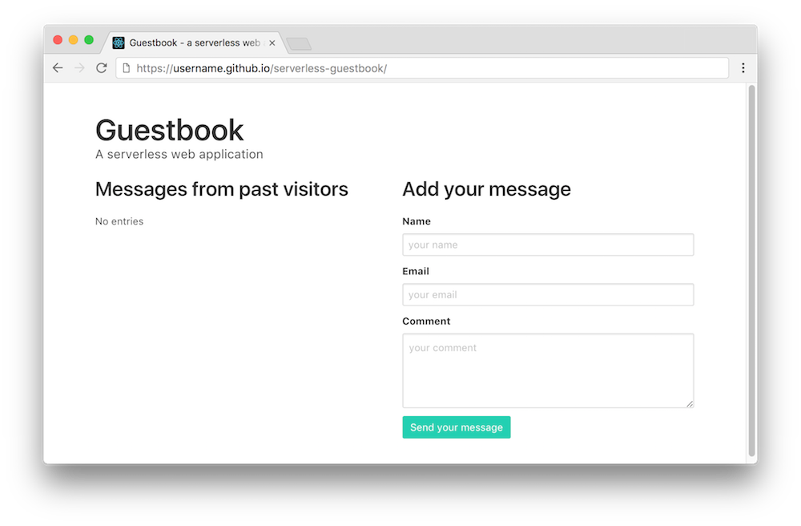

{:step: data-tutorial-type='step'}
{:shortdesc: .shortdesc}
{:new_window: target="_blank"}
{:codeblock: .codeblock}
{:screen: .screen}
{:tip: .tip}
{:pre: .pre}


# Serverless web application and API
{: #serverless-api-webapp}
{: toc-content-type="tutorial"}
{: toc-services="openwhisk, api-gateway, Cloudant, cloud-object-storage"}
{: toc-completion-time="2h"}

<!--##istutorial#-->
This tutorial may incur costs. Use the [Cost Estimator](https://{DomainName}/estimator/review) to generate a cost estimate based on your projected usage.
{: tip}

<!--#/istutorial#-->

In this tutorial, you will create a serverless web application using a bucket in {{site.data.keyword.cos_short}} and implementing the application backend using {{site.data.keyword.openwhisk}}.
{: shortdesc}

As an event-driven platform, {{site.data.keyword.openwhisk_short}} supports a [variety of use cases](https://{DomainName}/docs/openwhisk?topic=openwhisk-use_cases). Building web applications and APIs is one of them. With web apps, events are the interactions between the web browsers (or REST clients) and your web app, the HTTP requests. Instead of provisioning a virtual machine, a container or a Cloud Foundry runtime to deploy your backend, you can implement your backend API with a serverless platform. This can be a good solution to avoid paying for idle time and to let the platform scale as needed.

Any action (or function) in {{site.data.keyword.openwhisk_short}} can be turned into a HTTP endpoint ready to be consumed by web clients. When enabled for web, these actions are called *web actions*. Once you have web actions, you can assemble them into a full-featured API with API Gateway. API Gateway is a component of {{site.data.keyword.openwhisk_short}} to expose APIs. It comes with security, OAuth support, rate limiting, custom domain support.

## Objectives
{: #serverless-api-webapp-0}

* Deploy a serverless backend and a database
* Expose a REST API
* Host a static website
<!--##istutorial#-->
* Optional: Use a custom domain for the REST API
<!--#/istutorial#-->


The application shown in this tutorial is a simple guestbook website where users can post messages.

{: class="center"}
{: style="text-align: center;"}


1. The user accesses the application hosted on the bucket in {{site.data.keyword.cos_short}}
2. The web application calls a backend API.
3. The backend API is defined in API Gateway.
4. API Gateway forwards the request to [{{site.data.keyword.openwhisk_short}}](https://{DomainName}/openwhisk).
5. The {{site.data.keyword.openwhisk_short}} actions use [{{site.data.keyword.cloudant_short_notm}}](https://{DomainName}/catalog/services/cloudantNoSQLDB) to store and retrieve guestbook entries.

## Create the Guestbook database
{: #serverless-api-webapp-2}
{: step}

Let's start by creating an {{site.data.keyword.cloudant_short_notm}} service instance. {{site.data.keyword.cloudant_short_notm}} is a fully managed JSON document database. {{site.data.keyword.cloudant_short_notm}} is built upon and compatible with Apache CouchDB.

1. In the [Catalog](https://{DomainName}/catalog?category=databases#services), under **Services**, go to the **Databases** category. Click on the **{{site.data.keyword.cloudant}}** tile. In the new dialog:
   1. Under **Multitenant** select a region.
   1. Under **Configure Cloudant instance** pick a **unique** name for the service, such as `<yourinitials>-guestbook-db`.
   1. Select a resource group.
   1. Select **IAM and legacy credentials** as authentication method.
   1. Select the **Lite** plan. If you already have a Lite plan in your account, select another service plan.
   1. Click **Create**.
2. Back in the [{{site.data.keyword.Bluemix_short}} Resource List](https://{DomainName}/resources/), under **Services**, click on the {{site.data.keyword.cloudant}} instance you created to open the instance full details page. Note: You may be required to wait until the status of the service changes to `Active`.
3. Click on **Launch Dashboard** to open the dashboard in a new browser tab.
4. In the upper right, click on **Create Database**. Enter ***guestbook*** as name and select **Non-Partitioned** under **Partitioning**. Click **Create** to create the database.
5. Switch back to the browser tab with the service dashboard page. Go to **Service credentials**, then:
   1. Click **New credential**.
   2. Set the name to **for-guestbook**. Leave the role as **Manager**.
   3. Click **Add** to add the new credentials.
   4. Expand the newly created credentials and review them. We will need these credentials later to allow Cloud Functions actions to read/write to your Cloudant service.

## Create serverless actions
{: #serverless-api-webapp-3}
{: step}

In this section, you will create serverless actions (commonly termed as **Functions**). {{site.data.keyword.openwhisk}} (based on Apache OpenWhisk) is a Function-as-a-Service (FaaS) platform which executes functions in response to incoming events. Serverless functions only incur charges for the execution time.

### Sequence of actions to save the guestbook entry
{: #serverless-api-webapp-4}

You will create a **sequence** which is a chain of actions. In a sequence, the output of one action acts as input to the following action and so on. The first sequence you will create is used to persist a guest message. Provided a name, an emailID and a comment, the sequence will:
* Create a document to be persisted.
* Store the document in the {{site.data.keyword.cloudant_short_notm}} database.

Start by creating the first action:

1. In the browser, open a tab and go to [**Functions**](https://{DomainName}/functions).
1. From the namespace drop-down, either select an existing namespace or use **Create Namespace** to create a new one.
1. Go to the [**Actions** list](https://{DomainName}/functions/actions).
1. **Create** a new action:
   1. Set **Name** as `prepare-entry-for-save` as name.
   2. Click **Create Package** to create a new package with name `guestbook`.
   3. Pick a **Node.js** as **Runtime** (Note: Pick the latest version).
   4. Click **Create** to create the action.
1. In the new dialog replace the existing code with the code snippet below:
   ```js
   /**
    * Prepare the guestbook entry to be persisted
    */
   function main(params) {
     if (!params.name || !params.comment) {
       return Promise.reject({ error: 'no name or comment'});
     }

     return {
       doc: {
         createdAt: new Date(),
          name: params.name,
          email: params.email,
          comment: params.comment
       }
     };
   }
   ```
   {: codeblock}

1. Thereafter click **Save**.

Then add the action to a sequence:

1. On the left pane, click on **Enclosing Sequences** and then **Add To Sequence**.
1. Under **Create New** set the **Sequence Name** to `save-guestbook-entry-sequence` and choose **guestbook** as package.
1. Select guestbook for the **Enclosing Package**
1. Then finish by clicking **Create and Add**.

Now, add the second action to that sequence:

1. Click on the entry **save-guestbook-entry-sequence**. It opens sequence details. Then click **Add** on the upper right.
1. Instead of **Create New** select **Use Public**. It loads and displays icons for available integrations. Pick **Cloudant**.
1. Under **Actions** choose **create-document**.
1. Create a **New Binding** and complete the form as follows:
   1. Set **Name** to `binding-for-guestbook`.
   2. For **Instance** select your instance, for the credentials **for-guestbook** as created earlier, and as **Database** pick **guestbook**.
1. Click **Add**, thereafter **Save**.
1. To test the entire sequence, click on **Invoke with parameters** and enter the JSON below
   ```json
      {
        "name": "John Smith",
        "email": "john@smith.com",
        "comment": "this is my comment"
      }
   ```
   {: codeblock}

1. Click **Invoke**.

### Sequence of actions to retrieve entries
{: #serverless-api-webapp-5}

The second sequence is used to retrieve the existing guestbook entries. This sequence will:
* List all documents from the database.
* Format the documents and return them.

1. Under [**Functions**](https://{DomainName}/functions), click on **Actions** and then **Create**.
2. Then, after selecting **Action**, use `set-read-input` as name. Again, select **guestbook** as package and a **Node.js** version as runtime. Click **Create**.
3. In the action details, replace the existing code with the code snippet below. This action passes the appropriate parameters to the next action in the sequence.
   ```js
   function main(params) {
     return {
       params: {
         include_docs: true
       }
     };
   }
   ```
   {: codeblock}

4. Click **Save**.

Add the action to a sequence:

1. Similar to earlier, click on **Enclosing Sequences**, **Add to Sequence** and **Create New**.
1. Enter `read-guestbook-entries-sequence` for the **Sequence Name**
1. Select guestbook for the **Enclosing Package** and click **Create and Add**.

Complete the sequence:

1. Click on **read-guestbook-entries-sequence** sequence and then click **Add** to create and add the second action to get documents from {{site.data.keyword.cloudant_short_notm}}.
1. Under **Use Public**, choose **{{site.data.keyword.cloudant_short_notm}}** and then **list-documents**
1. Under **My Bindings**, choose **binding-for-guestbook** and **Add** to create and add this public action to your sequence.
1. Click **Add** again to create and add the third action which will format the documents from {{site.data.keyword.cloudant_short_notm}}.
1. Under **Create New** enter `format-entries` for name
1. Click **guestbook** for the Enclosing Package and then click **Create and Add**.
1. Click on **format-entries** and replace the code with below:
   ```js
   const md5 = require('spark-md5');

   function main(params) {
     return {
       entries: params.rows.map((row) => { return {
         name: row.doc.name,
         email: row.doc.email,
         comment: row.doc.comment,
         createdAt: row.doc.createdAt,
         icon: (row.doc.email ? `https://secure.gravatar.com/avatar/${md5.hash(row.doc.email.trim().toLowerCase())}?s=64` : null)
       }})
     };
   }
   ```
   {: codeblock}

1. Click on **Save**.
1. Choose the sequence by clicking on **Actions** and then **read-guestbook-entries-sequence**.
1. Click on **Save** and then **Invoke**.

## Create an API
{: #serverless-api-webapp-6}
{: step}

1. Go to [Actions](https://{DomainName}/functions/actions).
2. Select the **read-guestbook-entries-sequence** sequence. Next to the name, click on **Web Action**, check **Enable as Web Action** and **Save**.
3. Do the same for the **save-guestbook-entry-sequence** sequence.
4. Go to [APIs](https://{DomainName}/functions/apimanagement) and click **Create API** (or **Create Managed API** if you have existing APIs).
5. Set the API name to `guestbook` and, accordingly, the base path to `/guestbook`.
6. Click on **Create operation** and create an operation to retrieve guestbook entries:
   1. Set **path** to `/entries`
   2. Set **verb** to `GET`
   3. Select the **read-guestbook-entries-sequence** action
7. Click on **Create operation** and create an operation to persist a guestbook entry:
   1. Set **path** to `/entries`
   2. Set **verb** to `PUT`
   3. Select the **save-guestbook-entry-sequence** action
8. Scroll to the end of the page to **Create** the API. Make note of the provided route, as you will use it from your web application.

## Deploy the web app
{: #serverless-api-webapp-7}
{: step}

Create a {{site.data.keyword.cos_short}} bucket configured with static website hosting containing the files for the guestbook javascript application that uses the cloudant database.

Create a {{site.data.keyword.cos_short}} instance:
1. Select [Cloud Object Storage](https://{DomainName}/objectstorage/create) from the catalog
1. Chose a **unique** service name for the insrtance, such as `<yourinitials>-guestbook-cos`
1. Select a resource group.
1. Click **Create**

Create a bucket configured for static website hosting:
1. Click **Create a bucket**
1. Click Custom bucket
1. Enter a bucket name that is unique is across all IBM accounts.  Try `<yourinitials>-guestbook`.
1. Select Resiliency **Regional**
1. Select a Location, choose a region consistent with the {{site.data.keyword.cloudant_short_notm}} instance
1. Keep the Storage class default
1. Scroll down to the Static website hosting and click **Add rule**
1. Keep the Routing rules (individual) selected and add the Index document **index.html**
1. Click Public access to **On**
1. Click **Save**
1. Scroll to the bottom and click **Create bucket**

Copy the files in the `docs` directory of https://github.com/IBM-Cloud/serverless-guestbook into the bucket:
1. Open https://github.com/IBM-Cloud/serverless-guestbook in a new tab.
1. Download a zip file by clicking **Code** then **Download ZIP**.
1. Unzip the file and navigate to the `docs` directory of the unzipped file.
1. Edit **guestbook.js** - replace the value of **apiUrl** with the route you made a note of earlier when creating the API.
1. Open the bucket **Objects** view and drag and drop the **guestbook.js** and **index.html** files to the COS bucket.
1. Navigate to the **Configuration** tab for the bucket and scroll down to the **Static website hosting endpoints** section to copy the **Public** endpoint into a browser tab.
1. You should see the `test` guestbook entry created earlier.
1. Add new entries.

{: class="center"}
{: style="text-align: center;"}

<!--##istutorial#-->
## Optionally configure a custom domain
{: #serverless-api-webapp-custom-domain}
{: step}

You can optionally create a custom domain for the API.  Earlier you made note of the custom route and copied it into **guestbook.js**.  A CNAME record can be added to your custom domain in a DNS provider. Instructions to create a custom domain for an API using {{site.data.keyword.cis_full_notm}} and {{site.data.keyword.openwhisk_short}} can be found in [Deploy serverless apps across multiple regions](https://{DomainName}/docs/solution-tutorials?topic=solution-tutorials-multi-region-serverless).

A custom domain can also be assigned to the static website bucket. Follow the instructions at [Domain Routing for IBM Cloud Object Storage static web hosting](https://{DomainName}/docs/cloud-object-storage?topic=cloud-object-storage-routing-rules-cos). Navigate to the **Configuration** tab for the bucket and scroll down to the **Static website hosting endpoints** section to copy the **Public** endpoint that will be used for the CNAME target.
<!--#/istutorial#-->

## Remove resources
{: #serverless-api-webapp-cleanup}
{: step}

To delete the created bucket and {{site.data.keyword.openwhisk_short}} service:
1. Navigate to the {{site.data.keyword.cos_short}} bucket objects
1. Check the box in the title row to select all objects in the bucket
1. Click **Delete objects**
1. In the upper right of the bucket object page **Actions** menu select **Delete bucket**
1. In the upper right of the {{site.data.keyword.openwhisk_short}} instance **Actions** menu select **Delete Service**

To delete the created {{site.data.keyword.cloudant_short_notm}} service,
1. Navigate to [resource list](https://{DomainName}/resources)
2. Under **Services**, click on the action menu next to `<yourinitials>-guestbook-db` service
3. Click **Delete**

To delete the API and actions from {{site.data.keyword.openwhisk_short}},
1. Navigate to [{{site.data.keyword.openwhisk_short}}](https://{DomainName}/functions/) landing page.
2. On the left pane, click on **APIs**.
3. Click on the **delete** icon in the `guestbook` API row and then **Delete** on the modal window.
4. On the left pane, click on **Actions**.
5. Under the `guestbook` package, delete all the actions by clicking on the **delete** icon in the respective action rows.

Depending on the resource it might not be deleted immediately, but retained (by default for 7 days). You can reclaim the resource by deleting it permanently or restore it within the retention period. See this document on how to [use resource reclamation](https://{DomainName}/docs/account?topic=account-resource-reclamation).
{: tip}

## Related content
{: #serverless-api-webapp-13}

* [Deploy serverless apps across multiple regions](https://{DomainName}/docs/solution-tutorials?topic=solution-tutorials-multi-region-serverless)
* [Serverless Computing](https://www.ibm.com/cloud/learn/serverless)
* [More code patterns on serverless](https://developer.ibm.com/patterns/category/serverless/)
* [Getting started with {{site.data.keyword.openwhisk}}](https://{DomainName}/docs/openwhisk?topic=openwhisk-getting-started)
* [{{site.data.keyword.openwhisk}} common use cases](https://{DomainName}/docs/openwhisk?topic=openwhisk-use_cases)
* [Create REST APIs from actions](https://{DomainName}/docs/openwhisk?topic=openwhisk-apigateway)
