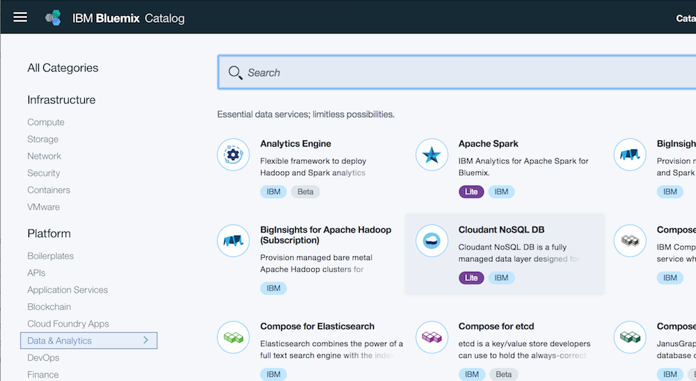

---
copyright:
  years: 2017
lastupdated: "2017-10-27"

---

{:shortdesc: .shortdesc}
{:new_window: target="_blank"}
{:codeblock: .codeblock}
{:screen: .screen}
{:tip: .tip}
{:pre: .pre}


# Serverless Web Application and API

In this tutorial, you will create a serverless web application by hosting static website content on GitHub Pages and  implementing the application backend using Functions on IBM Cloud.

The application shown in this tutorial is a simple guestbook website where users can post messages.

## Objectives

* Deploy a serverless backend and database
* Expose a REST API
* Host a static website
* Optional: Use a custom domain for the REST API

## Products

This tutorial uses the following products:
   * [Cloudant NoSQL DB](https://console.bluemix.net/catalog/services/cloudantNoSQLDB)
   * [Cloud Functions](https://console.bluemix.net/openwhisk)

   

1. The user access the application hosted in GitHub Pages.
2. The web application calls a backend API.
3. The backend API is defined in API Gateway.
4. API Gateway forwards the request to [Cloud Functions](https://console.bluemix.net/openwhisk).
5. The Cloud Functions actions use [Cloudant](https://console.bluemix.net/catalog/services/cloudantNoSQLDB) to store and retrieve guestbook entries.

## Before you begin
{: #prereqs}

This guide uses GitHub Pages to host the static website. Make sure you have a public GitHub account.

## Create the Guestbook database

Let's start by creating a Cloudant NoSQL Database. Cloudant NoSQL DB is a fully managed data layer designed for modern web and mobile applications that leverages a flexible JSON schema. Cloudant is built upon and compatible with Apache CouchDB and accessible through a secure HTTPS API, which scales as your application grows.



1. In the Catalog, under **Data & Analytics**, select **Cloudant NoSQL DB**.
2. Set the service name to **guestbook-db** and click **Create**.
3. **Launch** the Cloudant service console.
4. Create a database named **guestbook**.
   

## Create Cloud Functions actions

In this section, you will create serverless actions (commonly termed as Functions). IBM Cloud Functions (based on Apache OpenWhisk) is a Function-as-a-Service (FaaS) platform which executes functions in response to incoming events and costs nothing when not in use.


### Sequence of actions to save the guestbook entry

You will create a **sequence** which is a chain of actions where output of one action acts as an input to the following action and so on. The first sequence you will create is used to persist a guest message. Provided a name, an emailID and a comment, the sequence will:

   * Create a document to be persisted.
   * Store the document in the Cloudant NoSQL database.

1. Switch to **Functions** on IBM Cloud.
2. On the left pane, Click on **Develop**.
3. Create a new Node.js action named **prepare-entry-for-save** by selecting a **blank slate** option to start with.
4. Replace the existing code with the code snippet below. This is the code for your action.
   ```js
   /**
    * Prepare the guestbook entry to be persisted
    */
   function main(params) {
     if (!params.name || !params.comment) {
       return Promise.reject({ error: 'no name or comment'});
     }

     return {
       doc: {
         createdAt: new Date(),
          name: params.name,
          email: params.email,
          comment: params.comment
       }
     };
   }
   ```
   {: codeblock}
4. Click **Make it Live**. In the **Develop** view (https://console.bluemix.net/openwhisk/editor), Click **Link into a sequence** and pick Cloudant **create document**..
5. Create new binding on the left and set name to **binding-for-guestbook**.
6. Select the **guestbook-db** Cloudant instance and the **guestbook** database and **Save**.
7. Click **Add to sequence** and then **This looks good**.
8. Name the sequence **save-guestbook-entry**
9. **Save the sequence** and then **Done**
10. Select the sequence under **My Sequences** and **Run** the sequence with the JSON below to test it

    ```json
    {
      "name": "John Smith",
      "email": "john@smith.com",
      "comment": "this is my comment"
    }
    ```
    {: codeblock}
11. Check the Cloudant NoSQL database to confirm it contains the new record.

### Sequence of actions to retrieve entries

The second sequence is used to retrieve the existing guestbook entries. This sequence will:
   * List all documents from the database.
   * Format the documents and returning them.

1. Create an action to configure the **list documents** call. Name it **set-read-input**
   ```js
   function main(params) {
     return {
       params: {
         include_docs: true
       }
     };
   }
   ```
   {: codeblock}
2. And another action to process the results. Name it **format-entries**
   ```js
   const md5 = require('spark-md5');

   function main(params) {
     return {
       entries: params.rows.map((row) => { return {
         name: row.doc.name,
         email: row.doc.email,
         comment: row.doc.comment,
         createdAt: row.doc.createdAt,
         icon: (row.doc.email ? `https://secure.gravatar.com/avatar/${md5.hash(row.doc.email.trim().toLowerCase())}?s=64` : null)
       }})
     };
   }
   ```
   {: codeblock}
3. Select the **set-read-input** action and then **Link into a sequence**.
4. Select **Cloudant** then the **list documents** action.
5. Select **binding-for-guestbook** binding, **Add to Sequence**,  **Extend**,  **My Actions** and **format-entries**.
6. Click **Add to Sequence** and **This Looks Good**.
7. Name the sequence **read-guestbook-entries**.
8. **Save** the action sequence and click **Done**.

## Create an API


1. Go to Actions https://console.bluemix.net/openwhisk/manage/actions.
2. Select the **read-guestbook-entries** sequence. Under **Additional details**, check **Enable Web Action**.
3. Do the same for the **save-guestbook-entry** sequence.
4. Go to APIs https://console.bluemix.net/openwhisk/apimanagement and **Create Managed API**
5. Set name to **guestbook** and base path to **/guestbook**
6. Create an operation to retrieve guestbook entries:
   1. Set **path** to **/entries**
   2. Set **verb** to **GET**
   3. Select the **read-guestbook-entries** action
7. Create an operation to persist a guestbook entry:
   1. Set **path** to **/entries**
   2. Set **verb** to **PUT**
   3. Select the **save-guestbook-entry** action
8. Save and expose the API.

## Deploy the web app

1. Fork the Guestbook user interface repository https://github.com/IBM-Bluemix/serverless-guestbook to your public GitHub.
2. Modify **docs/guestbook.js** and replace the value of **apiUrl** with the route given by API Connect.
3. Commit the modified file to your forked repository.
4. In the Settings page of your repository, scroll to **GitHub Pages**, change the source to **master branch /docs folder** and Save.
5. Access the public page for your repository.
6. You should see the "test" guestbook entry created earlier.
7. Add new entries.


## Optional: Use your own domain for the API

1. Create your domain under your organization https://console.bluemix.net/docs/admin/manageorg.html#managedomains.
2. Upload a SSL certificate for your domain and the subdomain you will use for the API.
3. Go to the Cloud Functions dashboard, select **APIs** and the Guestbook API.
4. Switch to **Definition**.
5. Set the **Domain for API** to the domain you added to your organization.
6. Set the **Subdomain for API** to **guestbook-api**
7. At this stage, you need to configure your DNS to create a CNAME mapping this subdomain to the IBM Cloud servers. Create a CNAME record for the domain targeting one of the following secure endpoints depending on which region hosts the target API:
   * US South: secure.us-south.bluemix.net.
   * United Kingdom: secure.eu-gb.bluemix.net.
   * Frankfurt: secure.eu-de.bluemix.net.
   * Sydney: secure.au-syd.bluemix.net.

   > Refer to https://console.bluemix.net/docs/apis/management/manage_apis.html#custom_domains for additional information
8. Save the API.
9. Wait for DNS to propagate and you will be able to access your guestbook api at https://guestbook-api.mydomain.com/guestbook.
10. Edit **docs/guestbook.js** and update the value of **apiUrl** with https://guestbook-api.mydomain.com/guestbook
11. Commit the modified file.
12. Your application now access the API through your custom domain.

## Related Content
* [More guides and samples on serverless](https://developer.ibm.com/code/journey/category/serverless/)
* [Getting started with Cloud Functions](https://console.bluemix.net/docs/openwhisk/index.html#getting-started-with-openwhisk)
* [Cloud Functions common use cases](https://console.bluemix.net/docs/openwhisk/openwhisk_use_cases.html#openwhisk_common_use_cases)
* [Create APIs from Cloud Functions actions](https://console.bluemix.net/docs/apis/management/manage_openwhisk_apis.html#manage_openwhisk_apis)
