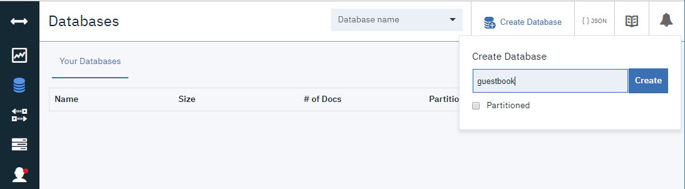
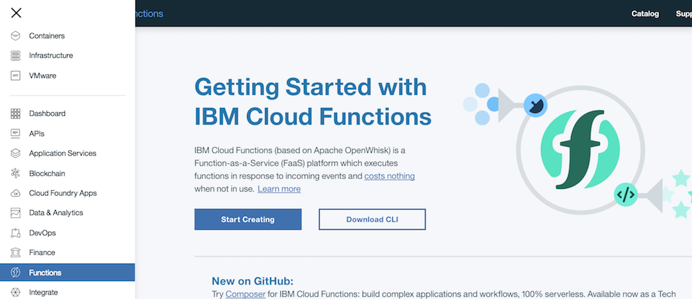
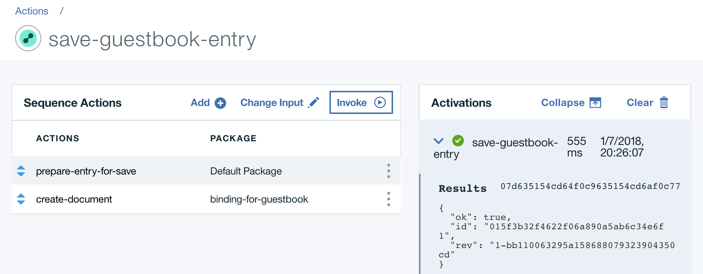
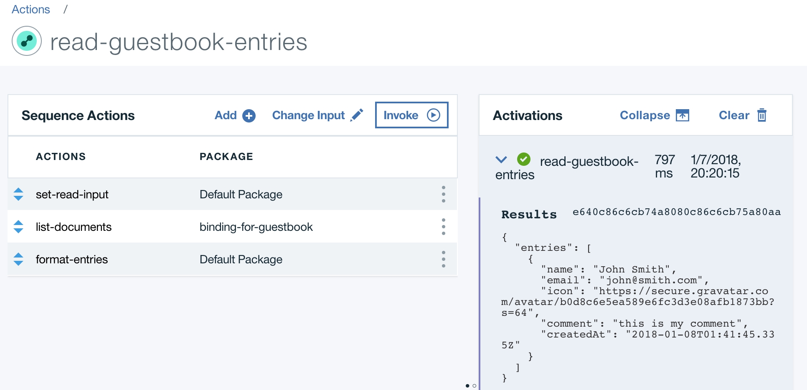
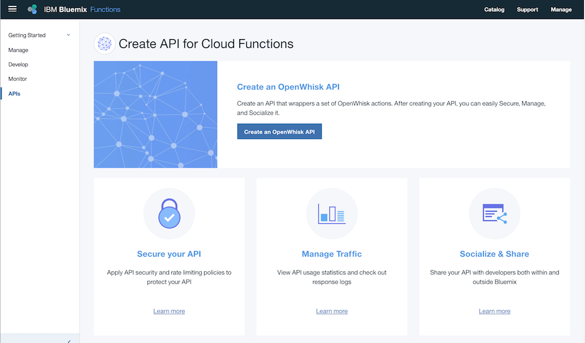

---
copyright:
  years: 2017, 2018
lastupdated: "2018-11-14"

---

{:shortdesc: .shortdesc}
{:new_window: target="_blank"}
{:codeblock: .codeblock}
{:screen: .screen}
{:tip: .tip}
{:pre: .pre}


# Serverless web application and API
{: #serverless-api-webapp}

In this tutorial, you will create a serverless web application by hosting static website content on GitHub Pages and implementing the application backend using {{site.data.keyword.openwhisk}}.

As an event-driven platform, {{site.data.keyword.openwhisk_short}} supports a [variety of use cases](https://{DomainName}/docs/openwhisk/openwhisk_use_cases.html#openwhisk_common_use_cases). Building web applications and APIs is one of them. With web apps, events are the interactions between the web browsers (or REST clients) and your web app, the HTTP requests. Instead of provisioning a virtual machine, a container or a Cloud Foundry runtime to deploy your backend, you can implement your backend API with a serverless platform. This can be a good solution to avoid paying for idle time and to let the platform scale as needed.

Any action (or function) in {{site.data.keyword.openwhisk_short}} can be turned into a HTTP endpoint ready to be consumed by web clients. When enabled for web, these actions are called *web actions*. Once you have web actions, you can assemble them into a full-featured API with API Gateway. API Gateway is a component of {{site.data.keyword.openwhisk_short}} to expose APIs. It comes with security, OAuth support, rate limiting, custom domain support.

## Objectives

* Deploy a serverless backend and a database
* Expose a REST API
* Host a static website
* Optional: Use a custom domain for the REST API

## Services used
{: #services}

This tutorial uses the following runtimes and services:
   * [{{site.data.keyword.cloudant_short_notm}}](https://{DomainName}/catalog/services/cloudantNoSQLDB)
   * [{{site.data.keyword.openwhisk_short}}](https://{DomainName}/openwhisk)

This tutorial may incur costs. Use the [Pricing Calculator](https://{DomainName}/pricing/) to generate a cost estimate based on your projected usage.

## Architecture
{: #architecture}

The application shown in this tutorial is a simple guestbook website where users can post messages.

<p style="text-align: center;">

   
</p>

1. The user access the application hosted in GitHub Pages.
2. The web application calls a backend API.
3. The backend API is defined in API Gateway.
4. API Gateway forwards the request to [{{site.data.keyword.openwhisk_short}}](https://{DomainName}/openwhisk).
5. The {{site.data.keyword.openwhisk_short}} actions use [{{site.data.keyword.cloudant_short_notm}}](https://{DomainName}/catalog/services/cloudantNoSQLDB) to store and retrieve guestbook entries.

## Before you begin
{: #prereqs}

This guide uses GitHub Pages to host the static website. Make sure you have a public GitHub account.

## Create the Guestbook database

Let's start by creating a {{site.data.keyword.cloudant_short_notm}}. {{site.data.keyword.cloudant_short_notm}} is a fully managed data layer designed for modern web and mobile applications that leverages a flexible JSON schema. {{site.data.keyword.cloudant_short_notm}} is built upon and compatible with Apache CouchDB and accessible through a secure HTTPS API, which scales as your application grows.

1. In the Catalog, select **Cloudant**.
2. Set the service name to **guestbook-db**, select **Use both legacy credentials and IAM** as authentication methods and click **Create**.
3. Back in the Resource list, click on the ***guestbook-db** entry under the Name column. Note: You may be required to wait until the service is provisioned. 
4. In the service details screen, click on  ***Launch Cloudant Dashboard*** which will open in another browser tab. Note: Log in maybe required to your Cloudant instance. 
5. Click on ***Create Database*** and create a database named ***guestbook***.

  

6. Back to the service details tab, Under **Service Credentials**
   1. Create **New credential**, accept the defaults and click **Add**.
   2. Click **View credentials** under Actions. We will need these credentials later to allow Cloud Functions actions to read/write to your Cloudant service.

## Create serverless actions

In this section, you will create serverless actions (commonly termed as Functions). {{site.data.keyword.openwhisk}} (based on Apache OpenWhisk) is a Function-as-a-Service (FaaS) platform which executes functions in response to incoming events and costs nothing when not in use.



### Sequence of actions to save the guestbook entry

You will create a **sequence** which is a chain of actions where output of one action acts as an input to the following action and so on. The first sequence you will create is used to persist a guest message. Provided a name, an emailID and a comment, the sequence will:
   * Create a document to be persisted.
   * Store the document in the {{site.data.keyword.cloudant_short_notm}} database.

Start by creating the first action:

1. Switch to **Functions** https://{DomainName}/openwhisk.
2. On the left pane, click on **Actions** and then **Create**.
3. **Create Action** with name `prepare-entry-for-save` and select **Node.js** as the Runtime (Note: Pick the lastest version).
4. Replace the existing code with the code snippet below:
   ```js
   /**
    * Prepare the guestbook entry to be persisted
    */
   function main(params) {
     if (!params.name || !params.comment) {
       return Promise.reject({ error: 'no name or comment'});
     }

     return {
       doc: {
         createdAt: new Date(),
          name: params.name,
          email: params.email,
          comment: params.comment
       }
     };
   }
   ```
   {: codeblock}
1. **Save**

Then add the action to a sequence:

1. Click on **Enclosing Sequences** and then **Add To Sequence**.
1. For the sequence name, enter `save-guestbook-entry-sequence` and then click **Create and Add**.

Finally add a second action to the sequence:

1. Click on **save-guestbook-entry-sequence** and then click **Add**.
1. Select **Use Public**, **Cloudant** and then choose **create-document** under **Actions**
1. Create **New Binding** 
1. For Name, enter `binding-for-guestbook`
1. For Cloudant Instance, select `Input your own credentials` and fill in the following fields with the credentials information captured for your cloudant service: Username, Password, Host and Database = `guestbook` and click **Add** and then **Save**.
   {: tip}
1. To test it, click on **Change Input** and enter the JSON below
    ```json
    {
      "name": "John Smith",
      "email": "john@smith.com",
      "comment": "this is my comment"
    }
    ```
    {: codeblock}
1. **Apply** and then **Invoke**.
    

### Sequence of actions to retrieve entries

The second sequence is used to retrieve the existing guestbook entries. This sequence will:
   * List all documents from the database.
   * Format the documents and returning them.

1. Under **Functions**, click on **Actions** and then **Create** a new Node.js action and name it `set-read-input`.
2. Replace the existing code with the code snippet below. This action passes the appropriate parameters to the next action.
   ```js
   function main(params) {
     return {
       params: {
         include_docs: true
       }
     };
   }
   ```
   {: codeblock}
1. **Save**

Add the action to a sequence:

1. Click on **Enclosing Sequences**, **Add to Sequence** and **Create New**
1. Enter `read-guestbook-entries-sequence` for the **Action Name** and click **Create and Add**.

Complete the sequence:

1. Click on **read-guestbook-entries-sequence** sequence and then click **Add** to create and add the second action to get documents from Cloudant.
1. Under **Use Public**, choose **{{site.data.keyword.cloudant_short_notm}}** and then **list-documents**
1. Under **My Bindings**, choose **binding-for-guestbook** and **Add** to create and add this public action to your sequence.
1. Click **Add** again to create and add the third action which will format the documents from {{site.data.keyword.cloudant_short_notm}}.
1. Under **Create New** enter `format-entries` for name and then click **Create and Add**.
1. Click on **format-entries** and replace the code with below:
   ```js
   const md5 = require('spark-md5');

   function main(params) {
     return {
       entries: params.rows.map((row) => { return {
         name: row.doc.name,
         email: row.doc.email,
         comment: row.doc.comment,
         createdAt: row.doc.createdAt,
         icon: (row.doc.email ? `https://secure.gravatar.com/avatar/${md5.hash(row.doc.email.trim().toLowerCase())}?s=64` : null)
       }})
     };
   }
   ```
   {: codeblock}
1. **Save**
1. Choose the sequence by clicking on **Actions** and then **read-guestbook-entries-sequence**.
1. Click on **Save** and then **Invoke**. The output should look like the following:
   

## Create an API



1. Go to Actions https://{DomainName}/openwhisk/actions.
2. Select the **read-guestbook-entries-sequence** sequence. Next to the name, click on **Web Action**, check **Enable Web Action** and **Save**.
3. Do the same for the **save-guestbook-entry-sequence** sequence.
4. Go to APIs https://{DomainName}/openwhisk/apimanagement and **Create a {{site.data.keyword.openwhisk_short}} API**
5. Set name to `guestbook` and base path to `/guestbook`
6. Click on **Create operation** and create an operation to retrieve guestbook entries:
   1. Set **path** to `/entries`
   2. Set **verb** to `GET*`
   3. Select the **read-guestbook-entries-sequence** action
7. Click on **Create operation** and create an operation to persist a guestbook entry:
   1. Set **path** to `/entries`
   2. Set **verb** to `PUT`
   3. Select the **save-guestbook-entry-sequence** action
8. Save and expose the API.

## Deploy the web app

1. Fork the Guestbook user interface repository https://github.com/IBM-Cloud/serverless-guestbook to your public GitHub.
2. Modify **docs/guestbook.js** and replace the value of **apiUrl** with the route given by API Gateway.
3. Commit the modified file to your forked repository.
4. In the Settings page of your repository, scroll to **GitHub Pages**, change the source to **master branch /docs folder** and Save.
5. Access the public page for your repository.
6. You should see the "test" guestbook entry created earlier.
7. Add new entries.


## Optional: Use your own domain for the API

Creating a managed API gives you a default endpoint like `https://service.us.apiconnect.ibmcloud.com/gws/apigateway/api/1234abcd/app`. In this section, you will configure this endpoint to be able to handle requests coming from your custom subdomain.

### Obtain a certificate for the custom domain

Exposing {{site.data.keyword.openwhisk_short}} actions through a custom domain will require a secure HTTPS connection. You should obtain a SSL certificate for the domain and subdomain you plan to use with the serverless back-end. Assuming a domain like *mydomain.com*, the actions could be hosted at *guestbook-api.mydomain.com*. The certificate will need to be issued for *guestbook-api.mydomain.com* (or **.mydomain.com*).

You can get free SSL certificates from [Let's Encrypt](https://letsencrypt.org/). During the process you may need to configure a DNS record of type TXT in your DNS interface to prove you are the owner of the domain.
{:tip}

Once you have obtained the SSL certificate and private key for your domain make sure to convert them to the [PEM](https://en.wikipedia.org/wiki/Privacy-Enhanced_Mail) format.

1. To convert a Certificate to PEM format:
   ```
   openssl x509 -in domain-crt.txt -out domain-crt.pem -outform PEM
   ```
1. To convert a Private Key to PEM format:
   ```
   openssl rsa -in domain-key.txt -out domain-key.pem -outform PEM
   ```

### Import the certificate to a central repository

1. Create a [{{site.data.keyword.cloudcerts_short}}](https://{DomainName}/catalog/services/cloudcerts) instance in a supported location.
1. In the service dashboard, use **Import Certificate**:
   * Set **Name** to the custom subdomain and domain, such as `guestbook-api.mydomain.com`.
   * Browse for the **Certificate file** in PEM format.
   * Browse for the **Private key file** in PEM format.
   * **Import**.

### Configure the custom domain for the managed API

1. Go to [APIs / Custom domains](https://{DomainName}/apis/domains).
1. In the Region selector, select the location where you deployed the actions.
1. Locate the custom domain linked to the organization and space where you created the actions and the managed API. Click **Change Settings** in the action menu.
1. Make note of the **Default domain / alias** value.
1. Check **Apply custom domain**
   1. Set **Domain name** to the domain you will use such as `guestbook-api.mydomain.com`.
   1. Select the {{site.data.keyword.cloudcerts_short}} instance holding the certificate.
   1. Select the certificate for the domain.
1. Go to your DNS provider and create a new **DNS TXT record** mapping your domain to the API default domain / alias. The DNS TXT record can be removed once the settings have been applied.
1. Save the custom domain settings. The dialog will check for the existence of the DNS TXT record.
1. Finally, return to your DNS provider's settings and create a CNAME record pointing your custom domain (e.g. guestbook-api.mydomain.com) to the Default domain / Alias. This will cause traffic through your custom domain to be routed to your backend API.

Once the DNS changes have been propagated, you will be able to access your guestbook api at https://guestbook-api.mydomain.com/guestbook.

1. Edit **docs/guestbook.js** and update the value of **apiUrl** with https://guestbook-api.mydomain.com/guestbook
1. Commit the modified file.
1. Your application now accesses the API through your custom domain.

## Remove resources

* Delete {{site.data.keyword.cloudant_short_notm}} service
* Delete API from {{site.data.keyword.openwhisk_short}}
* Delete actions from {{site.data.keyword.openwhisk_short}}

## Related content
* [More guides and samples on serverless](https://developer.ibm.com/code/journey/category/serverless/)
* [Getting started with {{site.data.keyword.openwhisk}}](https://{DomainName}/docs/openwhisk/index.html#getting-started-with-openwhisk)
* [{{site.data.keyword.openwhisk}} common use cases](https://{DomainName}/docs/openwhisk/openwhisk_use_cases.html#openwhisk_common_use_cases)
* [Create APIs from actions](https://{DomainName}/docs/apis/management/manage_openwhisk_apis.html#manage_openwhisk_apis)
