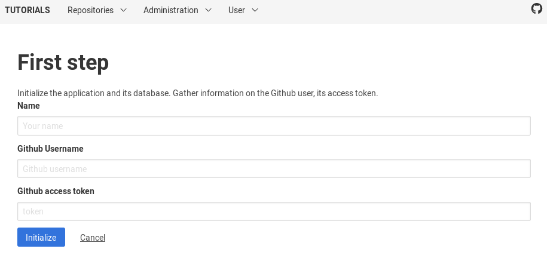

{:step: data-tutorial-type='step'}
{:shortdesc: .shortdesc}
{:new_window: target="_blank"}
{:codeblock: .codeblock}
{:screen: .screen}
{:tip: .tip}
{:pre: .pre}

# Serverless web app and eventing for data retrieval and analytics
{: #serverless-github-traffic-analytics}
{: toc-content-type="tutorial"}
{: toc-services="codeengine, Db2onCloud, appid"}
{: toc-completion-time="2h"}

<!--##istutorial#-->
This tutorial may incur costs. Use the [Cost Estimator](https://{DomainName}/estimator/review) to generate a cost estimate based on your projected usage.
{: tip}
<!--#/istutorial#-->

In this tutorial, you create an application to automatically collect GitHub traffic statistics for repositories and provide the foundation for traffic analytics. GitHub only provides access to the traffic data for the last 14 days. If you want to analyze statistics over a longer period of time, you need to download and store that data yourself. In this tutorial, you deploy a serverless app in a {{site.data.keyword.codeenginefull_notm}} project. The app manages the metadata for GitHub repositories and provides access to the statistics for data analytics. The traffic data is collected from GitHub either on-demand in the app or when triggered by {{site.data.keyword.codeengineshort}} events, e.g., daily. The app discussed in this tutorial implements a multi-tenant-ready solution with the initial set of features supporting a single-tenant mode.
{: shortdesc}


## Objectives
{: #serverless-github-traffic-analytics-0}

* Deploy a containerized Python database app with multi-tenant support and secured access
* Integrate App ID as OpenID Connect-based authentication provider
* Set up automated, serverless collection of GitHub traffic statistics

## Before you begin
{: #serverless-github-traffic-analytics-prereqs}

This tutorial requires:
* {{site.data.keyword.cloud_notm}} CLI,
   * {{site.data.keyword.codeenginefull_notm}} plugin,
   * {{site.data.keyword.registrylong}} plugin,
* a GitHub account.

You can run the sections requiring a shell in the [{{site.data.keyword.cloud-shell_full}}](https://{DomainName}/docs/cloud-shell?topic=cloud-shell-getting-started).

<!--##istutorial#-->
You will find instructions to download and install these tools for your operating environment in the [Getting started with tutorials](https://{DomainName}/docs/solution-tutorials?topic=solution-tutorials-tutorials) guide.
<!--#/istutorial#-->

## Service and Environment Setup (shell)
{: #serverless-github-traffic-analytics-1}
{: step}
In this section, you set up the needed services and prepare the environment. All of this can be accomplished from the shell environment (terminal).

1. Use `ibmcloud login` to log in interactively into {{site.data.keyword.cloud}}. You can reconfirm the details by running `ibmcloud target` command.
2. Create an {{site.data.keyword.cloud_notm}} IAM API key and save it to the file **ghstatsAPIKEY.json**.
   ```sh
   ibmcloud iam api-key-create ghstatsAPIKEY -d "API key for tutorial" --file ghstatsAPIKEY.json --output json
   ```
   {: pre}

3. Create a {{site.data.keyword.Db2_on_Cloud_short}} instance with the **free** (lite) plan and name it **ghstatsDB**.
   ```sh
   ibmcloud resource service-instance-create ghstatsDB dashdb-for-transactions free us-south
   ```
   {: pre}
   
4. Create an instance of the {{site.data.keyword.appid_short}} service. Use **ghstatsAppID** as name and the **Graduated tier** plan.
   ```sh
   ibmcloud resource service-instance-create ghstatsAppID appid graduated-tier us-south
   ```
   {: pre}
 
5. Add a new namespace **ghstats** to the {{site.data.keyword.registrylong}}. You are going to use it for referencing container images. The namespace needs to be unique across the registry.
   ```sh
   ibmcloud cr namespace-add ghstats
   ```
   {: pre}


## Code Engine preparation (shell)
{: #serverless-github-traffic-analytics-2}
{: step}

With the services provisioned and the general setup done, next is to create the {{site.data.keyword.codeengineshort}} project, create a container image for the app and to deploy it.

1. Create a {{site.data.keyword.codeengineshort}} project named **ghstats**. The command automatically sets it as the current {{site.data.keyword.codeengineshort}} context.
   ```sh
   ibmcloud ce project create --name ghstats
   ```
   {: pre}
2. Create metadata for the {{site.data.keyword.registryshort}}. By default, the [command](https://{DomainName}/docs/codeengine?topic=codeengine-cli#cli-registry) assumes the server **us.icr.io** and the username **iamapikey**. The registry information is needed to build and pull container images. When prompted, enter the API key that was previously stored in **ghstatsAPIKEY.json**.
   ```sh
   ibmcloud ce registry create --name usicr
   ```
   {: pre}
3. Create a {{site.data.keyword.codeengineshort}} build configuration, i.e., set up the project to build the container image for you. It takes the code from the [GitHub repository for this tutorial](https://github.com/IBM-Cloud/github-traffic-stats) and stores the image in the registry in the previously created  namespace using the registered user information.
   ```sh
   ibmcloud ce build create --name ghstats-build --source https://github.com/IBM-Cloud/github-traffic-stats  --context-dir /backend --commit master --image us.icr.io/ghstats/codeengine-ghstats --registry-secret usicr
   ```
   {: pre}
4. Next, run the actual build process.
   ```sh
   ibmcloud ce buildrun submit --build ghstats-build
   ```
   {: pre}
   You can check the status of your buildruns:
   ```sh
   ibmcloud ce buildrun list
   ```
   {: pre}


## Deploy the app (shell)
{: #serverless-github-traffic-analytics-3}
{: step}
Once the build is ready, you can use the container image to deploy the app, thereafter bind the previously provisioned services.
1. To deploy the app means to [create a {{site.data.keyword.codeengineshort}} app](https://{DomainName}/docs/codeengine?topic=codeengine-cli#cli-application-create) named **ghstats-app**. It pulls the image from the given registry and namespace.
   ```sh
   ibmcloud ce app create --name ghstats-app --image us.icr.io/ghstats/codeengine-ghstats:latest --registry-secret usicr
   ```
   {: pre}
   Once the app has deployed, you can check that it is available at the URL shown in the output. The app is not configured and hence not usable yet. You can check the deployment status using `ibmcloud ce app list` or for details by executing `ibmcloud ce app get --name ghstats-app`.

   By default, the minimum scaling is zero (0). It means that {{site.data.keyword.codeengineshort}} reduces the running instances to zero if there is no workload on the app. This saves costs, but requires a short app restart when scaling up from zero again. You can avoid this by using the paramater `--min 1` when creating or updating the app.
   {: tip}
2. To utilize the provisioned services, you have to bind them to the app. First, bind {{site.data.keyword.Db2_on_Cloud_short}}, then {{site.data.keyword.appid_short}}:
   ```sh
   ibmcloud ce application bind --name ghstats-app --service-instance ghstatsDB
   ```
   {: pre}
   ```sh
   ibmcloud ce application bind --name ghstats-app --service-instance ghstatsAppID
   ```
   {: pre}
   Note that each bind causes a new service key to be created and a new revision of the app to be deployed.

   Instead of binding the services to the app, you could also [use secrets and configmaps](https://{DomainName}/docs/codeengine?topic=codeengine-configmap-secret). They can be populated from values stored in files or passed in as literal. A sample file for secrets and related instruction are in the [GitHub repository for this tutorial](https://github.com/IBM-Cloud/github-traffic-stats).
   {: tip}

## App ID and GitHub configuration (browser)
{: #serverless-github-traffic-analytics-4}
{: step}
The following steps are all performed using your Internet browser. First, you configure {{site.data.keyword.appid_short}} to use the Cloud Directory and to work with the app. Thereafter, you create a GitHub access token. It is needed by the app to retrieve the traffic data.

1. In the [{{site.data.keyword.cloud}} Resource List](https://{DomainName}/resources) open the overview of your services. Locate the instance of the {{site.data.keyword.appid_short}} service in the **Services** section. Click on its entry to open the details.
2. In the service dashboard, click on **Manage Authentication** in the menu on the left side. It brings a list of the available identity providers, such as Facebook, Google, SAML 2.0 Federation and the Cloud Directory. Switch the Cloud Directory to **Enabled**, all other providers to **Disabled**.

   You may want to configure [Multi-Factor Authentication (MFA)](https://{DomainName}/docs/appid?topic=appid-cd-mfa#cd-mfa) and advanced password rules. They are not discussed as part of this tutorial.
   {: tip}

3. Click on the **Authentication Settings** tab in the same dialog. In **Add web redirect URLs** enter the **url** of your application + `/redirect_uri`, for example `https://ghstats-app.56ab78cd90ef.us-south.codeengine.appdomain.cloud/redirect_uri`.

   For testing the app locally, the redirect URL is `http://127.0.0.1:5000/redirect_uri`. You can configure multiple redirect URLs. In order to test the app locally, copy **.env.local.template** to **.env**, adapt it and start the app using `python3 ghstats.py`.
   {: tip}

4. In the menu on the left, expand **Cloud Directory** and click on **Users**. It opens the list of users in the Cloud Directory. Click on the **Create User** button to add yourself as the first user. You are now done configuring the {{site.data.keyword.appid_short}} service.
5. In the browser, visit [Github.com](https://github.com/settings/tokens) and go to **Settings -> Developer settings -> Personal access tokens**. Click on the button **Generate new token**. Enter **GHStats Tutorial** for the **Token description**. Thereafter, enable **public_repo** under the **repo** category and **read:org** under **admin:org**. Now, at the bottom of that page, click on **Generate token**. The new access token is displayed on the next page. You need it during the following application setup.
   


## Configure and test Python app
{: #serverless-github-traffic-analytics-5}
{: step}
After the preparation, you configure and test the app. The app is written in Python using the popular [Flask](https://flask.palletsprojects.com/) microframework. You can add repositories for statistics collection or remove them. You can access the traffic data in a tabular view or as line chart.

1. In a browser, open the URI of the deployed app. You should see a welcome page.
   

2. In the browser, add `/admin/initialize-app` to the URI and access the page. It is used to initialize the application and its data. Click on the button **Start initialization**. This will take you to a password-protected configuration page. The email address you log in with is taken as identification for the system administrator. Use the email address and password that you configured earlier.

3. In the configuration page, enter a name (it is used for greetings), your GitHub user name and the access token that you generated before. Click on **Initialize**. This creates the database tables and inserts some configuration values. Finally, it creates database records for the system administrator and a tenant.
   

4. Once done, you are taken to the list of managed repositories. You can now add repositories by providing the name of the GitHub account or organization and the name of the repository. After entering the data, click on **Add repository**. The repository, along with a newly assigned identifier, should appear in the table. You can remove repositories from the system by entering their ID and clicking **Delete repository**.

5. For testing, click on **Administration**, then **Collect statistics**. It retrieves the traffic data on demand. Thereafter, click on **Repositories** and **Daily Traffic**. It should display collected data.


## Set up daily data retrieval (shell)
{: #serverless-github-traffic-analytics-6}
{: step}
With the app in place and configured, the last part is to initiate daily retrieval of GitHub traffic data. You are going to [create a ping subscription](https://{DomainName}/docs/codeengine?topic=codeengine-cli#cli-subscription-ping-create). Similar to a [cron job](https://en.wikipedia.org/wiki/Cron), the app subscribes to events on the specified schedule (eventing). 

1. Create the ping subscription **ghstats-daily** with a daily schedule at 6 am UTC with a POST event at the path **/collectStats**. Replace **SECRET_TOKEN_AS_IDENTIFIER** with your chosen secret value. It is used to identify the event giver to the app.
   ```sh
   ibmcloud ce subscription ping create --name ghstats-daily --destination ghstats-app --path /collectStats --schedule '0 6 * * *' --data '{"token":"SECRET_TOKEN_AS_IDENTIFIER"}'
   ```
   {: pre}

2. To make the secret token know to the app, [update the app](https://{DomainName}/docs/codeengine?topic=codeengine-cli#cli-application-update). Replace **SECRET_TOKEN_AS_IDENTIFIER** with the value you picked at the previous step.
   ```sh
   ibmcloud ce app update --name ghstats-app --image us.icr.io/ghstats/codeengine-ghstats:latest --registry-secret usicr --env EVENT_TOKEN=SECRET_TOKEN_AS_IDENTIFIER
   ```
   {: pre}
   This creates a new app revision. You can check that the events were received and processed by the app when navigating in the app to **Administration**, then **System log**.

   The command above creates a schedule for 6 am UTC daily. To directly check that the eventing works, choose a time few minutes after your current time, converted to UTC.
   {: tip}

## Conclusions
{: #serverless-github-traffic-analytics-7}
{: step}
In this tutorial, you deployed a serverless app in {{site.data.keyword.codeenginefull_notm}}. The app source is taken from a GitHub repository. You instructed {{site.data.keyword.codeengineshort}} to build the container image and store it in the {{site.data.keyword.registrylong}}. Next, it was pulled from there and deployed as container. The app is bound to {{site.data.keyword.cloud_notm}} services.

The app and the associated eventing allow to automatically retrieve traffic data for GitHub repositories. Information about those repositories, including the tenant-specific access token, is stored in a SQL database ({{site.data.keyword.dashdbshort}}). That database is used by the Python app to manage users, repositories and to present the traffic statistics. Users can see the traffic statistics in searchable tables or visualized in a simple line chart (see image below). It is also possible to download the list of repositories and the traffic data as CSV files.


## Security: Rotate service credentials
{: #serverless-github-traffic-analytics-8}
{: step}
If you use this solution in production, then you should rotate the service credentials on a regular basis. Many security policies have a requirement to change passwords and credentials every 90 days or with similar frequency.

You can recreate and thereby rotate the credentials for the services bound to the app by unbinding, then binding the services again. When using secrets instead of service bindings, you even have more options by first recreating service keys, then updating the secrets and as last step updating the app.


## Remove resources
{: #serverless-github-traffic-analytics-9}
{: removeresources}
{: step}

To clean up the resources used for this tutorial, you can delete the related project and services.
1. Delete the project and its components.
   ```sh
   ibmcloud ce project delete --name ghstats
   ```
   {: pre}
2. Delete the services:
   ```sh
   ibmcloud resource service-instance-delete ghstatsDB
   ```
   {: pre}
   ```sh
   ibmcloud resource service-instance-delete ghstatsAppID
   ```
   {: pre}


## Expand the tutorial
{: #serverless-github-traffic-analytics-10}
Want to add to or change this tutorial? Here are some ideas:
* Expand the app for multi-tenant support.
* Integrate a chart for the data.
* Use social identity providers.
* Add a date picker to the statistics page to filter displayed data.
* Use a custom login page for {{site.data.keyword.appid_short}}.

## Related Content
{: #serverless-github-traffic-analytics-11}
Here are links to additional information on the topics covered in this tutorial. The app itself is available in this [GitHub repository](https://github.com/IBM-Cloud/github-traffic-stats) 

Documentation:
* [{{site.data.keyword.appid_short}} documentation](https://{DomainName}/docs/appid?topic=appid-getting-started)
* [{{site.data.keyword.Db2_on_Cloud_short}}](https://{DomainName}/docs/Db2onCloud?topic=Db2onCloud-about)
