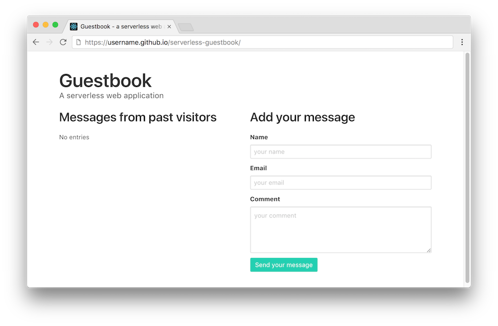

{:step: data-tutorial-type='step'}
{:shortdesc: .shortdesc}
{:new_window: target="_blank"}
{:codeblock: .codeblock}
{:screen: .screen}
{:tip: .tip}
{:pre: .pre}

# Serverless web application and API with {{site.data.keyword.codeengineshort}}
{: #serverless-webapp}
{: toc-content-type="tutorial"}
{: toc-services="codeengine, Cloudant, cloud-object-storage"}
{: toc-completion-time="1h"}

<!--##istutorial#-->
This tutorial may incur costs. Use the [Cost Estimator](https://{DomainName}/estimator/review) to generate a cost estimate based on your projected usage.
{: tip}

<!--#/istutorial#-->

In this tutorial, you will create a serverless web application using a bucket in {{site.data.keyword.cos_short}} and implementing the application backend using {{site.data.keyword.codeenginefull_notm}} and {{site.data.keyword.cloudant_short_notm}} as JSON document database.
{: shortdesc}

Static websites are great for performance and security. Their architectural model is sometimes referred to as [Jamstack](https://jamstack.org/) in reference to JavaScript, API, and Markup. In this tutorial, you will create a static website hosted on {{site.data.keyword.cos_short}}. The website has a guestbook which uses JavaScript to access an API for retrieving entries or to add a new entry. The API for interaction with the backing database is implemented using a serverless approach. It is deployed as backend app or microservice to [{{site.data.keyword.codeenginefull_notm}}](https://{DomainName}/docs/codeengine?topic=codeengine-getting-started). The backend only runs when required and thereby occurs charges when in use. 

## Objectives
{: #serverless-webapp-0}

* Deploy a serverless backend and a database
* Expose a REST API as serverless app
* Host a static website

The application shown in this tutorial is a simple guestbook website where users can post messages.

{: class="center"}
{: style="text-align: center;"}

1. The user accesses the application hosted on the bucket in {{site.data.keyword.cos_short}}
2. The web application calls a backend API.
3. The app with the backend API is deployed to {{site.data.keyword.codeengineshort}}.
5. The backend uses {{site.data.keyword.cloudant_short_notm}} to store and retrieve guestbook entries.

## Create the Guestbook database
{: #serverless-webapp-2}
{: step}

Let's start by creating a {{site.data.keyword.cloudant_short_notm}} service instance. {{site.data.keyword.cloudant_short_notm}} is a fully managed JSON document database. It is built upon and compatible with Apache CouchDB.

1. In the [Catalog](https://{DomainName}/catalog?category=databases#services), under **Services**, go to the **Databases** category. Click on the **{{site.data.keyword.cloudant}}** tile. In the new dialog:
   1. Under **Multitenant** select a region.
   1. Under **Configure Cloudant instance** pick a **unique** name for the service, such as `<yourinitials>-guestbook-db`.
   1. Select a resource group.
   1. Select **IAM** as authentication method.
   1. Select the **Lite** plan. If you already have a Lite plan in your account, select another service plan.
   1. Click **Create**.
2. Back in the [{{site.data.keyword.cloud_notm}} Resource List](https://{DomainName}/resources/), under **Services**, click on the {{site.data.keyword.cloudant}} instance you created to open the instance full details page. Note: You may be required to wait until the status of the service changes to `Active`.
3. Click on **Launch Dashboard** to open the dashboard in a new browser tab.
4. In the upper right, click on **Create Database**. Enter ***guestbook*** as name and do **not** select **Partitioned** under **Partitioning**. Click **Create** to create the database.
5. Switch back to the browser tab with the service dashboard page. Go to **Service credentials**, then:
   1. Click **New credential**.
   2. Set the name to **for-guestbook**. Leave the role as **Manager**.
   3. Click **Add** to add the new credentials.
   4. Expand the newly created credentials and review them. We will need these credentials later to allow the {{site.data.keyword.codeengineshort}} app to read/write to your Cloudant service.

## Create serverless backend
{: #serverless-webapp-3}
{: step}

In this section, you will create the serverless backend app with {{site.data.keyword.codeengineshort}}. Serverless apps only incur charges for the execution time which is ideal for infrequently accessed solutions like a guestbook.

### Create a {{site.data.keyword.codeengineshort}} project
{: #serverless-webapp-4}

1. Navigate to [{{site.data.keyword.codeenginefull_notm}} Overview](https://{DomainName}/codeengine/overview) page.
2. On the left pane, click on **Projects** and then click **Create project**,
   - Select a location.
   - Use `<yourinitials>-guestbook` as project name and select the same resource group as before.
   - Click on **Create**.
   - Wait until the project `status` changes to **Active**.
3. Click on the project name to enter the project dashboard.

### Create and deploy backend app
{: #serverless-webapp-5}
{: step}

1. Within the project dashboard, click on **Applications**, then **Create**.
2. In the new dialog, enter `guestbook-backend` as name.
3. Leave **Container image** selected and use `icr.io/solution-tutorials/tutorial-serverless-api-webapp:latest` as **Image reference**. It uses an already existing container image.
4. Go to and expand the section **Runtime settings**. Increase the **Min number of instances** to 1 and reduce **Max number of instances** to 2. The minimum of one makes the app more responsive during the initial tests. You could reduce it later to zero again.
5. Under **Instance resources**, select `0.25 vCPU / 0.5 GB` for **CPU and memory**. Not much of resources is needed for this type of app.
6. Last, in the section Environment variables, we are going to configure the credentials for the database service. It could be done with [service binding](https://{DomainName}/docs/codeengine?topic=codeengine-service-binding), too, but this is more convenient:
   1. Click **Add** to add a **Literal value** variable. Enter `CLOUDANT_URL` as **Environment variable name**. Use the value for **url** from the {{site.data.keyword.cloudant_short_notm}} credentials from above as **Value**. Finish with **Done**.
   2. Repeat the previous step by clicking **Add**, then using `CLOUDANT_APIKEY` as name and the value for **apikey** in the credentials. Click **Done** to add the variable.
7. Click **Create** to deploy the new backend app for the guestbook.
8. Wait for it to report as green and ready. Click on **Test application**, then on **Application URL**. The backend app should load and return a page saying `healthy`. Remember or copy the application URL because it is needed for the next part.

Instead of using the pre-built container image, you could build the image on your own. This can be done either outside of or [with the help of {{site.data.keyword.codeengineshort}}](https://{DomainName}/docs/codeengine?topic=codeengine-plan-build). If not using the pre-built container image and if [using a private container registry additional steps might be needed](https://{DomainName}/docs/codeengine?topic=codeengine-deploy-app-private). You can find the source at https://github.com/IBM-Cloud/serverless-guestbook/tree/ce
{: tip}

## Deploy the web app
{: #serverless-webapp-6}
{: step}

Create a {{site.data.keyword.cos_short}} bucket configured with static website hosting containing the files for the guestbook JavaScript application that uses the {{site.data.keyword.cloudant_short_notm}} database.

Create a {{site.data.keyword.cos_short}} instance:
1. Select [Cloud Object Storage](https://{DomainName}/objectstorage/create) from the catalog
1. Chose a **unique** service name for the insrtance, such as `<yourinitials>-guestbook-cos`
1. Select a resource group.
1. Click **Create**

Create a bucket configured for static website hosting:
1. Click **Create a bucket**.
1. Click **Customize your bucket**.
1. Enter a bucket name that is unique across all IBM accounts. Try `<yourinitials>-guestbook`.
1. Select resiliency as **Regional**.
1. Select a **Location** and choose a region consistent with the {{site.data.keyword.cloudant_short_notm}} instance.
1. Keep the **Storage class** default
1. Scroll down to the **Static website hosting** and click **Add rule**.
1. Keep the Routing rules (individual) selected and add the Index document **index.html**.
1. Click Public access to **On**
1. Click **Save**
1. Scroll to the bottom and click **Create bucket**

Copy the files in the `docs` directory of https://github.com/IBM-Cloud/serverless-guestbook/tree/ce into the bucket:
1. Open https://github.com/IBM-Cloud/serverless-guestbook/tree/ce in a new tab.
1. Download a zip file by clicking **Code** then **Download ZIP**.
1. Unzip the file and navigate to the `docs` directory of the unzipped file.
1. Edit **guestbook.js** - replace the value of **apiUrl** with the application URL from the previous section. Make sure that the URI does not end on a slash (`/`).
1. Open the bucket **Objects** view and drag and drop the **guestbook.js** and **index.html** files to the COS bucket.
1. Navigate to the **Configuration** tab for the bucket. In the endpoints section locate the **Static website hosting endpoints** section. Copy the **Public** endpoint into a browser tab.
1. You should see the guestbook page.
1. Add new entries to the guestbook.

{: class="center"}
{: style="text-align: center;"}

## Remove resources
{: #serverless-webapp-cleanup}
{: step}

To delete the created bucket and {{site.data.keyword.openwhisk_short}} service:
1. Navigate to the {{site.data.keyword.cos_short}} bucket objects
1. Check the box in the title row to select all objects in the bucket
1. Click **Delete objects**
1. In the upper right of the bucket object page **Actions** menu select **Delete bucket**
1. In the upper right of the {{site.data.keyword.cos_short}} instance **Actions** menu select **Delete Service**

To delete the created {{site.data.keyword.cloudant_short_notm}} service,
1. Navigate to [resource list](https://{DomainName}/resources)
2. Under **Services**, click on the action menu next to `<yourinitials>-guestbook-db` service
3. Click **Delete**

To delete the application and project {{site.data.keyword.codeengineshort}},
1. Navigate to [{{site.data.keyword.codeengineshort}}](https://{DomainName}/codeengine/) landing page.
2. On the left pane, click on **Projects**.
3. In the list of projects, check the guestbook project, then click **Delete**.

Depending on the resource it might not be deleted immediately, but retained (by default for 7 days). You can reclaim the resource by deleting it permanently or restore it within the retention period. See this document on how to [use resource reclamation](https://{DomainName}/docs/account?topic=account-resource-reclamation).
{: tip}

## Related content
{: #serverless-webapp-8}

* [Deploy serverless apps across multiple regions](https://{DomainName}/docs/solution-tutorials?topic=solution-tutorials-multi-region-serverless)
* [Serverless Computing](https://www.ibm.com/cloud/learn/serverless)
* [More code patterns on serverless](https://developer.ibm.com/patterns/category/serverless/)
* [Getting started with {{site.data.keyword.codeenginefull_notm}}](https://{DomainName}/docs/codeengine?topic=codeengine-getting-started)
