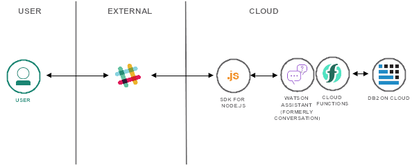
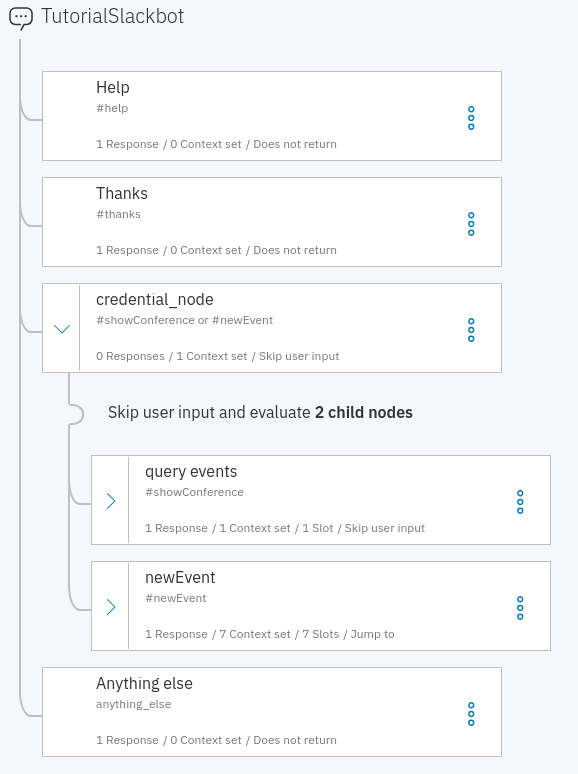
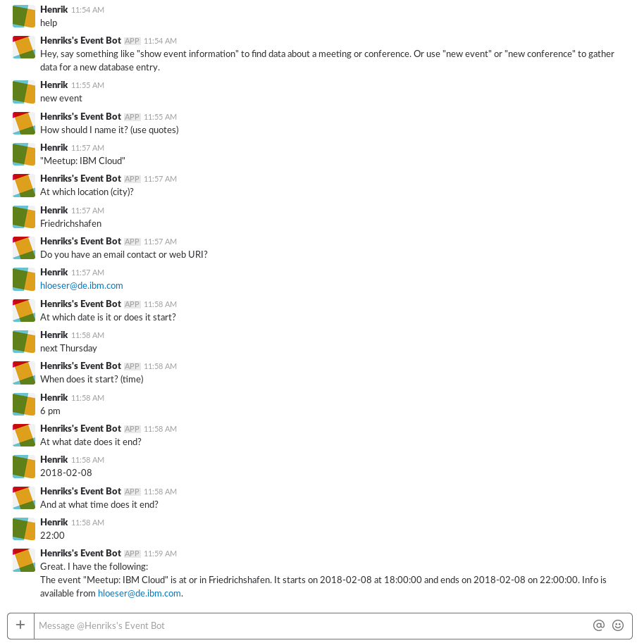

{:step: data-tutorial-type='step'}
{:shortdesc: .shortdesc}
{:new_window: target="_blank"}
{:codeblock: .codeblock}
{:screen: .screen}
{:tip: .tip}
{:pre: .pre}

# Build a database-driven Slackbot
{: #slack-chatbot-database-watson}
{: toc-content-type="tutorial"}
{: toc-services="cloud-foundry-public, assistant, openwhisk, Db2onCloud"}
{: toc-completion-time="2h"}

<!--##istutorial#-->
This tutorial may incur costs. Use the [Cost Estimator](https://{DomainName}/estimator/review) to generate a cost estimate based on your projected usage.
{: tip}
<!--#/istutorial#-->

In this tutorial, you are going to build a Slackbot to create and search Db2 database entries for events and conferences. The Slackbot is backed by the {{site.data.keyword.conversationfull}} service. You will integrate Slack and {{site.data.keyword.conversationfull}} using an Assistant integration.
{: shortdesc}

The Slack integration channels messages between Slack and {{site.data.keyword.conversationshort}}. There, some server-side dialog actions perform SQL queries against a Db2 database. All (but not much) code is written in Node.js.

## Objectives
{: #slack-chatbot-database-watson-objectives}

* Connect {{site.data.keyword.conversationfull}} to Slack using an integration
* Create, deploy and bind Node.js actions in {{site.data.keyword.openwhisk_short}}
* Access a Db2 database from {{site.data.keyword.openwhisk_short}} using Node.js


<p style="text-align: center;">

  
</p>

## Before you begin
{: #slack-chatbot-database-watson-prereqs}

This tutorial requires:
* {{site.data.keyword.cloud_notm}} CLI,
   * {{site.data.keyword.openwhisk}} plugin (`cloud-functions`),
* `git` to clone source code repository.

<!--##istutorial#-->
You will find instructions to download and install these tools for your operating environment in the [Getting started with tutorials](https://{DomainName}/docs/solution-tutorials?topic=solution-tutorials-tutorials) guide.
<!--#/istutorial#-->

## Service and Environment Setup
{: #slack-chatbot-database-watson-2}
{: step}
In this section, you are going to set up the needed services and prepare the environment. Most of this can be accomplished from the command line interface (CLI) using scripts. They are available on GitHub.

1. Clone the [GitHub repository](https://github.com/IBM-Cloud/slack-chatbot-database-watson) and navigate into the cloned directory:
   ```sh
   git clone https://github.com/IBM-Cloud/slack-chatbot-database-watson
   cd slack-chatbot-database-watson
   ```
   {: pre}
2. If you are not logged in, use `ibmcloud login` to log in interactively. Make sure to target the resource group to work with. It is used to create the services and actions. You can list your available resource groups using `ibmcloud resource groups`.
   ```sh
   ibmcloud target -g RESOURCE_GROUP
   ```
   {: pre}

   Use `ibmcloud target -g default` to switch to the default resource group.
   {: tip}

3. Create a {{site.data.keyword.Db2_on_Cloud_short}} instance and name it **eventDB**. Adapt the region **us-south** to your region, e.g., **eu-de**.
   ```sh
   ibmcloud resource service-instance-create eventDB dashdb-for-transactions free us-south
   ```
   {: pre}
   
   You can also use another than the **free** (lite) plan. The free plan is not available in all locations.

4. To access the database service from {{site.data.keyword.openwhisk_short}} later on, you need the authorization. Thus, you create service credentials and label them **slackbotkey**:
   ```sh
   ibmcloud resource service-key-create slackbotkey Manager --instance-name eventDB
   ```
   {: pre}
5. Create an instance of the {{site.data.keyword.conversationshort}} service. Use **eventConversation** as name and the free Lite plan. Adapt **us-south** to your location.
   ```sh
   ibmcloud resource service-instance-create eventConversation conversation free us-south
   ```
   {: pre}
6. Next, you are going to register actions for {{site.data.keyword.openwhisk_short}} and bind service credentials to those actions. The **dispatch** action is enabled as web action and a secret is set to prevent unauthorized invocations. Choose a secret and pass it in as parameter - replace **YOURSECRET** accordingly.

   One of the actions gets invoked to create a table in {{site.data.keyword.Db2_on_Cloud_short}}. By using an action of {{site.data.keyword.openwhisk_short}}, you neither need a local Db2 driver nor have to use the browser-based interface to manually create the table. To perform the registration and setup, run the line below and this will execute the **setup.sh** script. If your system does not support shell commands, copy each line out of the file **setup.sh** and execute it individually.

   ```sh
   sh setup.sh YOURSECRET "dashdb-for-transactions"
   ```
   {: pre}

   **Note:** By default the script also inserts few rows of sample data. You can disable this by outcommenting the following line in the above script: `#ibmcloud fn action invoke slackdemo/db2Setup -p mode "[\"sampledata\"]" -r`
7.  Obtain the URI for the deployed **dispatch** action.

   ```sh
   ibmcloud fn action get slackdemo/dispatch --url
   ```
   {: pre}

   Keep this information available for the next section.

## Load the skill / workspace
{: #slack-chatbot-database-watson-3}
{: step}
In this part of the tutorial you are going to load a pre-defined workspace or skill into the {{site.data.keyword.conversationshort}} service.
1. In the [{{site.data.keyword.Bluemix_short}} Resource List](https://{DomainName}/resources) open the overview of your services. Locate the instance of the {{site.data.keyword.conversationshort}} service created in the previous section. Click on its entry and then the service alias to open the service details.
2. Click on **Launch Watson Assistant** to get to the {{site.data.keyword.conversationshort}} Tool.
3. On the left navigation select **Skills**, then click **Create skill**, select **Dialog skill** and continue with **Next**, finally click on **Upload skill**.
4. In the dialog, after clicking **Choose JSON file**, select the file **skill-TutorialSlackbot.json** from the local directory. Click **Upload**. This creates a new skill named **TutorialSlackbot**.
5. On the left click on **Dialog** to see the dialog nodes. You can expand them to see a structure like shown below.

   The dialog has nodes to handle questions for help and simple "Thank You". The node **newEvent** gathers the necessary input and then invokes the webhook to insert a new event record into Db2. It uses the entity **eventLocation** to detect the location for an event in the user-provided answer. The entity is modeled as [contextual entity](https://{DomainName}/docs/assistant?topic=assistant-entities#entities-annotations-overview) and uses annotations in intent examples to enhance the defition.

   The node **query events** clarifies whether events are searched by their identifier or by date. The actual search and collecting the necessary data are then performed by the child nodes **query events by shortname** and **query event by dates**.

  Details will be explained later below once everything is set up.
     
6. On the left, click on **Options** and then on **Webhooks**. 

   Replace the value for **URL** with the one obtained in the previous section. Add `.json` to the URL to indicate that [JSON data should be returned](https://{DomainName}/docs/openwhisk?topic=openwhisk-actions_web#return_json). Next, replace **YOURSECRET** in **HEADER VALUE** with your actual value that you set earlier.

7. Click the **Try it** button on the upper right. The chatbot should be functional now. Enter the phrase `show event by date 2019`. It should return event information. If this is not the case, make sure the information entered in step 6 is correct.

## Create an assistant and integrate with Slack
{: #slack-chatbot-database-watson-4}
{: step}

Now, you will create an assistant associated with the skill from before and integrate it with Slack.
1. Click on **Assistants** in the top left navigation, then click on **Create assistant**.
2. In the dialog, fill in **TutorialAssistant** as name, then click **Create assistant**. On the next screen, choose **Add dialog skill**. Thereafter, choose **Add existing skill**, pick **TutorialSlackbot** from the list and add it.
3. After adding the skill, click **Add integration**, then from the list of **Third-party integrations** select **Slack**.
4. Follow the step by step instructions to integrate your chatbot with Slack. More information about it is available in the topic [Integrating with Slack](https://{DomainName}/docs/assistant?topic=assistant-deploy-slack).

## Test the Slackbot and learn
{: #slack-chatbot-database-watson-5}
{: step}
Open up your Slack workspace for a test drive of the chatbot. Begin a direct chat with the bot.

1. Type **help** into the messaging form. The bot should respond with some guidance.
2. Now enter **new event** to start gathering data for a new event record. You will use {{site.data.keyword.conversationshort}} slots to collect all the necessary input.
3. First up is the event identifier or name. Quotes are required. They allow entering more complex names. Enter **"Meetup: IBM Cloud"** as the event name. The event name is defined as a pattern-based entity **eventName**. It supports different kinds of double quotes at the beginning and ending.
4. Next is the event location. Input is based on the [system entity **sys-location**](https://{DomainName}/docs/assistant?topic=assistant-system-entities#system-entities-sys-location). As a limitation, only cities recognized by {{site.data.keyword.conversationshort}} can be used. Try **Friedrichshafen** as a city.
5. Contact information such as an email address or URI for a website is asked for in the next step. Start with **https://www.ibm.com/events**. You will use a pattern-based entity for that field.
6. The next questions are gathering date and time for the begin and end. **sys-date** and **sys-time** are used which allow for different input formats. Use **next Thursday** as start date, **6 pm** for the time, use the exact date of next Thursday, e.g., **2019-05-09** and **22:00** for the end date and time.
7. Last, with all data collected, a summary is printed and a server action, implemented as {{site.data.keyword.openwhisk_short}} action, is invoked to insert a new record into Db2. Thereafter, dialog switches to a child node to clean up the processing environment by removing the context variables. The entire input process can be canceled anytime by entering **cancel**, **exit** or similar. In that case, the user choice is acknowledged and the environment cleaned up.
  

With some sample data in it is time to search.
1. Type in **show event information**. Next is a question whether to search by identifier or by date. Enter a **name** and for the next question **"Think 2019"**. Now, the chatbot should display information about that event. The dialog has multiple responses to choose from.
2. With {{site.data.keyword.conversationshort}} as a backend, it is possible to enter more complex phrases and thereby skipping parts of the dialog. Use **show event by the name "Think 2019"** as input. The chatbot directly returns the event record.
3. Now you are going to search by date. A search is defined by a pair of dates, the event start date has to be between. With **search conference by date in February 2019** as input, the result should be the **Think 2019** event again. The entity **February** is interpreted as two dates, February 1st, and February 28th, thereby providing input for the start and end of the date range. [If no year 2019 would be specified, a February looking ahead would be identified](https://{DomainName}/docs/assistant?topic=assistant-system-entities#system-entities-sys-date-time).

After some more searches and new event entries, you can revisit the chat history and improve the future dialog. Follow the instructions in the [{{site.data.keyword.conversationshort}} documentation on **Improving understanding**](https://{DomainName}/docs/assistant?topic=assistant-logs).

## Share resources
{: #slack-chatbot-database-watson-6}
{: step}

If you want to work with others on resources of this solution tutorial, you can share all or only some of the components. [{{site.data.keyword.cloud_notm}} Identity and Access Management (IAM)](https://{DomainName}/docs/account?topic=account-iamoverview) enables the authentication of users and service IDs and the access control to cloud resources. For granting access to a resource, you can assign [predefined access roles](https://{DomainName}/docs/account?topic=account-userroles) to either a user, a service ID, or to an [access group](https://{DomainName}/docs/account?topic=account-groups). Details on how you can set up access control is discussed in the blog [IBM Cloud Security Hands-On: Share Your Chatbot Project](https://www.ibm.com/cloud/blog/share-your-chatbot-project).


## Remove resources
{: #slack-chatbot-database-watson-7}
{: removeresources}
{: step}

Executing the cleanup script in the main directory deletes the event table from {{site.data.keyword.Db2_on_Cloud_short}} and removes the actions from {{site.data.keyword.openwhisk_short}}. This might be useful when you start modifying and extending the code. The cleanup script does not change the {{site.data.keyword.conversationshort}} workspace or skill.
```sh
sh cleanup.sh
```
{: pre}

In the [{{site.data.keyword.Bluemix_short}} Resource List](https://{DomainName}/resources) open the overview of your services. Locate the instance of the {{site.data.keyword.conversationshort}} service, then delete it.

## Expand the tutorial
{: #slack-chatbot-database-watson-8}
Want to add to or change this tutorial? Here are some ideas:
1. Add search capabilities to, e.g., wildcard search or search for event durations ("give me all events longer than 8 hours").
2. Use {{site.data.keyword.databases-for-postgresql}} instead of {{site.data.keyword.Db2_on_Cloud_short}}.
3. Add a weather service and retrieve forecast data for the event date and location.
4. [Control the encryption keys for your database by adding {{site.data.keyword.keymanagementservicelong_notm}}](https://{DomainName}/docs/Db2onCloud?topic=Db2onCloud-key-protect).
5. Export event data as iCalendar **.ics** file.


## Related content
{: #slack-chatbot-database-watson-9}
{: related}

Here are links to additional information on the topics covered in this tutorial.

Chatbot-related blog posts:
* [Chatbots: Some tricks with slots in IBM Watson Conversation](https://www.ibm.com/cloud/blog/chatbots-some-tricks-with-slots-in-ibm-watson-conversation)
* [Lively chatbots: Best Practices](https://www.ibm.com/blogs/bluemix/2017/07/lively-chatbots-best-practices/)
* [Building chatbots: more tips and tricks](https://www.ibm.com/blogs/bluemix/2017/06/building-chatbots-tips-tricks/)
* [Add Watson Discovery News to your Chatbot](https://www.ibm.com/cloud/blog/add-watson-discovery-news-to-your-chatbot)
* [IBM Cloud Security Hands-On: Share Your Chatbot Project](https://www.ibm.com/cloud/blog/share-your-chatbot-project)

Documentation and SDKs:
* GitHub repository with [tips and tricks for handling variables in IBM Watson Conversation](https://github.com/IBM-Cloud/watson-conversation-variables)
* [{{site.data.keyword.openwhisk_short}} documentation](https://{DomainName}/docs/openwhisk)
* Documentation: [IBM Knowledge Center for {{site.data.keyword.Db2_on_Cloud_short}}](https://www.ibm.com/support/knowledgecenter/en/SS6NHC/com.ibm.swg.im.dashdb.kc.doc/welcome.html)
* [Free Db2 edition for developers](https://www.ibm.com/us-en/marketplace/ibm-db2-direct-and-developer-editions) for developers
* Documentation: [API Description of the ibm_db Node.js driver](https://github.com/ibmdb/node-ibm_db)
* [{{site.data.keyword.cloudantfull}} documentation](https://{DomainName}/docs/Cloudant?topic=Cloudant-about)
