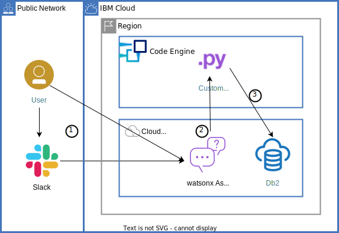
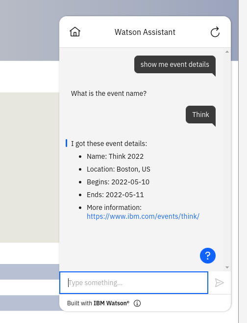
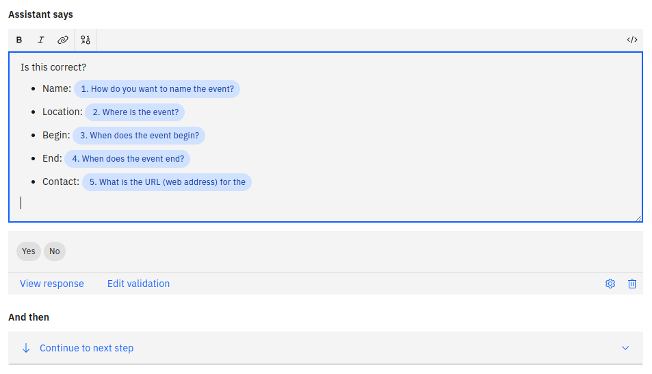
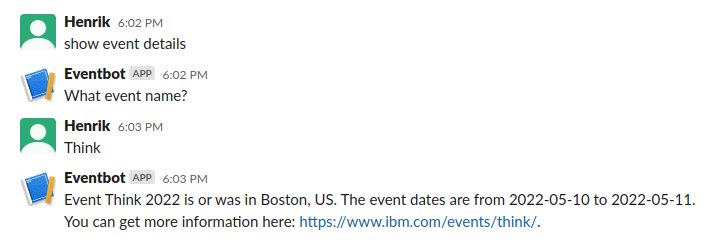

{:step: data-tutorial-type='step'}
{:shortdesc: .shortdesc}
{:new_window: target="_blank"}
{:codeblock: .codeblock}
{:screen: .screen}
{:note: .note}
{:tip: .tip}
{:pre: .pre}

# Build a database-driven Slackbot
{: #slack-chatbot-database-watson}
{: toc-content-type="tutorial"}
{: toc-services="codeengine, watson-assistant, Db2onCloud"}
{: toc-completion-time="2h"}

<!--##istutorial#-->
This tutorial may incur costs. Use the [Cost Estimator](https://{DomainName}/estimator/review) to generate a cost estimate based on your projected usage.
{: tip}

<!--#/istutorial#-->

In this tutorial, you are going to build a Slackbot which allows to search and create entries in a backend {{site.data.keyword.Db2_on_Cloud_short}} database. The Slackbot is backed by the {{site.data.keyword.conversationfull}} service. You will integrate Slack and {{site.data.keyword.conversationfull}} using an Assistant integration. {{site.data.keyword.Db2_on_Cloud_short}} is made available to {{site.data.keyword.conversationshort}} as custom extension.
{: shortdesc}

The Slack integration sends messages between Slack and {{site.data.keyword.conversationshort}}. A custom extension, written in Python and deployed as serverless {{site.data.keyword.codeengineshort}} app, exposes a REST API against the database backend.

This tutorial uses the new experience of {{site.data.keyword.conversationshort}} and an action skill. A former version was based on the dialog skill and the database was integrated using {{site.data.keyword.openwhisk}} with code written in Node.js. You can find that version of the tutorial in the [**cloud-functions** branch of the related code repository](https://github.com/IBM-Cloud/slack-chatbot-database-watson/tree/cloud-functions).
{: note}

## Objectives
{: #slack-chatbot-database-watson-objectives}

* Build a chatbot using {{site.data.keyword.conversationshort}} which interacts with a database backend
* Connect {{site.data.keyword.conversationshort}} to Slack using an integration
* Create and deploy a Python database app to {{site.data.keyword.codeengineshort}}
* Access a {{site.data.keyword.Db2_on_Cloud_short}} database via a {{site.data.keyword.conversationshort}} custom extension

{: class="center"}
{: style="text-align: center;"}

1. The user interacts with [{{site.data.keyword.conversationfull}}](https://{DomainName}/docs/watson-assistant), either through Slack or using a web chat client
2. The chatbot utilizes a custom extension with REST API deployed as Python app on [{{site.data.keyword.codeengineshort}}](https://{DomainName}/docs/codeengine?topic=codeengine-getting-started)
3. The custom extension app retrieves data from and inserts data into a [{{site.data.keyword.Db2_on_Cloud_short}}](https://{DomainName}/docs/Db2onCloud) database


## Before you begin
{: #slack-chatbot-database-watson-prereqs}

This tutorial requires:
* {{site.data.keyword.cloud_notm}} CLI,
   * {{site.data.keyword.codeengineshort}} plugin,
* `git` to clone source code repository,
* `jq` to query JSON data.

To avoid the installation of these tools you can use the [{{site.data.keyword.cloud-shell_short}}](https://{DomainName}/shell) from the {{site.data.keyword.cloud_notm}} console.
{: tip}

<!--##istutorial#-->
You will find instructions to download and install these tools for your operating environment in the [Getting started with tutorials](https://{DomainName}/docs/solution-tutorials?topic=solution-tutorials-tutorials) guide.
<!--#/istutorial#-->

## Set up services and deploy backend
{: #slack-chatbot-database-watson-2}
{: step}

In this section, you are going to set up the needed services and deploy the backend app. All of this can be accomplished from the command line interface (CLI) in a terminal.

1. Clone the [GitHub repository](https://github.com/IBM-Cloud/slack-chatbot-database-watson) and navigate into the cloned directory:
   ```sh
   git clone https://github.com/IBM-Cloud/slack-chatbot-database-watson
   cd slack-chatbot-database-watson
   ```
   {: pre}

2. If you are not logged in, use `ibmcloud login` to log in interactively. Make sure to target the resource group to work with. It is used to create the services and actions. You can list your available resource groups using `ibmcloud resource groups`.
   ```sh
   ibmcloud target -g RESOURCE_GROUP
   ```
   {: pre}

   Use `ibmcloud target -g default` to switch to the default resource group.
   {: tip}

3. Create a [{{site.data.keyword.Db2_on_Cloud_short}}](https://{DomainName}/docs/Db2onCloud) instance and name it **eventDB**. Adapt the region **us-south** to your region, e.g., **eu-de**.
   ```sh
   ibmcloud resource service-instance-create eventDB dashdb-for-transactions free us-south
   ```
   {: pre}
   
   You can also use another than the **free** (lite) plan. The free plan is not available in all locations. Wait for the service to be provisioned. See the output from the above command for instructions. You can also run the next command to check the status:

   ```sh
   ibmcloud resource service-instance eventDB
   ```
   {: pre}


4. To access the database service from the {{site.data.keyword.codeengineshort}} app later on, it needs the proper authorization. Thus, you create service credentials and label them **slackbotkey**:
   ```sh
   ibmcloud resource service-key-create slackbotkey Manager --instance-name eventDB --output json > slackbotkey.json
   ```
   {: pre}

   The output is stored in the file `slackbotkey.json` and needed at a later step. Run this command to extract the database connection URL:
   ```sh
   cat slackbotkey.json | jq '.[].credentials.connection.db2 | (.authentication.username + ":" + .authentication.password + "@" + .hosts[0].hostname + ":" + (.hosts[0].port | tostring) + "/" + .database + "?Security=SSL")'
   ```
   {: pre}

   The output should be of the following format: `ibm_db_sa://username:password@database-hostname:port/bludb?Security=SSL;`.

5. Create an instance of the {{site.data.keyword.conversationshort}} service. Use **eventAssistant** as name and the free Lite plan. Adapt **us-south** to your location.
   ```sh
   ibmcloud resource service-instance-create eventAssistant conversation free us-south
   ```
   {: pre}

6. Deploy the pre-built container image with the custom extension as {{site.data.keyword.codeengineshort}} app. First, create a project:
   ```sh
   ibmcloud ce project create --name slackbot
   ```
   {: pre}

   Then, deploy the app naming it **slackbot-backend**. Replace the value for the **API_TOKEN** (**MY_SECRET**) with your own secret. It is used to secure the calls to the REST API. For **DB2_URI** replace the parts with the database connection URL from above.
   ```sh
   ibmcloud ce app create --name slackbot-backend --image icr.io/solution-tutorials/tutorial-slack-chatbot-database:latest --min-scale 1 -e API_TOKEN=MY_SECRET -e DB2_URI="ibm_db_sa://username:password@database-hostname:port/bludb?Security=SSL;" 
   ```
   {: pre}

   Note the reported URI for the app. It is needed in the next steps.

7. Test the deployment by calling a REST API provided by the app to (re-)create the database schema and insert few sample records. Replace **projectid**, **region**, and **MY_SECRET** accordingly.
   ```sh
   curl -X 'POST' 'https://slackbot-backend.projectid.region.codeengine.appdomain.cloud/database/recreate' -H 'accept: application/json' -H 'API_TOKEN: MY_SECRET'
   ```
   The above request should return an error message that the confirmation is missing. Now try again with a query parameter:
   ```sh
   curl -X 'POST' 'https://slackbot-backend.projectid.region.codeengine.appdomain.cloud/database/recreate?confirmation=True' -H 'accept: application/json' -H 'API_TOKEN: MY_SECRET'
   ```
   The request should succeed and indicate that the database was recreated. Time for another test:
   ```sh
   curl -X 'GET' 'https://slackbot-backend.projectid.region.codeengine.appdomain.cloud/events' -H 'accept: application/json' -H 'API_TOKEN: MY_SECRET'
   ```


## Create an assistant
{: #slack-chatbot-database-watson-4}
{: step}
In this part of the tutorial you are going to work with the {{site.data.keyword.conversationshort}} service. First, you create a new assistant. Then, you create the custom extension and add it to the assistant. Thereafter, you will create actions and test them using the web preview. Finally, you integrate the chatbot with Slack and perform more tests.


1. In the [{{site.data.keyword.cloud_notm}} Resource List](https://{DomainName}/resources) open the overview of your services. Locate the instance of the {{site.data.keyword.conversationshort}} service. Click on its entry to open the service details.
2. Click on **Launch Watson Assistant** to get to the {{site.data.keyword.conversationshort}} Tool. In the welcome dialog, create a new assistant by using **slackbot** as **Assistant name**, then click **Next** to start personalizing. For the first question on deployment pick **Web**. For the other questions answer for your role or with **Other** / **Not sure at this time**. Click **Next** for the opportunity to customize the chat UI. Leave it as is and click **Next** again. Finalize by clicking **Create**.
   
   The new page includes a guided tour which you might want to complete if you are new to {{site.data.keyword.conversationshort}}.
   {: tip}


## Add and configure a custom extension
{: #slack-chatbot-database-watson-5}
{: step}

Next, you are going to add and then configure a custom extension to {{site.data.keyword.conversationshort}} and the newly created assistant.
1. In the dashboard on the lower left, click on **Integrations**, then on **Build custom extension** under **Extensions**.
2. In the multi-step dialog click **Next**, then enter **events** as **Extension name** and **API for events database** as **Extension description**. Click **Next** again.
3. Select and upload the local file **slackbot-openapi-spec.json**, then click **Next**. The last step lets you review the extension with included servers and operations. Once done click **Finish**.
4. Back on the **Integrations** page note the new **events** tile in the **Extensions** section. Click **Add** on that tile to configure the extension for the assistant.
5. The new dialog starts with a short overview. Click **Next** to get to the actual configuration. In the dropdown for **Authentication type** select **API key auth** and enter your chosen **API key** (**MY_SECRET** replacement).
6. For the **Server variables** use your deployment **region**, **slackbot-backend** as **appname**, and the {{site.data.keyword.codeengineshort}} **projectid** of your app. Thereafter, the **generated URL** should match that of your {{site.data.keyword.codeengineshort}} app. When done, click **Next** to get to the review page, then **Finish** and **Close** to get back to the **Integrations** page.

## Create the first action
{: #slack-chatbot-database-watson-6}
{: step}

First, you are going to create an action to retrieve information about a single event identified by its name.
1. On the upper left, click on **Actions** and on the welcome page on **Create a new action**. 
2. In the **New action** dialog, enter **show me event details** as example and click **Save**.
3. The next screen shows the step editor for the action with **Step 1** open. In **Assistant says** type **What is the event name?**. Then, for **Define customer response** pick **Free text** as option. Leave **And then** as **Continue to next step**.
4. Click **New step** on the lower left to add **Step 2**. Leave the first parts (**Assistant says**, **Define customer response**) untouched, but under **And then** select **Use an extension**. In the dropdowns pick the **events** extension and its **Event record by name** operation. Thereafter, **Parameters** will show the possible inputs. By using the dropdown, assign for **Set short_name** the value **1. What is the event name?**. It refers to the customer input from the previous step. Click on **Apply** to finish this step.
5. Add a **New step**. At the top change the selection so that **Step 3 is taken with condition**. Under **Conditions** and **If** select **2 Ran successfully**. It refers to a result from using the extension in step 2.
6. Under **Assistants says**, you can compose the answer with the event details by referring to the output fields of the API call to the deployed app. Use **I got these event details:** followed by the `Enter` key to get to the next line. [The editor supports Markdown format](https://{DomainName}/docs/watson-assistant?topic=watson-assistant-respond#respond-formatting). Thus, use the `-` key to create a bulleted list. Add a list item with **Name:**, then click on the **Insert a variable** icon. From the dropdown select **2 body.shortname**. Use the `Enter` key again to get to a new line with a list item. Add **Location:** with **2 body.location** from the variables dropdown. Repeat for **Begins**, **Ends**, and **Contact**. Once done, set **And then** to **End the action**.
7. To handle errors in the extension, create another step with a condition. Now let the step react to **2 Ran successfully** being **false**. Let the Assistant say **Sorry, there was a problem** and then end the action again.

   For the sake of simplicity, not all errors and conditions like empty results are handled.
   {: note}

8. Click on the **Save** icon on the upper right, then the **X** next to it to close the step editor. On the left select **Preview** to get to the **Assistant preview**. In the webchat, click on the **show me event details** button. The bot should respond **What is the event name?**. Now enter **Think**. Because the backend app uses a wildcard search, it should find the sample event with the name **Think 2022** and return the details (see screenshot below).



## Action to gather data and insert a new record
{: #slack-chatbot-database-watson-7}
{: step}

Similar to retrieving a record it is possible to gather input about an event and add that data via the custom extension.
1. Switch to **Actions** and **Created by you**. Click **New action**, then enter **add new event** and **Save**. Use **How do you want to name the event?** for **Assistant says**. The customer responds with **Free text** again.
2. Add a **New step** and have the Assistant say **Where is the event?**. Again, the customer may respond with **Free text**. Add another step and ask **When does the event begin?**, but use **Date** for **Define customer response**. Repeat the same but with **When does the event end?**. Last, in a new step, ask **What is the URL (web address) for the event?** and let the customer respond with **Free text**.
3. Now, to confirm the input, create a new step. Use **Is this correct?** and as bulleted list show the gathered data. Add an item for **Name**, **Location**, **Begin**, **End**, and **Contact** and use Action variables relating to the input steps for the data (see screenshot below). Use **Confirmation** as customer response type.
   

4. Add a new step with the condition the previous confirmation being **No**. The Assistant could say **Ok, let's start over**. Set **And then** to **Re-ask previous step(s)** and select all previous steps.
5. In a new step, which should be step 8, react to the confirmation being **Yes**. Under **And then** select **Use an extension**. Configure the events extension with **Insert a new event record** as operation. Match the parameters to the Action variables for the steps, e.g., **shortname** to **1. How do you want to name the event?**
6. Last, it requires another two steps to react to either a successful or unsuccessful call to the extension. Create the first step with a condition **8 Ran successfully** being true. Let the Assistant say **A new record with ID VARIABLE was created**. For **VARIABLE** select **8 body.eid** from **events (Step 8)**. End the action under **And then**. Create the second step with the condition for **8 Ran successfully** being false. Use something like **It seems there was a problem creating the new event record** for the Assistant to say and end the action under **And then**. Save and close the action with the icons in the upper right.
7. Test the new action by clicking on **Preview** on the left and using the webchat. Click on the **add new event** option. When prompted by the bot, enter **my conference** as name, **home office** as location, pick dates for begin and end, and use **http://localhost** as URL. Thereafter, confirm that the data is correct.


When creating a chatbot, you may want to [publish a chatbot](https://{DomainName}/docs/watson-assistant?topic=watson-assistant-publish). It is the controlled release of a version which allows to roll back changes and to continue with development without impacting the chatbot interacting with real customers.
{: tip}

## Integrate with Slack
{: #slack-chatbot-database-watson-8}
{: step}

Now, you will integrate the chatbot with Slack.
1. On the lower left, click on **Integrations**.
2. In the integrations overview, in the section **Channels**, locate **Slack** and click **Add**.
3. Follow the step by step instructions to integrate the **Draft** environment of your chatbot with Slack. More information about it is available in the topic [Integrating with Slack](https://{DomainName}/docs/watson-assistant?topic=watson-assistant-deploy-slack).
4. Once done, open up your Slack workspace. Begin a direct chat with the bot and say **show me event details**. Then, similar to above, answer with **Think** when prompted for an event name.




## Remove resources
{: #slack-chatbot-database-watson-9}
{: removeresources}
{: step}

To clean up the resources for this tutorial, go to the [{{site.data.keyword.cloud_notm}} Resource List](https://{DomainName}/resources). Locate the service instances of {{site.data.keyword.conversationshort}} and {{site.data.keyword.Db2_on_Cloud_short}} and delete them. Similarly, locate the {{site.data.keyword.codeengineshort}} project and delete it.

Depending on the resource it might not be deleted immediately, but retained (by default for 7 days). You can reclaim the resource by deleting it permanently or restore it within the retention period. See this document on how to [use resource reclamation](https://{DomainName}/docs/account?topic=account-resource-reclamation).
{: tip}

## Related content
{: #slack-chatbot-database-watson-10}
{: related}

Here are additional resources on the topics covered in this tutorial.
* [Build Great Chatbots, Fast](https://www.ibm.com/cloud/blog/build-great-chatbots-fast)
* [Tips and Tricks for Using the IBM Cloud CLI](https://www.ibm.com/cloud/blog/tips-and-tricks-for-using-the-ibm-cloud-cli)