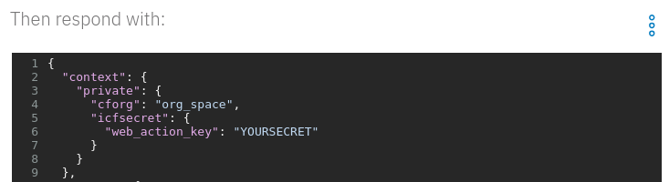

---
copyright:
  years: 2018, 2019
lastupdated: "2019-04-22"
---

{:shortdesc: .shortdesc}
{:new_window: target="_blank"}
{:codeblock: .codeblock}
{:screen: .screen}
{:tip: .tip}
{:pre: .pre}

# Build a database-driven Slackbot
{: #slack-chatbot-database-watson}

In this tutorial, you are going to build a Slackbot to create and search Db2 database entries for events and conferences. The Slackbot is backed by the {{site.data.keyword.conversationfull}} service. You will integrate Slack and {{site.data.keyword.conversationfull}} using an Assistant integration.

The  Slack integration channels messages between Slack and {{site.data.keyword.conversationshort}}. There, some server-side dialog actions perform SQL queries against a Db2 database. All (but not much) code is written in Node.js.

## Objectives
{: #objectives}

* Connect {{site.data.keyword.conversationfull}} to Slack using an integration
* Create, deploy and bind Node.js actions in {{site.data.keyword.openwhisk_short}}
* Access a Db2 database from {{site.data.keyword.openwhisk_short}} using Node.js

## Services used
{: #services}

This tutorial uses the following runtimes and services:
   * [{{site.data.keyword.conversationfull}}](https://{DomainName}/catalog/services/conversation)
   * [{{site.data.keyword.openwhisk_short}}](https://{DomainName}/openwhisk/)
   * [{{site.data.keyword.dashdblong}} ](https://{DomainName}/catalog/services/db2-warehouse) or [{{site.data.keyword.databases-for-postgresql}}](https://{DomainName}/catalog/services/databases-for-postgresql)


This tutorial may incur costs. Use the [Pricing Calculator](https://{DomainName}/estimator/review) to generate a cost estimate based on your projected usage.

## Architecture
{: #architecture}

<p style="text-align: center;">

  
</p>

## Before you begin
{: #prereqs}

To complete this tutorial, you need the latest version of the [{{site.data.keyword.Bluemix_notm}} CLI](/docs/cli?topic=cloud-cli-ibmcloud-cli#overview) and the {{site.data.keyword.openwhisk_short}} [plugin installed](/docs/cli?topic=cloud-cli-plug-ins).


## Service and Environment Setup
In this section, you are going to set up the needed services and prepare the environment. Most of this can be accomplished from the command line interface (CLI) using scripts. They are available on GitHub.

1. Clone the [GitHub repository](https://github.com/IBM-Cloud/slack-chatbot-database-watson) and navigate into the cloned directory:
   ```bash
   git clone https://github.com/IBM-Cloud/slack-chatbot-database-watson
   cd slack-chatbot-database-watson
   ```
2. If you are not logged in, use `ibmcloud login` to log in interactively.
3. Target the organization and space where to create the database service with:
   ```
   ibmcloud target --cf
   ```
4. Create a {{site.data.keyword.dashdbshort}} instance and name it **eventDB**:
   ```
   ibmcloud service create dashDB Entry eventDB
   ```
   {:codeblock}
   You can also use another than the **Entry** plan.
5. To access the database service from {{site.data.keyword.openwhisk_short}} later on, you need the authorization. Thus, you create service credentials and label them **slackbotkey**:   
   ```
   ibmcloud service key-create eventDB slackbotkey
   ```
   {:codeblock}
6. Create an instance of the {{site.data.keyword.conversationshort}} service. Use **eventConversation** as name and the free Lite plan.
   ```
   ibmcloud service create conversation free eventConversation
   ```
   {:codeblock}
7. Next, you are going to register actions for {{site.data.keyword.openwhisk_short}} and bind service credentials to those actions. Some of the actions are enabled as web actions and a secret is set to prevent unauthorized invocations. Choose a secret and pass it in as parameter - replace **YOURSECRET** accordingly.

   One of the actions gets invoked to create a table in {{site.data.keyword.dashdbshort}}. By using an action of {{site.data.keyword.openwhisk_short}}, you neither need a local Db2 driver nor have to use the browser-based interface to manually create the table. To perform the registration and setup, run the line below and this will execute the **setup.sh** file which contains all the actions. If your system does not support shell commands, copy each line out of the file **setup.sh** and execute it individually.

   ```bash
   sh setup.sh YOURSECRET
   ```
   {:codeblock}   

   **Note:** By default the script also inserts few rows of sample data. You can disable this by outcommenting the following line in the above script: `#ibmcloud fn action invoke slackdemo/db2Setup -p mode "[\"sampledata\"]" -r`
8. Extract the namespace information for the deployed actions.

   ```bash
   ibmcloud fn action list | grep eventInsert
   ```
   {:codeblock}   
   
   Note down the part before **/slackdemo/eventInsert**. It is the encoded organisation and space. You need it in the next section.

## Load the skill / workspace
In this part of the tutorial you are going to load a pre-defined workspace or skill into the {{site.data.keyword.conversationshort}} service.
1. In the [{{site.data.keyword.Bluemix_short}} Resource List](https://{DomainName}/resources) open the overview of your services. Locate the instance of the {{site.data.keyword.conversationshort}} service created in the previous section. Click on its entry and then the service alias to open the service details.
2. Click on **Launch Tool** to get to the {{site.data.keyword.conversationshort}} Tool.
3. Switch to **Skills**, then click **Create skill** and then on **Import skill**.
4. In the dialog, after clicking **Choose JSON file**, select the file **assistant-skill.json** from the local directory. Leave the import option at **Everything (Intents, Entities, and Dialog)**, then click **Import**. This creates a new skill named **TutorialSlackbot**.
5. Click on **Dialog** to see the dialog nodes. You can expand them to see a structure like shown below.

   The dialog has nodes to handle questions for help and simple "Thank You". The node **newEvent** and it's child gather the necessary input and then call an action to insert a new event record into Db2.

   The node **query events** clarifies whether events are searched by their identifier or by date. The actual search and collecting the necessary data are then performed by the child nodes **query events by shortname** and **query event by dates**.

   The **credential_node** sets up the secret for the dialog actions and the information about the Cloud Foundry organization. The latter is needed for invoking the actions.

  Details will be explained later below once everything is set up.
     
6. Click on the dialog node **credential_node**, open the JSON editor by clicking on the menu icon on the right of **Then respond with**.

      

   Replace **org_space** with the encoded organisation and space information which you retrieved earlier. Substitute any "@" with "%40". Next, change **YOURSECRET** to your actual secret from before. Close the JSON editor by clicking on the icon again.

## Create an assistant and integrate with Slack

Now, you will create an assistant associated with the skill from before and integrate it with Slack. 
1. Click on **Skills** in the top left, then select on **Assistants**. Next, click on **Create assistant**.
2. In the dialog, fill in **TutorialAssistant** as name, then click **Create assistant**. On the next screen, choose **Add dialog skill**. Thereafter, choose **Add existing skill**, pick **TutorialSlackbot** from the list and add it.
3. After adding the skill, click **Add integration**, then from the list of **Managed integrations** select **Slack**.
4. Follow the instructions to integrate your chatbot with Slack.

## Test the Slackbot and learn
Open up your Slack workspace for a test drive of the chatbot. Begin a direct chat with the bot.

1. Type **help** into the messaging form. The bot should respond with some guidance.
2. Now enter **new event** to start gathering data for a new event record. You will use {{site.data.keyword.conversationshort}} slots to collect all the necessary input.
3. First up is the event identifier or name. Quotes are required. They allow entering more complex names. Enter **"Meetup: IBM Cloud"** as the event name. The event name is defined as a pattern-based entity **eventName**. It supports different kinds of double quotes at the beginning and ending.
4. Next is the event location. Input is based on the [system entity **sys-location**](https://{DomainName}/docs/services/assistant?topic=assistant-system-entities#system-entity-details). As a limitation, only cities recognized by {{site.data.keyword.conversationshort}} can be used. Try **Friedrichshafen** as a city.
5. Contact information such as an email address or URI for a website is asked for in the next step. Start with **https://www.ibm.com/events**. You will use a pattern-based entity for that field.
6. The next questions are gathering date and time for the begin and end. **sys-date** and **sys-time** are used which allow for different input formats. Use **next Thursday** as start date, **6 pm** for the time, use the exact date of next Thursday, e.g., **2019-05-09** and **22:00** for the end date and time.
7. Last, with all data collected, a summary is printed and a server action, implemented as {{site.data.keyword.openwhisk_short}} action, is invoked to insert a new record into Db2. Thereafter, dialog switches to a child node to clean up the processing environment by removing the context variables. The entire input process can be canceled anytime by entering **cancel**, **exit** or similar. In that case, the user choice is acknowledged and the environment cleaned up.
     

With some sample data in it is time to search.
1. Type in **show event information**. Next is a question whether to search by identifier or by date. Enter a **name** and for the next question **"Think 2019"**. Now, the chatbot should display information about that event. The dialog has multiple responses to choose from.
2. With {{site.data.keyword.conversationshort}} as a backend, it is possible to enter more complex phrases and thereby skipping parts of the dialog. Use **show event by the name "Think 2019"** as input. The chatbot directly returns the event record.
3. Now you are going to search by date. A search is defined by a pair of dates, the event start date has to be between. With **search conference by date in February 2019** as input, the result should be the **Think 2019** event again. The entity **February** is interpreted as two dates, February 1st, and February 28th, thereby providing input for the start and end of the date range. [If no year 2019 would be specified, a February looking ahead would be identified](https://{DomainName}/docs/services/assistant?topic=assistant-system-entities#system-entities-sys-date-time). 

After some more searches and new event entries, you can revisit the chat history and improve the future dialog. Follow the instructions in the [{{site.data.keyword.conversationshort}} documentation on **Improving understanding**](https://{DomainName}/docs/services/assistant?topic=assistant-logs-intro#logs_intro).


## Remove resources
{:removeresources}

Executing the cleanup script in the main directory deletes the event table from {{site.data.keyword.dashdbshort}} and removes the actions from {{site.data.keyword.openwhisk_short}}. This might be useful when you start modifying and extending the code. The cleanup script does not change the {{site.data.keyword.conversationshort}} workspace or skill.   
```bash
sh cleanup.sh
```
{:codeblock}

In the [{{site.data.keyword.Bluemix_short}} Resource List](https://{DomainName}/resources) open the overview of your services. Locate the instance of the {{site.data.keyword.conversationshort}} service, then delete it.

## Expand the tutorial
Want to add to or change this tutorial? Here are some ideas:
1. Add search capabilities to, e.g., wildcard search or search for event durations ("give me all events longer than 8 hours").
2. Use {{site.data.keyword.databases-for-postgresql}} instead of {{site.data.keyword.dashdbshort}}. The [GitHub repository for this Slackbot tutorial](https://github.com/IBM-Cloud/slack-chatbot-database-watson) already has code to support {{site.data.keyword.databases-for-postgresql}}.
3. Add a weather service and retrieve forecast data for the event date and location.
4. Export event data as iCalendar **.ics** file.
5. Connect the chatbot to Facebook Messenger by adding another integration.
6. Add interactive elements, such as buttons, to the output.      


## Related content
{:related}

Here are links to additional information on the topics covered in this tutorial.

Chatbot-related blog posts:
* [Chatbots: Some tricks with slots in IBM Watson Conversation](https://www.ibm.com/blogs/bluemix/2018/02/chatbots-some-tricks-with-slots-in-ibm-watson-conversation/)
* [Lively chatbots: Best Practices](https://www.ibm.com/blogs/bluemix/2017/07/lively-chatbots-best-practices/)
* [Building chatbots: more tips and tricks](https://www.ibm.com/blogs/bluemix/2017/06/building-chatbots-tips-tricks/)

Documentation and SDKs:
* GitHub repository with [tips and tricks for handling variables in IBM Watson Conversation](https://github.com/IBM-Cloud/watson-conversation-variables)
* [{{site.data.keyword.openwhisk_short}} documentation](https://{DomainName}/docs/openwhisk?topic=cloud-functions-openwhisk_about#about-cloud-functions)
* Documentation: [IBM Knowledge Center for {{site.data.keyword.dashdbshort}}](https://www.ibm.com/support/knowledgecenter/en/SS6NHC/com.ibm.swg.im.dashdb.kc.doc/welcome.html)
* [Free Db2 Developer Community Edition](https://www.ibm.com/us-en/marketplace/ibm-db2-direct-and-developer-editions) for developers
* Documentation: [API Description of the ibm_db Node.js driver](https://github.com/ibmdb/node-ibm_db)
* [{{site.data.keyword.cloudantfull}} documentation](https://{DomainName}/docs/services/Cloudant?topic=cloudant-overview#overview)
