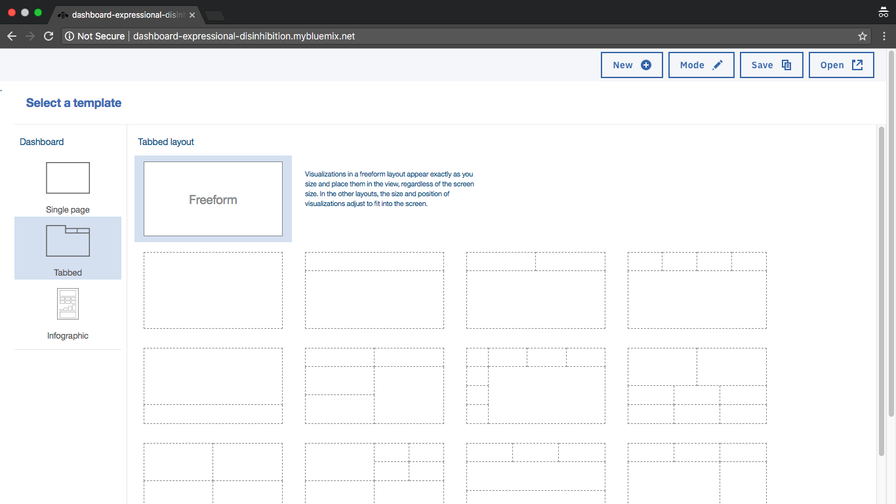
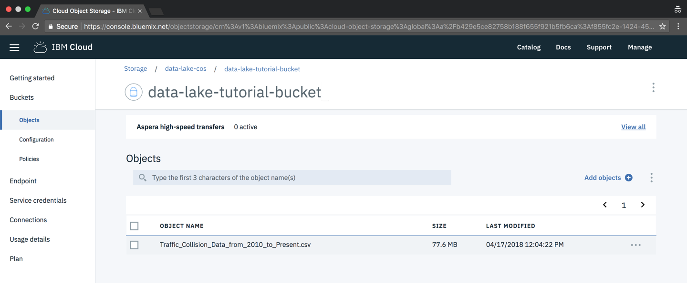
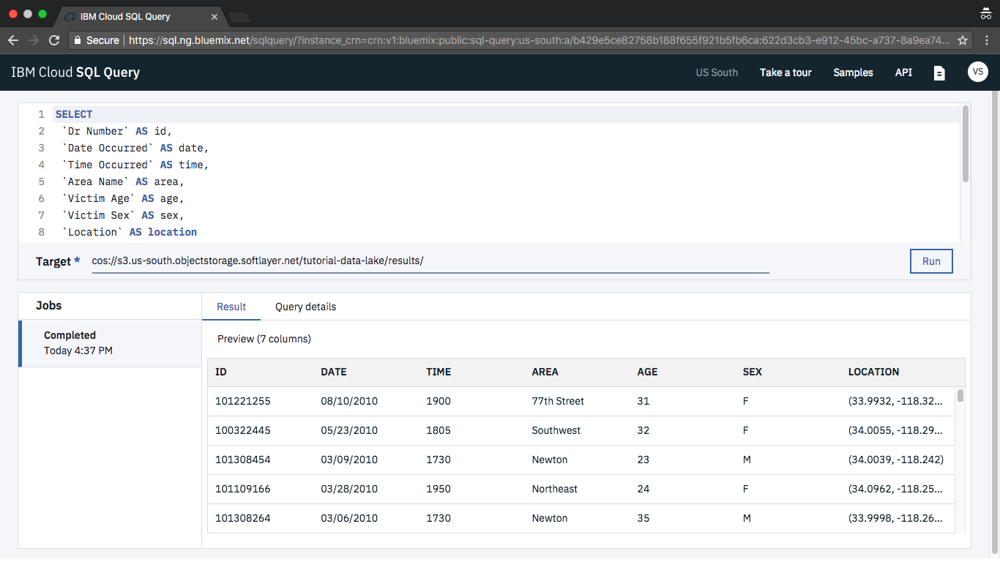

---
copyright:
  years: 2018
lastupdated: "2018-11-14"

---

{:shortdesc: .shortdesc}
{:new_window: target="_blank"}
{:codeblock: .codeblock}
{:screen: .screen}
{:tip: .tip}
{:pre: .pre}

# Build a data lake using object storage

Definitions of the term data lake vary, but in the context of this tutorial, a data lake is an approach to storing data in its native format for organizational use. To that end you will create a data lake for your organization using {{site.data.keyword.cos_short}}. By combining {{site.data.keyword.cos_short}} and SQL Query, data analysts can query data where it lies using SQL. You'll also leverage the SQL Query service in a Jupyter Notebook to conduct a simple analysis. When you're done, allow non-technical users to discover their own insights using {{site.data.keyword.dynamdashbemb_notm}}.

## Objectives

- Use {{site.data.keyword.cos_short}} to store raw data files
- Query data directly from {{site.data.keyword.cos_short}} using SQL Query
- Refine and analyze data in {{site.data.keyword.DSX_full}}
- Share data across your organization with {{site.data.keyword.dynamdashbemb_notm}}

## Services used

- [{{site.data.keyword.cos_short}}](https://console.bluemix.net/catalog/services/cloud-object-storage)
- [SQL Query](https://console.bluemix.net/catalog/services/sql-query)
- [{{site.data.keyword.DSX}}](https://console.bluemix.net/catalog/services/watson-studio)
- [{{site.data.keyword.dynamdashbemb_notm}}](https://console.bluemix.net/catalog/services/ibm-cognos-dashboard-embedded)

## Architecture


1. Raw data is stored on {{site.data.keyword.cos_short}}
2. Data is reduced, enhanced or refined with SQL Query
3. Data analysis occurs in {{site.data.keyword.DSX}}
4. Line of business accesses a web application
5. Refined data is pulled from {{site.data.keyword.cos_short}}
6. Line of business charts are built using {{site.data.keyword.dynamdashbemb_notm}}

## Before you begin

- [Install Git](https://git-scm.com/)
- [Install {{site.data.keyword.Bluemix_notm}} CLI](https://console.bluemix.net/docs/cli/reference/bluemix_cli/get_started.html#getting-started)
- [Install Aspera Connect](http://downloads.asperasoft.com/connect2/)
- [Install Node.js and NPM](https://nodejs.org)

## Create services

In this section, you will create the services required to build your data lake.

This section uses the command line to create service instances. Alternatively, you may do the same from the service page in the catalog using the provided links.
{: tip}

1. Login to {{site.data.keyword.cloud_notm}} via the command line and target your Cloud Foundry account. See [CLI Getting Started](https://console.bluemix.net/docs/cli/reference/bluemix_cli/get_started.html#getting-started).
    ```sh
    ibmcloud login
    ```
    {: pre}
    ```sh
    ibmcloud target --cf
    ```
    {: pre}
2. Create an instance of [{{site.data.keyword.cos_short}}](https://console.bluemix.net/catalog/services/cloud-object-storage) with a Cloud Foundry alias. If you already have a service instance, run the `service-alias-create` command with the existing service name.
    ```sh
    ibmcloud resource service-instance-create data-lake-cos cloud-object-storage lite global
    ```
    {: pre}
    ```sh
    ibmcloud resource service-alias-create dashboard-nodejs-cos --instance-name data-lake-cos
    ```
    {: pre}
3. Create an instance of [SQL Query](https://console.bluemix.net/catalog/services/sql-query).
    ```sh
    ibmcloud resource service-instance-create data-lake-sql sql-query beta us-south
    ```
    {: pre}
4. Create an instance of [{{site.data.keyword.DSX}}](https://console.bluemix.net/catalog/services/watson-studio).
    ```sh
    ibmcloud service create data-science-experience free-v1 data-lake-studio
    ```
    {: pre}
5. Create an instance of [{{site.data.keyword.dynamdashbemb_notm}}](https://console.bluemix.net/catalog/services/ibm-cognos-dashboard-embedded) with a Cloud Foundry alias.
    ```sh
    ibmcloud resource service-instance-create data-lake-dde dynamic-dashboard-embedded lite us-south
    ```
    {: pre}
    ```sh
    ibmcloud resource service-alias-create dashboard-nodejs-dde --instance-name data-lake-dde
    ```
    {: pre}
6. Change to a working directory and run the following command to clone the dashboard application's [GitHub repository](https://github.com/IBM-Cloud/nodejs-data-lake-dashboard). Then push the application to your Cloud Foundy organization. The application will automatically bind the required services from above using its [manifest.yml](https://github.com/IBM-Cloud/nodejs-data-lake-dashboard/blob/master/manifest.yml) file.
    ```sh
    git clone https://github.com/IBM-Cloud/nodejs-data-lake-dashboard.git
    ```
    {: pre}
    ```sh
    cd nodejs-data-lake-dashboard
    ```
    {: pre}
    ```sh
    npm install
    ```
    {: pre}
    ```sh
    npm run push
    ```
    {: pre}

    After deployment, the application will be public and listening on a random hostname. You can either login to the [Cloud Foundry Apps](https://console.bluemix.net/dashboard/cf-apps) page to view the URL or run the command `ibmcloud cf app dashboard-nodejs routes` to see routes.
    {: tip}

7. Confirm the application is active by accessing its public URL in the browser.



## Uploading data

In this section, you will upload data to an {{site.data.keyword.cos_short}} bucket using built-in {{site.data.keyword.CHSTSshort}}. {{site.data.keyword.CHSTSshort}} protects data as it is uploaded to the bucket and [can greatly reduce transfer time](https://www.ibm.com/blogs/bluemix/2018/03/ibm-cloud-object-storage-simplifies-accelerates-data-to-the-cloud/).

1. Download the [City of Los Angeles / Traffic Collision Data from 2010](https://catalog.data.gov/dataset/traffic-collision-data-from-2010-to-present/resource/643d0e98-5f40-4db3-8427-02641dd05fd9?inner_span=True) CSV file. The file is 81MB and may take a few minutes to download.
2. In your browser, access the **data-lake-cos** service instance from the [Dashboard](https://console.bluemix.net/dashboard).
3. Create a new bucket to store data.
    - Click the **Create a bucket** button.
    - Select **Regional** from the **Resiliency** drop down.
    - Select **us-south** from the **Location**. {{site.data.keyword.CHSTSshort}} is only available for buckets created in the `us-south` location at this time. Alternatively, choose another location and use the **Standard** transfer type in the next section.
    - Provide a bucket **Name** and click **Create** If you receive an *AccessDenied* error, try with a more unique bucket name.
4. Upload the CSV file to {{site.data.keyword.cos_short}}.
    - From your bucket, click the **Add objects** button.
    - Select the **Aspera high-speed transfer** radio button.
    - Click the **Add files** button. This will open the Aspera plugin, which will be in a separate window - possibly behind your browser window.
    - Browse to and select the previously downloaded CSV file.



## Working with data

In this section, you will convert the original, raw dataset into a targetted cohort based on time and age attributes. This is helpful to consumers of the data lake who have specific interests or would struggle with very large datasets.

You will use SQL Query to manipulate the data where it resides in {{site.data.keyword.cos_short}} using familar SQL statements. SQL Query has built-in support for CSV, JSON and Parquet - no additional computation services or extract-transform-load is necessary.

1. Access the **data-lake-sql** SQL Query service instance from your [Dashboard](https://console.bluemix.net/dashboard/apps).
2. Select **Open UI**.
3. Create a new dataset by executing SQL directly on the previously uploaded CSV file.
    - Enter the following SQL into the **Type SQL here ...** text area.
        ```
        SELECT
        `Dr Number` AS id,
        `Date Occurred` AS date,
        `Time Occurred` AS time,
        `Area Name` AS area,
        `Victim Age` AS age,
        `Victim Sex` AS sex,
        `Location` AS location
        FROM cos://us-south/<your-bucket-name>/Traffic_Collision_Data_from_2010_to_Present.csv
        WHERE
        `Time Occurred` >= 1700 AND
        `Time Occurred` <= 2000 AND
        `Victim Age` >= 20 AND
        `Victim Age` <= 35
        ```
        {: codeblock}
    - Replace the URL in the `FROM` clause with your bucket's name.
4. The **Target** will auto-create a {{site.data.keyword.cos_short}} bucket to hold the result. Change the **Target** to `cos://us-south/<your-bucket-name>/results`.
5. Click the **Run** button. The results will appear below.
6. On the **Query Details** tab, click the **Launch** icon next after the **Result Location** URL to view the intermediate dataset, which is now also stored on {{site.data.keyword.cos_short}}.



## Combine Jupyter Notebooks with SQL Query

In this section, you will use the SQL Query client within a Jupyter Notebook. This re-uses the data stored on {{site.data.keyword.cos_short}} within a data analysis tool. The combination also creates datasets that are automatically stored in {{site.data.keyword.cos_short}} that can then be used with {{site.data.keyword.dynamdashbemb_notm}}.

1. Create a new Jupyter Notebook in {{site.data.keyword.DSX}}.
    - In a browser, open [{{site.data.keyword.DSX}}](https://dataplatform.ibm.com/home?context=analytics&apps=data_science_experience&nocache=true).
    - Select the **New project** tile followed by **Jupyter Notebooks**.
    - Select **OK** and then provide a **Project name**.
    - Ensure **Storage** is set to **data-lake-cos**.
    - Click **Create**.
    - In the resulting project, click **Add to project** and **Notebook**.
    - From the **Blank** tab, enter a **Notebook name**.
    - Leave the **Language** and **Runtime** defaults; click **Create notebook**.
2. From the Notebook, install and import PixieDust and ibmcloudsql by adding the following commands to the **In [ ]:** input prompt and then **Run**.
    ```python
    !pip -q install ibmcloudsql
    !pip install --upgrade pixiedust
    import ibmcloudsql
    import pixiedust
    ```
    {: codeblock}
3. Add a {{site.data.keyword.cos_short}} API key to the Notebook. This will allow SQL Query results to be stored in {{site.data.keyword.cos_short}}.
    - Add the following in the next **In [ ]:** prompt and then **Run**.
        ```python
        import getpass
        cloud_api_key = getpass.getpass('Enter your IBM Cloud API Key')
        ```
        {: codeblock}
    - From the terminal, create an API key.
        ```sh
        ibmcloud iam api-key-create data-lake-cos-key
        ```
        {: pre}
    - Copy the **API Key** to the clipboard.
    - Paste the API Key into the textbox in the Notebook and hit the `enter` key.
    - You should also store the API Key to a secure, permanent location; the Notebook does not store the API key.
4. Add the SQL Query instance's CRN (Cloud Resource Name) to the Notebook.
    - In the next **In [ ]:** prompt, assign the CRN to a variable in your Notebook.
        ```python
        sql_crn = '<SQL_QUERY_CRN>'
        ```
        {: codeblock}
    - From the terminal, copy the CRN from the **ID** property to your clipboard.
        ```sh
        ibmcloud resource service-instance data-lake-sql
        ```
        {: pre}
    - Paste the CRN between the single quotes and then **Run**.
5. Add another variable to the Notebook to specify the {{site.data.keyword.cos_short}} bucket and **Run**.
    ```python
    sql_cos_endpoint = 'cos://us-south/<your-bucket-name>'
    ```
    {: codeblock}
6. Execute the following commands in another **In [ ]:** prompt and **Run** to view the result set. You will also have new `accidents/jobid=<id>/<part>.csv*` file added to your bucket that includes the result of the `SELECT`.
    ```python
    sqlClient = ibmcloudsql.SQLQuery(cloud_api_key, sql_crn, sql_cos_endpoint + '/accidents')

    data_source = sql_cos_endpoint + "/Traffic_Collision_Data_from_2010_to_Present.csv"

    query = """
    SELECT
        `Time Occurred` AS time,
        `Area Name` AS area,
        `Victim Age` AS age,
        `Victim Sex` AS sex,
        `Location` AS location
    FROM  {}
    WHERE
        `Time Occurred` >= 1700 AND `Time Occurred` <= 2000 AND
        `Victim Age` >= 20 AND `Victim Age` <= 35
    """.format(data_source)

    traffic_collisions = sqlClient.run_sql(query)
    traffic_collisions.head()
    ```
    {: codeblock}

## Visualize data using PixieDust

In this section, you will visualize the previous result set using PixieDust and Mapbox to better identify patterns or hot spots for traffic incidents.

1. Create a common table expression to convert the `location` column to separate `latitude` and `longitude` columns. **Run** the following from the Notebook's prompt.
    ```python
    query = """
    WITH location AS (
        SELECT
            id,
            cast(split(coordinates, ',')[0] as float) as latitude,
            cast(split(coordinates, ',')[1] as float) as longitude
        FROM (SELECT
                `Dr Number` as id,
                regexp_replace(Location, '[()]', '') as coordinates
            FROM {0}
        )
    )
    SELECT
        d.`Dr Number` as id,
        d.`Date Occurred` as date,
        d.`Time Occurred` AS time,
        d.`Area Name` AS area,
        d.`Victim Age` AS age,
        d.`Victim Sex` AS sex,
        l.latitude,
        l.longitude
    FROM {0} AS d
        JOIN
        location AS l
        ON l.id = d.`Dr Number`
    WHERE
        d.`Time Occurred` >= 1700 AND
        d.`Time Occurred` <= 2000 AND
        d.`Victim Age` >= 20 AND
        d.`Victim Age` <= 35 AND
        l.latitude != 0.0000 AND
        l.latitude != 0.0000
    """.format(data_source)

    traffic_location = sqlClient.run_sql(query)
    traffic_location.head()
    ```
    {: codeblock}
2. In the next **In [ ]:** prompt **Run** the `display` command to view the result using PixieDust.
    ```python
    display(traffic_location)
    ```
    {: codeblock}
3. Select the chart dropdown button; then select **Map**.
4. Add `latitude` and `longitude` to **Keys**. Add `id` and `age` to **Values**. Click **OK** to view the map.
5. Click the **Save** icon to save your Notebook to {{site.data.keyword.cos_short}}.


## Share your dataset with the organization

Not every user of the data lake is a data scientist. You can allow non-technical users to gain insight from the data lake using {{site.data.keyword.dynamdashbemb_notm}}. Similar to SQL Query, {{site.data.keyword.dynamdashbemb_notm}} can read data directly from {{site.data.keyword.cos_short}} using pre-built dashboards. This section presents a solution that allows any user to access the data lake and build a custom dashboard.

1. Access the public URL of the dashboard application you pushed to {{site.data.keyword.Bluemix_notm}} previously.
2. Select a template that matches your intended layout. (The following steps use the second layout in the first row.)
3. Use the `Add a source` button that appears in the `Selected sources` side shelf, expand the `bucket name` accoridan and click one of the `accidents/jobid=...` table entries. Close the dialog using the X icon in the upper right.
4. On left, click the `Visualizations` icon and then click **Summary**.
5. Select the `accidents/jobid=...` source, expand `Table` and create a chart.
    - Drag and drop `id` on the **Value** row.
    - Collapse the chart using the icon on the upper corner.
6. Again from `Visualizations` create a **Tree map** chart:
    - Drag and drop `area` on the **Area hierarchy** row.
    - Drag and drop `id` on the **Size** row.
    - Collapse the chart to view the result.


## Explore your dashboard

In this section, you'll take a few additional steps to explore the features of the dashboard application and {{site.data.keyword.dynamdashbemb_notm}}.

1. Click the **Mode** button in the sample dashboard application's toolbar to change the mode view `VIEW`.
2. Click any of the colored tiles in the lower chart or `area` values in the chart's legend. This applies a local filter to the tab, which causes the other chart(s) to show data specific to the filter.
3. Click the **Save** button in the toolbar.
    - Enter your dashboard's name in the corresponding input field.
    - Select the **Spec** tab to view this dashboard's specification. A spec is the native file format for {{site.data.keyword.dynamdashbemb_notm}}. In it you will find information about the charts you created as well as the {{site.data.keyword.cos_short}} data source used.
    - Save your dashboard to the browser's local storage using the dialog's **Save** button.
4. Click the toolbar's **New** button to create a new dashboard. To open a saved dashboard, click the **Open** button. To delete a dashboard, use the **Delete** icon on the Open Dashboard dialog.

In production applications, encrypt information such as URLs, usernames and passwords to prevent them from being seen by end users. See [Encrypting data source information](https://console.bluemix.net/docs/services/cognos-dashboard-embedded/ddeusecase_encryptdatasourceinformation.html#encrypting-data-source-information).
{: tip}

## Expand the tutorial

Congratulations, you have built a data lake using {{site.data.keyword.cos_short}}. Below are additional suggestions to enhance your data lake.

- Experiment with additional datasets using SQL Query
- Stream data from multiple sources into your data lake by completing [Big data logs with streaming analytics and SQL](https://console.bluemix.net/docs/tutorials/big-data-log-analytics.html)
- Edit the dashboard application's code to store dashboard specifications to [{{site.data.keyword.cloudant_short_notm}}](https://console.bluemix.net/catalog/services/cloudant-nosql-db) or {{site.data.keyword.cos_short}}
- Create an [{{site.data.keyword.appid_full_notm}}](https://console.bluemix.net/catalog/services/app-id) service instance to enable security in the dashboard application

## Remove resources

Run the following commands to remove services, applications and keys used.

```sh
ibmcloud resource service-binding-delete dashboard-nodejs-dde dashboard-nodejs
```
{: pre}
```sh
ibmcloud resource service-binding-delete dashboard-nodejs-cos dashboard-nodejs
```
{: pre}
```sh
ibmcloud resource service-alias-delete dashboard-nodejs-dde
```
{: pre}
```sh
ibmcloud resource service-alias-delete dashboard-nodejs-cos
```
{: pre}
```sh
ibmcloud iam api-key-delete data-lake-cos-key
```
{: pre}
```sh
ibmcloud resource service-instance-delete data-lake-dde
```
{: pre}
```sh
ibmcloud resource service-instance-delete data-lake-cos
```
{: pre}
```sh
ibmcloud resource service-instance-delete data-lake-sql
```
{: pre}
```sh
ibmcloud service delete data-lake-studio
```
{: pre}
```sh
ibmcloud app delete dashboard-nodejs
```
{: pre}

## Related content

- [ibmcloudsql](https://github.com/IBM-Cloud/sql-query-clients/tree/master/Python)
- [Jupyter Notebooks](http://jupyter.org/)
- [Mapbox](https://console.bluemix.net/catalog/services/mapbox-maps)
- [PixieDust](https://www.ibm.com/cloud/pixiedust)