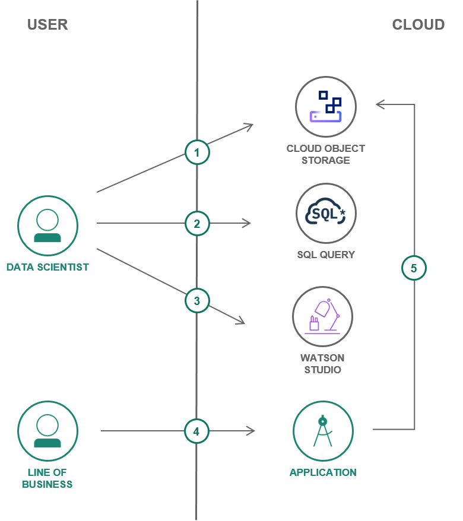
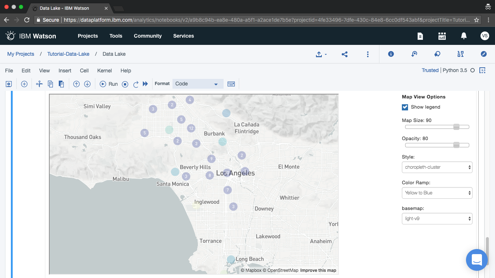
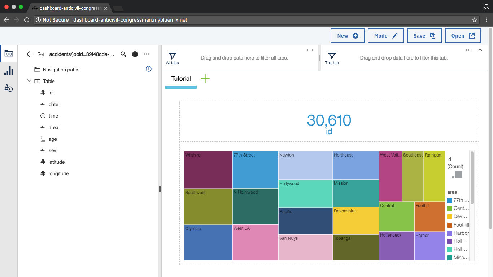

{{site.data.keyword.attribute-definition-list}}

# Build a data lake using object storage
{: #smart-data-lake}
{: toc-content-type="tutorial"}
{: toc-services="cloud-object-storage, sql-query"}
{: toc-completion-time="1h"}

<!--##istutorial#-->
This tutorial may incur costs. Use the [Cost Estimator](/estimator/review) to generate a cost estimate based on your projected usage.
{: tip}

<!--#/istutorial#-->

Definitions of the term data lake vary, but in the context of this tutorial, a data lake is an approach to storing data in its native format for organizational use. To that end, you will create a data lake for your organization using {{site.data.keyword.cos_short}}. By combining {{site.data.keyword.cos_short}} and {{site.data.keyword.sqlquery_short}}, data analysts can query data where it lies using Structured Query Language (SQL). You'll also leverage the {{site.data.keyword.sqlquery_short}} (previously SQL Query) service in a Jupyter Notebook to conduct a simple analysis. When you're done, allow non-technical users to discover their own insights.
{: shortdesc}

## Objectives
{: #smart-data-lake-0}

- Use {{site.data.keyword.cos_short}} to store raw data files
- Query data directly from {{site.data.keyword.cos_short}} using {{site.data.keyword.sqlquery_short}} (previously SQL Query)
- Refine and analyze data in {{site.data.keyword.DSX_full}}

{: caption="Figure 1. Architecture diagram of the tutorial" caption-side="bottom"}
{: style="text-align: center;"}

1. Raw data is stored on {{site.data.keyword.cos_short}}.
2. Data is reduced, enhanced or refined with {{site.data.keyword.sqlquery_short}}.
3. Data analysis occurs in {{site.data.keyword.DSX}}.
4. Non-technical users access data through application(s).
5. Refined data is pulled from {{site.data.keyword.cos_short}}.

## Before you begin
{: #smart-data-lake-1}

This tutorial requires:
* {{site.data.keyword.cloud_notm}} CLI.

<!--##istutorial#-->
You will find instructions to download and install these tools for your operating environment in the [Getting started with tutorials](/docs/solution-tutorials?topic=solution-tutorials-tutorials) guide.
<!--#/istutorial#-->

To avoid the installation of these tools you can use the [{{site.data.keyword.cloud-shell_short}}](/shell) from the {{site.data.keyword.cloud_notm}} console.
{: tip}

Optionally:
- [Install Aspera Connect](https://downloads.asperasoft.com/connect2/){: external} for high-speed data upload to {{site.data.keyword.cos_short}}.

## Create services
{: #smart-data-lake-2}
{: step}

In this section, you will create the services required to build your data lake.

This section uses the command line to create service instances. Alternatively, you may do the same from the service page in the [catalog](/catalog) using the provided links.
{: tip}

1. Login to {{site.data.keyword.cloud_notm}} via the command line. Use `ibmcloud login` or `ibmcloud login --sso` to log in interactively. See [CLI Getting Started](/docs/cli?topic=cli-getting-started).

2. Make sure to target the region and resource group to work with. It is used to create the services and actions. You can list your available resource groups using `ibmcloud resource groups`.
   ```sh
   ibmcloud target -r <region> -g <resource_group>
   ```
   {: pre}

   Use `ibmcloud target -g default` to switch to the default resource group.
   {: tip}

3. Create an instance of [{{site.data.keyword.cos_short}}](/catalog/services/cloud-object-storage). If you already have {{site.data.keyword.cos_short}} instance with a **lite** plan, use **standard** instead of **lite**.
    ```sh
    ibmcloud resource service-instance-create data-lake-cos cloud-object-storage lite global
    ```
    {: pre}

4. Create an instance of [{{site.data.keyword.sqlquery_short}}](/catalog/services/sql-query). Replace **us-south** by your region, if needed. If you already have {{site.data.keyword.sqlquery_short}} instance with a **lite** plan, use **standard** instead of **lite**.
    ```sh
    ibmcloud resource service-instance-create data-lake-sql sql-query lite us-south
    ```
    {: pre}

5. Create an instance of [{{site.data.keyword.DSX}}](/catalog/services/watson-studio).
    ```sh
    ibmcloud resource service-instance-create data-lake-studio data-science-experience free-v1 us-south
    ```
    {: pre}
    
6. Create an API key for service access. Copy the output to a secure, permanent location for later use.
    ```sh
    ibmcloud iam api-key-create data-lake-cos-key --output json
    ```
    {: pre}

## Uploading data
{: #smart-data-lake-3}
{: step}

In this section, you will upload data to an {{site.data.keyword.cos_short}} bucket. You can do this using regular http upload or by utilising the built-in {{site.data.keyword.CHSTSshort}}. {{site.data.keyword.CHSTSshort}} protects data as it is uploaded to the bucket and [can greatly reduce transfer time](https://www.ibm.com/cloud/blog/announcements/ibm-cloud-object-storage-simplifies-accelerates-data-to-the-cloud){: external}.

1. Download the [City of Los Angeles / Traffic Collision Data from 2010](https://data.lacity.org/api/views/d5tf-ez2w/rows.csv?accessType=DOWNLOAD){: external} CSV file. The file is 81MB and may take a few minutes to download.
2. In your browser, access the **data-lake-cos** service instance from the [Resource List](/resources) under the **Storage** section.
3. Create a new bucket to store data.
   - Click **Create a bucket**.
   - Select **Custom bucket/Customize your bucket**.
   - Close to the top of the form, provide a bucket **Name**.
   - Select **Regional** in the **Resiliency** section.
   - Select a **Location**.
   - At the bottom of the form click **Create bucket**.
4. Upload the CSV file to {{site.data.keyword.cos_short}}.
   - From your bucket, click **Upload**.
   - Select **Standard transfer** to use regular http file transfer or select the **Aspera high-speed transfer** radio button, you may need to install the Aspera plugin to your machine.
   - Click **Upload files**.
   - Browse and select the previously downloaded CSV file and click **Upload**.

## Working with data
{: #smart-data-lake-4}
{: step}

In this section, you will convert the original, raw dataset into a targeted cohort based on time and age attributes. This is helpful to consumers of the data lake who have specific interests or would struggle with very large datasets.

You will use {{site.data.keyword.sqlquery_short}} to manipulate the data where it resides in {{site.data.keyword.cos_short}} using familiar SQL statements. {{site.data.keyword.sqlquery_short}} has built-in support for CSV, JSON and Parquet - no additional computation services or extract-transform-load is necessary.

1. Access the **data-lake-sql** {{site.data.keyword.sqlquery_short}} service instance from the [Resource List](/resources) under the **Databases** section.
2. Click **Launch {{site.data.keyword.sqlquery_short}} UI** under **Manage**.
3. Create a new dataset by executing SQL directly on the previously uploaded CSV file.
    - Replace `<your-bucket-name` in the URL of the`FROM` clause with your bucket's name.
    - Replace `us-south` in the URL with the bucket **Location** (see Configuration tab for the bucket).
    - Enter the following SQL into the **Type SQL here ...** text area.
        ```sql
        SELECT
        `Dr Number` AS id,
        `Date Occurred` AS date,
        `Time Occurred` AS time,
        `Area Name` AS area,
        `Victim Age` AS age,
        `Victim Sex` AS sex,
        `Location` AS location
        FROM cos://us-south/<your-bucket-name>/Traffic_Collision_Data_from_2010_to_Present.csv
        WHERE
        `Time Occurred` >= 1700 AND
        `Time Occurred` <= 2000 AND
        `Victim Age` >= 20 AND
        `Victim Age` <= 35
        ```
        {: codeblock}

    - Click **Run**.
4. The **Target location** will auto-create a {{site.data.keyword.cos_short}} bucket to hold the result.
5. The intermediate dataset is displayed below the query on the **Results** tab associated with the **Job**

## Combine Jupyter Notebooks with {{site.data.keyword.sqlquery_short}}
{: #smart-data-lake-5}
{: step}

In this section, you will use the {{site.data.keyword.sqlquery_short}} client within a Jupyter Notebook. This re-uses the data stored on {{site.data.keyword.cos_short}} in a data analysis tool. The combination also creates datasets that are automatically stored in {{site.data.keyword.cos_short}} that can then be accessed by applications and tools serving line of business users.

First, create a new Jupyter Notebook and service connections in {{site.data.keyword.DSX}}.
1. Access the **data-lake-studio** {{site.data.keyword.DSX}} service instance from the [Resource List](/resources) under the **AI / Machine Learning** section.
    - Click **Launch in IBM Cloud Pak for Data**.
    - Click **Create a Project** followed by **Create an empty project**.
    - Use **Data lake project** as **Name**.
    - Under **Define storage** select **data-lake-cos**.
    - Click **Create**.
1. In the resulting project, add an access token to the project.
    - Click the **Manage** tab.
    - Click **Access control** on the left.
    - Click the **Access tokens** tab.
    - Click **New access token**.
    - Enter a name and select **Editor** for access role and click **Create**.
2. Click the **Assets** tab and then click **New asset** and **Connection**.
    - From the list of services select **{{site.data.keyword.sqlquery_notm}}**.
    - In the dialog enter **SQLQuery** as **Name**.
    - As **CRN** copy in the {{site.data.keyword.sqlquery_short}} instance CRN. You can obtain it by clicking in the [Resource List](/resources) right to the service name. **data-lake-sql**. The pop-up has the CRN and a copy button.
    - Fill in `cos://us-south/<your-bucket-name>` as **Target**. Replace `us-south` and `<your-bucket-name>` similar to how you did it earlier.
    - As **Password** under **Credentials** use the API key which you created earlier. The value is from the field **apikey**.
    - Finally, click **Create**.
3.  Now create the notebook. Click **New asset** and **Jupyter notebook editor**.
    - From the **Blank** tab, enter a **Data lake notebook** as **Name**.
    - Leave the **Runtime** and **Language** as default and click **Create**.

Once the notebook is available, follow these steps.
1. On the top right of the notebook click on the three dot menu and pick **Insert project token**. It inserts a code snippet into the first cell. **Run** that cell.
2. Install ibmcloudsql and folium by adding the following commands to the next `In [ ]:` input prompt (cell) and then **Run**.
    ```python
    !pip install ibmcloudsql
    !pip install folium
    ```
    {: codeblock}

3. In the next cell, import folium and ibmcloudsql by adding the following commands to the `In [ ]:` input prompt and then **Run**
    ```python
    import folium
    from folium.plugins import HeatMap
    import ibmcloudsql
    ```
    {: codeblock}

4. Enter the following commands into the next cell and click **Run** to view the result set. You will also have new `accidents/jobid=<id>/<part>.csv*` file added to your bucket that includes the result of the `SELECT`.
    ```python

    sqlquery_config=project.get_connection(name="SQLQuery")

    sqlClient = ibmcloudsql.SQLQuery(sqlquery_config['password'], sqlquery_config['crn'], sqlquery_config['target_cos_url'] + '/accidents')

    data_source = sqlquery_config['target_cos_url'] + "/Traffic_Collision_Data_from_2010_to_Present.csv"

    

    query = """
    SELECT
        `Time Occurred` AS time,
        `Area Name` AS area,
        `Victim Age` AS age,
        `Victim Sex` AS sex,
        `Location` AS location
    FROM  {}
    WHERE
        `Time Occurred` >= 1700 AND `Time Occurred` <= 2000 AND
        `Victim Age` >= 20 AND `Victim Age` <= 35
    """.format(data_source)

    traffic_collisions = sqlClient.run_sql(query)
    traffic_collisions.head()
    ```
    {: codeblock}

    The [function **get_connection**](https://dataplatform.cloud.ibm.com/docs/content/wsj/analyze-data/project-lib-python.html?audience=wdp){: external} retrieves the previously configured connection properties.

## Visualize data using folium
{: #smart-data-lake-6}
{: step}

In this section, you will visualize the previous result set using a folium heat map to better identify patterns or hot spots for traffic incidents.

1. Create a common table expression to convert the `location` column to separate `latitude` and `longitude` columns. **Run** the following from another Notebook cell.
    ```python
    query = """
    WITH location AS (
        SELECT
            id,
            cast(split(coordinates, ',')[0] as float) as latitude,
            cast(split(coordinates, ',')[1] as float) as longitude
        FROM (SELECT
                `Dr Number` as id,
                regexp_replace(Location, '[()]', '') as coordinates
            FROM {0}
        )
    )
    SELECT
        d.`Dr Number` as id,
        d.`Date Occurred` as date,
        d.`Time Occurred` AS time,
        d.`Area Name` AS area,
        d.`Victim Age` AS age,
        d.`Victim Sex` AS sex,
        l.latitude,
        l.longitude
    FROM {0} AS d
        JOIN
        location AS l
        ON l.id = d.`Dr Number`
    WHERE
        d.`Time Occurred` >= 1700 AND
        d.`Time Occurred` <= 2000 AND
        d.`Victim Age` >= 20 AND
        d.`Victim Age` <= 35 AND
        l.latitude != 0.0000 AND
        l.latitude != 0.0000
    """.format(data_source)

    traffic_location = sqlClient.run_sql(query)
    traffic_location.head()
    ```
    {: codeblock}

2. In the next cell **Run** the folium HeatMap to generate the map:
    ```python
    m = folium.Map(location=[traffic_location.latitude.mean(), traffic_location.longitude.mean()])
    locations = []
    for index, row in traffic_location.iterrows():
        locations.append((row["latitude"], row["longitude"]))
    HeatMap(locations, radius=15).add_to(m)
    m
    ```
    {: codeblock}

   {: caption="Notebook" caption-side="bottom"}
   {: style="text-align: center;"}

3. Click **File** > **Save** to save your Notebook to {{site.data.keyword.cos_short}}.

## Share your dataset with the organization
{: #smart-data-lake-7}
{: step}

Not every user of the data lake is a data scientist. You can allow non-technical users to gain insight from the data lake. Tools with analytic capabilities or for visualization can import data stored in CSV files. Application developers can make use of [{{site.data.keyword.dynamdashbemb_notm}}](/docs/cognos-dashboard-embedded?topic=cognos-dashboard-embedded-gettingstartedtutorial) to let users build and use feature-rich dashboards. Such a dashboard for the traffic data is shown below. 

{: caption="Dashboard Chart" caption-side="bottom"}
{: style="text-align: center;"}

## Expand the tutorial
{: #smart-data-lake-9}
{: step}

Congratulations, you have built a data lake using {{site.data.keyword.cos_short}}. Below are additional suggestions to enhance your data lake.

- Experiment with additional datasets using {{site.data.keyword.sqlquery_short}}
- Stream data from multiple sources into your data lake by completing [Big data logs with streaming analytics and SQL](/docs/solution-tutorials?topic=solution-tutorials-big-data-log-analytics#big-data-log-analytics)
- Build a web app with a dashboard for line of business users utilizing [{{site.data.keyword.dynamdashbemb_notm}}](/docs/cognos-dashboard-embedded?topic=cognos-dashboard-embedded-gettingstartedtutorial).

## Remove resources
{: #smart-data-lake-10}
{: step}

Run the following commands to remove services, applications and keys you created and used.

```sh
ibmcloud resource service-instance-delete data-lake-sql
```
{: pre}

```sh
ibmcloud resource service-instance-delete data-lake-studio
```
{: pre}

```sh
ibmcloud iam api-key-delete data-lake-cos-key
```
{: pre}

```sh
ibmcloud resource service-instance-delete data-lake-cos
```
{: pre}

If the deletion of **data-lake-cos** is not successful delete it from the storage section of the [Resource List](/resources).


Depending on the resource it might not be deleted immediately, but retained (by default for 7 days). You can reclaim the resource by deleting it permanently or restore it within the retention period. See this document on how to [use resource reclamation](/docs/account?topic=account-resource-reclamation).
{: tip}

## Related content
{: #smart-data-lake-11}

- [ibmcloudsql](https://github.com/IBM-Cloud/sql-query-clients/tree/master/Python){: external}
- [Jupyter Notebooks](https://jupyter.org/){: external}
- [Folium](https://python-visualization.github.io/folium/){: external}
