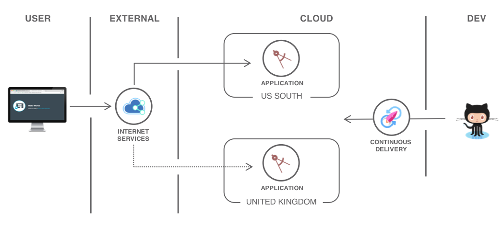

{{site.data.keyword.attribute-definition-list}}

# How to write a tutorial
{: #change-me-to-the-filename-without-md-extension}
{: toc-content-type="tutorial"}
{: toc-services="service1, service2"}
{: toc-completion-time="2h"}

<!--##istutorial#-->
This tutorial may incur costs. Use the [Cost Estimator](https://{DomainName}/estimator/review) to generate a cost estimate based on your projected usage.
{: tip}

<!--#/istutorial#-->

This template shows how to structure a tutorial but also some writing tips and general documentation on how to work with tutorials.
{: shortdesc}

## Objectives
{: #solution-template-objectives}

* Makes statements on what developers will learn/achieve - not what will they do Solutions and Tasks
* Short and informational (do not use sentences)

{: class="center"}
{: style="text-align: center;"}

1. The user does this
2. Then that
3. Create a .drawio file in diagrams/ directory with the same name as the tutorial.md only tutorial.drawio with a separate tab for each diagram


## Before you begin
{: #solution-template-prereqs}

This tutorial requires:
* An {{site.data.keyword.cloud_notm}} [billable account](https://{DomainName}/docs/account?topic=account-accounts),
* {{site.data.keyword.cloud_notm}} CLI,
   * {{site.data.keyword.vpc_short}} plugin (`vpc-infrastructure`),
   * {{site.data.keyword.containerfull_notm}} plugin (`container-service`),
   * {{site.data.keyword.registryshort_notm}} plugin (`container-registry`),
   * {{site.data.keyword.cos_full_notm}} plugin (`cloud-object-storage`),
   * `dev` plugin,
* a Docker engine,
* `kubectl` to interact with Kubernetes clusters,
* `oc` to interact with OpenShift,
* `helm` to deploy charts,
* `terraform` to use Infrastructure as Code to provision resources,
* `jq` to query JSON files,
* `git` to clone source code repository,
* a GitHub account,
* {{site.data.keyword.cloud_notm}} GitLab configured with your SSH key.

<!--##istutorial#-->
You will find instructions to download and install these tools for your operating environment in the [Getting started with solution tutorials](https://{DomainName}/docs/solution-tutorials?topic=solution-tutorials-tutorials) guide.

To avoid the installation of these tools you can use the [{{site.data.keyword.cloud-shell_short}}](https://{DomainName}/shell) from the {{site.data.keyword.cloud_notm}} console.
{: tip}

<!--#/istutorial#-->

In addition, make sure you have:
- a **namespace** created in the {{site.data.keyword.registryfull_notm}}
- and Android Studio installed.

<!--##isworkshop#-->
<!--
## Start a new {{site.data.keyword.cloud-shell_notm}}
{: #solution-template-2}
{: step}
1. From the {{site.data.keyword.cloud_notm}} console in your browser, select the account where you have been invited.
1. Click the button in the upper right corner to create a new [{{site.data.keyword.cloud-shell_short}}](https://{DomainName}/shell).

-->
<!--#/isworkshop#-->

## Create services
{: #solution-template-setup}
{: step}

In this section, you will create the services required to ...

1. Login to {{site.data.keyword.cloud_notm}} via the command line. See [CLI Getting Started](https://{DomainName}/docs/cli?topic=cloud-cli-getting-started).
    
2. Create an instance of [Service A](https://{DomainName}/catalog/services/the-service-name).
    ```sh
    ibmcloud resource service-instance-create service-instance-name service-name lite global
    ```
3. Create an instance of [Service B](https://{DomainName}/catalog/services/the-service-name).

## Solution Specific Section
{: #solution-template-section_one}
{: step}

Introductory statement that overviews the section

1. Step 1 Click **This** and enter your name.

   This is a tip.
   {: tip}

2. Keep each step as short as possible.
3. Do not use blank lines between steps except for tips or images.
4. *Avoid* really long lines like this one explaining a concept inside of a step. Do not offer optional steps or FYI inside steps. *Avoid* using "You can do ...". Be prescriptive and tell them exactly what to do succinctly, like a lab.
5. Do not use "I", "We will", "Let's", "We'll", etc.
6. Another step
7. Try to limit to 7 steps.

### A sub section
{: #solution-template-5}

   ```bash
   some shellscript
   ```
   {: pre}

   ```bash
   the output of the script
   is shown in a different format
   ```
   {: screen}

```bash
some iOS stuff
```
{: codeblock}
{: ios}

This paragraph only appears in the iOS documentation
{: ios}

```bash
some Android stuff
```
{: codeblock}
{: android}

And this paragraph only appears in the Android documentation
{: android}

```bash
some Java stuff
```
{: codeblock}
{: java}

This paragraph only appears for Java code
{: java}

```bash
some Swift stuff
```
{: codeblock}
{: swift}

And this paragraph only appears for Swift code
{: swift}

## Another Solution Specific Section
{: #solution-template-section_two}
{: step}

Introductory statement that overviews the section

### Another sub section
{: #solution-template-7}

## Remove resources
{: #solution-template-removeresources}
{: step}

Steps to take to remove the resources created in this tutorial

Depending on the resource it might not be deleted immediately, but retained (by default for 7 days). You can reclaim the resource by deleting it permanently or restore it within the retention period. See this document on how to [use resource reclamation](https://{DomainName}/docs/account?topic=account-resource-reclamation).
{: tip}

## Expand the tutorial (this section is optional, remove it if you don't have content for it)
{: #solution-template-0}

Want to add to or change this tutorial? Here are some ideas:
- idea with [link](http://example.com) to resources to help implement the idea
- idea with high level steps the user should follow
- avoid generic ideas you did not test on your own
- don't throw up ideas that would take days to implement
- this section is optional

## Related content
{: #solution-template-related}

* [Relevant links in IBM Cloud docs](https://{DomainName}/docs/cli?topic=blah)
* [Relevant links in external sources, i.e. normal link](https://kubernetes.io/docs/tutorials/hello-minikube/)

## Writing guide
{: #solution-template-writing_guide}

### Creating links
{: #solution-template-12}

For anchors within the same document always only use the following format:
   [link_description](#anchor_name)

For anchors or any links to external documents, even for those are are within our tutorials use the following format:
   [following these steps](https://{DomainName}/docs/cli?topic=cloud-cli-getting-started#overview)

If you have an old format html link that you are trying to translate to the new ?topic= format, enter the link uri, i.e. /docs/tutorials/serverless-api-webapp.html in the test.cloud.ibm.com, i.e. https://test.cloud.ibm.com/docs/tutorials/serverless-api-webapp.html, you will be redirected to the new ?topic= format which is: https://test.cloud.ibm.com/docs/solution-tutorials?topic=solution-tutorials-serverless-api-webapp#serverless-api-webapp

Finally refer to the link topic under the content and design documentation if you have any other questions: https://test.cloud.ibm.com/docs/writing?topic=writing-link-format

### Conrefs
{: #solution-template-13}

Use conrefs in place of IBM & IBM Cloud service names/branding. Just in case the service name gets updated/rebranded, the conrefs will take care. Check the [conrefs table](https://pages.github.ibm.com/cloud-docs/solution-tutorials/conref-table.html). E.g., conref for IBM cloud is \{{site.data.keyword.Bluemix_notm}}.

## Markup for workshops
{: #solution-template-10}

Some tutorials are [turned into workshops](https://github.ibm.com/lab-in-a-box/tutorials-to-gitbook/blob/master/.travis.yml#L9).

### Tutorial-only content
{: #solution-template-15}

To mark content as visible only in a tutorials enclose the content with `<!--##istutorial#-->` and `<!--#/istutorial#-->` as:

```markdown
<!--##istutorial#-->
This tutorial may incur costs. Use the [Pricing Calculator](https://{DomainName}/estimator/review) to generate a cost estimate based on your projected usage.
<!--#/istutorial#-->
```

### Workshop-only content
{: #solution-template-16}

To have content showing only in a workshop, use:

```markdown
<!--##isworkshop#-->
<!--
## Configure the access to your cluster
{: #solution-template-access-cluster}

This section will only appear in a workshop and not in the tutorial.
-->
<!--#/isworkshop#-->
```

Notice that the all section content is surrounded by html comments markup `<!--` and `-->`. This makes sure the content is not visible when the docs framework builds `test.cloud.ibm.com`. When we push changes to the `publish` branch, [`sync.sh`](https://github.ibm.com/cloud-docs/solution-tutorials/blob/draft/scripts/sync.sh#L32) makes sure to remove all markup so the workshop specific sections do not show up in our GitHub public repo.

### Testing coding styles
{: #solution-template-18}

#### Terraform
{: #solution-template-19}

```terraform
resource "ibm_is_vpc" "myvpc" {
  name = "the name using terraform"
}
```
{: codeblock}
