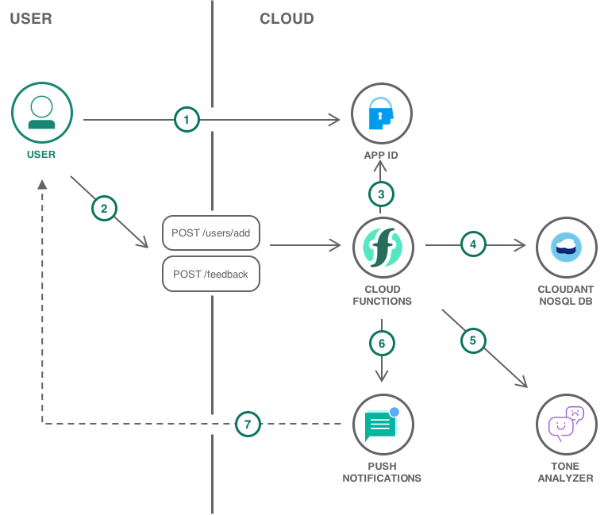

---
copyright:
  years: 2017
lastupdated: "2017-11-22"

---

{:java: #java .ph data-hd-programlang='java'}
{:swift: #swift .ph data-hd-programlang='swift'}
{:ios: #ios data-hd-operatingsystem="ios"}
{:android: #android data-hd-operatingsystem="android"}
{:shortdesc: .shortdesc}
{:new_window: target="_blank"}
{:codeblock: .codeblock}
{:screen: .screen}
{:tip: .tip}
{:pre: .pre}

# TUTORIAL TITLE
This tutorial...
{:shortdesc}

## Objectives
{: #objectives}

* First objective
* Second objective

## Products
{: #products}

This tutorial uses the following products:
* [IaaS or PaaS service name](https://console.ng.bluemix.net/catalog/services/ServiceName)
* [IaaS or PaaS service name](https://console.ng.bluemix.net/catalog/services/ServiceName)
* [IaaS or PaaS service name](https://console.ng.bluemix.net/catalog/services/ServiceName)

<p style="text-align: center;">

</p>

1. The user does this
2. Then that

## Before you begin
{: #prereqs}

* [IBM Cloud Developer Tools](https://github.com/IBM-Bluemix/ibm-cloud-developer-tools) - Script to install docker, kubectl, helm, bx cli and required plug-ins


## First Objective
{: #first_objective}

Objective description

1. Step 1

  This is a tip.
  {:tip}

2. Step 2

### Sub objective

   ```bash
   some shellscript
   ```
   {: pre}


This paragraph only appears in the iOS documentation
{: ios}

And this paragraph only appears in the Android documentation
{: android}

This paragraph only appears for Java code
{: java}

And this paragraph only appears for Swift code
{: swift}


## Second Objective
{: #second_objective}

Objective description

### Sub objective

## Clean up resources

Steps to take to remove the resources created in this tutorial

## Related information

* [Relevant links](https://blah)
