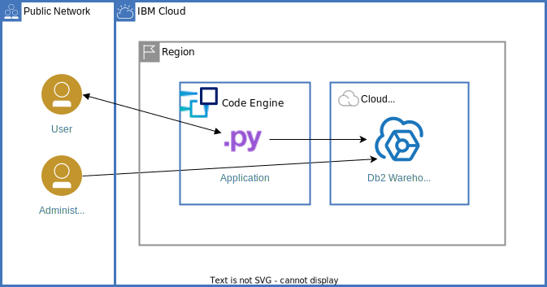
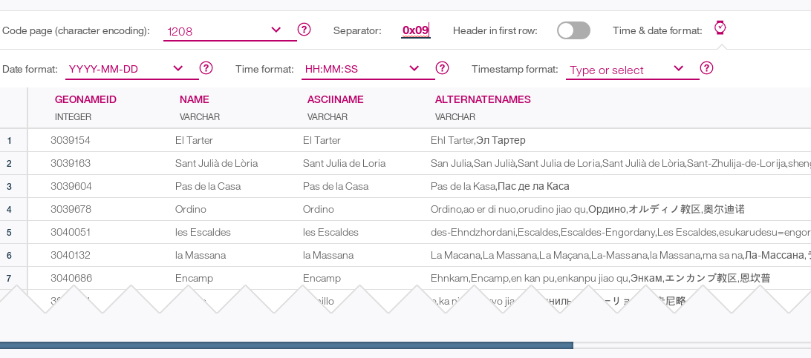

{{site.data.keyword.attribute-definition-list}}

# SQL Database for Cloud data
{: #sql-database}
{: toc-content-type="tutorial"}
{: toc-services="codeengine, Db2whc"}
{: toc-completion-time="2h"}

<!--##istutorial#-->
This tutorial may incur costs. Use the [Cost Estimator](/estimator) to generate a cost estimate based on your projected usage.
{: tip}

<!--#/istutorial#-->

This tutorial shows how to provision a SQL (relational) database service. As administrator, you create a table and load a large data set (city information) into the database. Then, you deploy a web app "worldcities" to [{{site.data.keyword.codeenginefull}}](/codeengine/){: external}. The app allows regular users to look up records from the cloud database. The app is written in Python using the [Flask framework](https://flask.palletsprojects.com){: external}.
{: shortdesc}

{: caption="Figure 1. Architecture diagram of the tutorial" caption-side="bottom"}
{: style="text-align: center;"}

## Objectives
{: #sql-database-0}

* Provision a SQL database
* Create the database schema (table) and load data
* Deploy a pre-built containerized app to {{site.data.keyword.codeengineshort}}
* Connect the app and database service (share credentials)
* Monitor, Secure, Backup & Recovery of cloud databases

## Before you begin
{: #sql-database-prereqs}

This tutorial requires:
* {{site.data.keyword.cloud_notm}} CLI with the Code Engine plugin,
* `git` to clone the source code repository.

To avoid the installation of these tools you can use the [{{site.data.keyword.cloud-shell_short}}](/shell){: external} from the {{site.data.keyword.cloud_notm}} console.
{: tip}

<!--##istutorial#-->
You will find instructions to download and install these tools for your operating environment in the [Getting started with tutorials](/docs/solution-tutorials?topic=solution-tutorials-tutorials) guide.
<!--#/istutorial#-->


1. Clone the [Github repository for this tutorial](https://github.com/IBM-Cloud/cloud-sql-database){: external} and change into its directory. In a terminal, execute the following lines:
   ```bash
   git clone https://github.com/IBM-Cloud/cloud-sql-database.git
   cd cloud-sql-database
   ```
   {: pre}

2. Go to [GeoNames](https://www.geonames.org/){: external} and download and extract the file [cities1000.zip](https://download.geonames.org/export/dump/cities1000.zip){: external}. It holds information about cities with a population of more than 1000. You are going to use it as data set.

## Provision the SQL Database
{: #sql-database-2}
{: step}

Start by creating an instance of the **[{{site.data.keyword.dashdbshort_notm}}](/db2-wh){: external}** service.

1. Visit the [{{site.data.keyword.Bluemix_short}} console](/). Click on **Catalog** in the top navigation bar.
2. Click on **Databases** on the left pane and select **Db2 Warehouse**.
3. Pick the **Flex One** plan and change the suggested service name to **sqldatabase** (you will use that name later on). Pick a resource group and a location for the deployment of the database.
4. Click on **Create**. The provisioning starts.
5. In the **Resource List**, locate the new instance under **Databases** and wait for it to be available (sometimes you may need to refresh the page). Click on the entry for your {{site.data.keyword.dashdbshort_notm}} service.
6. Click on **Open Console** to launch the database console.

## Create a table
{: #sql-database-3}
{: step}

You need a table to hold the sample data. Create it using the console.

1. In the console for {{site.data.keyword.dashdbshort_notm}} click on the upper left menu icon, then **Run SQL** in the navigation bar. 
2. Click on the **+** symbol (**Add a new script**) next to the **Untitled - 1** tab.
3. Click on **From file** and select the file `cityschema.txt` from the GitHub repository that was previously cloned to your local directory and open it.
4. Click on **Run all** to execute the statement. It should show a success message.

## Load data
{: #sql-database-4}
{: step}

Now that the table "cities" has been created, you are going to load data into it. This can be done in different ways, for example from your local machine or from cloud object storage (COS) or Amazon S3 interface. For this tutorial, you are going to upload data from your machine. During that process, you adapt the table structure and data format to fully match the file content.

1. In the console for {{site.data.keyword.dashdbshort_notm}} click on the upper left menu icon, then **Data** in the navigation bar. 
2. As **Source** keep the selection on **My Computer**.
3. Under **File selection**, click on **Drag a file here or browse files** to locate and pick the file "cities1000.txt" you downloaded in the first section of this guide.
2. Click **Next** to get to the **Target** overview with a **Schema** selection. Choose the schema **BLUADMIN**, then the table **CITIES**. Click on **Next** again.   

   Because the table is empty it does not make a difference to either append to or overwrite existing data.
   {: tip}

3. Now customize how the data from the file "cities1000.txt" is interpreted during the load process. First, disable **Header in first row** because the file contains data only. 
4. Next, type in **0x09** as separator. It means that values within the file are delimited by tab(ulator). 
5. Last, pick "YYYY-MM-DD" as date format. Now, everything should look similar to what is shown in this screen capture.
   {: caption="Screen capture showing the sampled data" caption-side="bottom"}
6. Click **Next** and you are offered to review the load settings. Agree and click **Begin Load** to start loading the data into the **CITIES** table. The progress is displayed. Once the data is uploaded it should only take few seconds until the load is finished and some statistics are presented.  
7. Click on **View Table** to browse the data. You may scroll down or click on column names to change the sort order.  

## Verify Loaded Data Using SQL
{: #sql-database-5}
{: step}

The data has been loaded into the relational database. There were no errors, but you should run some quick tests anyway. Use the built-in SQL editor to type in and execute some SQL statements.

1. In the left navigation click on **Run SQL** to get back to the SQL editor. Click on the **+** symbol (**Add new script**) and **Create new** to create a new editor tab.

   Instead of the built-in SQL editor you can use cloud-based and traditional SQL tools on your desktop or server machine with {{site.data.keyword.dashdbshort_notm}}. The connection information can be found in the **Administration** menu in the left navigation.
   {: tip}

2. In the editor type or copy in the following query:   
   ```bash
   select count(*) from cities;
   ```
   {: codeblock}

   Select the text of the query, then, in dropdown next to **Run All**, choose **Run selected**. In the section with results, the same number of rows as reported by the load process should be shown.   
3. In the "SQL Editor" enter the following statement on a new line:
   ```sql
   select countrycode, count(name) from cities
   group by countrycode
   order by 2 desc;
   ```
   {: codeblock}
  
   Mark the text of the above statement and click the **Run selected** button. Only this statement is executed, returning some by country statistics in the results section.
4. Finally, run the following statement similarly to retrieve details about San Francisco in California:
   ```sql
   select * from cities
   where name='San Francisco'
   and countrycode='US';
   ```
   {: codeblock}

## Deploy the application code
{: #sql-database-6}
{: step}

Change back to the terminal. Now you are going to deploy the application code, using a pre-built container image. You can modify the application code and build the container image on your own. See the [instructions in the GitHub repository](https://github.com/IBM-Cloud/cloud-sql-database){: external} for details.

1. If you are not logged in, use `ibmcloud login` or `ibmcloud login --sso` to log in interactively. Set the region and resource group to where the database has been provisioned. Replace **RESOURCE_GROUP** and **REGION** accordingly.
   ```sh
   ibmcloud target -g RESOURCE_GROUP -r REGION
   ```
   {: pre}

1. Create a new {{site.data.keyword.codeengineshort}} project named **sqldatabase**:
   ```sh
   ibmcloud ce project create --name sqldatabase
   ```
   {: pre}

   Select the new project as the active one:
   ```sh
   ibmcloud ce project select --name sqldatabase
   ```
   {: pre}


1. Then, deploy the app naming it **worldcities**. 
   ```sh
   ibmcloud ce app create --name worldcities --image icr.io/solution-tutorials/tutorial-cloud-sql-database:latest --min-scale 1
   ```
   {: pre}

1. Last, create a service binding between the existing {{site.data.keyword.dashdbshort_notm}} database and the app:
   ```sh
   ibmcloud ce application bind --name worldcities --service-instance sqldatabase
   ```
   {: pre}
   
   Once the binding is created, a new app revision is started.
1. Now you can check the app details for its status and to retrieve its URL:
   ```sh
   ibmcloud ce app get --name worldcities 
   ```
   {: pre}
   
   In the output, look for the line starting with **URL**. The shown URL should have a pattern like `https://worldcities.unique-subdomain.region.codeengine.appdomain.cloud`. Click on the link to access the app. Another option to retrieve app details is to visit the [{{site.data.keyword.codeengineshort}} console](/codeengine/overview){: external}.

## Security, Backup & Recovery, Monitoring
{: #sql-database-7}
{: step}

The {{site.data.keyword.dashdbshort_notm}} is a managed service. IBM takes care of securing the environment, daily backups and system monitoring. When you are using one of the enterprise plans there are [several options to manage access](/docs/Db2whc?topic=Db2whc-iam) and to configure [enhanced data encryption](/docs/Db2whc?topic=Db2whc-key-protect-v2). 

In addition to the traditional administration options the [{{site.data.keyword.dashdbshort_notm}} service also offers a REST API for monitoring, user management, utilities, load, storage access and more](/apidocs/db2-warehouse-on-cloud/db2-warehouse-on-cloud-v4#introduction){: external}.

## Test the App
{: #sql-database-8}
{: step}

The app to display city information based on the loaded data set is reduced to a minimum. It offers a search form to specify a city name - names are case sensitive - and few preconfigured cities. They are translated to either `/search?name=cityname` (search form) or `/city/cityname` (directly specified cities). Both requests are served from the same lines of code in the background. The `cityname` is passed as value to a prepared SQL statement using a parameter marker for security reasons. The rows are fetched from the database and passed to an HTML template for rendering.

## Cleanup
{: #sql-database-9}
{: step}

To clean up resources used by the tutorial, follow these steps:
1. Visit the [{{site.data.keyword.Bluemix_short}} Resource List](/resources){: external}. 
2. In the {{site.data.keyword.codeengineshort}} section locate the project **sqldatabase**. Click on the three dots and select **Delete** to delete the project and its app.
3. Locate the database `sqldatabase` under **Databases**. Again, click on the three dots and select **Delete** to delete the database.

Depending on the resource it might not be deleted immediately, but retained (by default for 7 days). You can reclaim the resource by deleting it permanently or restore it within the retention period. See this document on how to [use resource reclamation](/docs/account?topic=account-resource-reclamation).
{: tip}

## Expand the tutorial
{: #sql-database-10}

Want to extend this app? Here are some ideas:
1. Offer a wildcard search on the alternate names.
2. Search for cities of a specific country and within a certain population values only.
3. Change the page layout by replacing the CSS styles and extending the templates.
4. Allow form-based creation of new city information or allow updates to existing data, for example population.

## Related Content
{: #sql-database-11}

* Documentation: [API Description for the ibm_db Python driver](https://github.com/ibmdb/python-ibmdb/wiki/APIs){: external}
* [Db2 Data Management Console](https://www.ibm.com/products/db2-data-management-console){: external}
* [Db2 on Cloud](/catalog/services/db2){: external}
