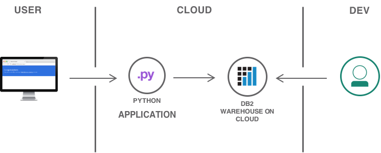

{:step: data-tutorial-type='step'}
{:shortdesc: .shortdesc}
{:new_window: target="_blank"}
{:codeblock: .codeblock}
{:screen: .screen}
{:tip: .tip}
{:pre: .pre}

# SQL Database for Cloud data
{: #sql-database}
{: toc-content-type="tutorial"}
{: toc-services="cloud-foundry-public, Db2whc"}
{: toc-completion-time="2h"}

<!--##istutorial#-->
This tutorial may incur costs. Use the [Cost Estimator](https://{DomainName}/estimator/review) to generate a cost estimate based on your projected usage.
{: tip}
<!--#/istutorial#-->

This tutorial shows how to provision a SQL (relational) database service, create a table, and load a large data set (city information) into the database. Then, you deploy a web app "worldcities" to make use of that data and show how to access the cloud database. The app is written in Python using the [Flask framework](https://flask.palletsprojects.com).
{: shortdesc}



## Objectives
{: #sql-database-0}

* Provision a SQL database
* Create the database schema (table)
* Load data
* Connect the app and database service (share credentials)
* Monitoring, Security, Backups & Recovery

## Before you begin
{: #sql-database-prereqs}

This tutorial requires:
* {{site.data.keyword.cloud_notm}} CLI,
* `git` to clone source code repository.

<!--##istutorial#-->
You will find instructions to download and install these tools for your operating environment in the [Getting started with tutorials](https://{DomainName}/docs/solution-tutorials?topic=solution-tutorials-tutorials) guide.
<!--#/istutorial#-->


1. Clone the Github repository and change into its directory. In a terminal, execute the following lines:
   ```bash
   git clone https://github.com/IBM-Cloud/cloud-sql-database.git
   cd cloud-sql-database
   ```
2. Go to [GeoNames](http://www.geonames.org/) and download and extract the file [cities1000.zip](http://download.geonames.org/export/dump/cities1000.zip). It holds information about cities with a population of more than 1000. You are going to use it as data set.

## Provision the SQL Database
{: #sql-database-2}
{: step}
Start by creating an instance of the **[{{site.data.keyword.dashdbshort_notm}}](https://{DomainName}/catalog/services/db2-warehouse)** service.

1. Visit the [{{site.data.keyword.Bluemix_short}} dashboard](https://{DomainName}). Click on **Catalog** in the top navigation bar.
2. Click on **Databases** on the left pane and select **Db2 Warehouse**.
3. Pick the **Flex One** plan and change the suggested service name to **sqldatabase** (you will use that name later on). Pick a location for the deployment of the database and make sure that the correct organization and space are selected.
4. Click on **Create**. The provisioning starts.
5. In the **Resource List**, locate the new instance under **Cloud Foundry services** and wait for it to be available (sometimes you may need to refresh the page). Click on the entry for your {{site.data.keyword.dashdbshort_notm}} service.
6. Click on **Open Console** to launch the database console.

## Create a table
{: #sql-database-3}
{: step}
You need a table to hold the sample data. Create it using the console.

1. In the console for {{site.data.keyword.dashdbshort_notm}} click on the upper left menu icon, then **Run SQL** in the navigation bar and start **From file**.
2. Select the file [cityschema.txt](https://github.com/IBM-Cloud/cloud-sql-database/blob/master/cityschema.txt) and open it.
3. Click on **Run all** to execute the statement. It should show a success message.

## Load data
{: #sql-database-4}
{: step}
Now that the table "cities" has been created, you are going to load data into it. This can be done in different ways, e.g. from your local machine or from cloud object storage (COS) or Amazon S3 interface. For this tutorial, you are going to upload data from your machine. During that process, you adapt the table structure and data format to fully match the file content.

1. In the top navigation click on **Data** and **Load Data**. Then, after clicking **My Computer**, under **File selection**, click on **browse files** to locate and pick the file "cities1000.txt" you downloaded in the first section of this guide.
2. Click **Next** to get to the schema overview. Choose the schema starting with **BLUADMIN**, then the table **CITIES**. Click on **Next** again.   

   Because the table is empty it does not make a difference to either append to or overwrite existing data.
   {: tip }
3. Now customize how the data from the file "cities1000.txt" is interpreted during the load process. First, disable **Header in first row** because the file contains data only. Next, type in **0x09** as separator. It means that values within the file are delimited by tab(ulator). Last, pick "YYYY-MM-DD" as date format. Now, everything should look similar to what is shown in this screenshot.    
  
4. Click **Next** and you are offered to review the load settings. Agree and click **Begin Load** to start loading the data into the **CITIES** table. The progress is displayed. Once the data is uploaded it should only take few seconds until the load is finished and some statistics are presented.  
5. Click on **View Table** to browse the data. You may scroll down or click on column names to change the sort order.  

## Verify Loaded Data Using SQL
{: #sql-database-5}
{: step}
The data has been loaded into the relational database. There were no errors, but you should run some quick tests anyway. Use the built-in SQL editor to type in and execute some SQL statements.

1. In the top navigation click on **Run SQL** to get back to the SQL editor. Click on the **+** symbol (**Add new script**) and **Create new** to create a new editor tab.

   Instead of the built-in SQL editor you can use cloud-based and traditional SQL tools on your desktop or server machine with {{site.data.keyword.dashdbshort_notm}}. The connection information can be found in the settings menu. Some tools are even offered for download in the "Downloads" section in the menu offered behind the "book" icon (standing for documentation and help).
    {: tip }
2. In the editor type or copy in the following query:   
   ```bash
   select count(*) from cities
   ```
   {: codeblock}
   then press the **Run All** button. In the results section the same number of rows as reported by the load process should be shown.   
3. In the "SQL Editor" enter the following statement on a new line:
   ```
   select countrycode, count(name) from cities
   group by countrycode
   order by 2 desc
   ```
   {: codeblock}   
4. In the editor select the text of the above statement. Click the **Run selected** button. Only this statement should be executed now, returning some by country statistics in the results section.

## Deploy the application code
{: #sql-database-6}
{: step}
Change back to the terminal and the directory with the cloned repository. Now you are going to deploy the application code.

1. Push the application to the IBM Cloud. You need to be logged in to the location, org and space to which the database has been provisioned. Copy and paste these commands one line at a time.
   ```bash
   ibmcloud login
   ibmcloud target --cf
   ibmcloud cf push
   ```
3. Once the push process is finished you should be able to access the app on the route shown in the output. No further configuration is needed. The file `manifest.yml` tells the IBM Cloud to bind the app and the database service named **sqldatabase** together. It also creates a random route (URI) for the app.

## Security, Backup & Recovery, Monitoring
{: #sql-database-7}
{: step}
The {{site.data.keyword.dashdbshort_notm}} is a managed service. IBM takes care of securing the environment, daily backups and system monitoring. When you are using one of the enterprise plans there are [several options to manage users, to configure additional database security](https://www.ibm.com/support/knowledgecenter/SS6NHC/com.ibm.swg.im.dashdb.security.doc/doc/security.html), and to [monitor the database](https://www.ibm.com/support/knowledgecenter/SS6NHC/com.ibm.swg.im.dashdb.admin.mon.doc/doc/c0001138.html).   

In addition to the traditional administration options the [{{site.data.keyword.dashdbshort_notm}} service also offers a REST API for monitoring, user management, utilities, load, storage access and more](https://www.ibm.com/support/knowledgecenter/SS6NHC/com.ibm.swg.im.dashdb.doc/connecting/connect_api.html). The executable Swagger interface of that API can be accessed in the menu behind the "book" icon under "Rest APIs". Some tools that can be used for monitoring and more, e.g., the IBM Data Server Manager, can even be downloaded under the "Downloads" section in that same menu.

## Test the App
{: #sql-database-8}
{: step}
The app to display city information based on the loaded data set is reduced to a minimum. It offers a search form to specify a city name and few preconfigured cities. They are translated to either `/search?name=cityname` (search form) or `/city/cityname` (directly specified cities). Both requests are served from the same lines of code in the background. The cityname is passed as value to a prepared SQL statement using a parameter marker for security reasons. The rows are fetched from the database and passed to an HTML template for rendering.

## Cleanup
{: #sql-database-9}
{: step}
To clean up resources used by the tutorial, follow these steps:
1. Visit the [{{site.data.keyword.Bluemix_short}} Resource List](https://{DomainName}/resources). Locate your app.
2. Click on the menu icon for the app and choose **Delete App**. In the dialog window tick the checkmark that you want to delete the related {{site.data.keyword.dashdbshort_notm}} service.
3. Click the **Delete** button. The app and database service are removed and you are taken back to the resource list.

## Expand the tutorial
{: #sql-database-10}
Want to extend this app? Here are some ideas:
1. Offer a wildcard search on the alternate names.
2. Search for cities of a specific country and within a certain population values only.
3. Change the page layout by replacing the CSS styles and extending the templates.
4. Allow form-based creation of new city information or allow updates to existing data, e.g. population.

## Related Content
{: #sql-database-11}
* Documentation: [IBM Knowledge Center for {{site.data.keyword.dashdbshort_notm}}](https://www.ibm.com/support/knowledgecenter/en/SS6NHC/com.ibm.swg.im.dashdb.kc.doc/welcome.html)
* [Free Db2 edition for developers](https://www.ibm.com/us-en/marketplace/ibm-db2-direct-and-developer-editions) for developers
* Documentation: [API Description of ibm_db Python driver](https://github.com/ibmdb/python-ibmdb/wiki/APIs)
* [Db2 Data Management Console](https://www.ibm.com/products/db2-data-management-console)
