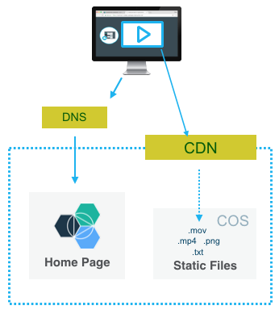
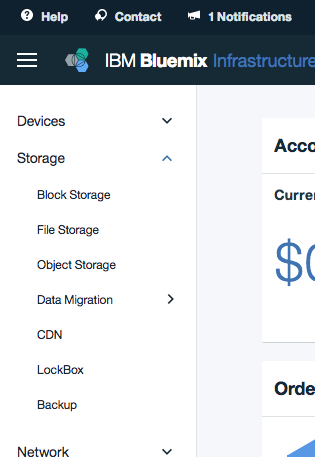
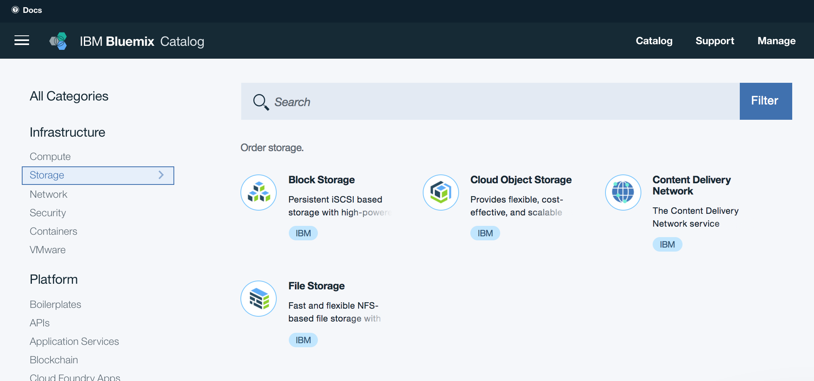

---


copyright:
  years: 2017
lastupdated: "2017-09-28"

---

{:shortdesc: .shortdesc}
{:new_window: target="_blank"}
{:codeblock: .codeblock}
{:screen: .screen}
{:tip: .tip}
{:pre: .pre}


# Accelerate delivery of static files using a CDN

Host and serve website assets (images, videos, documents) and user generated content in a Cloud Object Storage and use a Content Delivery Network (CDN) for fast and secure delivery to users around the world.

## Objectives

* Create a Cloud Object Storage S3 bucket
* Upload files to a bucket
* Make the content globally available with a CDN
* Expose files using a Cloud Foundry web application



## Before you begin
{: #prereqs}

1. **Contact your Infrastructure master user to get the following permissions:**
   * Manage CDN Account
   * Manage Storage
   * Manage CDN File Transfers
   * API Key
   > These permissions are required to be able to view and use the Storage and CDN services.
2. Ensure that you have access to Storage in the Infrastructure console
   * Go to https://control.bluemix.net
   * Confirm you can see the `Storage` section and the `Object Storage` section underneath.


## Get the web application code

{: #get_code}

This guide uses a simple web application which links to the files (css, images and videos) served by a Content Delivery Network.

To start with, retrieve the application code:

   ```sh
   git clone https://github.ibm.com/frederic-lavigne/webapp-with-cos-and-cdn
   ```
  {: pre}


## Create an Object Storage

{: #create_cos}

Cloud Object Storage provides flexible, cost-effective, and scalable cloud storage for unstructured data.



1. Go in the Catalog
2. Click on **Storage** and then **Object Storage**
3. Select **Cloud Object Storage** and click **Create** and **Create**.
4. Click **Create Bucket**.
5. Set the Bucket Name to **mywebsite** and click **Create**. Avoid dots (.) in the bucket name

## Upload files to a bucket
{: #upload}

In this section, we will use the command line tool **curl** to upload files to the bucket.

1. **Login** to IBM Cloud using the CLI and get a **token** from IAM
   ```sh
   bx login
   bx iam oauth-tokens
   ```
   {: pre}
3. **Copy** the token from the output of the command above.
   ```
   IAM token:  Bearer <token>
   ```
   {: screen}
4. **Set** the value of the token and bucket name to an environment variable for easy access.
   ```sh
   export IAM_TOKEN=<REPLACE_WITH_TOKEN>
   export BUCKET_NAME=<REPLACE_WITH_BUCKET_NAME>
   ```
   {: pre}
5. Upload the files named **a-css-file.css**, **a-picture.png** and **a-video.mp4** from the **content** directory of the web application code you downloaded above. Upload the files to the root of the bucket.
  ```sh
   cd content
  ```
  {: pre}
  ```sh

   curl -X "PUT" \
         "https://s3-api.us-geo.objectstorage.softlayer.net/$BUCKET_NAME/a-picture.png" \
        -H "x-amz-acl: public-read" \
        -H "Authorization: Bearer $IAM_TOKEN" \
        -H "Content-Type: image/png" \
        -T a-picture.png
  ```
  {: pre}
  ```sh
   curl -X "PUT" \
         "https://s3-api.us-geo.objectstorage.softlayer.net/$BUCKET_NAME/a-css-file.css" \
        -H "x-amz-acl: public-read" \
        -H "Authorization: Bearer $IAM_TOKEN" \
        -H "Content-Type: text/css" \
        -T a-css-file.css
  ```
  {: pre}
  ```sh
   curl -X "PUT" \
         "https://s3-api.us-geo.objectstorage.softlayer.net/$BUCKET_NAME/a-video.mp4" \
        -H "x-amz-acl: public-read" \
        -H "Authorization: Bearer $IAM_TOKEN" \
        -H "Content-Type: video/mp4" \
        -T a-video.mp4
  ```
  {: pre}
6. You should now be able to view your files using the dashboard.
   
7. Access the files through your browser. The link will look like:

   http://s3-api.us-geo.objectstorage.softlayer.net/YOUR_BUCKET_NAME/a-picture.png


## Make the files globally available with a CDN

In this section, we will create a CDN service. The CDN service distributes content where it is needed. The first time content is requested, it’s pulled from the host server (our bucket in Cloud Object Storage) to the network and stays there for other users to access it quickly without the network latency to reach the host server again.

### Create a CDN instance

1. Go into the Catalog
2. Search for **Content Delivery Network**
3. Pick the one under the **Network** category. This CDN is powered by Akamai.
4. Create a **Content Delivery Network** instance
5. Select **Akamai** as the CDN Provider and **Start Provision**

### Configure the CDN instance

1. Set the **hostname** for the CDN to your custom domain. Although you set a custom domain, you will still be able to access the CDN contents through the IBM provided CNAME. So if you don't plan to use custom domain, you can set an arbitrary name.
2. Set the **Custom CNAME** prefix. Do not use dots "." in the name.
3. Leave the **Path** empty
4. Select **Object Storage** as Origin
5. Set the **Endpoint** to your bucket API endpoint, such as *s3-api.us-geo.objectstorage.softlayer.net*
6. Set the **Bucket name** to *your-bucket-name*
7. Enable HTTP Port 80
8. Click **Create**

### Access your content through the CDN domain

1. Select the CDN instance in the list at https://control.bluemix.net/network/cdn
2. The **Details** panel shows the **CNAME** for your CDN
3. Access your file with https://your-cdn-cname.cdnedge.bluemix.net/a-picture.png If you omit the filename, you should see the S3 ListBucketResult instead.

## Deploy the Cloud Foundry application

The application contains a web page **public/index.html** that includes references to the files now hosted in the Cloud Object Storage. The backend **app.js** serves this web page and replace a placeholder with the actual location of your CDN. This way all assets used by the web page will be served by the CDN.

1. With a terminal, go in the directory where you checked out the code
   ```
   cd webapp-with-cos-and-cdn
   ```
   {: pre}
2. Push the application without starting it.
   ```
   bx cf push --no-start
   ```
   {: pre}
3. Configure the CDN_NAME environment variable so the app can reference the CDN contents
   ```
   bx cf set-env webapp-with-cos-and-cdn CDN_CNAME your-cdn.cdnedge.bluemix.net
   ```
   {: pre}
4. Start the app.
   ```
   bx cf start webapp-with-cos-and-cdn
   ```
   {: pre}
5. Access the app with your web browser, the page stylesheet, a picture and a video are loaded from the CDN.


Using a CDN with an Object Storage is a powerful combination which lets you host files and serve them to users from around the world. You can also use Object Storage to store any files your users upload to your application.

## Related Content

[IBM Object Storage](https://ibm-public-cos.github.io/crs-docs/index.html)

[Manage Access to Object Storage](https://ibm-public-cos.github.io/crs-docs/manage-access)

[Getting Started with CDN](https://console.bluemix.net/docs/infrastructure/CDN/getting-started.html)
