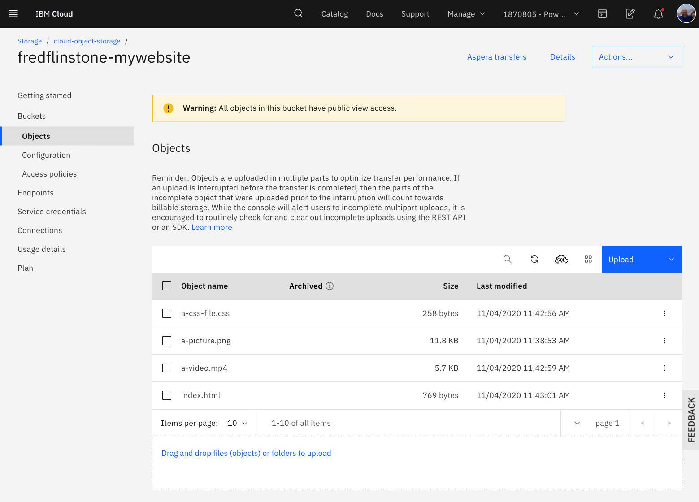

{:step: data-tutorial-type='step'}
{:shortdesc: .shortdesc}
{:new_window: target="_blank"}
{:codeblock: .codeblock}
{:screen: .screen}
{:tip: .tip}
{:pre: .pre}

# Accelerate delivery of static files using a CDN
{: #static-files-cdn}
{: toc-content-type="tutorial"}
{: toc-services="cloud-foundry-public, CDN, cloud-object-storage"}
{: toc-completion-time="2h"}

<!--##istutorial#-->
This tutorial may incur costs. Use the [Cost Estimator](https://{DomainName}/estimator/review) to generate a cost estimate based on your projected usage.
{: tip}

<!--#/istutorial#-->

This tutorial walks you through how to host and serve website assets (images, videos, documents) and user generated content in a {{site.data.keyword.cos_full_notm}}, and how to use a [{{site.data.keyword.cdn_full}} (CDN)](https://{DomainName}/catalog/infrastructure/cdn-powered-by-akamai) for fast and secure delivery to users around the world.
{: shortdesc}

Web applications have different types of content: HTML content, images, videos, cascading style sheets, JavaScript files, user-generated content. Some contents change often, others not so much, some are accessed very often by lot of users, others occasionally. As the audience for the application grows, you may want to offload serving these contents to another component, freeing resources for your main application. You may also want to have these contents served from a location close to your application users, wherever they are in the world.

There are many reasons why you would use a Content Delivery Network in these situations:
* the CDN will cache the content, pulling the content from the origin (your servers) only if it is not available in its cache or if it has expired;
* with multiple data centers across the world, the CDN will serve the cached content from the closest location for your users;
* running on a different domain than your main application, the browser will be able to load more contents in parallel - most browsers have a limit in the number of connections per hostname.

## Objectives
{: #static-files-cdn-objectives}

* Upload files to a {{site.data.keyword.cos_full_notm}} bucket.
* Make content globally available with a Content Delivery Network (CDN).
* Expose files by using a static website application.

{: class="center"}
{: style="text-align: center;"}

1. The user accesses the application
2. The application includes content distributed through a Content Delivery Network
3. If the content is not available in the CDN or has expired, the CDN pulls the content from the origin.

## Before you begin
{: #static-files-cdn-prereqs}

This tutorial requires:
* {{site.data.keyword.cloud_notm}} CLI with the {{site.data.keyword.cos_full_notm}} plugin (`cloud-object-storage`),
* `git` to clone source code repository.
* `jq` to query JSON files,

<!--##istutorial#-->
You will find instructions to download and install these tools for your operating environment in the [Getting started with tutorials](https://{DomainName}/docs/solution-tutorials?topic=solution-tutorials-tutorials) guide.

Note: To avoid the installation of these tools you can use the [{{site.data.keyword.cloud-shell_short}}](https://{DomainName}/shell) from the {{site.data.keyword.cloud_notm}} console.
{: tip}

<!--#/istutorial#-->

In addition, contact the master user of your Infrastructure account to get the following permissions:
* Manage CDN Account
* Manage {{site.data.keyword.cos_full_notm}}

These permissions are required to be able to view and use the Storage and CDN services.

## Get the web application code
{: #static-files-cdn-get_code}
{: step}

Let's consider a simple web application with different types of content like images, videos and cascading style sheets. You will store the content in a storage bucket and configure the CDN to use the bucket as its origin.

To start, retrieve the application code:

   ```sh
   git clone https://github.com/IBM-Cloud/webapp-with-cos-and-cdn
   cd webapp-with-cos-and-cdn
   ```
   {: pre}

## Create an Object Storage
{: #static-files-cdn-create_cos}
{: step}

{{site.data.keyword.cos_full_notm}} provides flexible, cost-effective, and scalable cloud storage for unstructured data.

1. Go to the [catalog](https://{DomainName}/catalog/) in the console, and select [**Object Storage**](https://{DomainName}/catalog/services/cloud-object-storage) from the Storage section.
2. Provide a **Service Name**.
3. Select the desired **resource group**
4. Click **Create** to create a new instance of {{site.data.keyword.cos_full_notm}}
5. In the service dashboard, click **Create Bucket**.
   * Select **Customize your bucket**

In the Custom Bucket dialog:

1. Set a unique bucket name such as `username-mywebsite` avoid dots (.) in the bucket name.
1. Set the **Resiliency** to **Regional**.
1. Set the **Location** appropriately.  Choose **us-south** or make substitutions in the instructions below when you see us-south.
1. Scroll down to **Static website hosting** and click **Add rule**
   * **Routing rules (individual)** should be selected
   * Enter index.html into the **Index document** text box
   * Click **Public access** to **On**
   * Click **Save** above in the **Static website hosting** title
1. Scroll down and click **Create bucket**. The bucket will be displayed after creation completes.  Identify the public endpoint.
1. Click **Buckets** **Configuration** on the left side
1. Notice the **Endpoint** section and take note of the **Public** endpoint which will be needed later to both configure ibmcloud CLI and the CDN. As example for a bucket with resiliency set to _Regional_ in the _us-south_ region, the public endpoint would be _s3.us-south.cloud-object-storage.appdomain.cloud_.

## Upload files to a bucket
{: #static-files-cdn-upload}
{: step}

In this section, you will use the {{site.data.keyword.cos_short}} plugin to upload files to the bucket.

1. Set a variable for the COS endpoint url:
   ```sh
   PUBLIC_ENDPOINT=s3.us-south.cloud-object-storage.appdomain.cloud
   ```
1. Log in to {{site.data.keyword.Bluemix_notm}} from the CLI.
   ```sh
   ibmcloud login
   ```
   {: pre}

1. Target the region where the bucket was created. As example for a bucket created in `us-south`:
   ```sh
   ibmcloud target -r us-south
   ```
1. Set a variable with the bucket name:
   ```sh
   BUCKET_NAME=<YOUR_BUCKET_NAME>
   ```
   {: pre}

1. Upload the files named `index.html`, `a-css-file.css`, `a-picture.png`, and `a-video.mp4` from the content directory of the web application code you downloaded previously. Upload the files to the root of the bucket.
   ```sh
   ibmcloud cos upload --bucket $BUCKET_NAME --key index.html --file index.html
   ibmcloud cos upload --bucket $BUCKET_NAME --key a-picture.png --file a-picture.png 
   ibmcloud cos upload --bucket $BUCKET_NAME --key a-css-file.css --file a-css-file.css
   ibmcloud cos upload --bucket $BUCKET_NAME --key a-video.mp4 --file a-video.mp4
   ```
   {: pre}

1. View your files from your dashboard.
   
1. Access the files through your browser or by using curl:
   ```sh
   curl http://$BUCKET_NAME.$PUBLIC_ENDPOINT/index.html
   echo open http://$BUCKET_NAME.$PUBLIC_ENDPOINT/index.html
   ```
   It will look like:
   ```html
   <html>
   <head>
     <title>Files hosted in Cloud Object Storage and accessible through a Content Delivery Network</title>
   ...
   </html>
   open http://fredflinstone-mywebsite.s3.us-south.cloud-object-storage.appdomain.cloud/index.html
   ```
   {: screen}

## Make the files globally available with a CDN
{: #static-files-cdn-5}
{: step}

In this section, you will create a CDN service. The CDN service distributes content where it is needed. The first time content is requested, it’s pulled from the host server (your bucket in {{site.data.keyword.cos_full_notm}}) to the network and stays there for other users to access it quickly without the network latency to reach the host server again.

### Create a CDN instance
{: #static-files-cdn-6}

1. Go to the catalog in the console, and select [**Content Delivery Network**](https://{DomainName}/catalog/infrastructure/cdn-powered-by-akamai) from the Network section. This CDN is powered by Akamai. Click **Create**.
2. On the next dialog, set the **Hostname** to a subdomain in a custom domain that you can control.  For example if you own the domain `yourdomain.com` choose a Hostname something lik `static.yourdomain.com`.  If you do not control your own domain, no problem, but below you will have limited options - you must choose HTTPS with a `Wildcard` SSL certificate, and instead of accessing the CDN contents through `static.yourdomain.com` use the IBM provided CNAME.
3. Leave the **Custom CNAME** prefix blank, it will default to a unique name.
4. Next, under **Configure your origin**, leave **Host header** and **Path** empty.
5. Select **Object Storage** to configure the CDN for COS.
6. Set the **Endpoint** to your bucket API endpoint ($PUBLIC_ENDPOINT).  Above thie was: **s3.us-south.cloud-object-storage.appdomain.cloud**.
7. Set **Bucket name** to $BUCKET_NAME
8. Enable HTTP (80)
9. Optionally enable HTTPS (443) for https access.  Enable if you do not control the DNS **Hostname** supplied earlier.
   - For **SSL certificate** select **DV SAN Certificate** to use your custom domain. If you do not have a custom domain pick the **Wildcard Certificate** option.
10. Accept the **Master Service Agreement** and click **Create**.

### Access your content through the CDN CNAME
{: #static-files-cdn-7}

1. Select the CDN instance [in the list](https://{DomainName}/classic/network/cdn).
2. If you earlier picked *DV SAN Certificate*, you are likely seeing `Requesting certificate`.  It can take as long as 24 hours for this state to complete.  When available follow the steps shown when clicking on **View domain validation**.  Note that this can take a few hours.  If you want to continue with this tutorial just create a new CDN and this time do not enable HTTPS or select a wildcard certificate.  Do not forget to select a different hostname.
3. The **Details** panel shows both the **Hostname** and the **IBM CNAME** for your CDN
4. Go to your DNS provider and create a CNAME record for the **HOSTNAME** for **IBM CNAME**.  For me it was `static.yourdomain.com` -> `cdnakawazw9dpv33.cdn.appdomain.cloud`
5. Access your files with `http://<static.yourdomain.com>/index.html`.

You can demonstrate the performance improvement.  Access via the CDN.  Check the output of the first curl to verify successful connection:
```sh
SUBDOMAIN=static.yourdomain.com
curl http://$SUBDOMAIN/index.html
while sleep 1; do curl --output /tmp/fast http://$SUBDOMAIN/a-video.mp4; done
```
{: screen}

Access via COS:

```sh
curl http://$PUBLIC_ENDPOINT/$BUCKET_NAME/index.html
while sleep 1; do curl --output /tmp/slow http://$PUBLIC_ENDPOINT/$BUCKET_NAME/a-video.mp4 ; done
```

If you are using {{site.data.keyword.cloud-shell_short}} you can change the location to a region with more distance from the bucket to see a more substantial performance change.

### Access index.html through COS and other content through CDN
{: #static-files-cdn-8}

All of the content is now distributed through the CDN.  Website content can be broken into static content and dynamic content.  To demonstrate this a file `cdn.html` has references to the CDN related files through the prefix CDN/.  Edit cdn.html and replace the occurrences of CDN with your CNAME, `http://static.yourdomain.com`, in the example above.  If you open the file in the `vim` editor the command `:%s#CDN#http://static.yourwebsite.com#` will do the trick.

Upload cdn.html into the index.html and open the application in a browser:
```sh
ibmcloud cos upload --bucket $BUCKET_NAME --key index.html --file cdn.html
```

Back in the {{site.data.keyword.cloud_notm}} console in the bucket **Configuration** panel scroll down to the **Static website hosting endpoints** section and copy the **Public** url into a browser tab.  Since you configured this earlier to redirect to `index.html` the web application will be displayed and content will be delivered through the CDN.  For me the url was fredflinstone-mywebsite.s3-web.us-south.cloud-object-storage.appdomain.cloud notice the s3-web.

### Access the static website through custom subdomain
{: #static-files-cdn-9}

Accessing the website at the URL provided by the COS bucket is great, but access via a custom domain, like web.yourdomain.com, is even better.  Follow the instructions at [Domain Routing for IBM Cloud Object Storage static web hosting](https://{DomainName}/docs/cloud-object-storage?topic=cloud-object-storage-routing-rules-cos).  Paste web.yourdomain.com into the browser which will default to https:// which will display the page correctly, but the CDN content will only be rendered if it also accessed via an https:// url.  You can explicitly specify http://yourdomain.com or better yet insure that HTTPS was selected when creating the CDN and https:// URL references to the CDN content were pasted into the index.html file in the previous step.

## Remove resources
{: #static-files-cdn-10}
{: step}

* Delete the {{site.data.keyword.cis_short_notm}} DNS CNAME and Page Rule
* Delete the {{site.data.keyword.cdn_full}} service
* Delete the {{site.data.keyword.cos_full_notm}} service or bucket


Depending on the resource it might not be deleted immediately, but retained (by default for 7 days). You can reclaim the resource by deleting it permanently or restore it within the retention period. See this document on how to [use resource reclamation](https://{DomainName}/docs/account?topic=account-resource-reclamation).
{: tip}

## Related content
{: #static-files-related-content}

* [{{site.data.keyword.cos_full_notm}}](/docs/cloud-object-storage)
* [Manage Access to {{site.data.keyword.cos_full_notm}}](/docs/cloud-object-storage?topic=cloud-object-storage-iam)
* [Getting Started with CDN](https://{DomainName}/docs/CDN?topic=CDN-getting-started#getting-started)
* [{{site.data.keyword.cis_full_notm}}](https://{DomainName}/docs/cis?topic=cis-getting-started)
