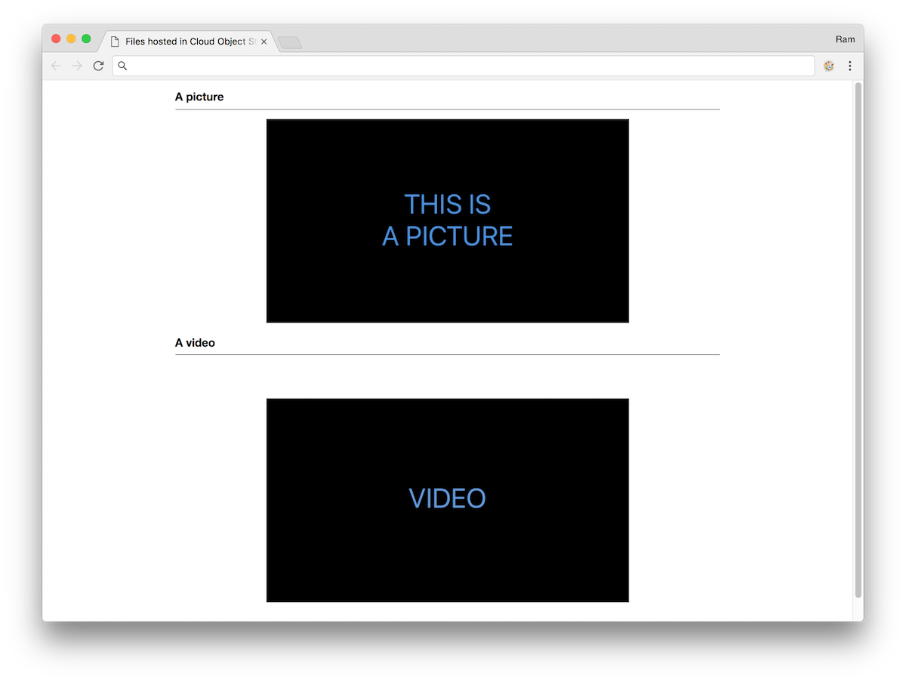

---
copyright:
  years: 2017, 2019
lastupdated: "2019-03-07"
---

{:shortdesc: .shortdesc}
{:new_window: target="_blank"}
{:codeblock: .codeblock}
{:screen: .screen}
{:tip: .tip}
{:pre: .pre}

# Accelerate delivery of static files using a CDN
{: #static-files-cdn}

This tutorial walks you through how to host and serve website assets (images, videos, documents) and user generated content in a {{site.data.keyword.cos_full_notm}}, and how to use a [{{site.data.keyword.cdn_full}} (CDN)](https://{DomainName}/catalog/infrastructure/cdn-powered-by-akamai) for fast and secure delivery to users around the world.

Web applications have different types of content: HTML content, images, videos, cascading style sheets, JavaScript files, user-generated content. Some contents change often, others not so much, some are accessed very often by lot of users, others occasionally. As the audience for the application grows, you may want to offload serving these contents to another component, freeing resources for your main application. You may also want to have these contents served from a location close to your application users, wherever they are in the world.

There are many reasons why you would use a Content Delivery Network in these situations:
* the CDN will cache the content, pulling the content from the origin (your servers) only if it is not available in its cache or if it has expired;
* with multiple data centers across the world, the CDN will serve the cached content from the closest location for your users;
* running on a different domain than your main application, the browser will be able to load more contents in parallel - most browsers have a limit in the number of connections per hostname.

## Objectives
{: #objectives}

* Upload files to a {{site.data.keyword.cos_full_notm}} bucket.
* Make content globally available with a Content Delivery Network (CDN).
* Expose files by using a Cloud Foundry web application.

## Services used
{: #services}

This tutorial uses the following products:
   * [{{site.data.keyword.cos_full_notm}}](https://{DomainName}/docs/services/cloud-object-storage?topic=cloud-object-storage-about-ibm-cloud-object-storage#about-ibm-cloud-object-storage)
   * [{{site.data.keyword.cdn_full}}](https://{DomainName}/catalog/infrastructure/cdn-powered-by-akamai)

This tutorial may incur costs. Use the [Pricing Calculator](https://{DomainName}/pricing/) to generate a cost estimate based on your projected usage.

## Architecture

<p style="text-align: center;">

</p>

1. The user accesses the application
2. The application includes content distributed through a Content Delivery Network
3. If the content is not available in the CDN or has expired, the CDN pulls the content from the origin.

## Before you begin
{: #prereqs}

Contact the master user of your Infrastructure account to get the following permissions:
   * Manage CDN Account
   * Manage Storage
   * API Key

These permissions are required to be able to view and use the Storage and CDN services.

## Get the web application code
{: #get_code}

Let's consider a simple web application with different types of content like images, videos and cascading style sheets. You will store the content in a storage bucket and configure the CDN to use the bucket as its origin.

To start, retrieve the application code:

   ```sh
   git clone https://github.com/IBM-Cloud/webapp-with-cos-and-cdn
   ```
  {: pre}

## Create an Object Storage
{: #create_cos}

{{site.data.keyword.cos_full_notm}} provides flexible, cost-effective, and scalable cloud storage for unstructured data.

1. Go to the [catalog](https://{DomainName}/catalog/) in the console, and select [**Object Storage**](https://{DomainName}/catalog/services/cloud-object-storage) from the Storage section.
2. Create a new instance of {{site.data.keyword.cos_full_notm}}
4. In the service dashboard, click **Create Bucket**.
5. Set a unique bucket name such as `username-mywebsite` and click **Create**. Avoid dots (.) in the bucket name.

## Upload files to a bucket
{: #upload}

In this section, you will use the command line tool **curl** to upload files to the bucket.

1. Log in to {{site.data.keyword.Bluemix_notm}} from the CLI and get a token from IBM Cloud IAM.
   ```sh
   ibmcloud login
   ibmcloud iam oauth-tokens
   ```
   {: pre}
2. Copy the token from the output of the command in the previous step.
   ```
   IAM token:  Bearer <token>
   ```
   {: screen}
3. Set the value of the token and bucket name to an environment variable for easy access.
   ```sh
   export IAM_TOKEN=<REPLACE_WITH_TOKEN>
   export BUCKET_NAME=<REPLACE_WITH_BUCKET_NAME>
   ```
   {: pre}
4. Upload the files named `a-css-file.css`, `a-picture.png`, and `a-video.mp4` from the content directory of the web application code you downloaded previously. Upload the files to the root of the bucket.
  ```sh
   cd content
  ```
  {: pre}
  ```sh
   curl -X "PUT" \
         "https://s3-api.us-geo.objectstorage.softlayer.net/$BUCKET_NAME/a-picture.png" \
        -H "x-amz-acl: public-read" \
        -H "Authorization: Bearer $IAM_TOKEN" \
        -H "Content-Type: image/png" \
        -T a-picture.png
  ```
  {: pre}
  ```sh
   curl -X "PUT" \
         "https://s3-api.us-geo.objectstorage.softlayer.net/$BUCKET_NAME/a-css-file.css" \
        -H "x-amz-acl: public-read" \
        -H "Authorization: Bearer $IAM_TOKEN" \
        -H "Content-Type: text/css" \
        -T a-css-file.css
  ```
  {: pre}
  ```sh
   curl -X "PUT" \
         "https://s3-api.us-geo.objectstorage.softlayer.net/$BUCKET_NAME/a-video.mp4" \
        -H "x-amz-acl: public-read" \
        -H "Authorization: Bearer $IAM_TOKEN" \
        -H "Content-Type: video/mp4" \
        -T a-video.mp4
  ```
  {: pre}
5. View your files from your dashboard.
   
6. Access the files through your browser by using a link similar to the following example:

   `http://s3-api.us-geo.objectstorage.softlayer.net/YOUR_BUCKET_NAME/a-picture.png`

## Make the files globally available with a CDN

In this section, you will create a CDN service. The CDN service distributes content where it is needed. The first time content is requested, it’s pulled from the host server (your bucket in {{site.data.keyword.cos_full_notm}}) to the network and stays there for other users to access it quickly without the network latency to reach the host server again.

### Create a CDN instance

1. Go to the catalog in the console, and select **Content Delivery Network** from the Network section. This CDN is powered by Akamai. Click **Create**.
2. On the next dialog, set the **Hostname** for the CDN to your custom domain. Although you set a custom domain, you can still access the CDN contents through the IBM provided CNAME. So if you don't plan to use custom domain, you can set an arbitrary name.
3. Set the **Custom CNAME** prefix to a unique value.
4. Next, under **Configure your origin**, select **Object Storage** to configure the CDN for COS.
5. Set the **Endpoint** to your bucket API endpoint, such as *s3-api.us-geo.objectstorage.softlayer.net*.
6. Leave **Host header** and **Path** empty. Set **Bucket name** to *your-bucket-name*.
7. Enable both HTTP (80) and HTTPS (443) ports.
8. For **SSL certificate** select *DV SAN Certificate* if you want to use a custom domain. Else, for accessing the storage via CNAME, pick the **Wildcard Certificate* option.
9. Click **Create**.

### Access your content through the CDN CNAME

1. Select the CDN instance in the list at [https://control.bluemix.net/network/cdn](https://control.bluemix.net/network/cdn).
2. If you earlier picked *DV SAN Certificate*, you will be prompted for domain validation once the inital setup is completed. Follow the steps shown when clicking on **View domain validation**.
3. The **Details** panel shows both the **Hostname** and the **CNAME** for your CDN.
4. Access your file with `https://your-cdn-cname.cdnedge.bluemix.net/a-picture.png` or, if you are using a custom domain, `https://your-cdn-hostname/a-picture.png`. If you omit the file name, you should see the S3 ListBucketResult instead.

## Deploy the Cloud Foundry application

The application contains a public/index.html web page that includes references to the files now hosted in the {{site.data.keyword.cos_full_notm}}. The backend `app.js` serves this web page and replaces a placeholder with the actual location of your CDN. This way, all assets that are used by the web page are served by the CDN.

1. From a terminal, go in the directory where you checked out the code.
   ```
   cd webapp-with-cos-and-cdn
   ```
   {: pre}
2. Push the application without starting it.
   ```
   ibmcloud cf push --no-start
   ```
   {: pre}
3. Configure the CDN_NAME environment variable so the app can reference the CDN contents.
   ```
   ibmcloud cf set-env webapp-with-cos-and-cdn CDN_CNAME your-cdn.cdnedge.bluemix.net
   ```
   {: pre}
4. Start the app.
   ```
   ibmcloud cf start webapp-with-cos-and-cdn
   ```
   {: pre}
5. Access the app with your web browser, the page stylesheet, a picture and a video are loaded from the CDN.



Using a CDN with {{site.data.keyword.cos_full_notm}} is a powerful combination which lets you host files and serve them to users from around the world. You can also use {{site.data.keyword.cos_full_notm}} to store any files your users upload to your application.

## Remove resources

* Delete the Cloud Foundry application
* Delete the Content Delivery Network service
* Delete the {{site.data.keyword.cos_full_notm}} service or bucket

## Related content

[{{site.data.keyword.cos_full_notm}}](https://{DomainName}/docs/services/cloud-object-storage?topic=cloud-object-storage-about-ibm-cloud-object-storage#about-ibm-cloud-object-storage)

[Manage Access to {{site.data.keyword.cos_full_notm}}](https://{DomainName}/docs/services/cloud-object-storage/iam?topic=cloud-object-storage-getting-started-with-iam#getting-started-with-iam)

[Getting Started with CDN](https://{DomainName}/docs/infrastructure/CDN?topic=CDN-getting-started#getting-started)
