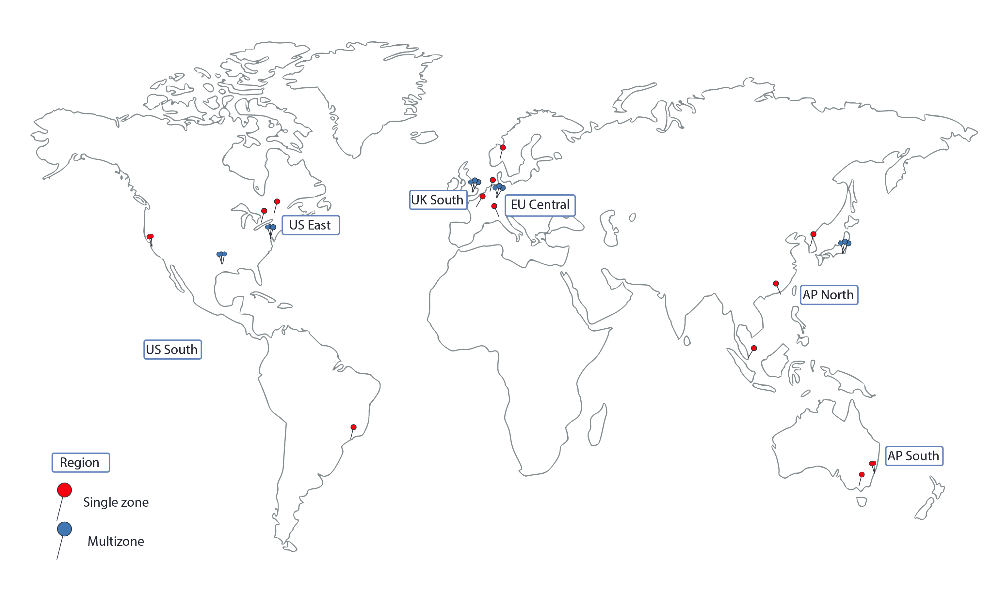
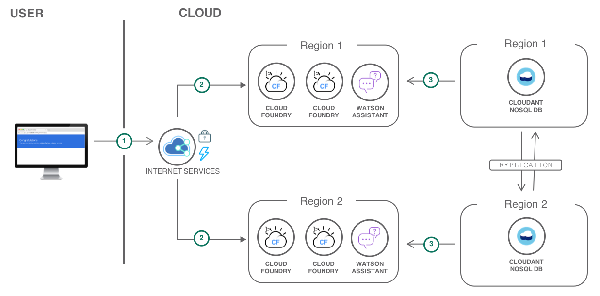

---
copyright:
  years: 2018
lastupdated: "2018-11-14"

---

{:java: #java .ph data-hd-programlang='java'}
{:swift: #swift .ph data-hd-programlang='swift'}
{:ios: #ios data-hd-operatingsystem="ios"}
{:android: #android data-hd-operatingsystem="android"}
{:shortdesc: .shortdesc}
{:new_window: target="_blank"}
{:codeblock: .codeblock}
{:screen: .screen}
{:tip: .tip}
{:pre: .pre}

# Strategies for resilient applications

Users are less likely to experience downtime when an application is designed with resiliency in mind. When implementing a solution using Kubernetes services, Cloud Foundry, Cloud Functions or virtual servers, regardless of the compute options, you want to minimize downtimes and have your as resilient as possible for maximum availability. To achieve maximum resiliency, you may consider deploying your solutions across multiple zones and regions with data replications.

This tutorial highlights what IBM Cloud provides for resilient solutions, answering questions like: 

- Does IBM Cloud compute options support multiple regions deployment? and how can I import my app into all the regions?
- What should I consider when preparing my app to be globally available across multiple regions? 
- How data is handled in a multiple regions deployment, when using a database as service like Cloudant, how data replication can be handled between regions? 
- How about other services like Watson services, how can they handled in a multi-region setup?

This tutorial will give you the guidelines needed for when thinking about multi-region deployment on IBM Cloud, it will give your the guidelines for what is possible and what is not possible. You will get answers to questions above and more, you will understand how runtimes, databases, file storage, Watson services work in a multiple regions setup. 

## Objectives
{: #objectives}

* The guidelines for deploying Kubernetes services, Cloud Foundry, Cloud Functions and Virtual Servers apps across multi-regions, learn the best practices and guidelines. 
* Databases, the guidelines for handling databases across multiple regions. How database as a service can work in a multi-region deployment. 
* Database replication between different regions, what IBM Cloud provides and the options available to you.
* Other services like Watson service and AppID, the guidelines for a multi-region setup.

## Services used
{: #services}

This tutorial uses the following runtimes and services:
* [{{site.data.keyword.containershort_notm}}](https://console.bluemix.net/containers-kubernetes/catalog/cluster)
* [{{site.data.keyword.cfee_full_notm}}](https://console.bluemix.net/cfadmin/create)
* [{{site.data.keyword.openwhisk_short}}](https://console.bluemix.net/openwhisk)
* [{{site.data.keyword.BluVirtServers}}](https://console.bluemix.net/catalog/infrastructure/virtual-server-group)
* [{{site.data.keyword.cloudant_short_notm}}](https://console.bluemix.net/catalog/services/cloudant-nosql-db)
* [{{site.data.keyword.dashdbshort_notm}}](https://console.bluemix.net/catalog/services/db2-warehouse)
* [{{site.data.keyword.appid_short_notm}}](https://console.bluemix.net/catalog/services/app-id)
* [Internet Services](https://console.bluemix.net/catalog/services/internet-services)

This tutorial may incur costs. Use the [Pricing Calculator](https://console.bluemix.net/pricing/) to generate a cost estimate based on your projected usage.

## Architecture
{: #architecture}

This tutorial involves an active/active and active/passive scenarios where two copies of the application are deployed in two different regions and the two copies are serving customer requests in a round-robin way. `active/active` is the ideal scenario for highly available applications, but this may not always work for all use cases, and depending on the compute option selected where sometimes `active/active` is simply not so easily possible. 

With IBM Cloud compute options, the following scenario is possible:  

-  `active/active` &  `active/passive` scenarios is possible using Kubernetes, Cloud Functions and Cloud Foundry compute options.
- Only `active/passive` scenario is truly possible if using infrastructure services, using Virtual Servers on IBM Cloud.

1. User connect to the application, Cloud Internet Services is configured to intercept requests to the application and to distribute the load across the regions. 
2. The application is deployed to two regions and traffic distributed across the two regions. 
3. The application uses a database and a storage services, replication is set between the two regions.

Note: the architecture digram above may be different depending on the compute option used and you may require different service like for example File Storage is used for Virtual Servers but Cloud Object Storage may be used if using Cloud Functions. You will see specific architecture digram under each compute option in later stages of this solution tutorials.

## Before you begin
{: #prereqs}

* You have deployed applications to a single region on IBM Cloud where been using Kubernetes, Cloud Functions, Cloud Foundry or Virtual Servers.
* Understanding of database as a service like `Cloudant NoSQL DB` or any other database as service in this matter work, you have used a database and want to learn how to handle replication between regions.
* You have used other IBM Cloud services like Watson.
* You understand the different between `active/active` &  `active/passive` scenarios.

## Multi-zone regions applications

Building multi-zone regions applications, means having your application deployed across zones within a region and then replicate the same in a different region. This provide many advantages and many reasons to why you may consider such setup, however building successfully running multi-region, active-active architecture is hard, so this solution tutorial you will understand the guiltiness and where to do go to dive deeper to the different part of this art.

### Why bother with multi-region architectures?

There are many reasons to why you would want to have a multi-region architecture, here are the top three. 

1. Improve latency for end-users
2. Disaster recovery
3. Business requirements

There are many blogs and posts articles written on this topic covering the why for Multi-region architecture. Next let's look at the architectures type within a region, `Active/Active` and `Active/Passive`.

### Active/active and active/passive

- Active/Active having both regions active, with the approach you need to make sure data replication is set to have data synced in real time. This approach is more favourable but not always easily possible depending on the setup and compute option used. With Active/Active you need to make sure you have images and files in sync, database data in sync and that is not easily achieved. 
- Active/Passive having one region active and the second region passive ready for use as a backup in an event of downtime. With this approach you may not need to have live image files and database files in sync in real time. You would manually sync and replicate the data when one region is down and the passive region become active. 

### Multi-regions apps and Multi-zones within regions apps 

A region is a specific geographical location where you can deploy apps, services, and other IBM® Cloud resources. [IBM Cloud regions](https://console.bluemix.net/docs/containers/cs_regions.html#bluemix_regions) consist of one or more zones, which are physical data centers that host the compute, network, and storage resources and related cooling and power that host services and applications. Zones are isolated from each other, which ensures no shared single point of failure.

- Multi-regions apps means having the app deployed across multiple regions, one copy of the app within each region.
- Multi-zones within regions means having the application running within multiple zones in a regions, with this then you would require local load balancer within each region, and then replicating the same in other regions and then attach Cloud Internet Services to distribute traffic between regions which then get distributed within zones in a region. This setup provides maximum availability and resiliency for your application. 

Learn more on regions and zones [here](https://console.bluemix.net/docs/containers/cs_regions.html#regions-and-zones).

## Cloud Foundry apps deployed across multiple regions globally

With Cloud Foundry, you can achieve true Active/Active and active/passive multi-region architecture with data replications set between regions. The architecture for Cloud Foundry multi-region looks like this. 

To deploy a Cloud Foundry multi-region app, follow the a step by step [solution tutorial](multi-region-webapp.html) here. 

The above architecture deploys a Cloud Foundry application in two regions. The next steps would be to add databases, Watson services and other services in the IBM Cloud catalog, when deploying a multi-region architecture, you need to think about databases, data replications and services, how they are all work for a given compute option selected. 

- Handle non-database services like Watson and other services. See the [Handling non-database services like Watson services in multi-region architecture](#nondatabaseservices) section. 
- Handle databases-as-service like Cloudant, DB2, Cloud Object Storage and other databases-as-service in the IBM Cloud catalog. See the [Handing databases and application files in multi-region architecture](#databaseservices) section. 

##Kubernetes apps deployed across multiple regions globally

With Kubernetes, you can achieve multi-zones within regions architecture having Active/Active regions. When implementing a solution with Kubernetes Service, you benefit from built-in capabilities, like load balancing and isolation, increase resiliency against potential failures with hosts, networks, or apps. By creating multiple clusters and if an outage occurs with one cluster, users can still access an app that is also deployed in another cluster. With multiple clusters in different regions, users can also access the closest cluster and reduce network latency. For additional resiliency, you have the option to also select the multi-zone clusters, meaning your nodes are deployed across multiple zones within a region. 

The Kubernetes multi-region architecture looks like this.

1. The developer builds Docker images for the application.
2. The images are pushed to IBM Cloud Container Registry in the US and UK regions.
3. The application is deployed to Kubernetes clusters in both regions.
4. End-users access the application.
5. Cloud Internet Services is configured to intercept requests to the application and to distribute the load across the clusters. In addition, DDoS Protection and Web Application Firewall are enabled to protect the application from common threats. Optionally assets like images, CSS files are cached.

To deploy a Kubernetes multi-region app, follow the a step by step [solution tutorial](multi-region-k8s-cis.html) here. 

The above architecture deploys a Kubernetes clusters in both regions but without a database, the next steps may be to add a database and some sort of Watson services. 

- Handle non-database services like Watson and other services. See the [Handling non-database services like Watson services in multi-region architecture](#nondatabaseservices) section. 
- Handle databases-as-service like Cloudant, DB2, Cloud Object Storage and other databases-as-service in the IBM Cloud catalog. See the [Handing databases and application files in multi-region architecture](#databaseservices) section. 

##Cloud Functions apps deployed across multiple regions globally

With Cloud Functions, you can achieve multi-region architecture with Active/Active regions. The architecture for Cloud Functions multi-region looks like this. 

1. Users access the application. The request goes through Internet Services.
2. Internet Services redirect the users to the closest healthy API back-end.
3. Certificate Manager provides the API with its SSL certificate. The traffic is encrypted end-to-end.
4. The API is implemented with Cloud Functions.

To deploy Cloud Functions multi-region app, follow the a step by step [solution tutorial](multi-region-serverless.html) here. 

The above architecture deploys a Kubernetes clusters in both regions but without a database, the next steps may be to add a database and some sort of Watson services. 

This tutorial shows how to configure IBM Cloud Internet Services and Cloud Functions to deploy serverless apps across multiple locations.

The above architecture considers a public web application with a back-end implemented with Cloud Functions. To reduce network latency and prevent outage, the application is deployed in multiple locations. Two locations are configured in the [Deploy serverless apps across multiple locations](multi-region-serverless.html) tutorial. The next steps would be to add a database and a non-database service like Watson services. 

- Handle non-database services like Watson and other services. See the [Handling non-database services like Watson services in multi-region architecture](#nondatabaseservices) section. 
- Handle databases-as-service like Cloudant, DB2, Cloud Object Storage and other databases-as-service in the IBM Cloud catalog. See the [Handing databases and application files in multi-region architecture](#databaseservices) section. 

## Global Infrastructure availability zones

Virtual Servers and IBM Cloud Infrastructure you can have multi-region architecture but only Active/Passive where one region is Active and second is passive used in an event of downtime of the main region. 

When preparing for multi-region architecture using virtual servers, you also need to think about file storage where to store files and backup data, databases where to use database as service or a server the database with manual configuration and data replication. More on that later. 

Multi-region architecture using virtual servers looks like this. 

1. Users access the application through IBM Cloud Internet Services (CIS).
2. CIS routes traffic to a healthy region.
3. Within a region a load balancer redirects traffic to a server.
4. The application accesses the database.
5. The application stores and retrieves media assets from a file storage.

To deploy multi-region WordPress app using virtual servers, follow the a step by step [solution tutorial](highly-available-and-scalable-web-application.html) here. 

The above architecture deploys a WordPress application to a single region and then replicate the same across a second region. It's important to understand that this is an Active/Passive setup, where true Active/Active is more complex to achieve. 

**Important areas to review:** 

- Database: the database in above architecture is set as a database server, meaning you setup a virtual server and then install your database. With this you need to manage the database, and also manage the replication between the region, and backup the database. The other option for this would be use a database-as-server, something like Cloudant for example where it comes with backups, multi-region support and data replication between regions. More on that covered in later section, see the [Handing databases and application files in multi-region architecture](#databaseservices) section.
- File Storage: is used store the application images and files, in addition with the application source code to avoid duplicated source code between multiple servers within a single region. Using File Store, you can achieve Active/Passive but not Active/Active. Achieving Active/Active meaning have images and files replication set in real time in between regions and this not yet possible using File Storage. The alternative option would be to use Cloud Object Storage. ToDo: Add more one that later... 
- Handle non-database services like Watson and other services. See the [Handling non-database services like Watson services in multi-region architecture](#nondatabaseservices) section. 

## Cloud Foundry Enterprise Environment apps deployed across multiple regions globally

- Missing solution! solution needed for this.

##Handing databases and application files in multi-region architecture

{:databaseservices}

- ToDo

##Handling non-database services like Watson services in multi-region architecture

{:nondatabaseservices}

- ToDo

## Related content

{:related}

- IBM Cloud [Internet Services](https://console.bluemix.net/docs/infrastructure/cis/getting-started.html#getting-started-with-ibm-cloud-internet-services-cis-)
- [Manage your IBM CIS for optimal security](https://console.bluemix.net/docs/infrastructure/cis/managing-for-security.html#best-practice-2-configure-your-security-level-selectively)
- [{{site.data.keyword.containershort_notm}}](https://console.bluemix.net/docs/containers/cs_planning.html#cs_planning)
- [{{site.data.keyword.registrylong_notm}} Basic](https://console.bluemix.net/docs/services/Registry/registry_overview.html#registry_planning)
- [Deploying single instance apps to Kubernetes clusters](https://console.bluemix.net/docs/containers/cs_tutorials_apps.html#cs_apps_tutorial_lesson1)
- [Best practice to secure traffic and internet application via CIS](https://console.bluemix.net/docs/infrastructure/cis/managing-for-security.html#manage-your-ibm-cis-for-optimal-security)
- [Improving App Availability with Multizone Clusters](https://www.ibm.com/blogs/bluemix/2018/06/improving-app-availability-multizone-clusters/)