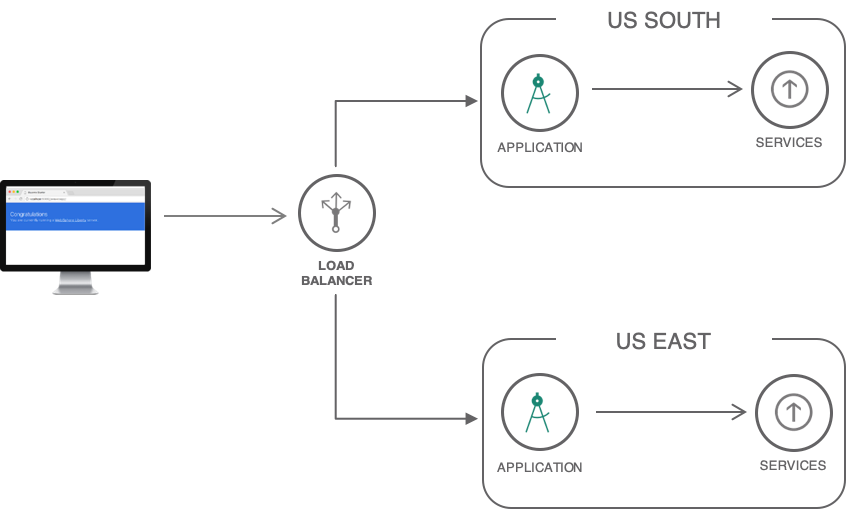

---
copyright:
  years: 2018
lastupdated: "2018-11-20"

---

{:java: #java .ph data-hd-programlang='java'}
{:swift: #swift .ph data-hd-programlang='swift'}
{:ios: #ios data-hd-operatingsystem="ios"}
{:android: #android data-hd-operatingsystem="android"}
{:shortdesc: .shortdesc}
{:new_window: target="_blank"}
{:codeblock: .codeblock}
{:screen: .screen}
{:tip: .tip}
{:pre: .pre}

# Strategies for resilient applications

Users are less likely to experience downtime when an application is designed with resiliency in mind. When implementing a solution using Kubernetes services, Cloud Foundry, Cloud Functions or virtual servers, regardless of the compute options, you want to minimize downtimes and have your as resilient as possible for maximum availability. To achieve maximum resiliency, you may consider deploying your solutions across multiple zones and regions with data replications.

This tutorial highlights what IBM Cloud provides for resilient solutions, answering questions like: 

- Does IBM Cloud compute options support multiple regions deployment? and how can I import my app into all the regions?
- What should I consider when preparing my app to be globally available across multiple regions? 
- How data is handled in a multiple regions deployment, when using a database as service like Cloudant, how data replication can be handled between regions? 
- How about other services like Watson services, how can they handled in a multi-region setup?

This tutorial will give you the guidelines needed for when thinking about multi-region deployment on IBM Cloud, it will give your the guidelines for what is possible and what is not possible. You will get answers to questions above and more, you will understand how runtimes, databases, file storage, Watson services work in a multiple regions setup. 

## Objectives
{: #objectives}

* Understand the architecture and concepts involved in building resilient applications.
   * resiliency (multi-zone region)
   * high-availability
   * active/passive
   * active/active
   * backup/recovery (RPO/RTO)
* Understand how these concepts map to IBM Cloud compute and service offerings

* The guidelines for deploying Kubernetes services, Cloud Foundry, Cloud Functions and Virtual Servers apps across multi-regions, learn the best practices and guidelines. 
* Databases, the guidelines for handling databases across multiple regions. How database as a service can work in a multi-region deployment. 
* Database replication between different regions, what IBM Cloud provides and the options available to you.
* Other services like Watson service and AppID, the guidelines for a multi-region setup.

ToDo: come back to this...

## Services used
{: #services}

This tutorial uses the following runtimes and services:
* [{{site.data.keyword.containershort_notm}}](https://console.bluemix.net/containers-kubernetes/catalog/cluster)
* [{{site.data.keyword.cfee_full_notm}}](https://console.bluemix.net/cfadmin/create)
* [{{site.data.keyword.openwhisk_short}}](https://console.bluemix.net/openwhisk)
* [{{site.data.keyword.BluVirtServers}}](https://console.bluemix.net/catalog/infrastructure/virtual-server-group)
* [{{site.data.keyword.cloudant_short_notm}}](https://console.bluemix.net/catalog/services/cloudant-nosql-db)
* [{{site.data.keyword.dashdbshort_notm}}](https://console.bluemix.net/catalog/services/db2-warehouse)
* [Internet Services](https://console.bluemix.net/catalog/services/internet-services)

This tutorial may incur costs. Use the [Pricing Calculator](https://console.bluemix.net/pricing/) to generate a cost estimate based on your projected usage.

## Architecture and Concepts
{: #architecture}

This tutorial involves an active/active and active/passive scenarios where two copies of the application are deployed in two different regions and the two copies are serving customer requests in a round-robin way. `active/active` is the ideal scenario for highly available applications, but this may not always work for all use cases.

With IBM Cloud compute options, the following scenario is possible:  

-  Multi-region architecture with regions been `active/active` or  `active/passive`.
-  Multi-zone within a region architecture with regions been `active/active` or  `active/passive`.

Below is a multi-region architecture.

The architecture digram above may be different depending on the compute option used and you may require different service like for example File Storage is used for Virtual Servers but Cloud Object Storage may be used if using Cloud Functions. You will see specific architecture digram under each compute option in later stages of this solution tutorials. 

### Active/active and active/passive

- Active/Active having both regions active, with the approach you need to make sure data replication is set to have data synced in real time. This approach is more favourable but not always easily possible depending on the setup and compute option used. With Active/Active you need to make sure you have images and files in sync, database data in sync and that is not easily achieved. 
- Active/Passive having one region active and the second region passive ready for use as a backup in an event of downtime. With this approach you may not need to have live image files and database files in sync in real time. You would manually sync and replicate the data when one region is down and the passive region become active. When building Active/Passive architecture, backups and data replication something you must think about, if the working region goes down then what actions to take in the passive region, how data is backed and replication been set. More on backups that in the next section.

### Backup, Recovery, RPO, RTO

- Recovery Time Objective
- Recovery Point Objective
- ToDo: update both of above parts.

### Multi-regions architectures

Multi-regions apps means having the app deployed across multiple regions, one copy of the app within each region, with this then you would require to have a Global load balancer something like `Cloud Internet Services` to distribute traffic between regions. 

A region is a specific geographical location where you can deploy apps, services, and other IBM® Cloud resources. [IBM Cloud regions](https://console.bluemix.net/docs/containers/cs_regions.html#bluemix_regions) consist of one or more zones, which are physical data centers that host the compute, network, and storage resources and related cooling and power that host services and applications. Zones are isolated from each other, which ensures no shared single point of failure.

### Multi-zones within regions architectures

Building multi-zone regions applications, means having your application deployed across zones within a region and then replicate the same in a different region. This provide many advantages and many reasons to why you may consider such setup, however building successfully running multi-region, active-active architecture is hard, so following this tutorial will give you an understanding and the guidelines needed with links to other sources to dive deeper. 

With Multi-zone region architecture with you would require to have a Local load balancer to distribute traffic locally within the region to different zones, and then on a global level to have Global load balancer something like `Cloud Internet Services` to distribute traffic between the regions. 

**Why bother with multi-region architectures?** 

well there are many reasons to why you would want to have a multi-region architecture, here are the top three:

1. Improve latency for end-users
2. Disaster recovery
3. Business requirements

You can learn more on regions and zones [here](https://console.bluemix.net/docs/containers/cs_regions.html#regions-and-zones).

## Cloud Foundry apps

Cloud Foundry offers the capability to achieve a deployment of multi-region architecture, in addition using a [Continuous Delivery](https://console.bluemix.net/catalog/services/continuous-delivery) pipeline services allows you to deploy your application across multiple regions with pipeline testing and deployment. The architecture for Cloud Foundry multi-region looks like this. 

To deploy a Cloud Foundry multi-region app, follow the a step by step [solution tutorial](multi-region-webapp.html) here. The above architecture deploys a Cloud Foundry application in two regions. 

Note the architecture above does not have databases or other services, the next logical step would be to add databases and some other Watson services. When deploying a multi-region architecture, you need to think about databases, and non-database-services within your multi-region Cloud Foundry architecture. In later sections of this tutorial, [databases](databases, and non-database-services), and [non-database-services](#databaseservices) are covered in detail.

## Kubernetes apps

With Kubernetes, you can achieve multi-zones within regions architecture having Active/Active regions. When implementing a solution with Kubernetes Service, you benefit from built-in capabilities, like load balancing and isolation, increase resiliency against potential failures with hosts, networks, or apps. By creating multiple clusters and if an outage occurs with one cluster, users can still access an app that is also deployed in another cluster. With multiple clusters in different regions, users can also access the closest cluster and reduce network latency. For additional resiliency, you have the option to also select the multi-zone clusters, meaning your nodes are deployed across multiple zones within a region. 

The Kubernetes multi-region architecture looks like this.

1. The developer builds Docker images for the application.
2. The images are pushed to IBM Cloud Container Registry in the US and UK regions.
3. The application is deployed to Kubernetes clusters in both regions.
4. End-users access the application.
5. Cloud Internet Services is configured to intercept requests to the application and to distribute the load across the clusters. In addition, DDoS Protection and Web Application Firewall are enabled to protect the application from common threats. Optionally assets like images, CSS files are cached.

To deploy a Kubernetes multi-region app, follow the a step by step [solution tutorial](multi-region-k8s-cis.html) here. 

The above architecture deploys a Kubernetes clusters in both regions but without a database, the next steps may be to add a database and some sort of Watson services. 

Note the architecture above does not have databases or other services, the next logical step would be to add databases and some other Watson services, in later sections of this tutorial, [databases](databases, and non-database-services), and [non-database-services](#databaseservices) are covered in detail.

## Cloud Functions apps

With Cloud Functions, you can achieve multi-region architecture. The architecture for Cloud Functions multi-region looks like this.

 

1. Users access the application. The request goes through Internet Services.
2. Internet Services redirect the users to the closest healthy API back-end.
3. Certificate Manager provides the API with its SSL certificate. The traffic is encrypted end-to-end.
4. The API is implemented with Cloud Functions.

To deploy Cloud Functions multi-region app, follow the a step by step [solution tutorial](multi-region-serverless.html) here. 

## Bare Metal and Virtual Servers

IBM Cloud Virtual Servers and Bare Metal offers the capability to achieve a multi-region architecture. When preparing for such architecture using Virtual Servers and Bare Metal you need to think about things like, file storage where to store files, backups, recovery and databases, selecting between a database as service or installing a database on a virtual server. 

Below architecture demonstrates a deployment of a multi-region architecture using virtual servers with using the active/passive approach where one region is active and the second region is passive. 

The components for such architecture are: 

- Global load balancer directing traffic to the active region always. 
- Cloud/Local load balancer distributing traffic between virtual servers in different zones within a region. 
- Databases deployed on a virtual server, meaning you would configure the database and setup replications and backups between regions. The alternative would be use a database-as-service, a topic discussed later in the tutorial.
- File storage to store the application images and files, File storage offers the capability to take a snapshot at a given time and date, this snapshot then can be reused within another region, something in which you would do manually. 

To deploy above multi-region app using virtual servers, follow the a step by step [solution tutorial](highly-available-and-scalable-web-application.html) here. 

When preparing for multi-region architectures using Virtual Servers and Bare Metal, you need to factor in other things like: 

- File storage, where do you store files and images, how these files are synced and backed up between servers. To resolve that you can look at the IBM File Storage service to store the application files and images, then this can be used between zones within a region. Using File Storage you can also take snapshot backups to be used by the passive region. You would require to do manually reimport the snapshot backup into the passive region. 
- Databases, you have the option to install the database directly on the server or use the Database-as-service approach. With using the database-as-a-service approach, you don't need to worry about backups and replications. A database like Cloudant fully supports a multi-region architecture. More on that in the later sections.

## Cloud Foundry Enterprise Environment

Earlier you reviewed Cloud Foundry Public and learned how to deploy a mulit-region app to a public Cloud Foundry org. The next step would be to look at the Enterprise edition of Cloud Foundry. 

**Cloud Foundry Enterprise Environment (CFEE)** is where you can instantiate multiple, isolated, enterprise-grade Cloud Foundry platforms on demand. Instances of the CFEE service run within your own account in [IBM Cloud](http://ibm.com/cloud). The environment is deployed on isolated hardware ([Kubernetes clusters](https://www.ibm.com/cloud/container-service?cm_mmc=OSocial_Blog-_-Cloud_Cloud%20Platform-_-WW_WW-_-CFEE&cm_mmca1=000023UA&cm_mmca2=10007999&)). You have full control over the environment, including access control, capacity management, change management, monitoring, and services. With this in place, learn how to plan for a multi-region architecture when using Cloud Foundry Enterprise Environment. 

CFEE uses all the same like the public Cloud Foundry with number of additional features and ways in which setting up the architecture.

A multi-region architecture using Cloud Foundry Enterprise Environment.  

CFEE works in the same manner like the Public Cloud Foundry, with one thing been different and that's to setup the CFEE account and binding service to the CFEE account. After that everything else works in the same matter. 

You would require to do the following: 

- Setup a two CFEE accounts, one on each region. 
- Create and bind the services to the CFEE account. 
- Push the apps targeting the CFEE api endpoint. 
- Setup database replication, the same like you would do for public Cloud Foundry. 

For a more real world application deployment, checkout the step by step guide [Deploy Logistics Wizard to Cloud Foundry Enterprise Environment (CFEE)](https://github.com/IBM-Cloud/logistics-wizard/blob/master/Deploy_Microservices_CFEE.md) where it will take you deploying a microservice based application to CFEE. Once deployed to one CFEE account, then you would require to redeploy to a second region and attach the internet services front of the two CFEE account to load balance the traffic. 

You can learn more on IBM Cloud Foundry Enterprise Environment [here](https://console.bluemix.net/docs/cloud-foundry/index.html#about).

## Databases and application files 

{:databaseservices}

IBM Cloud offers a selection of [databases](https://console.bluemix.net/catalog/?category=databases) to which can be called database-as-a-services. You can find both relation and non-relation databases depending on your business needs. 

Database-as-service comes with many advantages that are too good to avoid. Using a database-as-service like Cloudant you can take advantages of his multi-region support allowing you to do live replication between two database services in different regions, backups, scaling and maximum up time. 

Some of the key features: 

- A database service built and accessed through a cloud platform
- Enables enterprise users to host databases without buying dedicated hardware
- Can be managed by the user or offered as a service and managed by a provider
- Can support SQL (including MySQL) or NoSQL databases
- Accessed through a web interface or vendor-provided API

Why cloud database-as-service:

- Ease of access

- Scalability

- Disaster recovery

- More on databases can be found [here](https://www.ibm.com/cloud/learn/what-is-cloud-database). 

When prepping for multi-region architecture, there are number of items you need to factor for. 

- Does the database support Multi-Region architecture?
- How's does replication handle between multiple database services across regions? 
- How data is backed up
- What are the disaster recovery approaches for each.

Below you will dive deeper into three of the databases IBM Cloud. 

### Cloudant

IBM Cloudant is a distributed database that is optimized for handling heavy workloads that are typical of large, fast-growing web and mobile apps. Available as an SLA-backed, fully managed IBM Cloud service, Cloudant elastically scales throughput and storage independently.

Cloudant is also available as a downloadable on-premises installation, and its API and powerful replication protocol are compatible with an open source ecosystem that includes CouchDB, PouchDB and libraries for the most popular web and mobile development stacks.

Some of Cloudant features: 

- **Fully managed**: IBM Cloud service provides a fully managed, distributed JSON document database. 
- **Secure**: Cloudant is ISO 27001, SOC 2 Type 2 compliant and HIPAA ready. All data is encrypted over the wire and at rest with optional user-defined key management through IBM Key Protect. 
- **Global availability**: Cloudant is available in all IBM Cloud regions and 55+ data centers around the world, Cloudant can easily be set up for disaster recovery between continents or scaling an app for a global release through a horizontal scaling architecture that can handle millions of users and terabytes of data to grow seamlessly alongside your business. All Cloudant instances are deployed on clusters that span availability zones in regions that support them, for added durability at no extra cost.
- **Data flexibility**: leverage a flexible JSON schema and powerful API that is compatible with Apache CouchDB™, enabling you to access an abundance of language libraries and tools to rapidly build new applications and features.
- **Durable replication:** Move application data closer to all the places it needs to be — for uninterrupted data access, offline or on. Cloudant helps teams build Progressive Web Apps, develop with an offline-first architecture, or manipulate data on edge devices.
- **Powerful serverless API**: Enhance your applications with built-in key value, MapReduce, full-text search and geospatial querying that goes beyond simple bounding boxes.

More on Cloudant can be found [here](https://www.ibm.com/cloud/cloudant). Now that you understand some features and benefits of using Cloudant, next look at how can it work within a multi-region architecture.

#### Does Cloudant support multi-region?

Yes, you can configure replication in IBM Cloudant using an 'active-active' or 'active-passive' topology across data center.s The following diagram shows a typical configuration that uses two IBM Cloudant accounts, one in each region: 

It is helpful to remember:

- Within each datacenter, IBM Cloudant already offers high availability by storing data in triplicate across three servers.
- Replication occurs at the database rather than account level and must be explicitly configured.
- IBM Cloudant does not provide any Service Level Agreements (SLAs) or certainties about replication latency.
- IBM Cloudant does not monitor individual replications. Your own strategy for detecting failed replications and restarting them is advisable.

For step by step instructions on setting up Cloudant for a multi-region arctecture, follow the instructions [here](https://console.bluemix.net/docs/services/Cloudant/guides/active-active.html#configuring-ibm-cloudant-for-cross-region-disaster-recovery).

#### How does replication work?

IBM Cloudant for IBM Cloud replication is the process that synchronizes ('syncs') the state of two databases.

Any change that occurred in the source database is reproduced in the target database. You can create replications between any number of databases, either continuously or as a 'one off' task.

Depending on your application requirements, you use replication to share and aggregate state and content.

Replication takes place in one direction only. To keep two databases synchronized with each other, you must replicate in both directions. Do this by replicating from `database1` to `database2`, and separately from `database2` to `database1`.

The aim of replication is that at the end of the process, all active documents in the source database are also in the destination or 'target' database, *and* that all documents that are deleted from the source databases are also deleted from the destination database (if they existed there).

Replication has two forms: push or pull replication:

- *Push replication* is where the source is a local database, and the destination is a remote database.
- *Pull replication* is where the source is a remote database instance, and the destination is the local database.

For more detailed instructions on Cloudant replication, checkout the replication docs [here](https://console.bluemix.net/docs/services/Cloudant/api/replication.html#replication).

#### Backups and recovery, how do they work?

Your data is important and valuable. You want to protect your data, to help ensure it is secure, available, and maintains integrity. IBM® Cloudant for IBM Cloud provides several ways to protect your data and help keep your applications operational. Some of these protection features are automatic. For other forms of protection, IBM Cloudant provides you with supported tools that help you to create your own high availability and disaster recovery capabilities.

**Types and levels of protection**

- In-Region Automatic Data Redundancy
- Cross-Region Redundancy for Disaster Recovery
- Database Backup and Recovery

To dive deeper into the three levels of protections, checkout the Cloudant backup and recovery docs [here](https://console.bluemix.net/docs/services/Cloudant/guides/disaster-recovery-and-backup.html#disaster-recovery-and-backup).

### Db2, Db2 hosted and Db2 Warehouse

IBM Cloud offers a selection range of Db2 debases, these can be found [here](https://console.bluemix.net/catalog/?search=db2h).

- **Db2**: A fully-managed cloud SQL database. Powered by a turbo-charged Db2 engine.
- **Db2 hosted**: IBM Db2 Hosted lets you run Db2 with full administrative access on cloud infrastructure. It eliminates the cost, complexity and risk of managing your own infrastructure.
- **Db2 Warehouse**: IBM Db2 Warehouse on Cloud is a fully-managed, enterprise-class, cloud data warehouse service. Powered by IBM BLU Acceleration, Db2 Warehouse on Cloud provides you with unmatched query performance. The service is offered in multiple form factors: SMP for cost-effective cloud data warehousing, and MPP for high-performance parallel query processing and high availability. Db2 Warehouse on Cloud also comes packed with a suite of Netezza-like in-database analytics tools and functions so you can run your analytics jobs wherever your data resides. Get the most out of your cloud data warehouse by combining it with IBM or third-party data visualization and ETL tools.

#### Does Db2 support multi-region?

Yes, you can plan and prepare for it. Db2 on Cloud uses the Db2 High Availability Disaster Recovery (HADR) technology in `ASYNC` mode to achieve the offsite DR node capability and provides `Read on Standby` on the DR node.

Db2 on Cloud high availability plans have excellent availability characteristics with a 99.99% SLA. The standard high availability plans without a disaster recovery (DR) node provide seamless failover and rolling updates. They are managed for you by using automatic client reroute (ACR) and portable IPs.

In addition, you can add a Geo-Replicated Disaster Recovery Node. This offsite DR node option gives you the ability to rapidly synchronize your data in real time to a database node in an offsite IBM Cloud data center of your choice.

For more, checkout the Db2 docs [here](https://console.bluemix.net/docs/services/Db2onCloud/ha.html#ha).

#### How does replication work?

How to add a Geo-Replicated Disaster Recovery Node:

- You can add an on-demand DR node to existing Db2 on Cloud instances. After clicking your instance in the IBM Cloud dashboard, you will see an option called **Manage Disaster Recovery**. You can add a Geo-Replicated Disaster Recovery Node from there.
- If you purchased Db2 on Cloud on contract through a sales representative and do not have an IBM Cloud subscription, contact your IBM representative to add a DR node.

#### Backup, restore and import data

Backup data:

- For paid plans, encrypted backups of the database are done daily. A daily backup is kept for each of the last 14 days. Retained backups are used by IBM for system recovery purposes in the event of a disaster or system loss. More on that can be found [here](https://console.bluemix.net/docs/services/Db2onCloud/br.html#br).

Restore data, managing high availability and disaster recovery nodes: 

- For standard HA nodes, which are not offsite, the failover is managed for you by IBM. IBM monitors the health of your server, failover, and failing back as needed, including rolling updates and scaling to keep uptime as high as possible.

- For Geo-Replicated Disaster Recovery (HADR), you must manually fail over by using **Manage Disaster Recovery** in the console.

Import data:

- You can use [IBM Lift CLI](https://lift.ng.bluemix.net/) to import data into Db2 on Cloud.

### Cloud Object Storage

A COS service instance is global, buckets within a COS instance are where it starts to talk about regions. Information stored with IBM® Cloud Object Storage is encrypted and dispersed across multiple geographic locations, and accessed over HTTP using a REST API. This service makes use of the distributed storage technologies provided by the IBM Cloud Object Storage System (formerly Cleversafe).

#### Does Cloud Object Storage support multi-region

There are three types of bucket/resiliency that COS offer, Cross Region, Regional, and Single Data Center.

- **Cross Region** resiliency will spread your data across several metropolitan areas.
- **Regional** resiliency will spread data across a single metropolitan area - this is the multi-zone within a region.
- **Single Data Center** resiliency spreads data across multiple appliances within a single data center.

Regional and Cross Region buckets can maintain availability during a site outage. 

Supported regions:

- Cross Region: US, EU, AP
- Regional: us-south, us-east, eu-gb, eu-de, jp-tok
- Single site: ams03, che01, mel01, osl01, tor01, sao01, seo01

**Cross Region** has a special "geo" endpoint `s3-api.us-geo.objectstorage.softlayer.net, s3-api.us-geo.objectstorage.service.networklayer.com` to automatically redirect to a healthy region. COS has several access points to enter the cross region, regional.

Additionally, with **Cross Region** and **Regional** buckets, data is automatically replicated across multiple regions within a geo (example for Cross Region US, content goes to Dallas, San Jose, Washington).

For more detailed explanation COS resiliency options, checkout the COS docs [here](https://console.bluemix.net/docs/services/cloud-object-storage/basics/endpoints.html#select-regions-and-endpoints).

### File Storage

IBM File Storage for IBM Cloud is persistent, fast, and flexible network-attached, NFS-based File Storage. In this network-attached storage (NAS) environment, you have total control over your file shares function and performance. File Storage shares can be connected to up to 64 authorized devices over routed TCP/IP connections for resiliency.

Some of file storage features: 

- Consistent performance baseline
- File Storage
- Highly durable and resilient
- Data-At-Rest Encryption
- All Flash Backed Storage
- Snapshots
- Replication
- Highly available connectivity
- Concurrent access
- Clustered databases

For more detailed dive into File Storage, checkout the file storage docs page [here](https://console.bluemix.net/docs/infrastructure/FileStorage/index.html#getting-started-with-file-storage).

#### Does File Storage support multi-region

Yes it can be configured for active/passive use case. In the active/passive architecture file storage can be used easily, you can attach file storage service to your servers to store data backups, application files like images and videos, these images and files can then be used within different servers in the same region. 

Within adding a second region, you would then use the snapshots feature of File Storage where you would take a snapshot automatically or manually, and then reuse it within the second passive region. More on File Storage snapshots can be found [here](https://console.bluemix.net/docs/infrastructure/FileStorage/snapshots.html#snapshots).

#### File Storage data replication

Replication uses one of your snapshot schedules to automatically copy snapshots to a destination volume in a remote data center. The copies can be recovered in the remote site if a catastrophic event occurs or your data becomes corrupted.

Before you can replicate, you must create a snapshot schedule. When you fail over, you’re "flipping the switch" from your storage volume in your primary data center to the destination volume in your remote data center. For example, your primary data center is London and your secondary data center is Amsterdam. If a failure event occurs, you’d fail over to Amsterdam – connecting to the now-primary volume from a compute instance in Amsterdam. After your volume in London is repaired, a snapshot is taken of the Amsterdam volume to fail back to London and the once-again primary volume from a compute instance in London.

More on File Storage replication can be found [here](https://console.bluemix.net/docs/infrastructure/FileStorage/replication.html#replicating-data).

##Non-database services

{:nondatabaseservices}

IBM Cloud offers a selection of non-database services, these are both IBM services and 3rd party service. 

Focusing on the [AI](https://console.bluemix.net/catalog/?category=ai) services. Using the Watson Assistant service, how a service like Watson Assistant can be used and setup in a multi-region architecture? below you will learn just that.  

#### Watson Assistant

Watson Assistant a platform that allows developers and non-technical users to collaborate on building conversational AI-powered assistants. The Watson Assistant service comes with a powerful visual dialog editor where you can import and export workspaces. A workspace contains intents, entities and dialog, it's the there things that creates the ChatBot conversion. You can read more on Watson Assistant [here](https://console.bluemix.net/docs/services/assistant/index.html#about). The focus here is on how to configure and use a service like Watson Assistant in a multi-region app. 

#### Watson Assistant setup in multi-region apps

It's important to note that Watson Assistant is stateless. Watson assistant delivers 99.5% up time, but still for highly available applications across multiple regions, you may still want to have multiple instances of this services across regions. 

In a multi-region architecture, an active/passive use case for example. You would be required to setup an instance of the Watson Assistant in both regions and manually import and export workspaces between regions in an event of downtime of the active region. 

If you wish you run an active/active use case, you could have both regions using one instances of the Watson Assistant service, and in event where the healthy region is down then manually export the workspace and import into the second region where you have the second Watson Assistant service created. You can learn more on Watson Assistant [here](https://console.bluemix.net/docs/services/assistant/migrating.html#migrating).

#### Import and export service data between regions

Watson Assistant comes with a tooling allowing you to export an exiting workspace that contains the intents, entities and dialog in which everything you need, the exported workspace can then be reimported into another Watson Assistant  service in a different region. Learn more [here](https://console.bluemix.net/docs/services/assistant/getting-started.html#getting-started).

## Related content

{:related}

- IBM Cloud [Internet Services](https://console.bluemix.net/docs/infrastructure/cis/getting-started.html#getting-started-with-ibm-cloud-internet-services-cis-)
- [Improving App Availability with Multizone Clusters](https://www.ibm.com/blogs/bluemix/2018/06/improving-app-availability-multizone-clusters/)
- [Cloud Foundry, secure web application across multiple regions](https://console.bluemix.net/docs/tutorials/multi-region-webapp.html?pos=2#secure-web-application-across-multiple-regions)
- [Cloud Functions, deploy serverless apps across multiple regions](https://console.bluemix.net/docs/tutorials/multi-region-serverless.html?pos=2#deploy-serverless-apps-across-multiple-regions)
- [Kubernetes, resilient and secure multi-region Kubernetes clusters with Cloud Internet Services](https://console.bluemix.net/docs/tutorials/multi-region-k8s-cis.html?pos=3#resilient-and-secure-multi-region-kubernetes-clusters-with-cloud-internet-services)
- [Virtual Servers, build highly available and scalable web app](https://console.bluemix.net/docs/tutorials/highly-available-and-scalable-web-application.html?pos=2#use-virtual-servers-to-build-highly-available-and-scalable-web-app)