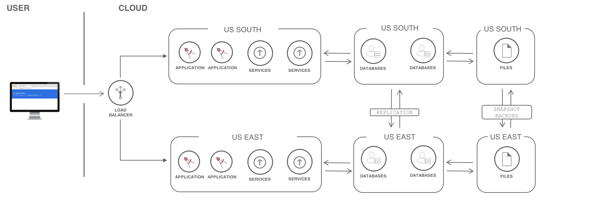
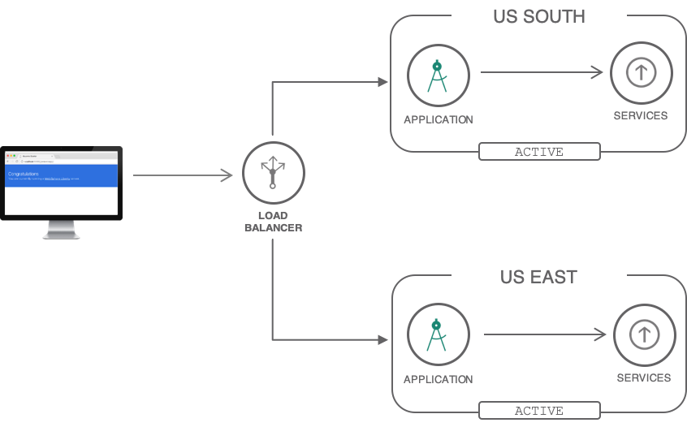
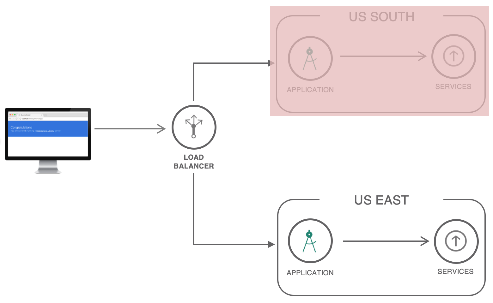
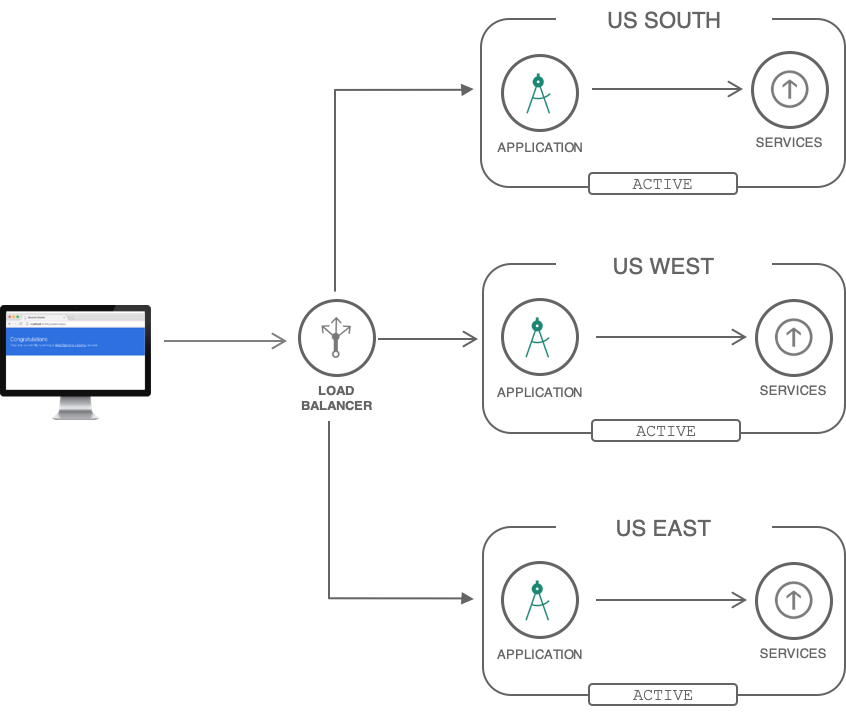
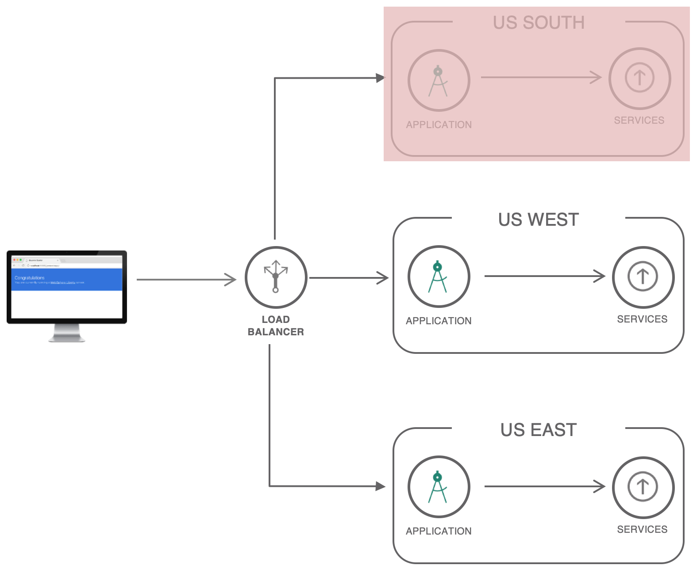
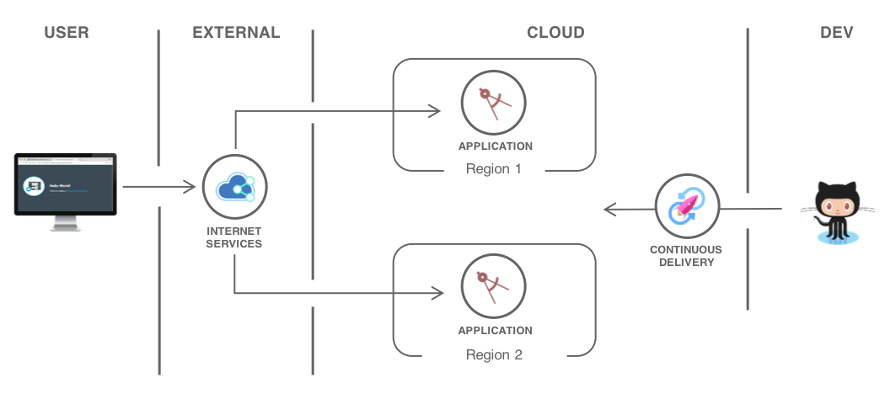
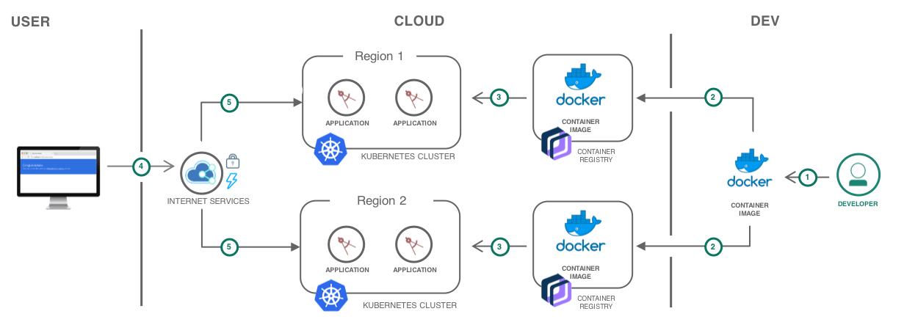
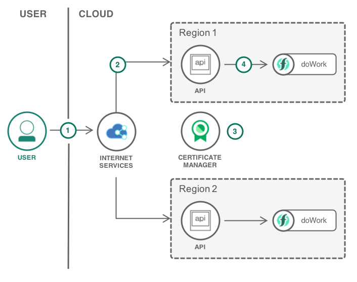
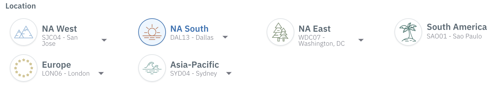
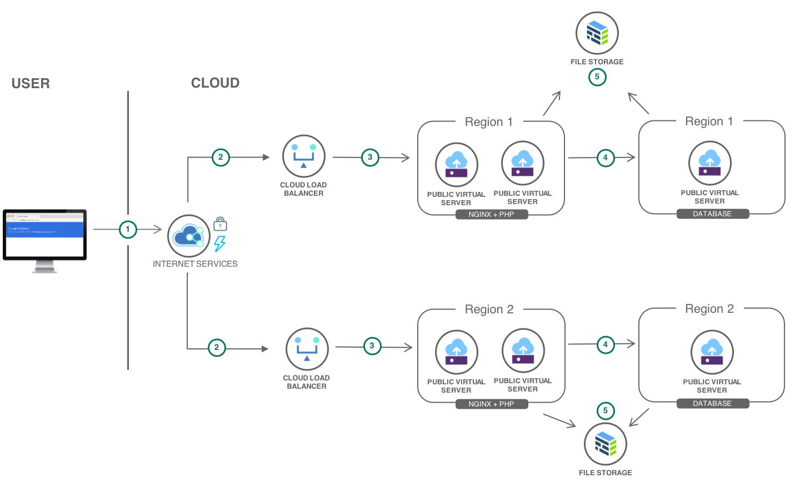

{:java: #java .ph data-hd-programlang='java'}
{:swift: #swift .ph data-hd-programlang='swift'}
{:ios: #ios data-hd-operatingsystem="ios"}
{:android: #android data-hd-operatingsystem="android"}
{:shortdesc: .shortdesc}
{:new_window: target="_blank"}
{:codeblock: .codeblock}
{:screen: .screen}
{:tip: .tip}
{:pre: .pre}

# Strategies for resilient applications
{: #strategies-for-resilient-applications}

<!--##istutorial#-->
This tutorial may incur costs. Use the [Cost Estimator](https://{DomainName}/estimator/review) to generate a cost estimate based on your projected usage.
{: tip}
<!--#/istutorial#-->

Regardless of the compute option, Kubernetes, Cloud Foundry, Cloud Functions, Code Engine or Virtual Servers, enterprises seek to minimize downtime and create resilient architectures that achieve maximum availability. This tutorial highlights IBM Cloud's capabilities to build resilient solutions, and in doing so, answers the following questions.

- What should I consider when preparing a solution to be globally available?
- How available compute options help you deliver multi-region applications?
- How do I import application or service artifacts into additional regions?
- How can databases replicate across locations?
- Which backing services should be used: Block Storage, File Storage, Object Storage, Databases?
- Are there any service-specific considerations?

## Objectives
{: #strategies-for-resilient-applications-objectives}

* Learn architectural concepts involved when building resilient applications.
* Understand how such concepts map to IBM Cloud compute and service offerings

{: #architecture}

To design a resilient architecture, you need to consider the individual blocks of your solution and their specific capabilities.

Below is a multi-region architecture showcasing the different components that may exist in a multi-region setup. 

The architecture diagram above may be different depending on the compute option. You will see specific architecture diagrams under each compute option in later sections.

### Disaster recovery with two regions
{: #strategies-for-resilient-applications-1}

To facilitate disaster recovery, two widely accepted architectures are used: **active/active** and **active/passive**. Each architecture has its costs and benefits related to time and effort during recovery.

#### Active-active configuration
{: #strategies-for-resilient-applications-2}

In an active/active architecture, both locations have identical active instances with a load balancer distributing traffic between them. Using this approach, data replication must be in place to synchronize data between both regions in real-time.

This configuration provides higher availability with less manual remediation than an active/passive architecture. Requests are served from both data centers. You should configure the edge services (load balancer) with appropriate timeout and retry logic to automatically route the request to the second data center if a failure occurs in the first data center.

When considering **recovery point objective** (RPO) in the active/active scenario, data synchronization between the two active data centers must be extremely timely to allow seamless request flow.

#### Active-passive configuration
{: #strategies-for-resilient-applications-3}

An active/passive architecture relies on one active region and a second (passive) region used as a backup. In the event of an outage in the active region, the passive region becomes active. Manual intervention may be required to ensure databases or file storage is current with the application and user needs.

Requests are served from the active site. In the event of an outage or application failure, pre-application work is performed to make the standby data center ready to serve the request. Switching from the active to the passive data center is a time-consuming operation. Both **recovery time objective** (RTO) and **recovery point objective** (RPO) are higher compared to the active/active configuration.

### Disaster recovery with three regions
{: #strategies-for-resilient-applications-4}

In today's era of "Always On" services with zero tolerance for downtime, customers expect every business service to remain accessible around the clock anywhere in the world. A cost-effective strategy for enterprises involves architecting your infrastructure for continuous availability rather than building disaster recovery infrastructures.

Using three data centers provides greater resiliency and availability than two. It can also offer better performance by spreading the load more evenly across data centers. 

#### Active-active-active (3-active) configuration
{: #strategies-for-resilient-applications-5}

Requests are served by the application running in any of the three active data centers. A case study on the IBM.com website indicates that 3-active requires only 50% of the compute, memory, and network capacity per cluster, but 2-active requires 100% per cluster. The data layer is where the cost difference stands out. For further details, read [*Always On: Assess, Design, Implement, and Manage Continuous Availability*](http://www.redbooks.ibm.com/redpapers/pdfs/redp5109.pdf).

#### Active-active-passive configuration
{: #strategies-for-resilient-applications-6}

In this scenario, when either of the two active applications in the primary and secondary data centers suffers an outage, the standby application in the third data center is activated. The disaster recovery procedure described in the two data centers scenario is followed for restoring normalcy to process customer requests. The standby application in the third data center can be set up in either a hot or a cold standby configuration.

Refer to [this guide](https://www.ibm.com/cloud/garage/content/manage/hadr-on-premises-app/) for more on disaster recovery.

### Multi-regions architectures
{: #strategies-for-resilient-applications-7}

In a multi-region architecture, an application is deployed to different locations where each region runs an identical copy of the application.

A region is a specific geographical location where you can deploy apps, services, and other {{site.data.keyword.cloud_notm}} resources. [{{site.data.keyword.cloud_notm}} regions](https://{DomainName}/docs/containers?topic=containers-regions-and-zones) consist of one or more zones, which are physical data centers that host the compute, network, and storage resources and related cooling and power that host services and applications. Zones are isolated from each other, which ensures no shared single point of failure.

Additionally, in a multi-region architecture, a Global load balancer like [{{site.data.keyword.cis_full_notm}}](https://{DomainName}/catalog/services/internet-services) ({{site.data.keyword.cis_short_notm}}) is required to distribute traffic between regions. The [{{site.data.keyword.cloudcerts_full_notm}}](https://{DomainName}/catalog/services/certificate-manager) is integrated with {{site.data.keyword.cis_short_notm}} and allows an administrator to order - or import - SSL/TLS certificates to secure the network traffic.

Deploying a solution across multiple regions comes with the following benefits:
- Reduce latency - improve user experience by deploying resources closer to their point of origin.
- Disaster recovery - ability to recover quickly in the event a region fails.
- Business requirements - store user data in their region.

### Multi-zone within region architecture
{: #strategies-for-resilient-applications-8}

Building multi-zone applications involve having your application deployed across multiple zones within a region. With that architecture, a regional load balancer is used to distribute traffic locally between the zones.

You can learn more about regions and zones [here](https://{DomainName}/docs/containers?topic=containers-regions-and-zones#regions-and-zones).

## Compute Options
{: #strategies-for-resilient-applications-0}

This section reviews the compute options available in {{site.data.keyword.cloud_notm}}. For each compute option, an architecture diagram is provided together with a tutorial on how to deploy such architecture.

Note: all compute options architectures do not have databases or other services included, they only focus on deploying an app to two regions for the selected compute option. Once you deployed any of the multi-region compute options examples, the next logical step would be to add databases and other services. Later sections of this solution tutorial will cover [databases](#strategies-for-resilient-applications-databaseservices) and [non-database-services](#strategies-for-resilient-applications-nondatabaseservices).

### Cloud Foundry
{: #strategies-for-resilient-applications-10}

Cloud Foundry offers the capability to achieve deployment of a multi-region architecture. The architecture for Cloud Foundry multi-region looks like this:

The same application is deployed in multiple regions and a global load balancer routes traffic to the closest and healthy region. The [**Secure web application across multiple regions**](https://{DomainName}/docs/solution-tutorials?topic=solution-tutorials-multi-region-webapp#multi-region-webapp) tutorial guides you through the deployment of a similar architecture utilizing a [continuous delivery](https://{DomainName}/catalog/services/continuous-delivery) pipeline service.

### Kubernetes or {{site.data.keyword.openshiftshort}}
{: #strategies-for-resilient-applications-11}

When implementing a solution with {{site.data.keyword.containerlong_notm}} or {{site.data.keyword.openshiftlong_notm}}, you benefit from built-in capabilities, like load balancing and isolation, increased resiliency against potential failures with hosts, networks, or apps. For additional resiliency, you have the option to also create multi-zone clusters, meaning your nodes are deployed across multiple zones within a region. Kubernetes and {{site.data.keyword.openshiftshort}} clusters can be deployed in a [Virtual Private Cloud infrastructure](https://{DomainName}/docs/containers?topic=containers-plan_clusters#plan_vpc_basics), which gives you the security of a private cloud environment with the dynamic scalability of a public cloud, or in [Classic infrastructure](https://{DomainName}/docs/containers?topic=containers-plan_clusters#plan_basics).

By creating multiple clusters in different regions, users can also access the closest cluster with reduced network latency.  The Kubernetes multi-region architecture looks like this.

1. The developer builds Docker images for the application.
2. The images are pushed to {{site.data.keyword.registryshort_notm}} in two different locations.
3. The application is deployed to Kubernetes clusters in both locations.
4. End-users access the application.
5. {{site.data.keyword.cis_full_notm}} is configured to intercept requests to the application and to distribute the load across the clusters. In addition, DDoS Protection and Web Application Firewall are enabled to protect the application from common threats. Optionally assets like images, CSS files are cached.

The tutorial [**Resilient and secure multi-region Kubernetes clusters with {{site.data.keyword.cis_full_notm}}**](https://{DomainName}/docs/solution-tutorials?topic=solution-tutorials-multi-region-k8s-cis#multi-region-k8s-cis) walks you through the steps to deploy a similar architecture.

### {{site.data.keyword.openwhisk_short}}
{: #strategies-for-resilient-applications-12}

{{site.data.keyword.openwhisk_short}} is available in multiple {{site.data.keyword.cloud_notm}} locations. To increase resiliency and reduce network latency, applications can deploy their back-end in multiple locations. Then, with {{site.data.keyword.cis_full_notm}} ({{site.data.keyword.cis_short_notm}}), developers can expose a single entry point in charge of distributing traffic to the closest healthy back-end. The architecture for {{site.data.keyword.openwhisk_short}} multi-region looks like this.

 

1. Users access the application. The request goes through {{site.data.keyword.cis_full_notm}}.
2. {{site.data.keyword.cis_full_notm}} redirects the users to the closest healthy API back-end.
3. Certificate Manager provides the API with its SSL certificate. The traffic is encrypted end-to-end.
4. The API is implemented with Cloud Functions.

Find out how to deploy this architecture by following the tutorial [**Deploy serverless apps across multiple regions**](https://{DomainName}/docs/solution-tutorials?topic=solution-tutorials-multi-region-serverless#multi-region-serverless).

### {{site.data.keyword.codeengineshort}}
{: #strategies-for-resilient-applications-26}

{{site.data.keyword.codeengineshort}} is a fully managed, serverless platform that runs your containerized workloads, including web apps, microservices, event-driven functions, or batch jobs.  {{site.data.keyword.codeengineshort}} is available in multiple {{site.data.keyword.cloud_notm}} locations. {{site.data.keyword.codeengineshort}} abstracts the operational burden of building, deploying, and managing workloads in Kubernetes so that developers can focus on their source code development. To increase resiliency and reduce network latency, applications can be deployed across multiple locations. Then, with {{site.data.keyword.cis_full_notm}} ({{site.data.keyword.cis_short_notm}}), developers can expose a single entry point in charge of distributing traffic to the closest location. 

Learn how to deploy this architecture by following the [**Deploying an application across multiple regions with a custom domain name tutorial**](https://{DomainName}/docs/codeengine?topic=codeengine-deploy-multiple-regions).

### Virtual server instances on VPC Infrastructure
{: #strategies-for-resilient-applications-13}
{{site.data.keyword.vsi_is_full}} offer the capability to achieve a multi-region architecture. You can provision instances in multiple availability zones on {{site.data.keyword.cloud_notm}}.

The below architecture demonstrates deploying isolated workloads by provisioning VPCs in different IBM Cloud regions. Regions with subnets and virtual server instances (VSIs). These VSIs are created in multiple zones within a region to increase resiliency within a region and globally by configuring load balancers with back-end pools, front-end listeners, and proper health checks.

The tutorial [**Deploy isolated workloads across multiple locations and zones**](https://{DomainName}/docs/solution-tutorials?topic=solution-tutorials-vpc-multi-region) implements this architecture.

### {{site.data.keyword.baremetal_short}} and {{site.data.keyword.virtualmachinesshort}} on Classic Infrastructure
{: #strategies-for-resilient-applications-14}

{{site.data.keyword.virtualmachinesshort}} and {{site.data.keyword.baremetal_short}} offer the capability to achieve a multi-region architecture. You can provision servers in multiple locations on {{site.data.keyword.cloud_notm}}.

When preparing for such architecture using {{site.data.keyword.virtualmachinesshort}} and {{site.data.keyword.baremetal_short}}, consider the following: file storage, backups, recovery, and databases, selecting between a database as service, or installing a database on a virtual server.

The below architecture demonstrates the deployment of a multi-region architecture using {{site.data.keyword.virtualmachinesshort}} in an active/passive architecture where one region is active and the second region is passive.

The components required for such architecture:

1. Users access the application through {{site.data.keyword.cis_full_notm}} ({{site.data.keyword.cis_short_notm}}).
2. {{site.data.keyword.cis_short_notm}} routes traffic to the active location.
3. Within a location, a load balancer redirects traffic to a server.
4. Databases are deployed on a virtual server. Backup is enabled and replication is set up between regions. The alternative would be to use a database-as-service, a topic discussed later in the tutorial.
5. File storage to store the application images and files, File storage offers the capability to take a snapshot at a given time and date, this snapshot then can be reused within another region, something which you would do manually.

The tutorial [**Use Virtual Servers to build highly available and scalable web app**](https://{DomainName}/docs/solution-tutorials?topic=solution-tutorials-highly-available-and-scalable-web-application#highly-available-and-scalable-web-application) implements this architecture.

## Databases and application files
{: #strategies-for-resilient-applications-databases-and-application-files}

{{site.data.keyword.cloud_notm}} offers a selection of [databases as a service](https://{DomainName}/catalog?category=databases#services) with both relational and non-relational databases depending on your business needs. [Database-as-a-service (DBaaS)](https://www.ibm.com/cloud/learn/what-is-cloud-database) comes with many advantages. Using a DBaaS like {{site.data.keyword.cloudant}}, you can take advantage of the multi-region support allowing you to do live replication between two database instances in different regions, perform backups, and scale.

**Key features:**

- A database service built and accessed through a cloud platform
- Enables enterprise users to host databases without buying dedicated hardware
- Can be managed by the user or offered as a service and managed by a provider
- Can support SQL or NoSQL databases
- Accessed through a web interface or vendor-provided API

**Prepping for multi-region architecture:**

- What are the resiliency options of the database service?
- How is replication handled between multiple database services across regions?
- How is the data backed up?
- What are the disaster recovery approaches for each?

### {{site.data.keyword.cloudant}}
{: #strategies-for-resilient-applications-16}

{{site.data.keyword.cloudant}} is a distributed database that is optimized for handling heavy workloads that are typical of large, fast-growing web and mobile apps. Available as an SLA-backed, fully managed {{site.data.keyword.Bluemix_notm}} service, {{site.data.keyword.cloudant}} elastically scales throughput and storage independently. {{site.data.keyword.cloudant}} is also available as a downloadable on-premises installation, and its API and powerful replication protocol are compatible with an open-source ecosystem that includes CouchDB, PouchDB, and libraries for the most popular web and mobile development stacks.

{{site.data.keyword.cloudant}} supports [replication](https://{DomainName}/docs/Cloudant?topic=Cloudant-replication-api#replication-operation) between multiple instances across locations. Any change that occurred in the source database is reproduced in the target database. You can create replication between databases, either continuously or as a 'one-off' task. The following diagram shows a typical configuration that uses two {{site.data.keyword.cloudant}} instances, one in each region:

Refer to [these instructions](https://{DomainName}/docs/Cloudant?topic=Cloudant-configuring-ibm-cloudant-for-cross-region-disaster-recovery#configuring-ibm-cloudant-for-cross-region-disaster-recovery) to configure replication between {{site.data.keyword.cloudant}} instances. The service also provides instructions and tooling to [backup and restore data](https://{DomainName}/docs/Cloudant?topic=Cloudant-ibm-cloudant-backup-and-recovery#ibm-cloudant-backup-and-recovery).

### {{site.data.keyword.Db2_on_Cloud_short}}, {{site.data.keyword.dashdbshort_notm}}, and {{site.data.keyword.Db2Hosted_notm}}
{: #strategies-for-resilient-applications-17}

{{site.data.keyword.cloud_notm}} offers several Db2 database services. These are:

- [**{{site.data.keyword.Db2_on_Cloud_short}}**](https://{DomainName}/catalog/services/db2): A fully-managed cloud SQL database for typical operational, OLTP-like workloads.
- [**{{site.data.keyword.dashdbshort_notm}}**](https://{DomainName}/catalog/services/db2-warehouse): A fully-managed cloud data warehouse service for high-performance, petabyte-scale analytic workloads. It offers both SMP and MPP service plans and utilizes an optimized columnar data store and in-memory processing.
- [**{{site.data.keyword.Db2Hosted_notm}}**](https://{DomainName}/catalog/services/db2-hosted): A hosted by IBM and managed by the user database system. It provides Db2 with full administrative access to cloud infrastructure, thereby eliminating the cost, complexity, and risk of managing your own infrastructure.

In the following, we will focus on {{site.data.keyword.Db2_on_Cloud_short}} as DBaaS for operational workloads. These workloads are typical for the applications discussed in this tutorial.

#### Multi-region support for {{site.data.keyword.Db2_on_Cloud_short}}
{: #strategies-for-resilient-applications-18}

{{site.data.keyword.Db2_on_Cloud_short}} offers several [options to achieve High Availability and Disaster Recovery (HADR)](/docs/Db2onCloud?topic=Db2onCloud-getting-started). You can choose the High Availability option when you create a new service. Later on, you can [add a Geo-Replicated Disaster Recovery Node](https://{DomainName}/docs/Db2onCloud?topic=Db2onCloud-ha) through the instance dashboard. The offsite DR node option gives you the ability to synchronize your data in real-time to a database node in an offsite {{site.data.keyword.cloud_notm}} data center of your choice.

More information is available in the [High Availability documentation](https://{DomainName}/docs/Db2onCloud?topic=Db2onCloud-ha#ha).

#### Backup and restore
{: #strategies-for-resilient-applications-19}

{{site.data.keyword.Db2_on_Cloud_short}} includes daily backups for paid plans. Typically, the backups are stored using {{site.data.keyword.cos_short}} and thereby utilizing three data centers for increased availability of retained data. Backups are kept for 14 days. You can use them to perform a point-in-time recovery. The [backup and restore documentation](https://{DomainName}/docs/Db2onCloud?topic=Db2onCloud-bnr) provides details on how you can restore data to the desired date and time.

### {{site.data.keyword.databases-for}}
{: #strategies-for-resilient-applications-databaseservices}

{{site.data.keyword.databases-for}} offers several open source database systems as fully managed services. They are:
* [{{site.data.keyword.databases-for-postgresql}}](https://{DomainName}/catalog/services/databases-for-postgresql)
* [{{site.data.keyword.databases-for-enterprisedb}}](https://{DomainName}/catalog/services/databases-for-enterprisedb)
* [{{site.data.keyword.databases-for-cassandra}}](https://{DomainName}/catalog/services/databases-for-cassandra)
* [{{site.data.keyword.databases-for-redis}}](https://{DomainName}/catalog/services/databases-for-redis)
* [{{site.data.keyword.databases-for-elasticsearch}}](https://{DomainName}/catalog/services/databases-for-elasticsearch)
* [{{site.data.keyword.databases-for-etcd}}](https://{DomainName}/catalog/services/databases-for-etcd)
* [{{site.data.keyword.databases-for-mongodb}}](https://{DomainName}/catalog/services/databases-for-mongodb)
* [{{site.data.keyword.messages-for-rabbitmq}}](https://{DomainName}/catalog/services/messages-for-rabbitmq)

All of these services share the same characteristics:
* For high availability they are deployed in clusters. Details can be found in the documentation of each service:
  - [{{site.data.keyword.postgresql}}](https://{DomainName}/docs/databases-for-postgresql?topic=databases-for-postgresql-high-availability#high-availability)
  - [EnterpriseDB](https://{DomainName}/docs/databases-for-enterprisedb?topic=databases-for-enterprisedb-high-availability)
  - [DataStax](https://{DomainName}/docs/databases-for-cassandra?topic=databases-for-cassandra-high-availability)
  - [{{site.data.keyword.redis}}](https://{DomainName}/docs/databases-for-redis?topic=databases-for-redis-high-availability#high-availability)
  - [ElasticSearch](https://{DomainName}/docs/databases-for-elasticsearch?topic=databases-for-elasticsearch-high-availability#high-availability)
  - [etcd](https://{DomainName}/docs/databases-for-etcd?topic=databases-for-etcd-high-availability#high-availability)
  - [{{site.data.keyword.mongodb}}](https://{DomainName}/docs/databases-for-mongodb?topic=databases-for-mongodb-high-availability#high-availability)
  - [{{site.data.keyword.rabbitmq}}](https://{DomainName}/docs/messages-for-rabbitmq?topic=messages-for-rabbitmq-high-availability)
* Each cluster is spread over multiple zones.
* Data is replicated across the zones.
* Users can scale up storage and memory resources for an instance. See the [documentation on scaling for, e.g., {{site.data.keyword.databases-for-redis}}](https://{DomainName}/docs/databases-for-redis?topic=databases-for-redis-resources-scaling) for details.
* Backups are taken daily or on demand. Details are documented for each service. Here is [backup documentation for, e.g., {{site.data.keyword.databases-for-postgresql}}](https://{DomainName}/docs/databases-for-postgresql?topic=cloud-databases-dashboard-backups).
* Data at rest, backups and network traffic are encrypted.
* Each [service can be managed using the {{site.data.keyword.databases-for}} CLI plugin](https://{DomainName}/docs/databases-cli-plugin?topic=databases-cli-plugin-cdb-reference)

### {{site.data.keyword.cos_full_notm}}
{: #strategies-for-resilient-applications-21}

{{site.data.keyword.cos_full_notm}} (COS) provides durable, secure, and cost-effective cloud storage. Information stored with {{site.data.keyword.cos_full_notm}} is encrypted and dispersed across multiple geographic locations. When creating storage buckets within a COS instance, you decide in which location the bucket should be created and which resiliency option to use.

There are three types of bucket resiliency:
   - **Cross Region** resiliency will spread your data across several metropolitan areas. This can be seen as a multi-region option. When accessing content stored in a Cross Region bucket, COS offers a special endpoint able to retrieve content from a healthy region.
   - **Regional** resiliency will spread data across a single metropolitan area. This can be seen as a multi-zone within a region configuration.
   - **Single Data Center** resiliency spreads data across multiple appliances within a single data center.

Refer to [this documentation](https://{DomainName}/docs/cloud-object-storage/basics?topic=cloud-object-storage-endpoints) for a detailed explanation of {{site.data.keyword.cos_full_notm}} resiliency options.

### {{site.data.keyword.filestorage_full_notm}}
{: #strategies-for-resilient-applications-22}

{{site.data.keyword.filestorage_full_notm}} is persistent, fast, and flexible network-attached, NFS-based file storage. In this network-attached storage (NAS) environment, you have total control over your file shares function and performance. {{site.data.keyword.filestorage_short}} shares can be connected to up to 64 authorized devices over routed TCP/IP connections for resiliency.

Some of the file storage features are _Snapshots_, _Replication_, _Concurrent access_. Refer to [the  documentation](https://{DomainName}/docs/FileStorage?topic=FileStorage-getting-started) for a full list of features.

Once attached to your servers, a {{site.data.keyword.filestorage_short}} service can be used to store data backups, application files like images and videos, these images and files can then be used within different servers in the same region.

When adding a second region, you can use the snapshots feature of {{site.data.keyword.filestorage_short}} to take a snapshot automatically or manually, and then reuse it within the second passive region.

Replication can be scheduled to automatically copy snapshots to a destination volume in a remote data center. The copies can be recovered in the remote site if a catastrophic event occurs or your data becomes corrupted. More on File Storage snapshots can be found [here](https://{DomainName}/docs/FileStorage?topic=FileStorage-snapshots#snapshots).

## Non-database services
{: #strategies-for-resilient-applications-nondatabaseservices}

{{site.data.keyword.cloud_notm}} offers a selection of non-database [services](https://{DomainName}/catalog), these are both IBM services and 3rd party services. When planning for multi-region architecture, you need to understand how services can work in a multi-region setup.

Many of the services provide stateless APIs and offer high availability through multi-zone deployments. But still, for highly available applications across multiple regions, you may even want to have multiple instances of this service across regions. Then it is important to understand how configuration and user-specific data can be made available across regions. In some cases this might be by utilizing built-in replication capabilities, in others, it could mean manually keeping data in sync by exporting and importing data sets.

## Summary
{: #strategies-for-resilient-applications-24}

| Offering | Resiliency Options |
| -------- | ------------------ |
| Cloud Foundry | <ul><li>Deploy applications to multiple locations</li><li>Serve requests from multiple locations with {{site.data.keyword.cis_full_notm}}</li><li>Use Cloud Foundry APIs to configure orgs, spaces and push apps to multiple locations</li></ul> |
| {{site.data.keyword.containerlong_notm}}, {{site.data.keyword.openshiftlong_notm}} | <ul><li>Resiliency by design with support for multi-zone clusters</li><li>Serve requests from clusters spread in multiple locations with {{site.data.keyword.cis_full_notm}}</li></ul> |
| {{site.data.keyword.openwhisk_short}} | <ul><li>Available in multiple locations</li><li>Serve requests from multiple locations with {{site.data.keyword.cis_full_notm}}</li><li>Use Cloud Functions API to deploy actions in multiple locations</li></ul> |
| {{site.data.keyword.codeengineshort}} | <ul><li>Available in multiple locations</li><li>Serve requests from multiple locations with {{site.data.keyword.cis_full_notm}}</li></ul> |
| {{site.data.keyword.baremetal_short}} and {{site.data.keyword.virtualmachinesshort}} | <ul><li>Provision servers in multiple locations</li><li>Attach servers in the same location to a local load balancer</li><li>Serve requests from multiple locations with {{site.data.keyword.cis_full_notm}}</li></ul> |
| {{site.data.keyword.cloudant}} | <ul><li>One-shot and Continuous replication between databases</li><li>Automatic data redundancy within a region</li></ul> |
| {{site.data.keyword.Db2_on_Cloud_short}} | <ul><li>Provision a geo-replicated disaster recovery node for real-time data synchronization</li><li>Daily backup with paid plans</li></ul> |
| Cloud Databases | <ul><li>Built on multi-zone Kubernetes clusters</li><li>Cross-region read replicas</li><li>Daily and on-demand backups</li></ul> |
| {{site.data.keyword.cos_short}} | <ul><li>Single Data Center, Regional and Cross-Regional resiliency</li><li>Use API to synchronize contents across storage buckets</li></ul> |
| {{site.data.keyword.filestorage_short}} | <ul><li>Use snapshots to automatically capture content to a destination in a remote data center</li></ul> |

## Related content
{: #strategies-for-resilient-applications-25}

{: related}

- [{{site.data.keyword.cis_full_notm}}](https://{DomainName}/docs/cis?topic=cis-getting-started)
- [Improving App Availability with Multizone Clusters](https://www.ibm.com/cloud/blog/announcements/improving-app-availability-multizone-clusters)
- [Cloud Foundry, secure web application across multiple regions](https://{DomainName}/docs/solution-tutorials?topic=solution-tutorials-multi-region-webapp)
- [Cloud Functions, deploy serverless apps across multiple regions](https://{DomainName}/docs/solution-tutorials?topic=solution-tutorials-multi-region-serverless)
- [Kubernetes, resilient and secure multi-region Kubernetes clusters with {{site.data.keyword.cis_full_notm}}](https://{DomainName}/docs/solution-tutorials?topic=solution-tutorials-multi-region-k8s-cis)
- [Virtual Servers, build highly available and scalable web app](https://{DomainName}/docs/solution-tutorials?topic=solution-tutorials-highly-available-and-scalable-web-application)
