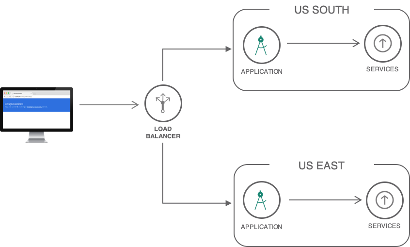

---
copyright:
  years: 2018
lastupdated: "2018-11-28"

---

{:java: #java .ph data-hd-programlang='java'}
{:swift: #swift .ph data-hd-programlang='swift'}
{:ios: #ios data-hd-operatingsystem="ios"}
{:android: #android data-hd-operatingsystem="android"}
{:shortdesc: .shortdesc}
{:new_window: target="_blank"}
{:codeblock: .codeblock}
{:screen: .screen}
{:tip: .tip}
{:pre: .pre}

# Strategies for resilient applications

Regardless of the compute option: Kubernetes, Cloud Foundry, Cloud Functions or Virtual Servers, enterprises seek to minimize downtime and create resilient architectures that achieve maximum availability. This tutorial highlights IBM Cloud's capabilities to build resilient solutions, and in doing so, answers the following questions.

- Which compute options support multi-region deployment?
- How do I import application or service artifacts into additional regions?
- What should I consider when preparing an app to be globally available?
- How can databases replicate across locations?
- Which backing services should be used: Block Storage, File Storage, Object Storage, Databases?
- Are there any service-specific considerations?

## Objectives
{: #objectives}

* Learn architectural concepts involved when building resilient applications.
* Understand how such concepts map to IBM Cloud compute and service offerings

## Services used
{: #services}

This tutorial uses the following runtimes and services:
* [{{site.data.keyword.containershort_notm}}](https://{DomainName}/containers-kubernetes/catalog/cluster)
* [{{site.data.keyword.cfee_full_notm}}](https://{DomainName}/cfadmin/create)
* [{{site.data.keyword.openwhisk_short}}](https://{DomainName}/openwhisk)
* [{{site.data.keyword.BluVirtServers}}](https://{DomainName}/catalog/infrastructure/virtual-server-group)
* [{{site.data.keyword.cloudant_short_notm}}](https://{DomainName}/catalog/services/cloudant-nosql-db)
* [{{site.data.keyword.dashdbshort_notm}}](https://{DomainName}/catalog/services/db2-warehouse)
* [Cloud Internet Services](https://{DomainName}/catalog/services/internet-services)

This tutorial may incur costs. Use the [Pricing Calculator](https://{DomainName}/pricing/) to generate a cost estimate based on your projected usage.

## Architecture and Concepts

{: #architecture}

To design a resilient architecture, involving scenarios like active/active, active/passive deployment, you need to consider the individual blocks of your solution and their specific capabilities. 

Below is a multi-region architecture showcasing the different components that may exist in a multi-region setup. 

The architecture diagram above may be different depending on the compute option. You will see specific architecture diagrams under each compute option in later sections. 

### Disaster recovery with two regions 

To facilitate disaster recovery, two widely accepted architectures are used: active/active and active/passive. Each architecture has its own costs and benefits related to time and effort during recovery.

#### Active-active configuration

In an active/active architecture, both locations have identical active instances with a load balancer distributing traffic between them. Using this approach, data replication must be in place to synchronize data between both regions in real time.

This configuration provides higher availability with less manual remediation than an active/passive architecture. Requests are served from both data centers. You should configure the edge services (load balancer) with appropriate timeout and retry logic to automatically route the request to the second data center if a failure occurs in the first data center environment.

When considering recovery point objectives (RPO) in active/active, data synchronization between the two active data centres must be extremely timely to allow seamless request flow.

#### Active-passive configuration

An active/passive architecture relies on one active region and a second (passive) region used as a backup. In the event of an outage in the active region, the passive region becomes active. Manual intervention may be required to ensure databases or file storage is current with the application's and users' needs. 

Requests are served from the active site. In the event of an outage or application failure, pre-application work is performed to make the standby data center ready to serve the request. Switching from the active to the passive data centre is a time-consuming operation. Both recovery time objective (RTO) and recovery point objective (RPO) are higher compared to the active/active configuration.

### Disaster recovery with three regions

In today's era of "Always On" services with zero tolerance for downtime, customers expect every business service to remain accessible around the clock anywhere in the world. A cost-effective strategy for enterprises involves architecting your infrastructure for continuous availability rather than building disaster recovery infrastructures.

Using three data centers provides greater resiliency and availability than two. It can also offer better performance by spreading the load more evenly across data centers. If the enterprise has only two data centers, a variant of this is to deploy two applications in one data center and deploy the third application in the second data center. Alternatively, you can deploy business logic and presentation layers in the 3-active topology and deploy the data layer in the 2-active topology.

#### Active-active-active (3-active) configuration

Requests are served by the application running in any of the three active data centers. A case study on IBM.com website indicates that 3-active requires only 50% of the compute, memory, and network capacity per cluster, but 2-active requires 100% per cluster. The data layer is where the cost difference stands out. For further details, read [*Always On: Assess, Design, Implement, and Manage Continuous Availability*](http://www.redbooks.ibm.com/redpapers/pdfs/redp5109.pdf).

#### Active-active-passive configuration

In this scenario, when either of the two active applications in the primary and secondary data centers suffers an outage, the standby application in the third data center is activated. The DR procedure described in the two data centers scenario is followed for restoring normalcy to process customer requests. The standby application in the third data center can be set up in either a hot or a cold standby configuration.

Read this read this [guide](https://www.ibm.com/cloud/garage/content/manage/hadr-on-premises-app/) for more on disaster recovery.

### Multi-regions architectures

In a multi-region architecture, an application is deployed to different locations where each region runs an identical copy of the application. 

A region is a specific geographical location where you can deploy apps, services, and other IBM® Cloud resources. [IBM Cloud regions](https://{DomainName}/docs/containers/cs_regions.html#bluemix_regions) consist of one or more zones, which are physical data centers that host the compute, network, and storage resources and related cooling and power that host services and applications. Zones are isolated from each other, which ensures no shared single point of failure.

Additionally, in a multi-region architecture, a Global load balancer is required in order to distribute traffic between regions. To achieve that, the [Cloud Internet Services](https://{DomainName}/catalog/services/internet-services) can be used for the load balancing. 

### Multi-zones within regions architectures

Building multi-zones regions applications means having your application deployed across zones within a region and then you may also have two or three regions. 

With multi-zone region architecture you would require to have a local load balancer to distribute traffic locally between zones in a region, and then if a second region is set up then a global load balancer distributes traffic between the regions. 

**Why bother with multi-region architectures?** 

There are many reasons to why you would want to have a multi-region architecture, here are the top three:

1. Improve latency for end-users - speed is the key, the closer your backend origin is to end-users, the better the experience for users and the faster.
2. Disaster recovery - when the active region failover, then have a backup region and quickly recover. 
3. Business requirements - in some cases you need to store data in distinct regions, separated by several hundreds of kilometres. Therefore, those in such case you have have to store data in multiple regions. 

You can learn more about regions and zones [here](https://{DomainName}/docs/containers/cs_regions.html#regions-and-zones).

## Compute Options 

In this section, you will discover the different compute options available in IBM Cloud. For each of the compute options listed, you been given an architecture digram with direct link taken you to the solution tutorial for deploying the architecture. 

Note: all compute options architectures do not have databases or other services included, they only focus on deploying an app to two regions for the compute option selected. Once you deployed any of the multi-region compute options examples, the next logical step would be to add databases and some other Watson services. When deploying a multi-region architecture, you need to think about databases and non-database-services within your multi-region Cloud Foundry architecture. In later sections of this solution tutorial, [#databaseservices](databases, and non-database-services), and [non-database-services](#nondatabaseservices) are covered in detail.

### Cloud Foundry apps 

Cloud Foundry offers the capability to achieve deployment of a multi-region architecture, also using a [continuous delivery](https://{DomainName}/catalog/services/continuous-delivery) pipeline services allows you to deploy your application across multiple regions with pipeline testing and deployment. The architecture for Cloud Foundry multi-region looks like this. 

**Deploy above architecture by following the [solution tutorial here.](multi-region-webapp.html)** 

### Cloud Foundry Enterprise Environment

In the last section, you reviewed how to deploy a multi-region app to the public Cloud Foundry. The next step is to look at Cloud Foundry Enterprise Environment (CFEE). CFEE offers all the same functionalities like public Cloud Foundry but with additional features.

**Cloud Foundry Enterprise Environment (CFEE)** allows you to instantiate multiple, isolated, enterprise-grade Cloud Foundry platforms on demand. Instances of CFEE run within your own account in [IBM Cloud](http://ibm.com/cloud). The environment is deployed on isolated hardware ([Kubernetes clusters](https://www.ibm.com/cloud/container-service?cm_mmc=OSocial_Blog-_-Cloud_Cloud%20Platform-_-WW_WW-_-CFEE&cm_mmca1=000023UA&cm_mmca2=10007999&)). You have full control over the environment, including access control, capacity management, change management, monitoring, and services. With this in place, learn how to plan for a multi-region architecture when using Cloud Foundry Enterprise Environment. 

A multi-region architecture using Cloud Foundry Enterprise Environment is below.

Deploying this architecture requires the following: 

- Setup two CFEE instances - one in each region.
- Create and bind the services to the CFEE account. 
- Push the apps targeting the CFEE API endpoint. 
- Setup database replication, just as you would on public Cloud Foundry. 

Additionally, check out the step by step guide [Deploy Logistics Wizard to Cloud Foundry Enterprise Environment (CFEE)](https://github.com/IBM-Cloud/logistics-wizard/blob/master/Deploy_Microservices_CFEE.md) where it will take you deploying a microservice based application to CFEE. Once deployed to one CFEE account, then you would require to redeploy to a second region and attach the [Internet Services](https://{DomainName}/docs/infrastructure/cis/getting-started.html#getting-started-with-ibm-cloud-internet-services-cis-) in front of the two CFEE account to load balance the traffic. 

You can learn more on IBM Cloud Foundry Enterprise Environment [here](https://{DomainName}/docs/cloud-foundry/index.html#about).

### Kubernetes apps

With Kubernetes, you can achieve a multi-zones within regions architecture, this can be an active/active use case. When implementing a solution with Kubernetes Service, you benefit from built-in capabilities, like load balancing and isolation, increase resiliency against potential failures with hosts, networks, or apps. By creating multiple clusters and if an outage occurs with one cluster, users can still access an app that is also deployed in another cluster. With multiple clusters in different regions, users can also access the closest cluster and reduce network latency. For additional resiliency, you have the option to also select the multi-zone clusters, meaning your nodes are deployed across multiple zones within a region. 

The Kubernetes multi-region architecture looks like this.

1. The developer builds Docker images for the application.
2. The images are pushed to IBM Cloud Container Registry in Dallas and London.
3. The application is deployed to Kubernetes clusters in both locations.
4. End-users access the application.
5. Cloud Internet Services is configured to intercept requests to the application and to distribute the load across the clusters. In addition, DDoS Protection and Web Application Firewall are enabled to protect the application from common threats. Optionally assets like images, CSS files are cached.

**Deploy above architecture by following the [solution tutorial here.](multi-region-k8s-cis.html)** 

### Cloud Functions apps

Cloud Functions is available in multiple IBM Cloud locations. To increase resiliency and reduce network latency, applications can deploy their back-end in multiple locations. Then, with IBM Cloud Internet Services (CIS), developers can expose a single entry point in charge of distributing traffic to the closest healthy back-end. The architecture for Cloud Functions multi-region looks like this.

 

1. Users access the application. The request goes through Internet Services.
2. Internet Services redirect the users to the closest healthy API back-end.
3. Certificate Manager provides the API with its SSL certificate. The traffic is encrypted end-to-end.
4. The API is implemented with Cloud Functions.

**Deploy above architecture by following the [solution tutorial here.](multi-region-serverless.html)** 

### Bare Metal and Virtual Servers

IBM Cloud Virtual Servers and Bare Metal offers the capability to achieve a multi-region architecture. You can provision servers on many available locations on IBM Cloud. 

When preparing for such architecture using Virtual Servers and Bare Metal you need to think about the following: file storage, backups, recovery and databases, selecting between a database as service or installing a database on a virtual server. 

The below architecture demonstrates deployment of a multi-region architecture using Virtual Servers in an active/passive architecture where one region is active and the second region is passive. 

The components required for such architecture: 

1. Users access the application through IBM Cloud Internet Services (CIS).
2. CIS routes traffic to a healthy location.
3. Within a location a load balancer redirects traffic to a server.
4. Databases deployed on a virtual server, meaning you would configure the database and setup replications and backups between regions. The alternative would be use a database-as-service, a topic discussed later in the tutorial.
5. File storage to store the application images and files, File storage offers the capability to take a snapshot at a given time and date, this snapshot then can be reused within another region, something in which you would do manually. 

**Deploy above architecture by following the [solution tutorial here.](highly-available-and-scalable-web-application.html)** 

## Databases and application files
{: #databaseservices}

IBM Cloud offers a selection of [databases as a service](https://{DomainName}/catalog/?category=databases) both relation and non-relation databases depending on your business needs. Database-as-service comes with many advantages that are too good to avoid. Using a database-as-service like Cloudant you can take advantages of the multi-region support allowing you to do live replication between two database services in different regions, backups, scaling and maximum uptime. 

**Key features:** 

- A database service built and accessed through a cloud platform
- Enables enterprise users to host databases without buying dedicated hardware
- Can be managed by the user or offered as a service and managed by a provider
- Can support SQL or NoSQL databases
- Accessed through a web interface or vendor-provided API

**Prepping for multi-region architecture**

- What are the resiliency options of the database service?
- How is replication handled between multiple database services across regions?
- How is the data backed up?
- What are the disaster recovery approaches for each?

More on cloud database-as-service can be found [here](https://www.ibm.com/cloud/learn/what-is-cloud-database). 

### 1.0 Cloudant

IBM Cloudant is a distributed database that is optimized for handling heavy workloads that are typical of large, fast-growing web and mobile apps. Available as an SLA-backed, fully managed IBM Cloud service, Cloudant elastically scales throughput and storage independently. Cloudant is also available as a downloadable on-premises installation, and its API and powerful replication protocol are compatible with an open source ecosystem that includes CouchDB, PouchDB, and libraries for the most popular web and mobile development stacks.

Cloudant offers many features like, `fully Managed`, `security`, `global availability`, `durable replication` and many more. A full list of Cloudant features can be found [here](https://www.ibm.com/cloud/cloudant).

#### Does Cloudant support multi-region?

Yes, you can configure replication in IBM Cloudant using an active/active or active/passive topology across data centres. The following diagram shows a typical configuration that uses two IBM Cloudant accounts, one in each region:

For step by step instructions on setting up Cloudant for a multi-region architecture, follow the instructions [here](https://{DomainName}/docs/services/Cloudant/guides/active-active.html#configuring-ibm-cloudant-for-cross-region-disaster-recovery).

#### How does replication work?
{: #replication-cloudant}

IBM Cloudant for IBM Cloud replication is the process that synchronizes ('syncs') the state of two databases. Any change that occurred in the source database is reproduced in the target database. You can create replications between any number of databases, either continuously or as a 'one-off' task. Depending on your application requirements, you use replication to share and aggregate state and content.

Replication takes place in one direction only. To keep two databases synchronized with each other, you must replicate in both directions. Do this by replicating from `database1` to `database2`, and separately from `database2` to `database1`. The aim of replication is that at the end of the process, all active documents in the source database are also in the destination or 'target' database, *and* that all documents that are deleted from the source databases are also deleted from the destination database (if they existed there).

Replication has two forms: push or pull replication:

- *Push replication* is where the source is a local database, and the destination is a remote database.
- *Pull replication* is where the source is a remote database instance, and the destination is the local database.

For more detailed instructions on Cloudant replication, check out the replication docs [here](https://{DomainName}/docs/services/Cloudant/api/replication.html#replication).

#### Backups and recovery

Your data is important and valuable. You want to protect your data, to help ensure it is secure, available, and maintains integrity. IBM® Cloudant for IBM Cloud provides several ways to protect your data and help keep your applications operational. Some of these protection features are automatic. For other forms of protection, IBM Cloudant provides you with supported tools that help you to create your high availability and disaster recovery capabilities.

**Types and levels of protection**

- In-Region Automatic Data Redundancy
- Cross-Region Redundancy for Disaster Recovery
- Database Backup and Recovery

To dive deeper into the three levels of protection, check out the Cloudant backup and recovery docs [here](https://{DomainName}/docs/services/Cloudant/guides/disaster-recovery-and-backup.html#disaster-recovery-and-backup).

### 2.0 Db2, Db2 hosted and Db2 Warehouse

IBM Cloud offers a selection range of [Db2 databases](https://{DomainName}/catalog/?search=db2h), these are:

- **Db2**: A fully-managed cloud SQL database. Powered by a turbo-charged Db2 engine.
- **Db2 hosted**: IBM Db2 Hosted lets you run Db2 with full administrative access on cloud infrastructure. It eliminates the cost, complexity, and risk of managing your own infrastructure.
- **Db2 Warehouse**: IBM Db2 Warehouse on Cloud is a fully-managed, enterprise-class, cloud data warehouse service. Powered by IBM BLU Acceleration, Db2 Warehouse on Cloud provides you with unmatched query performance. The service is offered in multiple form factors: SMP for cost-effective cloud data warehousing, and MPP for high-performance parallel query processing and high availability. Db2 Warehouse on Cloud also comes packed with a suite of Netezza-like in-database analytics tools and functions so you can run your analytics jobs wherever your data resides. Get the most out of your cloud data warehouse by combining it with IBM or third-party data visualization and ETL tools.

#### Does Db2 support multi-region?

Yes, you can plan and prepare for it. Db2 on Cloud uses the Db2 High Availability Disaster Recovery (HADR) technology in `ASYNC` mode to achieve the offsite DR node capability and provides `Read on Standby` on the DR node.

Db2 on Cloud high availability plans have excellent availability characteristics with a 99.99% SLA. The standard high availability plans without a disaster recovery (DR) node provide seamless failover and rolling updates. They are managed for you by using automatic client reroute (ACR) and portable IPs.

Also, you can add a Geo-Replicated Disaster Recovery Node. This offsite DR node option gives you the ability to rapidly synchronize your data in real time to a database node in an offsite IBM Cloud data center of your choice.

For more, check out the Db2 docs [here](https://{DomainName}/docs/services/Db2onCloud/ha.html#ha).

#### How does replication work?
{: #replication-db2}

How to add a Geo-Replicated Disaster Recovery Node:

- You can add an on-demand DR node to existing Db2 on Cloud instances. After clicking your instance in the IBM Cloud dashboard, you will see an option called **Manage Disaster Recovery**. You can add a Geo-Replicated Disaster Recovery Node from there.
- If you purchased Db2 on Cloud on contract through a sales representative and do not have an IBM Cloud subscription, contact your IBM representative to add a DR node.

#### Backup, restore and import/export data

Backup data:

- For paid plans, encrypted backups of the database are done daily. A daily backup is kept for each of the last 14 days. Retained backups are used by IBM for system recovery purposes in the event of a disaster or system loss. More on that can be found [here](https://{DomainName}/docs/services/Db2onCloud/br.html#br).

Restore data, managing high availability and disaster recovery nodes: 

- For standard HA nodes, which are not offsite, the failover is managed for you by IBM. IBM monitors the health of your server, failover, and failing back as needed, including rolling updates and scaling to keep uptime as high as possible.

- For Geo-Replicated Disaster Recovery (HADR), you must manually failover by using **Manage Disaster Recovery** in the console.

Import data:

- You can use [IBM Lift CLI](https://lift.ng.bluemix.net/) to import data into Db2 on Cloud.

### 3.0 IBM Cloud Databases for PostgreSQL and Redis 

The [IBM Cloud Databases for PostgreSQL](https://{DomainName}/catalog/services/databases-for-postgresql) and [IBM Cloud Databases for Redis](https://{DomainName}/catalog/services/databases-for-redis) are database-as-a-service products that are fully managed, highly available, and built from the ground up with enterprise security in mind. They are scalable, cost-efficient, and readily usable for enterprise application development.

**IBM Cloud Databases for PostgreSQL**

PostgreSQL is an object-relational SQL database that is complemented by powerful enhancements like indexable JSON, publish/subscribe functions, and drivers. The technology is commonly used for web and mobile transactional applications, business intelligence, and geospatial analysis with PostGIS.

**IBM Cloud Databases for Redis**

Redis is a powerful, open source, in-memory key value store that acts as a cache, queue, or transient store designed for the modern application stack. Applications typically use the Redis for database and web caching or counting and queuing.

#### Does IBM Cloud Databases supports multi-region or multi-zone region?

Yes, multi-zone region supported using IBM Cloud Databases for PostgreSQL and Redis.

#### How does replication work?
{: #replication-icd}

IBM Cloud Databases for Redis and IBM Cloud Databases for PostgreSQL offers cross regional replicas. By creating a read replica, you can get: 

- Additional read capacity for applications
- Relieve pressure on source database
- Upgrade a read replica to new database version
- Provides more replicas for disaster recovery

Refer to the [PostgreSQL](https://{DomainName}/docs/services/databases-for-postgresql/index.html#about-databases-for-postgresql) and [Redis](https://{DomainName}/docs/services/databases-for-redis/index.html#about-databases-for-redis) docs for more on replication.

#### Backups 

IBM® Cloud Databases offers automatic back-ups to cross-regional Cloud Object Storage. Daily and on-demand backups are available for 30 days. Each backup is labeled with its type, and when the backup was taken. Click the backup to reveal the full ID of the backup and a command that you can use to restore a backup with the IBM Cloud CLI. More on backups can be found [here](https://{DomainName}/docs/services/databases-for-postgresql/dashboard-backups.html#backups) for PostgreSQL and [here](https://{DomainName}/docs/services/databases-for-redis/dashboard-backups.html#backups) for Redis.

### 4.0 Cloud Object Storage

Cloud Object Storage (COS) service instance are global, buckets within a COS instance are where it starts to talk about regions. Information stored with IBM® Cloud Object Storage is encrypted and dispersed across multiple geographic locations, and accessed over HTTP using a REST API. This service makes use of the distributed storage technologies provided by the IBM Cloud Object Storage System (formerly Cleversafe).

#### Does Cloud Object Storage support multi-region?

Yes, there are three types of bucket resiliency that COS offer, these are:

- **Cross Region** resiliency will spread your data across several metropolitan areas. This is the multi-region.
- **Regional** resiliency will spread data across a single metropolitan area - this is the multi-zone within a region.
- **Single Data Center** resiliency spreads data across multiple appliances within a single data center.

Regional and Cross Region buckets can maintain availability during a site outage. 

**Cross Region** has a special "geo" endpoint `s3-api.us-geo.objectstorage.softlayer.net, s3-api.us-geo.objectstorage.service.networklayer.com` to automatically redirect to a healthy region. COS has several access points to enter the cross region, regional.

Additionally, with **Cross Region** and **Regional** buckets, data is automatically replicated across multiple regions within a geo (example for Cross Region US, content goes to Dallas, San Jose, Washington).

For more detailed explanation COS resiliency options, checkout the COS docs [here](https://{DomainName}/docs/services/cloud-object-storage/basics/endpoints.html#select-regions-and-endpoints).

#### How does replication work?
{: #replication-cos}

With **Cross Region** and **Regional** buckets, data is automatically replicated across multiple regions within a geo (example for Cross Region US, content goes to Dallas, San Jose, Washington).

You have the option to manually synchronize content across buckets in different regions. 

#### Backup and restore

IBM Cloud Object Storage provides durable, secure and cost effective cloud storage for a variety of backup needs. Protect the data in your datacenter by backing it up to IBM Cloud Object Storage to replace tape, streamline backup operations, and simplify archival processes. Most major backup software vendors integrate directly with IBM Cloud Object Storage and offer turnkey data backup solutions. For data in the cloud, leverage the cloud-native capabilities and the low cost of Cloud Object Storage for an automated, application-consistent backup and recovery solution. 

You can initiate your backup to the bucket with the policy. and perform backups to IBM Cloud Object Storage. More information on Simpana backups is available [here](https://documentation.commvault.com/commvault/v11/article?p=11677.htm). Backup contents transition to the Archive tier based on the policy configured on the bucket.

Refer to the `performing backups` section [here](https://{DomainName}/docs/services/cloud-object-storage/gui/simpana.html#performing-backups).

### 5.0 File Storage

IBM File Storage for IBM Cloud is persistent, fast, and flexible network-attached, NFS-based File Storage. In this network-attached storage (NAS) environment, you have total control over your file shares function and performance. File Storage shares can be connected to up to 64 authorized devices over routed TCP/IP connections for resiliency.

Some of file storage features are things like `Snapshots`, `Replication`, `Concurrent access` and many more. Get the full list of features [here](https://{DomainName}/docs/infrastructure/FileStorage/index.html#getting-started-with-file-storage).

#### Does File Storage support multi-region?

Yes it can be configured for active/passive use case. In the active/passive architecture file storage can be used easily, you can attach file storage service to your servers to store data backups, application files like images and videos, these images and files can then be used within different servers in the same region. 

When adding a second region, use the snapshots feature of File Storage to take a snapshot automatically or manually, and then reuse it within the second passive region. 

#### How does replication work?
{: #replication-filestorage}

Replication uses one of your snapshot schedules to automatically copy snapshots to a destination volume in a remote data center. The copies can be recovered in the remote site if a catastrophic event occurs or your data becomes corrupted. More on File Storage snapshots can be found [here](https://{DomainName}/docs/infrastructure/FileStorage/snapshots.html#snapshots).

Before you can replicate, you must create a snapshot schedule. When you fail over, you’re "flipping the switch" from your storage volume in your primary data center to the destination volume in your remote data center. For example, your primary data center is London and your secondary data center is Amsterdam. If a failure event occurs, you’d fail over to Amsterdam – connecting to the now-primary volume from a compute instance in Amsterdam. After your volume in London is repaired, a snapshot is taken of the Amsterdam volume to fail back to London and the once-again primary volume from a compute instance in London. More on File Storage replication can be found [here](https://{DomainName}/docs/infrastructure/FileStorage/replication.html#replicating-data).

## Non-database services
{: #nondatabaseservices}

IBM Cloud offers a selection of non-database [services](https://{DomainName}/catalog), these are both IBM services and 3rd party service. When planning for multi-region architecture, you need to understand how services like Watson services and App ID can work in a multi-region setup.  

#### Watson Assistant

A platform that allows developers and non-technical users to collaborate on building conversational AI-powered assistants. The Watson Assistant service comes with a powerful visual dialog editor where you can import and export workspaces. A workspace contains intents, entities and dialog, it's the there things that creates the ChatBot conversion. You can read more on Watson Assistant [here](https://{DomainName}/docs/services/assistant/index.html#about). 

Focus point: How to configure and use a service like Watson Assistant in a multi-region app. 

#### Watson Assistant in multi-region architecture

It's important to note that Watson Assistant V1 is stateless. Watson assistant delivers 99.5% uptime, but still, for highly available applications across multiple regions, you may even want to have multiple instances of this services across regions. In the active/passive use case for example, you would be required to set up an instance of the Watson Assistant in both regions and manually import and export workspaces between regions in an event of downtime of the active region. 

If you wish you run an active/active use case, you could have both regions using one instance of the Watson Assistant service, and an event where the healthy region is down then export the workspace and import it into the second region where you have the second Watson Assistant service created. You can learn more on Watson Assistant [here](https://{DomainName}/docs/services/assistant/getting-started.html).

#### Import and export services data between regions

Watson Assistant comes with tooling allowing you to export an existing workspace that contains the intents, entities, and dialog in which everything you need, the exported workspace can then be reimported into another Watson Assistant service in a different region. More on Watson Assistant can be found [here](https://{DomainName}/docs/services/assistant/getting-started.html#getting-started).

## Related content

{:related}

- IBM Cloud [Internet Services](https://{DomainName}/docs/infrastructure/cis/getting-started.html#getting-started-with-ibm-cloud-internet-services-cis-)
- [Improving App Availability with Multizone Clusters](https://www.ibm.com/blogs/bluemix/2018/06/improving-app-availability-multizone-clusters/)
- [Cloud Foundry, secure web application across multiple regions](https://{DomainName}/docs/tutorials/multi-region-webapp.html?pos=2#secure-web-application-across-multiple-regions)
- [Cloud Functions, deploy serverless apps across multiple regions](https://{DomainName}/docs/tutorials/multi-region-serverless.html?pos=2#deploy-serverless-apps-across-multiple-regions)
- [Kubernetes, resilient and secure multi-region Kubernetes clusters with Cloud Internet Services](https://{DomainName}/docs/tutorials/multi-region-k8s-cis.html?pos=3#resilient-and-secure-multi-region-kubernetes-clusters-with-cloud-internet-services)
- [Virtual Servers, build highly available and scalable web app](https://{DomainName}/docs/tutorials/highly-available-and-scalable-web-application.html?pos=2#use-virtual-servers-to-build-highly-available-and-scalable-web-app)