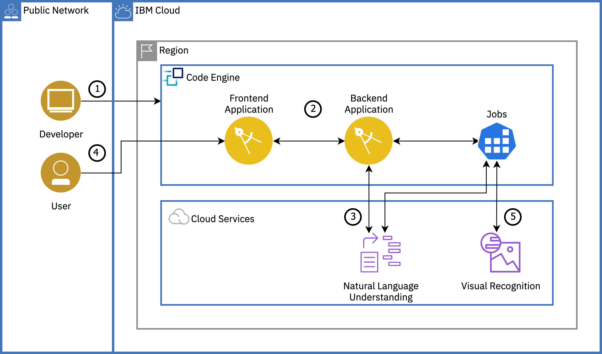
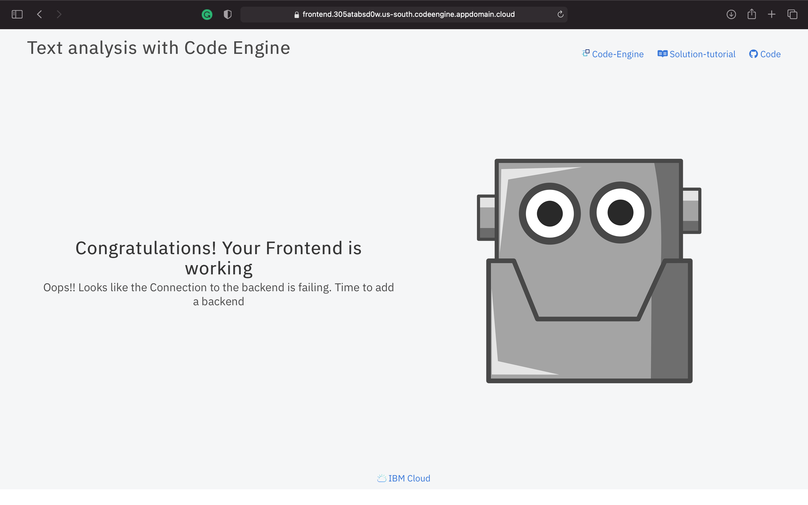

{{site.data.keyword.attribute-definition-list}}

# Text analysis with {{site.data.keyword.codeengineshort}}
{: #text-analysis-code-engine}
{: toc-content-type="tutorial"}
{: toc-services="codeengine, containers, cloud-object-storage, natural-language-understanding"}
{: toc-completion-time="2h"}

<!--##istutorial#-->
This tutorial may incur costs. Use the [Cost Estimator](/estimator/review) to generate a cost estimate based on your projected usage.
{: tip}

<!--#/istutorial#-->

In this tutorial, you will learn about {{site.data.keyword.codeenginefull}} by deploying a text analysis with {{site.data.keyword.nlushort}} application. You will create a {{site.data.keyword.codeengineshort}} project, select the project and deploy {{site.data.keyword.codeengineshort}} entities - applications and jobs - to the project. You will learn how to bind {{site.data.keyword.cloud_notm}} services to your {{site.data.keyword.codeengineshort}} entities. You will also understand the auto-scaling capability of {{site.data.keyword.codeengineshort}} where instances are scaled up or down (to zero) based on incoming workload.
{: shortdesc}

[{{site.data.keyword.codeenginefull_notm}}](/docs/codeengine) is a fully managed, serverless platform that runs your containerized workloads, including web apps, microservices, event-driven functions, or batch jobs. {{site.data.keyword.codeengineshort}} even builds container images for you from your source code. Because these workloads are all hosted within the same Kubernetes infrastructure, all of them can seamlessly work together. The {{site.data.keyword.codeengineshort}} experience is designed so that you can focus on writing code and not on the infrastructure that is needed to host it.

The platform is designed to address the needs of developers who just want their code to run. {{site.data.keyword.codeengineshort}} abstracts the operational burden of building, deploying, and managing workloads in Kubernetes so that developers can focus on what matters most to them: the source code.

## Objectives
{: #text-analysis-code-engine-objectives}

* Understand {{site.data.keyword.codeenginefull}} and how it simplifies the developer experience.
* Understand how easy it is to deploy and scale an application using {{site.data.keyword.codeengineshort}}.
* Learn the use of jobs to execute run to completion workloads.

{: caption="Figure 1. Architecture diagram of the tutorial" caption-side="bottom"}
{: style="text-align: center;"}

1. Developer creates a {{site.data.keyword.codeengineshort}} project and deploys a frontend and a backend {{site.data.keyword.codeengineshort}} application.
2. Developer connects the frontend (UI) app to the backend by modifying the frontend application to set an environment variable value to point to the backend application's endpoint.
3. Developer provisions the required cloud services and binds them to the backend application and jobs by creating secrets and configmap.
4. User uploads a text file(s) via the frontend app that is stored in {{site.data.keyword.cos_short}} through the backend application.
5. User runs a {{site.data.keyword.codeengineshort}} job via the backend to analyze text by pushing the text to {{site.data.keyword.nlushort}}. The result is then saved to {{site.data.keyword.cos_short}} and displayed in the frontend app when the user clicks the refresh button.

You can use the [{{site.data.keyword.codeengineshort}} console](/codeengine){: external} to view your progress while working through this tutorial.
{: tip}

<!--##istutorial#-->
## Before you begin
{: #text-analysis-code-engine-prereqs}

This tutorial requires:
* {{site.data.keyword.cloud_notm}} CLI - This CLI tool will enable you to interact with {{site.data.keyword.cloud_notm}}.
   * code-engine/ce plugin (`code-engine/ce`) - Plugins extend the capabilities of the {{site.data.keyword.cloud_notm}} CLI with commands specific to a service. The {{site.data.keyword.codeengineshort}} plugin will give you access to {{site.data.keyword.codeengineshort}} commands on {{site.data.keyword.cloud_notm}}.
   * **Optional** {{site.data.keyword.registryshort_notm}} plugin (`container-registry`)

You can find instructions to download and install these tools for your operating environment in the [Getting started with tutorials](/docs/solution-tutorials?topic=solution-tutorials-tutorials) guide.
To avoid the installation of these tools, this tutorial will use the [{{site.data.keyword.cloud-shell_short}}](/shell){: external} from the {{site.data.keyword.cloud_notm}} console.

## Start a new {{site.data.keyword.cloud-shell_notm}}
{: #text-analysis-cloud-shell}
{: step}

From the [{{site.data.keyword.cloud_notm}}](/){: external} console in your browser click the button in the upper right corner to create a new [{{site.data.keyword.cloud-shell_short}}](/shell){: external}.

<!--#/istutorial#-->

<!--##isworkshop#-->
<!--
## Start a new {{site.data.keyword.cloud-shell_notm}}
{: #text-analysis-code-engine-shell}
{: step}
1. From the {{site.data.keyword.cloud_notm}} console in your browser, select the account where you have been invited.
1. Click the button in the upper right corner to create a new [{{site.data.keyword.cloud-shell_short}}](/shell).

-->
<!--#/isworkshop#-->

## Create an {{site.data.keyword.codeenginefull_notm}} project
{: #text-analysis-code-engine-create_code_engine_project}
{: step}

In this section, you will create a {{site.data.keyword.codeengineshort}} project. A project is a grouping of {{site.data.keyword.codeengineshort}} entities such as applications, jobs, and builds. Projects are used to manage resources and provide access to its entities.

Putting entities into a single project enables you to manage access control more easily. The entities within a project share the same private network, which enables them to talk to each other securely. For more details read the [documentation on {{site.data.keyword.codeengineshort}} projects](/docs/codeengine?topic=codeengine-manage-project).

<!--##istutorial#-->
1. Navigate to [{{site.data.keyword.codeenginefull_notm}} Overview](/codeengine/overview){: external} page.
2. On the left pane, click on **Projects** and then click **Create**.
   - Select a location.
   - Provide a project name.
   - Select the resource group where you will create your project and also the cloud services required in the later steps. Resource groups are a way for you to organize your account resources into customizable groupings.
   - Click on **Create**.
   - Wait until the project `status` changes to **Active**.
3. Switch to the {{site.data.keyword.cloud-shell_short}} session that you started earlier and use it in this tutorial when you are asked to run CLI commands.
4. Create a shell variable with the project name and resource group name
   ```sh
   PROJECT_NAME=YourProjectName
   RESOURCE_GROUP_NAME=YourResourceGroupName
   ```

5. Target the resource group where you created your project.
   ```sh
   ibmcloud target -g $RESOURCE_GROUP_NAME
   ```
   {: pre}

6. Make the command line tooling point to your project by [selecting](/docs/codeengine?topic=codeengine-cli#cli-project-select) it.
   ```sh
   ibmcloud code-engine project select --name $PROJECT_NAME
   ```
   {: pre}

<!--#/istutorial#-->

<!--##isworkshop#-->
<!--
1. Target the resource group where to create the project:
   ```
   ibmcloud target -g <ASSIGNED_RESOURCE_GROUP_NAME>
   ```
   {: pre}

1. Create a new project with a unique name like `<your-initials>-ceproject`:
   ```
   ibmcloud code-engine project create --name $PROJECT_NAME
   ```
   {: pre}

-->
<!--#/isworkshop#-->

## Deploy the frontend and backend apps as {{site.data.keyword.codeengineshort}} applications
{: #text-analysis-code-engine-deploy_app}
{: step}

[{{site.data.keyword.codeengineshort}} applications](/docs/codeengine?topic=codeengine-application-workloads) run your code to serve HTTP requests, automatically scale up and back down to zero, and offer traffic routing to multiple revisions. In this section, you will deploy your frontend and backend applications to the {{site.data.keyword.codeengineshort}} project. The **frontend** web application will allow users to upload text files, while the **backend** application will write the file to {{site.data.keyword.cos_full_notm}}.

We've already built images for the two applications and pushed them to the public {{site.data.keyword.registryshort_notm}}. You will use these pre-built container images to deploy the respective applications. Creation of your own applications will be covered in a later step.

### Deploy a frontend application
{: #text-analysis-code-engine-4}

1. To deploy a new {{site.data.keyword.codeengineshort}} application, run the following command; providing a service name `frontend` and the pre-built container image as a parameter to `--image` flag.
   ```sh
   ibmcloud code-engine application create --name frontend --image icr.io/solution-tutorials/tutorial-text-analysis-code-engine-frontend
   ```
   {: pre}

   After running this command, you should see some output with a URL to your application. It should look something like: `https://frontend.305atabsd0w.us-south.codeengine.appdomain.cloud`. Copy or make note of this application URL for the next step. With just these two pieces of data (application name and image name), {{site.data.keyword.codeengineshort}} has deployed your application and will handle the complexities of configuring it and managing it for you.

   <!--##istutorial#-->
   The application source code used to build the container images is available in a [GitHub repo](https://github.com/IBM-Cloud/code-engine-text-analysis){: external} for your reference. If you wish to build the container images from source code and push the images to a private Container Registry, follow the [instructions here](/docs/solution-tutorials?topic=solution-tutorials-text-analysis-code-engine#text-analysis-code-engine-private-registry).
   {: tip}
   
   <!--#/istutorial#-->

2. Open the application URL from the previous step in a browser to see an output similar to this:
   {: caption="Frontend is running" caption-side="bottom"}

   Run `ibmcloud code-engine application get -n frontend` command to see the details of the application. You should see details like the ID, project information, age of the application, the URL to access the application, a Console URL to access your application configuration, Image, Resource allocation, and various revisions, conditions and runtime for your application. Since you only have one revision, you should see that 100% of the traffic is going to the latest revision. You can also check the number of instances and their status.
   {: tip}

3. For troubleshooting and to [check the logs of your application](/docs/codeengine?topic=codeengine-view-logs), run the following command by replacing the `<INSTANCE_NAME>` with the **name** of one of the instances from the `ibmcloud code-engine application get -n frontend` command.
   
   If you do not see any running instances, make sure to open the application URL from step 2 again.
   {: tip}

   ```sh
   ibmcloud code-engine application logs --instance <INSTANCE_NAME>
   ```
   {: pre}

   If the application is running, you should see `backend URL: undefined` and App listening on port 8080. Later on in the tutorial, you will connect this frontend application to our backend application

Congratulations!! You've just deployed a web application to {{site.data.keyword.codeengineshort}} with a simple command and also without needing to know about the intricacies of Kubernetes such as pods, deployments, services, and ingress.

### Scale the application
{: #text-analysis-code-engine-5}

When you created the application with the `application create` command, you only passed in an image to use and a name for your application. While this is the minimum amount of information to deploy an application, there are a [number of other knobs you have control over](/docs/codeengine?topic=codeengine-app-scale). Among others, you can set the number of requests that can be processed concurrently per instance, the amount of CPU for the instance of the application, the amount of memory set for the instance of the application, the environment variables for the application, the maximum and minimum number of instances that can be used for this application, and the port where the application listens for requests.

Most of these values have a default set if nothing is provided as an option when creating the application. Because we did not provide a value, {{site.data.keyword.codeengineshort}} deployed our application with a default max scale of 10, meaning that it will only scale our application up to 10 instances. The default minimum scale is zero, so that when our application is no longer in use, it will scale itself back down to zero.

1. To check the autoscaling capabilities of {{site.data.keyword.codeengineshort}}, we can use a load generator to generate a load against our service. This load generator will simulate about 300 clients requesting the URL for 30 seconds. Navigate to the [load generator URL](https://load.fun.cloud.ibm.com/){: external} and paste the frontend application URL from the step above.
2. Click on **Generate load** to generate traffic.
3. Run the below command to see the instance(pod) count incrementing as part of the autoscaling.
   ```sh
   ibmcloud code-engine application get -n frontend
   ```
   {: pre}

   By default, the maximum number of requests that can be processed concurrently per instance is `10` leading to autoscaling and this value can be changed using `--concurrency or -cn` flag with `application update` command.
   {: tip}

4. If you didn't want to allow as many as 10 instances to be created, you can adjust the max scale to be a lower number. While your serverless application can easily scale up, you may depend on a downstream service such as a SQL DB that can only handle a limited number of connections or another rate limited API. Let's try limiting the number of instances for this frontend application.
    ```sh
    ibmcloud code-engine application update --name frontend --max-scale 5
    ```
    {: pre}
    
5. Once load generation is stopped, wait for a few minutes to see the instances terminating, eventually scaling down to zero instances.
6. Again, navigate to the [load generator URL](https://load.fun.cloud.ibm.com/){: external} and paste the frontend application URL from the step above. Run the `ibmcloud code-engine application get -n frontend` command to see the instance count increasing to 5.

    Expected Output:
    ```sh
    Name                                        Revision        Running  Status   Restarts  Age
    frontend-00002-deployment-77d5fbfb5d-7zpfl  frontend-00002  3/3      Running  0         70s
    frontend-00002-deployment-77d5fbfb5d-kv6rn  frontend-00002  3/3      Running  0         69s
    frontend-00002-deployment-77d5fbfb5d-mhlwn  frontend-00002  3/3      Running  0         68s
    frontend-00002-deployment-77d5fbfb5d-qkjmd  frontend-00002  3/3      Running  0         67s
    frontend-00002-deployment-77d5fbfb5d-zpr9n  frontend-00002  3/3      Running  0         85s
    ```
    {: screen}

### Deploy a backend application and test the connection
{: #text-analysis-code-engine-6}

1. To deploy a new backend application to store your text files into {{site.data.keyword.cos_full_notm}}, run this command
   ```sh
   ibmcloud code-engine application create --name backend --image icr.io/solution-tutorials/tutorial-text-analysis-code-engine-backend --cluster-local
   ```
   {: pre}

   The `--cluster-local` flag will instruct {{site.data.keyword.codeengineshort}} to keep the endpoint for this application private, meaning that it will only be available from within the project. This is often used for security purposes. In this case, there is no reason to expose the backend application with a public endpoint, since it will not be accessed from outside of the cluster.
   {: tip}

2. Copy and save the internal endpoint (URL) from the output to use it in the next command.  It will look something like this:
   ```sh
   BACKEND_PRIVATE_URL=http://backend.xxxxxx
   ```
   {: pre}

   You can run `ibmcloud code-engine application get -n backend` command to check the status and details of the backend application which includes the **URL**.
   {: tip}

3. The frontend application uses an environment variable (BACKEND_URL) to know where the backend application is hosted. You now need to update the frontend application to set this value to point to the backend application's endpoint.
   ```sh
   ibmcloud code-engine application update --name frontend --env BACKEND_URL=$BACKEND_PRIVATE_URL
   ```
   {: pre}

   The `--env` flag can appear as many times as you would like if you need to set more than one environment variable. This option could have also been used on the `ibmcloud code-engine application create` command for the frontend application if you knew its value at that time. Learn more by reading the [Working with environment variables](/docs/codeengine?topic=codeengine-envvar) documentation topic.
   {: tip}

4. Hard refresh the frontend URL on the browser to test the connection to the backend application. You should see a page with an option to upload a text file(.txt) and also an error message from the backend application as the backend is still not connected with the required {{site.data.keyword.cloud_notm}} services to store and process the text files. Clicking on **Upload text file** should also show a similar error message.

## Connect the backend application to {{site.data.keyword.cos_short}} service
{: #text-analysis-code-engine-0}
{: connect_cloud_services}
{: step}

In this section, you will provision the required {{site.data.keyword.cos_short}} and {{site.data.keyword.nlushort}} services and bind the {{site.data.keyword.cos_short}} service to the backend application. The backend application will store the text files into the {{site.data.keyword.cos_short}}, while the {{site.data.keyword.nlushort}} will be used later in the tutorial to perform text analysis on the uploaded text files.

With {{site.data.keyword.nlufull}}, developers can analyze semantic features of text input, including categories, concepts, emotion, entities, keywords, metadata, relations, semantic roles, and sentiment.

### Provision {{site.data.keyword.cos_short}} and {{site.data.keyword.nlushort}} services
{: #text-analysis-code-engine-create_services}

1. Create an instance of [{{site.data.keyword.cos_short}}](/catalog/services/cloud-object-storage){: external}
   1. Select the **Lite** plan or the **Standard** plan if you already have an {{site.data.keyword.cos_short}} service instance in your account.
   2. Set **Service name** to **your-initials-code-engine-cos**.
   3. Select the resource group where you created the {{site.data.keyword.codeengineshort}} project.
   4. Click on **Create**.
   5. Capture the service name in a shell variable:
      ```sh
      COS_INSTANCE_NAME=your-initials-code-engine-cos
      ```
      {: pre}

3. Under **Create Bucket** click **Create Bucket**, then under **Create a Custom Bucket** select **Create**.

   _When you create buckets or add objects, be sure to avoid the use of Personally Identifiable Information (PII).Note: PII is information that can identify any user (natural person) by name, location, or any other means._
   1. Enter **Unique bucket name** such as `<your-initials>-bucket-code-engine`.
   3. Select a **Location**, where you created the {{site.data.keyword.codeengineshort}} project.
   2. Select **Smart Tier** Storage class.
   3. Click **Create bucket**.
   4. Capture the bucket name in a shell variable:
      ```sh
      COS_BUCKETNAME=your-initials-bucket-code-engine
      ```
      {: pre}

4. On the bucket page.
   1. Click the **Configuration** tab
   2. The **Direct** endpoint will keep data within {{site.data.keyword.cloud_notm}}. Capture the direct endpoint in a shell variable.  In the Dallas, us-south, region it might be:
      ```sh
      COS_ENDPOINT=s3.direct.us-south.cloud-object-storage.appdomain.cloud
      ```
      {: pre}

5. Create an instance of [{{site.data.keyword.nlushort}}](/catalog/services/natural-language-understanding){: external}
   1. Select a location and select **Lite** plan.
   2. Set **Service name** to **<!--##isworkshop#--><!--&lt;your-initials&gt;---><!--#/isworkshop#-->code-engine-nlu** and select the resource group where you created the {{site.data.keyword.codeengineshort}} project.
   3. Read the license agreement and then check **I have read and agree to the following license agreements:**.
   4. Click on **Create**.
   5. Capture the service name in a shell variable:
      ```sh
      NLU_INSTANCE_NAME=YourServiceName
      ```
      {: pre}

<!--##isworkshop#-->
<!--
### Create a Service ID
{: #text-analysis-code-engine-create_service_id}

To give your {{site.data.keyword.codeengineshort}} project access to the services you provisioned, you will create a [service ID](/iam/serviceids) and configure it with the right access policies.

1. Go the page to manage [Service IDs](/iam/serviceids).
1. **Create** a new service ID with a unique name, e.g `<PROJECT-NAME>-serviceId`.
1. Click **Details** and make note of the `ID` of the Service ID. You will need it later.
1. Select the **Access policies** tab.
1. Click **Assign access**
1. Add one access policy for the {{site.data.keyword.cos_short}} service:
   1. Select **IAM services**.
   2. Select **Cloud Object Storage** from the list.
   3. Select **Services based on attribute**, then **Service instance**, then pick the instance you previously created from the list.
   4. Check **Operator** and **Writer** as roles.
   5. Add the policy.
1. Add another policy for the {{site.data.keyword.nlushort}} service:
   1. Select **IAM services**.
   2. Select **{{site.data.keyword.nlushort}}** from the list.
   3. Select **Services based on attribute**, then **Service instance**, then pick the instance you previously created from the list.
   4. Check **Operator** and **Writer** as roles.
   5. Add the policy.
1. Click **Assign**.

Now that you have configured the service ID, you need to update the {{site.data.keyword.codeengineshort}} project so that this service ID will be used when binding services.

1. From the command line, update the project:
   ```
   ibmcloud code-engine project update --binding-service-id <ID-of-the-Service-ID-retrieved-from-Details-panel>
   ```
-->
<!--#/isworkshop#-->

### Bind the {{site.data.keyword.cos_short}} service to the backend application
{: #text-analysis-code-engine-9}

Now, you will need to pass in the credentials for the {{site.data.keyword.cos_full_notm}} instance you just created into your backend application. You will do this by [binding](/docs/codeengine?topic=codeengine-service-binding) the {{site.data.keyword.cos_short}} service to your application, which automatically adds credentials for a service to the environment variables for your application or job.

1. Create a binding for {{site.data.keyword.cos_short}} service with a prefix `COS` for ease of use in your application. The **bind** command creates a service credential in the service instance and from that initializes the environment variables of the application with the credentials. _Each service binding can be configured to use a custom environment variable prefix by using the `--prefix` flag._
   ```sh
   ibmcloud code-engine application bind --name backend --service-instance $COS_INSTANCE_NAME --role Writer --prefix COS
   ```
   {: pre}

2. You will also need to provide the application with your bucket name where you want to store the text files, as well as your COS endpoint. Both of these were defined in an earlier step.  The endpoint for us-south for the **Smart tier** is **s3.direct.us-south.cloud-object-storage.appdomain.cloud**.

   [Define a configmap](/docs/codeengine?topic=codeengine-configmap) to hold the bucket name and the endpoint as the information isn't sensitive. ConfigMaps are a Kubernetes object, which allows you to decouple configuration artifacts from image content to keep containerized applications portable. You could create this configmap from a file or from a key value pair -- for now we'll use a key value pair with the `--from-literal` flag.  Verify that you captured these earlier and create the configmap:
   ```sh
   echo bucket $COS_BUCKETNAME endpoint $COS_ENDPOINT
   ```
   {: pre}

   ```sh
   ibmcloud code-engine configmap create --name backend-configuration --from-literal=COS_BUCKETNAME=$COS_BUCKETNAME --from-literal=COS_ENDPOINT=$COS_ENDPOINT
   ```
   {: pre}

4. With the configmap defined, you can now update the backend application by asking {{site.data.keyword.codeengineshort}} to set environment variables in the runtime of the application based on the values in the configmap. Update the backend application with the following command
   ```sh
   ibmcloud code-engine application update --name backend --env-from-configmap backend-configuration
   ```
   {: pre}

   To create a secret, you would need to use `--env-from-secret` flag. Both secrets and configmaps are "maps"; so the environment variables set will have a name corresponding to the "key" of each entry in those maps, and the environment variable values will be the value of that "key".
   {: tip}

5. To verify whether the backend application is updated with the binding and configmap. You can run the below command and look for the `Service Bindings` and `Environment Variables` sections in the output
   ```sh
   ibmcloud code-engine application get --name backend
   ```
   {: pre}

6. Go to the frontend UI and **upload text files** for text analysis. You should see the uploaded files with `Not analyzed` tag on them.


## Process text files with an automated job
{: #text-analysis-code-engine-test_the_app}
{: step}

Now, you have the backend application connected to the frontend application. You have provided all the required credentials through service binding and uploaded files for text analysis. To complete the test, you will create a job to specify workload configuration information that is used each time that the job is run to analyze text using {{site.data.keyword.nlushort}} service.

### Create a job
{: #text-analysis-code-engine-11}

[Jobs](/docs/codeengine?topic=codeengine-job-plan), unlike applications which react to incoming HTTP requests, are meant to be used for running container images that contain an executable designed to run one time and then exit. When you create a `job`, you can specify workload configuration information that is used each time the job is run. You can create a job from the console or with the CLI.

This job will read text files from {{site.data.keyword.cos_full_notm}}, and then analyze them using the {{site.data.keyword.nlushort}} Service. It will need to have access to service credentials for both services.

1. Run the following command to create a job,
   ```sh
   ibmcloud code-engine job create --name backend-job --image icr.io/solution-tutorials/tutorial-text-analysis-code-engine-backend-job --env-from-configmap backend-configuration
   ```
   {: pre}

   You can set the version of {{site.data.keyword.nlushort}} service using the `--env` flag. For versioning, check this [link](/docs/natural-language-understanding?topic=natural-language-understanding-versioning)
   {: tip}

### Bind the {{site.data.keyword.cloud_notm}} services to job
{: #text-analysis-code-engine-12}

1. Let's create a binding for {{site.data.keyword.cos_short}} service with a prefix `COS_JOB` to be used with the jobs to read the uploaded files and to store the results,
   ```sh
   ibmcloud code-engine job bind --name backend-job --service-instance $COS_INSTANCE_NAME --role Writer --prefix COS_JOB
   ```
   {: pre}

2. Similarly, let's bind {{site.data.keyword.nlushort}} service with a prefix `NLU_JOB` to analyze the uploaded text files,
   ```sh
   ibmcloud code-engine job bind --name backend-job --service-instance $NLU_INSTANCE_NAME --role Writer --prefix NLU_JOB
   ```
   {: pre}

3. To verify whether the job is updated with the binding and configmap. You can run the below command and look for the `Service Bindings` and `Environment Variables` sections in the output
   ```sh
   ibmcloud code-engine job get --name backend-job
   ```
   {: pre}

### Run the job
{: #text-analysis-code-engine-13}

1. To [run a job](/docs/codeengine?topic=codeengine-run-job) with the configuration created above, use the `jobrun submit` command,
   ```sh
   ibmcloud code-engine jobrun submit --name backend-jobrun --job backend-job
   ```
   {: pre}

   When you run a job, you can override many of the variables that you set in the job configuration. To check the variables, run `ibmcloud code-engine jobrun submit --help`.
   {: tip}

2. To check the status of the `jobrun`, run the following command
   ```sh
   ibmcloud code-engine jobrun get --name backend-jobrun
   ```
   {: pre}

3. The logs can be displayed:
   ```sh
   ibmcloud code-engine jobrun logs --follow --name backend
   ```
   {: pre}

4. In the frontend UI, click on the **refresh** button (next to Upload text file) to see the **Keywords** and **JSON** for each of the uploaded text files. The tag on each file should now change to `Analyzed`.
6. Upload new files or delete individual file by clicking the **delete** icon, resubmit the **jobrun** with the below command and hit the **refresh** button to see the results.
   ```sh
   ibmcloud code-engine jobrun resubmit --jobrun backend-jobrun
   ```
   {: pre}

### Automate the job run
{: #text-analysis-code-engine-automate}

Instead of running the job manually, you can automate the job run by creating an {{site.data.keyword.cos_full_notm}} subscription that listens for changes to an {{site.data.keyword.cos_short}} bucket. When you create a [subscription](/docs/codeengine?topic=codeengine-subscribing-events) to a bucket, your job receives a separate event for each successful change to that bucket. 

1. Before you can create an {{site.data.keyword.cos_short}} subscription, you must assign the `Notifications Manager` role to {{site.data.keyword.codeengineshort}}. As a Notifications Manager, {{site.data.keyword.codeengineshort}} can view, modify, and delete notifications for an {{site.data.keyword.cos_short}} bucket. [Follow the instructions here](/docs/codeengine?topic=codeengine-eventing-cosevent-producer#notify-mgr-cos) to assign the Notifications Manager role to your {{site.data.keyword.codeengineshort}} project.
2. Run the below command to connect your `backend-job` to the {{site.data.keyword.cos_full_notm}} event producer. _Check and update the `bucket name` before running the command_
   ```sh
   ibmcloud code-engine subscription cos create --name backend-job-cos-event --destination-type job --destination backend-job --bucket $COS_BUCKETNAME --prefix files --event-type write
   ```
   {: pre}

5. Now, just upload new files and hit the **refresh** button to see the results. Going forward, you don't have to resubmit the **jobrun** as it is taken care by the subscription.

<!--##istutorial#-->
## Optional: Build and push the container images to {{site.data.keyword.registrylong_notm}}
{: #text-analysis-code-engine-private-registry}
{: step}

There are a few options for [building a container image with stand-alone build commands](/docs/codeengine?topic=codeengine-build-standalone).  [Running a single build that pulls source from a local directory](/docs/codeengine?topic=codeengine-build-standalone#buildsa-local) is used to create a new frontend application:

```sh
git clone https://github.com/IBM-Cloud/code-engine-text-analysis
cd code-engine-text-analysis/frontend
echo $BACKEND_PRIVATE_URL
```
{: pre}

You can change some of the source code to verify. The second occurrence of `Text analysis with Code Engine` in the **body** of public/index.html and public/501.html can be changed to add in your name. Create the container image in a code engine namespace and create the application in one command:
```sh
ibmcloud ce application create --name frontend-fromsource --build-source . --env BACKEND_URL=$BACKEND_PRIVATE_URL
```
{: pre}

<!--#/istutorial#-->

## Remove resources
{: #text-analysis-code-engine-cleanup}
{: step}

1. With the command below, delete the project to delete all its components (applications, jobs etc.).
   ```sh
   ibmcloud code-engine project delete --name $PROJECT_NAME
   ```
   {: pre}
   
2. Navigate to [Resource List](/resources/){: external}, then delete the services you created:
   * {{site.data.keyword.cos_full}}
   * {{site.data.keyword.nlufull}}<!-- markdownlint-disable-line -->
<!--##isworkshop#-->
<!--
1. [Delete the Service ID](/iam/serviceids) used for the project.
-->
<!--#/isworkshop#-->

Depending on the resource it might not be deleted immediately, but retained (by default for 7 days). You can reclaim the resource by deleting it permanently or restore it within the retention period. See this document on how to [use resource reclamation](/docs/account?topic=account-resource-reclamation).
{: tip}

## Related resources
{: #text-analysis-code-engine-related_resources}

- [{{site.data.keyword.codeenginefull_notm}} Documentation](/docs/codeengine)
- [Building applications by using buildpacks](/docs/codeengine?topic=codeengine-build-app-tutorial)
- [Getting started with subscriptions](/docs/codeengine?topic=codeengine-subscribing-events)
