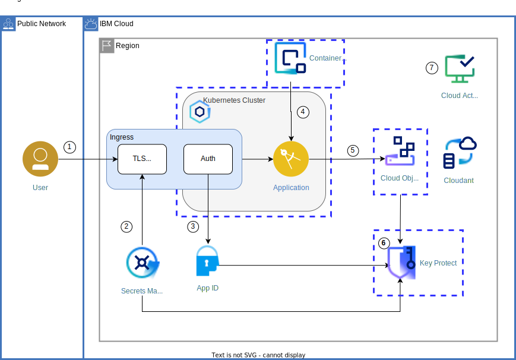
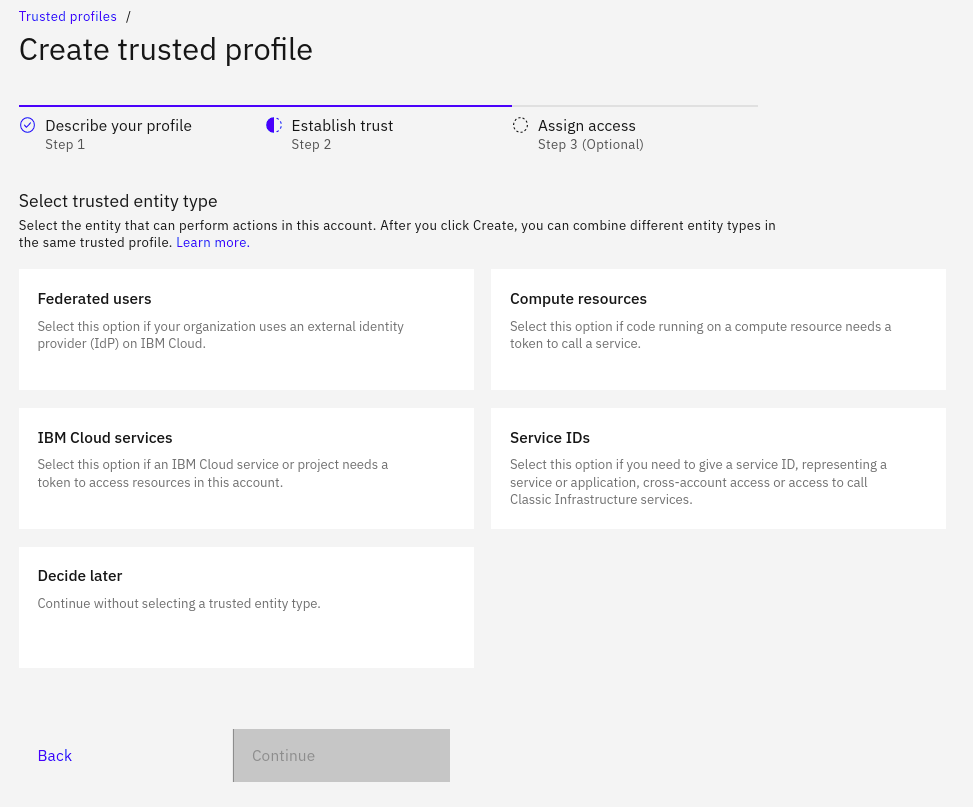

{{site.data.keyword.attribute-definition-list}}

# Use trusted profiles as foundation for secure cloud environments
{: #trusted-profile-for-enterprise-security}
{: toc-content-type="tutorial"}
{: toc-services="containers, Cloudant"}
{: toc-completion-time="2h"}

This tutorial may incur costs. Use the [Cost Estimator](/estimator/review) to generate a cost estimate based on your projected usage.
{: tip}

{{site.data.keyword.cloud_notm}} [Identity and Access Management (IAM)](/docs/account?topic=account-cloudaccess) enables you to control which users see, create, use, and manage resources in your cloud environment. Your environment might be a single {{site.data.keyword.cloud_notm}} account, multiples accounts, or an [enterprise](/docs/secure-enterprise?topic=secure-enterprise-what-is-enterprise) with a hierarchy of many account groups and accounts. When operating with account resources, typically users and service IDs are involved. But there are more options available to manage access, assign privileges, and to identify: [Trusted profiles](/docs/account?topic=account-identity-overview#trustedprofiles-bestpract).

In this tutorial, you are going to learn about trusted profiles, their use cases, and how to utilize them for enhanced security. Learn how to use trusted profiles as foundation for secure cloud environments. They can serve as building block for secure cloud solutions.

Learn about trusted profiles as building block for secure cloud environments
{: shortdesc}

## Objectives
{: #trusted-profile-for-enterprise-security-objectives}

* Learn about use cases for trusted profiles
* Create trusted profiles and manage access to cloud resources
* Deepen your Identity and Access Management (IAM) knowledge

{: caption="Solution architecture" caption-side="bottom"}

## Before you begin
{: #trusted-profile-for-enterprise-security-prereqs}

This tutorial requires:
* An {{site.data.keyword.cloud_notm}} [billable account](/docs/account?topic=account-accounts)

You will find instructions to download and install these tools for your operating environment in the [Getting started with solution tutorials](/docs/solution-tutorials?topic=solution-tutorials-tutorials) guide.

To avoid the installation of these tools you can use the [{{site.data.keyword.cloud-shell_short}}](/shell) from the {{site.data.keyword.cloud_notm}} console.
{: tip}

## Overview: Trusted profiles
{: #trusted-profile-for-enterprise-security-overview}

Similar to users and service IDs, [trusted profiles](/docs/account?topic=account-identity-overview#trustedprofiles-bestpract) are identities that can be granted access in IAM policies. Trusted profiles differ in that they cannot create and own API keys. They are an identity within a specific account which serves as "gateway" for someone or something else to work within that account without the need for an API key. You configure that someone or something else (see below) as part of the trusted profile setup. All the usual options are available, the {{site.data.keyword.cloud_notm}} API, CLI, any of the available SDKs or the {{site.data.keyword.cloud_notm}} console. 

In the console, as part of the IAM category, [trusted profiles](/iam/trusted-profiles) have their own section. There, you can easily create and manage them. The following screenshot shows the second step of the dialog to create a trusted profile. You can [configure which entity can assume the identity of the trusted profile](/docs/account?topic=account-create-trusted-profile), one or more of:
- Federated users
- Compute resources
- {{site.data.keyword.cloud_notm}} services
- Service IDs

{: caption="Trusted profile types" caption-side="bottom"}

Learn about trusted profiles
- what is a TP
- what are the supported use cases
- what is needed to use a TP

## Trusted profile use cases
{: #trusted-profile-for-enterprise-security-use-cases}

Trusted profiles are identities within {{site.data.keyword.cloud_notm}}. They can be members of IAM access groups and thereby have assigned access privileges. Similar to users and service IDs, you can also directly assign access to trusted profiles. The distinguishing feature is the ability to configure a trusted profiles, so that specific identities or resources can act under its identity. These identities and resources might be even located in other accounts. Thus, on a high level, ***the*** use case for using trusted profiles is to allow administrative work
- with a given set of privileges
- under a specific identity
- for identities or resources identified by a set of properties configured as part of the trusted profile.

The following scenarios are such use cases for trusted profiles, differing by the way the trust is established:
- **Map federated users and their group membership to {{site.data.keyword.cloud_notm}} privileges**: Configure a trusted profile to let users of a federated identity provider assume its identity. You can define which IdP and what user attributes to consider.
- **Perform administrative tasks from dedicated compute resources**: You can configure a trusted profile to establish trust through a well-known compute resource. Such a resource might be a specific pod in a Kubernetes cluster or a virtual server instance (VSI) in a virtual private cloud ({{site.data.keyword.vpc_short}}).
- **Perform administrative tasks from a well-known service ID**: A service ID from the same or another account is allowed to assume the identity of the trusted profile.
- **Deploy cloud resources from an instance of a special cloud service**: Configure an instance of an{{site.data.keyword.cloud_notm}} service, identified by its CRN ([cloud resource name](/docs/overview?topic=overview-glossary#x9494304)) to be allowed to assume the identity of a trusted profile. A typical scenario is for an [enterprise project to deploy an architecture](/docs/secure-enterprise?topic=secure-enterprise-tp-project).

## Federated identity
{: #trusted-profile-for-enterprise-security-federated-id}

[Users that utilize a corporate or enterprise single sign-on ID to log in to {{site.data.keyword.cloud_notm}}](/docs/account?topic=account-federated_id) are called federated identities. The single sign-on (SSO) provider acts as identity provider (IdP). A great advantage of utilizing federated identities is that [users do not need new credentials to use {{site.data.keyword.cloud_notm}} and continue to use their companies' IdP for authentication](/docs/account?topic=account-account-getting-started#signup-federated). 

ederated identities can be used in two ways

[perform operations work in the console under the umbrella of a trusted profile](/docs/account?topic=account-federated_id&interface=ui#login_console_trustedprofile)

details on federated ID, including resources and blogs, why should I use it?

- bring in users from corporate directory (LDAP, Active Directory)
- uses SAML or OIDC via App ID
- use dynamic rule in Access Group to determine which users to map to IBM Cloud privileges

federated ID, bring in users from corporate directory (LDAP, Active Directory), uses SAML or OIDC via App ID, use rules to determine which users to map to IBM Cloud privileges / access groups - need to distinguish between dynamic rule in AG (login) and rules / conditions in TP, can operate either under TP or add user to account

## Compute resource
{: #trusted-profile-for-enterprise-security-compute-resource}

- supported CR
- how to obtain the token
- how to develop app for using CR token locally, see blog post
- [IAM condition properties](docs/account?topic=account-iam-condition-properties)

avoid using API keys, but perform (administrative) tasks, access to a compute resource indicates privilege, compute resource can obtain token, turn into IAM token and perform the action

## Remove resources
{: #trusted-profile-for-enterprise-security-removeresources}
{: step}

Steps to take to remove the resources created in this tutorial

Depending on the resource it might not be deleted immediately, but retained (by default for 7 days). You can reclaim the resource by deleting it permanently or restore it within the retention period. See this document on how to [use resource reclamation](/docs/account?topic=account-resource-reclamation).
{: tip}

## Related content
{: #trusted-profile-for-enterprise-security-related}

some content here