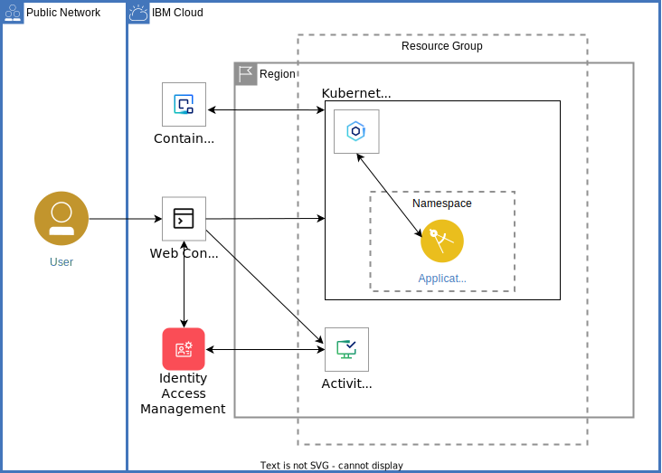
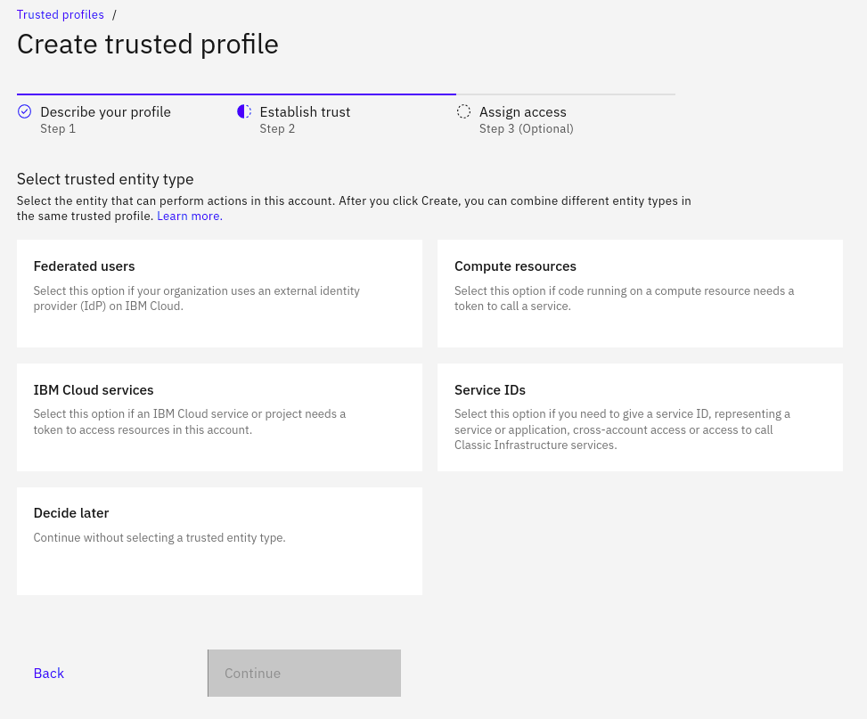

{{site.data.keyword.attribute-definition-list}}

# Use trusted profiles as foundation for secure cloud environments
{: #trusted-profile-for-enterprise-security}
{: toc-content-type="tutorial"}
{: toc-services="secure-enterprise, containers, cloud-logs, atracker, Registry"}
{: toc-completion-time="2h"}
{: toc-use-case="IdentityAndAccessManagement, ApplicationIntegration"}

This tutorial may incur costs. Use the [Cost Estimator](/estimator){: external} to generate a cost estimate based on your projected usage.
{: tip}

{{site.data.keyword.cloud_notm}} [Identity and Access Management (IAM)](/docs/account?topic=account-cloudaccess) enables you to control which users see, create, use, and manage resources in your cloud environment. Your environment might be a single {{site.data.keyword.cloud_notm}} account, multiples accounts, or an [enterprise](/docs/enterprise-management?topic=enterprise-management-what-is-enterprise) with a hierarchy of many account groups and accounts. When operating with account resources, often, users and service IDs are involved. Yet, there are more options available to manage access, assign privileges, and to identify: [Trusted profiles](/docs/account?topic=account-identity-overview#trustedprofiles-bestpract).

In this tutorial, you are going to learn about trusted profiles, their use cases, and how to utilize them for enhanced security. Trusted profiles can serve as foundation for secure cloud environments, as building block for secure cloud solutions. As part of this tutorial, you will create a trusted profile which is utilized by an app to perform administrative tasks.


## Objectives
{: #trusted-profile-for-enterprise-security-objectives}

* Learn about use cases for trusted profiles
* Create trusted profiles and manage access to cloud resources
* Deepen your Identity and Access Management (IAM) knowledge

{: caption="Solution architecture" caption-side="bottom"}

- The container image for the application is pulled from the {{site.data.keyword.registryshort_notm}} and deployed to the Kubernetes cluster into a namespace.
- The user connects to the application.
- The application reads a special access token from the Kubernetes environment and turns it into an IAM access token for a trusted profile.
- IAM logs auditing events to {{site.data.keyword.atracker_full_notm}}.

## Before you begin
{: #trusted-profile-for-enterprise-security-prereqs}

This tutorial does not require any installation and is only using the [{{site.data.keyword.cloud_notm}} console](/){: external}.

The [{{site.data.keyword.atracker_full_notm}}](/docs/atracker?topic=atracker-about) must be configured to route auditing events to a {{site.data.keyword.logs_full_notm}} target instance. Route global audit events as described in [configuring an IBM Logs target](/docs/atracker?topic=atracker-getting-started-target-cloud-logs) if not currently configured in your account.

## Overview: Trusted profiles
{: #trusted-profile-for-enterprise-security-overview}

Similar to users and service IDs, [trusted profiles](/docs/account?topic=account-identity-overview#trustedprofiles-bestpract) are identities that can be granted access in IAM policies. Trusted profiles differ in that they cannot create and own API keys. They are an identity within a specific account which serves as "gateway" for someone or something else to work within that account without the need for an API key. They can assume the identity of that trusted profile. 

You configure that someone or something else (see below) as part of the trusted profile setup. All the usual options are available, the {{site.data.keyword.cloud_notm}} API, CLI, any of the available SDKs, Terraform or the {{site.data.keyword.cloud_notm}} console. 

In the console, as part of the IAM category, [trusted profiles](/iam/trusted-profiles){: external} have their own section. There, you can easily create and manage them. The following screenshot shows the second step of the dialog to create a trusted profile. You can [configure how to establish trust](/docs/account?topic=account-create-trusted-profile), which entity can assume the identity of the trusted profile. It is one or more of:
- Federated users
- Compute resources
- {{site.data.keyword.cloud_notm}} services
- Service IDs

{: caption="Trusted entity types" caption-side="bottom"}


## Trusted profile use cases
{: #trusted-profile-for-enterprise-security-use-cases}

Trusted profiles are identities within {{site.data.keyword.cloud_notm}}. They can be members of IAM access groups and thereby have assigned access privileges. Similar to users and service IDs, you can also directly assign access to trusted profiles. The distinguishing feature is the ability to configure a trusted profile, so that specific identities or resources can act under its identity. These identities and resources might be even located in other accounts. Thus, on a high level, ***the*** use case for using trusted profiles is to allow administrative work
- with a given set of privileges
- under a specific identity
- for identities or resources identified by a set of properties configured as part of the trusted profile.

The following scenarios are such use cases for trusted profiles, differing by the way the trust is established:
- **Map federated users and their group membership to {{site.data.keyword.cloud_notm}} privileges**: Configure a trusted profile to let users of a federated identity provider assume its identity. You can define which IdP and what user attributes to consider.
- **Perform administrative tasks from dedicated compute resources**: You can configure a trusted profile to establish trust through a well-known compute resource. Such a resource might be a specific pod in a Kubernetes cluster (including {{site.data.keyword.openshiftlong_notm}}) or a virtual server instance (VSI) in a virtual private cloud ({{site.data.keyword.vpc_short}}).
- **Perform administrative tasks from a well-known service ID**: A service ID from the same or another account is allowed to assume the identity of the trusted profile.
- **Deploy cloud resources from an instance of a special cloud service**: Configure an instance of an {{site.data.keyword.cloud_notm}} service, identified by its CRN ([cloud resource name](/docs/overview?topic=overview-glossary#x9494304)) to be allowed to assume the identity of a trusted profile. A typical scenario is for an [enterprise project to deploy an architecture](/docs/enterprise-management?topic=enterprise-management-understanding-projects).

## Establish trust
{: #trusted-profile-for-enterprise-security-trust}

As outlined in the overview, there are different options available on how to establish trust, how an entity can assume the identity of a trusted profile.

### Federated identity
{: #trusted-profile-for-enterprise-security-federated-id}

[Users that utilize a corporate or enterprise single sign-on ID to log in to {{site.data.keyword.cloud_notm}}](/docs/account?topic=account-federated_id) are called federated identities. The single sign-on (SSO) provider acts as identity provider (IdP). A great advantage of utilizing federated identities is that [users do not need new credentials to use with {{site.data.keyword.cloud_notm}} and can continue to use their companies' IdP for authentication](/docs/account?topic=account-account-getting-started#signup-federated). 

Federated identities can be used with trusted profiles and [in dynamic rules of IAM access groups](/docs/account?topic=account-rules).
{: note}

### Compute resource
{: #trusted-profile-for-enterprise-security-compute-resource}

Instead of through user properties supplied by an identity provider, in this case, trust is established through [attributes of compute resources](/docs/account?topic=account-iam-condition-properties#cr-attribute-names). You can configure to only trust an app running in, e.g., a specific namespace and pod in a Kubernetes cluster, or a virtual server instance in a VPC with a specific combination of values for resource group, region, subnet, and zone. That trusted app can assume the identity of the trusted profile and perform tasks with the assigned privileges.

The benefit of utilizing a trusted profile based on a compute resource is that this solution avoids using an API key. Thus, there are no requirements and challenges on how to create, store and protect any shared API key, how to assign and manage privileges. The app which assumes the identity of a trusted profile simply fetches a special compute resource token, then turns it into a regular IAM access token for the trusted profile. Thereafter, the intended tasks can be performed with the token provided for authentication.

See the blog post [Developer Tricks: Simulate Cloud Security for Local App Development](https://www.ibm.com/products/blog/developer-tricks-simulate-cloud-security-for-local-app-development){: external} for some background on the compute resource token. Learn how to locally develop and test apps utilizing that token.
{: tip}


### Service ID
{: #trusted-profile-for-enterprise-security-service-id}

Another method to establish trust is by specifying a service ID. The service ID can be from the same or other account. Because service IDs are unique identities across all {{site.data.keyword.cloud_notm}} accounts, no further attributes need to be configured. With that setup in place, a service ID from an account A can now request to assume the identity of a trusted profile in account B and perform (administrative) tasks.


### Cloud service instance
{: #trusted-profile-for-enterprise-security-service-instance}

Similar to a service ID, it is possible to specify the cloud resource name (CRN) of an {{site.data.keyword.cloud_notm}} service instance, so that the instance is a trusted resource. That service instance can be located in the same or another account. Right now, its only supported scenario is for an [enterprise project to deploy an architecture](/docs/enterprise-management?topic=enterprise-management-understanding-projects). Projects, as service instances, with deployable architectures can be managed centrally in one account. By establishing trust through the project's CRN, it can assume the identity of a trusted profile in another account in the same or another enterprise account hierarchy, then deploy a solution pattern with its resources.


## Trusted profile with compute resource
{: #trusted-profile-for-enterprise-security-cr0}
{: step}

To put theory into practice, you are going to authorize a containerized app to perform tasks in an {{site.data.keyword.cloud_notm}} account. The app is deployed to a Kubernetes cluster. It serves as compute resource which is going to be used to establish trust to use the trusted profile. You can perform all the following steps in a web browser with multiple open tabs. Make sure to leave the browser tabs open as instructed.

For security reasons, the app is operating in a read-only mode. It tries to gather a list of your deployed resources. You will assign privileges to the app which determine which resources it can read. Moreover, you will deploy the app in a way, so that it is accessible from within the Kubernetes cluster only, not from the public internet.

The blog post [Turn Your Container Into a Trusted Cloud Identity](https://www.ibm.com/think/insights/turn-your-container-into-a-trusted-cloud-identity){: external} discusses the same scenario.
{: tip}

## Kubernetes cluster as compute resource
{: #trusted-profile-for-enterprise-security-cr1}
{: step}

{{site.data.keyword.containershort_notm}} provides an environment to deploy highly available apps in containers that run in Kubernetes clusters.

Skip this section if you have an existing cluster you want to reuse with this tutorial, throughout the remainder of this tutorial the cluster name is referenced as **mycluster-tpcr**, simply substitute with the name of your cluster. **Note the minimum required Kubernetes version of 1.21.**
{: tip}

A minimal cluster with one (1) zone, one (1) worker node and the smallest available size (**Flavor**) is sufficient for this tutorial. A **minimum Kubernetes version of 1.21 is required**. Make sure to select an appropriate version when creating the cluster.

Open the [Kubernetes clusters](/kubernetes/clusters){: external} and click **Create cluster**. See the documentation referenced below for more details based on the cluster type.  Summary:
- Click **Standard tier cluster**
- For Kubernetes on VPC infrastructure see the reference documentation [Creating VPC clusters](/docs/containers?topic=containers-cluster-create-vpc-gen2&interface=ui).
   - Click **Create VPC**:
      - Enter a **name** for the VPC.
      - Chose the same resource group as the cluster.
      - Click **Create**.
   - Attach a Public Gateway to each of the subnets that you create:
      - Navigate to the [Virtual private clouds](/vpc-ext/network/vpcs){: external}.
      - Click the previously created VPC used for the cluster.
      - Scroll down to subnets section and click a subnet.
      - In the **Public Gateway** section, click **Detached** to change the state to **Attached**.
      - Click the browser **back** button to return to the VPC details page.
      - Repeat the previous three steps to attach a public gateway to each subnet.
- For Kubernetes on Classic infrastructure see the reference documentation [Creating classic cluster](/docs/containers?topic=containers-cluster-create-classic&interface=ui).
- Choose a resource group.
- Uncheck all zones except one.
- Scale down to 1 **Worker nodes per zone**.
- Choose the smallest **Worker Pool flavor**.
- For the **Cluster name** use **mycluster-tpcr**.
- Turn off all security options for this demonstration cluster that will be deleted after completing this tutorial. It will be important to carefully evaluate these for other clusters you create.
  
When the cluster is provisioned, leave the browser (*cluster overview*) tab open and available for later. You can move on to the next steps nonetheless.

## Create a trusted profile
{: #trusted-profile-for-enterprise-security-cr2}
{: step}

1. In a new browser tab (*IAM trusted profile*), use the top navigation **Manage** > **Access (IAM)**, then **Trusted profiles** on the left to get to the [trusted profiles](https://{DomainName}/iam/trusted-profiles/create){: external} overview. Then **Create** a new trusted profile.
2. Use **TPwithCR** as **Name** and type in a short **Description**, e.g., `Test trusted profile with compute resource`. Thereafter, click **Continue**.
3. In the second form tab under **Select trusted entity type** pick **Compute resources** and a dialog **Create trust relationship** appears. There, choose **Kubernetes** as **Compute service type**.
4. Next, you can decide between either all or specific service resources. 
   - Click on **Specific resources** and the next form field appears.
   - In **Enter or select an instance**, click **Add resource**. Then, in the field **Allow access to** select the Kubernetes cluster **mycluster-tpcr**. 
   - Then, enter **tptest** as value for **Namespace**. Leave the field for **Service account** as is to go with the default. 
   - Finish by clicking **Continue**.
5. Next, click on **Access policy**. In the list of services, select **All Identity and Access enabled services** and click **Next**. Go with **All resources**, click **Next** again, then select **Viewer**, and again click on **Next**. In the section **Roles and actions**, select **Reader** for **Service access** and **Viewer** for **Platform access**. When done, click **Next** and finally **Add**.
6. Review the **Summary** on the right side, then **Create** the trusted profile with the shown trust relationship and the listed access privileges. Leave the browser tab open for later.


[Utilizing an access group to assign access is best practices](/docs/account?topic=account-account_setup#limit-policies). For the sake of simplicity, we opted for assigning read-only access through a direct access policy. The recommendation is to create an access group with assigned privileges, then make the trusted profile a member of it.
{: attention}

## Deploy the app
{: #trusted-profile-for-enterprise-security-cr3}
{: step}

With the Kubernetes cluster and the trusted profile in place, it is time to deploy a simple test app. The source code for the app and the configuration is in the GitHub repository [**trusted-profile-enterprise-security**](https://github.com/IBM-Cloud/trusted-profile-enterprise-security){: external}. You don't need it for the deployment, but might be interested in how it works nonetheless.

1. In the browser tab *cluster overview*, check that the cluster has been fully deployed. In a one node configuration the ingress status may report a warning. You might want to refresh the browser and check that other checkmarks are green. If this is the case, click on **Kubernetes dashboard** and a new browser tab opens (*Kubernetes dashboard*).
2. In the top left, find the namespace selector and switch to **All namespaces**.
3. On the upper right, click on **+** to create a new resource. Paste the following content into the text form **Create from input**.
   ```yaml
   apiVersion: v1
   kind: Namespace
   metadata:
     name: tptest
     labels:
       name: tptest
   ---
   apiVersion: v1
   kind: Service
   metadata:
     name: trustedprofile-test
     namespace: tptest
   spec:
     ports:
     - port: 8080
       targetPort: 8080
       protocol: TCP
     type: ClusterIP
     selector:
       app: tptest
   ---
   apiVersion: apps/v1
   kind: Deployment
   metadata:
     name: trustedprofile-test-deployment
     namespace: tptest
   spec:
     selector:
       matchLabels:
         app: tptest
     replicas: 1
     template:
       metadata:
         labels:
           app: tptest
       spec:
         containers:
         - name: tptest-container
           image: icr.io/solution-tutorials/tutorial-trusted-profile-enterprise-security:v1.0.3
           imagePullPolicy: Always
           ports:
           - containerPort: 8080
           volumeMounts:
           - mountPath: /var/run/secrets/tokens
             name: sa-token
         serviceAccountName: default
         volumes:
         - name: sa-token
           projected:
             sources:
             - serviceAccountToken:
                 path: sa-token
                 expirationSeconds: 3600
                 audience: iam
   ```
   {: codeblock}

   Then, click **Upload** to create the resources for the app. It includes a new Kubernetes namespace **tptest**, a deployment and a service with a pod.

   You can find the [source code for the above YAML configuration on GitHub](https://raw.githubusercontent.com/IBM-Cloud/trusted-profile-enterprise-security/main/app.yaml){: external}.
   {: tip}

4. In the left navigation column, click on **Deployments** to check for the state of the new deployment **trustedprofile-test-deployment**. Next, click on **Pods** in the same navigation column and notice a pod with a name starting with **trustedprofile-test-deployment**. Once it is showing the status green, move on to the next section.
   

## Test the trusted profile
{: #trusted-profile-for-enterprise-security-cr4}
{: step}

With the trusted profile and the Kubernetes cluster with the running app in place, it is time to test. Start by opening a browser-based shell to run commands, a tab for the container logs, and another one for {{site.data.keyword.logs_full_notm}} logs.

1. In the currently active tab *Kubernetes dashboard* with the pods, click on the menu with three dots on the right and *right-click* on **Exec** in that menu. Choose to open the link in a new tab (*container shell*). It opens a shell for the running container. Still in the browser tab *Kubernetes dashboard*, click on the three dots menu again and then with a left-click on **Logs**. In the new three dots menu enable **Auto refresh**.
  
   Last, open a tab with the [{{site.data.keyword.logs_full_notm}} service](/observability/logging){: external} and select the **Cloud Logs** tab and click the name of the instance that is receiving the auditing events.
2. In the browser tab *container shell*, run the following command in the shell to test the app:
   ```sh
   curl -s localhost:8080
   ```
   {: pre}
  
   The above should return a JSON object with the **codeversion** and **result**. You should see some new log activity in the *Kubernetes dashboard* tab with the logs. Next, in the *container shell* tab, run the following command:
   ```sh
   curl -s localhost:8080/api/listresources_crn | jq
   ```
   {: pre}

   The command invokes the app, trying to retrieve the list of resources in the account, but no trusted profile name is provided. The result should be a formatted JSON object with an error message.

3. Repeat the above command, but now specify which trusted profile to use:
   ```sh
   curl -s localhost:8080/api/listresources_crn?tpname=TPwithCR | jq
   ```
   {: pre}

   Now, the result should be formatted JSON object with information about the resources in your account. For readability, only the resource CRNs are returned. Use `localhost:8080/api/listresources` for the full object details. You may also want to try a different, non-existing trusted profile name and examine the error message.

   When invoked, the app first reads the token for the compute resource. Then, it [turns the token into an IAM access token](/apidocs/iam-identity-token-api#gettoken-crtoken){: external} for the specified trusted profile. Last, it calls the [{{site.data.keyword.cloud_notm}} resource controller API](/apidocs/resource-controller/resource-controller){: external} to retrieve information about service instances. The result depends on the trusted profile's configured privileges. If interested, examine the [app source code](https://github.com/IBM-Cloud/trusted-profile-enterprise-security/blob/main/app.py){: external}.
   {: note}


4. Switch to the *{{site.data.keyword.logs_full_notm}}* browser tab and use the search box at the bottom to look for the term **profile**. This must be the instance configured as an auditing event target. It should return at least one line with `IAM Identity Service: login.computeresource-token TPwithCR`. `Open the info panel` to expand the record to examine details, look for the **initiator** section. It lists the trusted profile which was used for the request and information on the compute resource. The **authName** should match your deployment from the *Kubernetes dashboard* browser tab.
   
   {: caption="Details in the activity log" caption-side="bottom"}

5. Now, visit the browser tab *Kubernetes dashboard* and check the container log. The app prints details on the [JWT access token](https://www.ibm.com/think/topics/json-web-tokens){: external} it uses to authenticate for listing the resources. Examine the individual key/value pairs, including **sub** (subject) twice. They relate to the trusted profile and the compute resource.
6. Switch to the browser tab *IAM trusted profile* with the configuration for **TPwithCR**. In the form, click on the **Access** tab, then on the three dot menu for **All Identity and Access enabled services**, select **Edit**. Now, it should show **Edit policy for TPwithCR**. Click on **Edit** for **Resources** and select **Specific resources**. Pick **Region** as **Attribute type** and as **Value**, for example, **Frankfurt**. Finish by pressing **Save**.
7. Move back to the browser tab *container shell* and run this command again to list resources:
   ```sh
   curl -s localhost:8080/api/listresources?tpname=TPwithCR | jq
   ```
   {: pre}

   The result can be different from above, depending on where you deployed other resources in your account. Revisit the *{{site.data.keyword.logs_full_notm}} logs* and *Kubernetes dashboard* browser tabs for new log activity.
8. You might want to go back to step 6 and edit the access policy again, then retest with step 7. Some ideas for editing the access policy would be to add regions or restrict to specific services instead of **All Identity and Access enabled services**.


## Remove resources
{: #trusted-profile-for-enterprise-security-removeresources}

When you are done testing the above scenario with trusted profiles and compute resources, you can remove the resources by following these steps:
1. To delete the Kubernetes cluster, click on **Actions** in the top right in the browser tab *cluster overview*, then **Delete cluster**.
2. In the tab *IAM trusted profiles* with the trusted profile **TPwithCR**, click on **Actions** and **Remove** to delete the trusted profile.


Depending on the resource it might not be deleted immediately, but retained (by default for 7 days). You can reclaim the resource by deleting it permanently or restore it within the retention period. See this document on how to [use resource reclamation](/docs/account?topic=account-resource-reclamation).
{: tip}


## Related content
{: #trusted-profile-for-enterprise-security-related}

- The source code for the app and the configuration is in the [GitHub repository **trusted-profile-enterprise-security**](https://github.com/IBM-Cloud/trusted-profile-enterprise-security){: external}
- Blog post [Turn Your Container Into a Trusted Cloud Identity](https://www.ibm.com/think/insights/turn-your-container-into-a-trusted-cloud-identity){: external}
- Blog post [Secure Onboarding for Your Workshops and Hackathons](https://www.ibm.com/blog/secure-onboarding-for-your-workshops-and-hackathons){: external}
