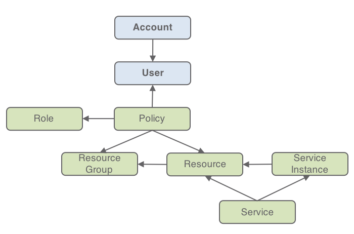
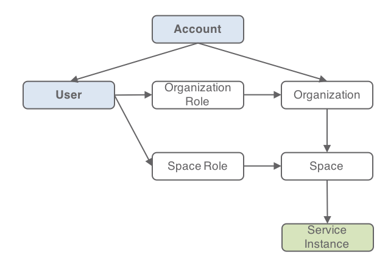
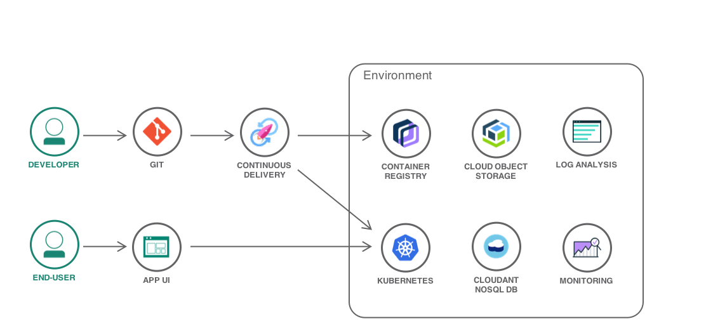
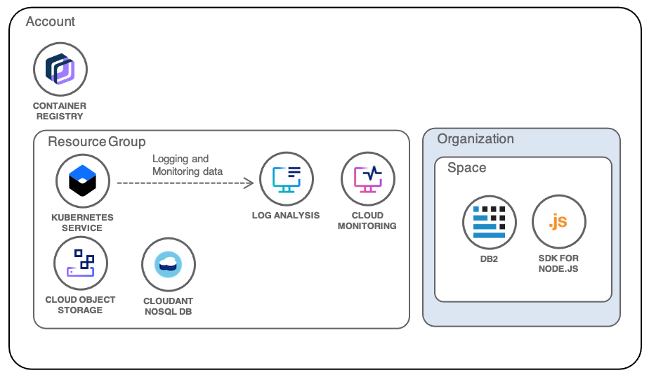
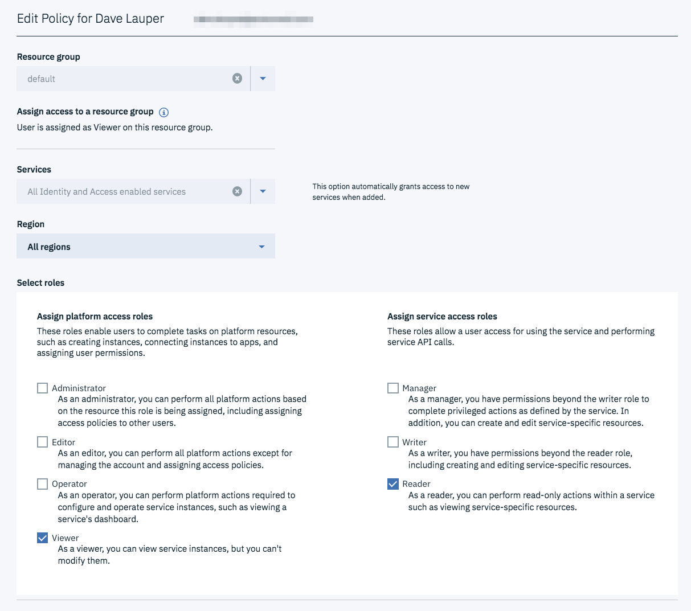
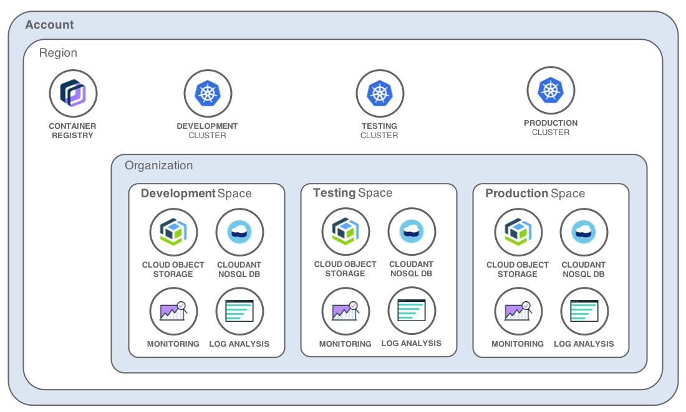
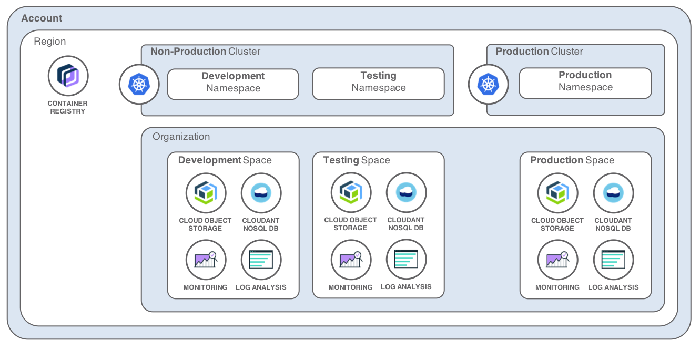

{:java: #java .ph data-hd-programlang='java'}
{:swift: #swift .ph data-hd-programlang='swift'}
{:ios: #ios data-hd-operatingsystem="ios"}
{:android: #android data-hd-operatingsystem="android"}
{:shortdesc: .shortdesc}
{:new_window: target="_blank"}
{:codeblock: .codeblock}
{:screen: .screen}
{:tip: .tip}
{:pre: .pre}

# Best practices for organizing users, teams, applications
{: #users-teams-applications}

<!--##istutorial#-->
This tutorial may incur costs. Use the [Cost Estimator](https://{DomainName}/estimator/review) to generate a cost estimate based on your projected usage.
{: tip}

<!--#/istutorial#-->

This tutorial gives an overview of the concepts available in {{site.data.keyword.cloud_notm}} to manage identity and access management and how they can be implemented to support the multiple development stages of an application.
{: shortdesc}

When building an application, it is very common to define multiple environments reflecting the development lifecycle of a project from a developer committing code to the application code being made available to the end-users. *Sandbox*, *test*, *staging*, *UAT* (user acceptance testing), *pre-production*, *production* are typical names for these environments.

Isolating the underlying resources, implementing governance and access policies, protecting a production workload, validating changes before pushing them to production, are some of the reasons why you would want to create these separate environments.

## Objectives
{: #users-teams-applications-objectives}

* Learn about {{site.data.keyword.iamlong}}
* Configure a project with separation between roles and environments
* Setup continuous integration

## Define a project
{: #users-teams-applications-1}

Let's consider a sample project with the following components:
* several microservices deployed in {{site.data.keyword.containershort_notm}},
* databases,
* file storage buckets.

In this project, we define three environments:
* *Development* - this environment is continuously updated with every commit, unit tests, smoke tests are executed. It gives access to the latest and greatest deployment of the project.
* *Testing* - this environment is built after a stable branch or tag of the code. This is where user acceptance testing is made. Its configuration is similar to the production environment. It is loaded with realistic data (anonymized production data as example).
* *Production* - this environment is updated with the version validated in the previous environment.

**A delivery pipeline manages the progression of a build through the environment.** It can be fully automated or include manual validation gates to promote approved builds between environments - this is really open and should be set up to match the company best practices and workflows.

To support the execution of the build pipeline, we introduce **a [Service ID](https://{DomainName}/docs/account?topic=account-serviceids)**. A service ID identifies a service or application similar to how a user ID identifies a user. Policies can be assigned to a service ID, providing it access to resources. This service ID is used in the delivery pipelines and any other cloud resources requiring strong ownership. This approach helps in the case where a team member leaves the company or is moving to another project. The service ID will be dedicated to your project and will not change over the lifetime of the project. The [service ID should be locked](https://{DomainName}/docs/account?topic=account-serviceids#lock_serviceid) to protect it against accidental deletion. The next thing you will want to create is [an API key](https://{DomainName}/iam/serviceids) for this service ID. You will select this API key when you set up the DevOps pipelines, or when you want to run automation scripts, to impersonate the service ID.

When it comes to assigning responsibilities to the project team members, let's define the following roles and related permissions:

|           | Development | Testing | Production |
| --------- | ----------- | ------- | ---------- |
| Developer | - contributes code \n - can access log files \n - can view app and service configuration \n - use the deployed applications | - can access log files \n - can view app and service configuration \n - use the deployed applications | - no access |
| Tester    | - use the deployed applications | - use the deployed applications | - no access |
| Operator  | - can access log files \n - can view/set app and service configuration | - can access log files \n - can view/set app and service configuration | - can access log files \n - can view/set app and service configuration |
| Pipeline Service ID  | - can deploy/undeploy applications \n - can view/set app and service configuration | - can deploy/undeploy applications \n - can view/set app and service configuration | - can deploy/undeploy applications \n - can view/set app and service configuration |

## Identity and Access Management (IAM)
{: #users-teams-applications-first_objective}

{{site.data.keyword.iamshort}} (IAM) enables you to securely authenticate users for both platform and infrastructure services and control (authorize) access to **resources** consistently across the {{site.data.keyword.cloud_notm}} platform. {{site.data.keyword.cloud_notm}} services enabled to use Cloud IAM for access control are provisioned into [**resource groups**](https://{DomainName}/docs/account?topic=account-rgs) within your **account**. They allow you to give **users** quick and easy access to more than one resource at a time. Cloud IAM access **policies** are used to assign users and service IDs access to the resources within your account.

This tutorial focusses on a single account. Multiple accounts can be grouped within an [enterprise account](https://{DomainName}/docs/account?topic=account-enterprise) and organized in account groups to centrally manage billing and resource usage.
{: tip}

A **policy** assigns a user or service ID one or more **roles** with a combination of attributes that define the scope of access. The policy can provide access to a single service down to the instance level, or the policy can apply to a set of resources organized together in a resource group. Depending on the user roles that you assign, the user or service ID is allowed varying levels of access for completing platform management tasks or accessing a service by using the UI or performing specific types of API calls.

{: class="center"}
{: style="text-align: center;"}

Most services in the {{site.data.keyword.cloud_notm}} catalog are managed by using IAM. A few continue to use Cloud Foundry by providing users access to the organization and space to which the instance belongs with a Cloud Foundry role assigned to define the level of access that is allowed.  If you do not have requirements for Cloud Foundry applications and are using resources that support IAM then ignore the Organization and Space text below.

{: class="center"}
{: style="text-align: center;"}

## Create the resources for one environment
{: #users-teams-applications-3}

Although the three environments needed by this sample project require different access rights and may need to be allocated different capacities, they share a common architecture pattern.

{: class="center"}
{: style="text-align: center;"}

Let's start by building the Development environment.

1. Most cloud service instances are regional.  Keep this in mind and choose the same region for all resources in this tutorial.
1. Create an instance of [{{site.data.keyword.at_full_notm}}](https://{DomainName}/observe/activitytracker/create) for the region to allow the audit of all API calls for the region.
1. For Cloud Foundry services and apps:
   1. [Create an organization for the project](https://{DomainName}/docs/account?topic=account-orgsspacesusers#createorg).
   1. [Create a Cloud Foundry space for the environment](https://{DomainName}/docs/account?topic=account-orgsspacesusers#spaceinfo).
   1. Create the Cloud Foundry services used by the project under this space
1. [Create a resource group for the environment](https://{DomainName}/account/resource-groups).
1. Create the services {{site.data.keyword.cos_full_notm}}, {{site.data.keyword.la_full_notm}}, {{site.data.keyword.mon_full_notm}}, {{site.data.keyword.Db2_on_Cloud_long_notm}} and {{site.data.keyword.cloudant_short_notm}} in this group.
1. [Create a new Kubernetes cluster](https://{DomainName}/kubernetes/catalog/cluster) in {{site.data.keyword.containershort_notm}}, make sure to select the resource group created above.
1. From the Kubernetes cluster connect to the {{site.data.keyword.la_full_notm}} and {{site.data.keyword.mon_full_notm}} service instances to send logs and to monitor the cluster.

The following diagram shows where the project resources are created under the account:

{: class="center"}
{: style="text-align: center;"}

## Assign roles within the environment
{: #users-teams-applications-4}

1. Invite users to the account
1. Assign Policies to the users to control who can access the resource group, the services within the group and the {{site.data.keyword.containershort_notm}} instance and their permissions. Refer to the [access policy definition](https://{DomainName}/docs/containers?topic=containers-users#access_policies) to select the right policies for a user in the environment. Users with the same set of policies can be placed into the [same access group](https://{DomainName}/docs/account?topic=account-groups#groups). It simplifies the user management as policies will be assigned to the access group and inherited by all users in the group.
1. Configure their Cloud Foundry organization and space roles based on their needs within the environment. Refer to the [role definition](https://{DomainName}/docs/account?topic=account-cfaccess#cfaccess) to assign the right roles based on the environment.

Refer to the documentation of services to understand how a service is mapping IAM and Cloud Foundry roles to specific actions. See for example [how the {{site.data.keyword.mon_full_notm}} service maps IAM roles to actions](https://{DomainName}/docs/Monitoring-with-Sysdig?topic=Monitoring-with-Sysdig-iam#iam).

Assigning the right roles to users will require several iterations and refinement. Given permissions can be controlled at the resource group level, for all resources in a group or be fine-grained down to a specific instance of a service, you will discover over time what are the ideal access policies for your project.

Some services also provide IAM-based data access controls, i.e. IAM groups combined with the service own group filtering.  For example: 

- [Using groups to control data access in IBM Log Analysis](https://{DomainName}/docs/log-analysis?topic=log-analysis-group_data_access)
- [Using groups to control data access in IBM Cloud Activity Tracker](https://{DomainName}/docs/activity-tracker?topic=activity-tracker-group_data_access)
- [Monitoring RBAC, teams, and IAM integration](https://{DomainName}/docs/monitoring?topic=monitoring-iam_grant_team)

Note that by default accounts are configured for [unrestricted user view access](https://{DomainName}/docs/account?topic=account-iam-user-setting). Any user in the account can see any other user information. You can [change the setting](https://{DomainName}/iam/settings) to a restrictive mode.
{: tip}

A good practice is to start with the minimum set of permissions then expand carefully as needed. For Kubernetes, you will want to look at its [Role-Based Access Control (RBAC)](https://kubernetes.io/docs/admin/authorization/rbac/) to configure in-cluster authorizations.

For the Development environment, the user responsibilities defined earlier could translate to the following:

|           | IAM Access policies | Cloud Foundry |
| --------- | ----------- | ------- |
| Developer | - Resource Group: *Viewer* \n - Platform Access Roles in the Resource Group: *Viewer* \n - Logging & Monitoring service role: *Writer* | - Organization Role: *Auditor* \n - Space Role: *Auditor* |
| Tester    | - No configuration needed. Tester accesses the deployed application, not the development environments | - No configuration needed |
| Operator  | - Resource Group: *Viewer* \n - Platform Access Roles in the Resource Group: *Operator*, *Viewer* \n - Logging & Monitoring service role: *Writer* | - Organization Role: *Auditor* \n - Space Role: *Developer* |
| Pipeline Service ID | - Resource Group: *Viewer* \n - Platform Access Roles in the Resource Group: *Editor*, *Viewer* | - Organization Role: *Auditor* \n - Space Role: *Developer* |

The IAM access configuration for groups is centralized in [Access (IAM) Acess groups](https://{DomainName}/iam/groups):
1. Select or create an access group.
1. Select the **Access policies** tab
1. Click **Assign access** button to assign policies as shown below
1. Click the **Users** tab of the **Access group** to add users to the group

{: class="center"}
{: style="text-align: center;"}

## Replicate for multiple environments
{: #users-teams-applications-5}

From there, you can replicate similar steps to build the other environments.

1. Create one resource group per environment.
1. Create one cluster and required service instances per environment.
1. Create one Cloud Foundry space per environment.
1. Create the required service instances in each space.

{: class="center"}
{: style="text-align: center;"}

Using a combination of tools like the [{{site.data.keyword.cloud_notm}} `ibmcloud` CLI](https://github.com/IBM-Cloud/ibm-cloud-developer-tools), [terraform](https://{DomainName}/docs/terraform?topic=terraform-about), the [{{site.data.keyword.cloud_notm}} provider for Terraform](https://github.com/IBM-Cloud/terraform-provider-ibm), Kubernetes CLI `kubectl`, you can script and automate the creation of these environments.

Separate Kubernetes clusters for the environments come with good properties:
* no matter the environment, all clusters will tend to look the same;
* it is easier to control who has access to a specific cluster;
* it gives flexibility in the update cycles for deployments and underlying resources; when there is a new Kubernetes version, it gives you the option to update the Development cluster first, validate your application then update the other environment;
* it avoids mixing different workloads that may impact each other such as isolating the production deployment from the others.

Another approach is to use [Kubernetes namespaces](https://kubernetes.io/docs/concepts/overview/working-with-objects/namespaces/) in conjunction with [Kubernetes resource quotas](https://kubernetes.io/docs/concepts/policy/resource-quotas/) to isolate environments and control resource consumption.

{: class="center"}
{: style="text-align: center;"}

In the `Search` input box of UI, use the field `namespace:` to filter logs based 0n the namespace.
{: tip}

## Setup delivery pipeline
{: #users-teams-applications-6}

When it comes to deploying to the different environments, your continuous integration / continuous delivery pipeline can be setup to drive the full process:
* continuously update the `Development` environment with the latest and greatest code from the `development` branch, running unit tests and integration tests on the dedicated cluster;
* promote development builds to the `Testing` environment, either automatically if all tests from the previous stages are OK or through a manual promotion process. Some teams will use different branches too here, merging the working development state to a `stable` branch as example;
* Repeat a similar process to move to the `Production` environment.

{: class="center"}
{: style="text-align: center;"}

When configuring the DevOps pipeline, make sure to use the API key of a service ID. Only the service ID should need to have the required rights to deploy apps to your clusters.

During the build phase, it is important to properly version the Docker images. You can use the Git commit revision as part of the image tag, or a unique identifier provided by your DevOps toolchain; any identifier that will make it easy for you to map the image to the actual build and source code contained in the image.

As you get acquainted with Kubernetes, [Helm](https://helm.sh/), the package manager for Kubernetes, will become a handy tool to version, assemble and deploy your application. [This sample DevOps toolchain](https://github.com/open-toolchain/simple-helm-toolchain) is a good starting point and is preconfigured for continuous delivery to a Kubernetes cluster. As your project grows into multiple microservices, the [Helm umbrella chart](https://helm.sh/docs/howto/charts_tips_and_tricks/#complex-charts-with-many-dependencies) will provide a good solution to compose your application.

## Expand the tutorial
{: #users-teams-applications-7}

Congratulations, your application can now safely be deployed from dev to production. Below are additional suggestions to improve application delivery.

* Follow the tutorial [Plan, create and update deployment environments](https://{DomainName}/docs/solution-tutorials?topic=solution-tutorials-plan-create-update-deployments#plan-create-update-deployments) to automate the deployment of your environments.
* Investigate [Using the IBM Cloud console to create VPC resources](https://{DomainName}/docs/vpc?topic=vpc-creating-a-vpc-using-the-ibm-cloud-console)

## Related information
{: #users-teams-applications-8}

* [Getting Started with {{site.data.keyword.iamshort}}](https://{DomainName}/docs/account?topic=account-access-getstarted)
* [Best practices for organizing resources in a resource group](https://{DomainName}/docs/account?topic=account-account_setup)
* [Analyze logs and monitor health](https://{DomainName}/docs/solution-tutorials?topic=solution-tutorials-application-log-analysis#application-log-analysis)
* [Continuous Deployment to Kubernetes](https://{DomainName}/docs/solution-tutorials?topic=solution-tutorials-continuous-deployment-to-kubernetes#continuous-deployment-to-kubernetes)
* [Hello Helm toolchain](https://github.com/open-toolchain/simple-helm-toolchain)
* [Develop a microservices application with Kubernetes and Helm](https://github.com/open-toolchain/microservices-helm-toolchain)
* [Grant permissions to a user to view logs](/docs/Log-Analysis-with-LogDNA?topic=Log-Analysis-with-LogDNA-work_iam)
* [Grant permissions to a user to view metrics](/docs/Monitoring-with-Sysdig?topic=Monitoring-with-Sysdig-iam)
