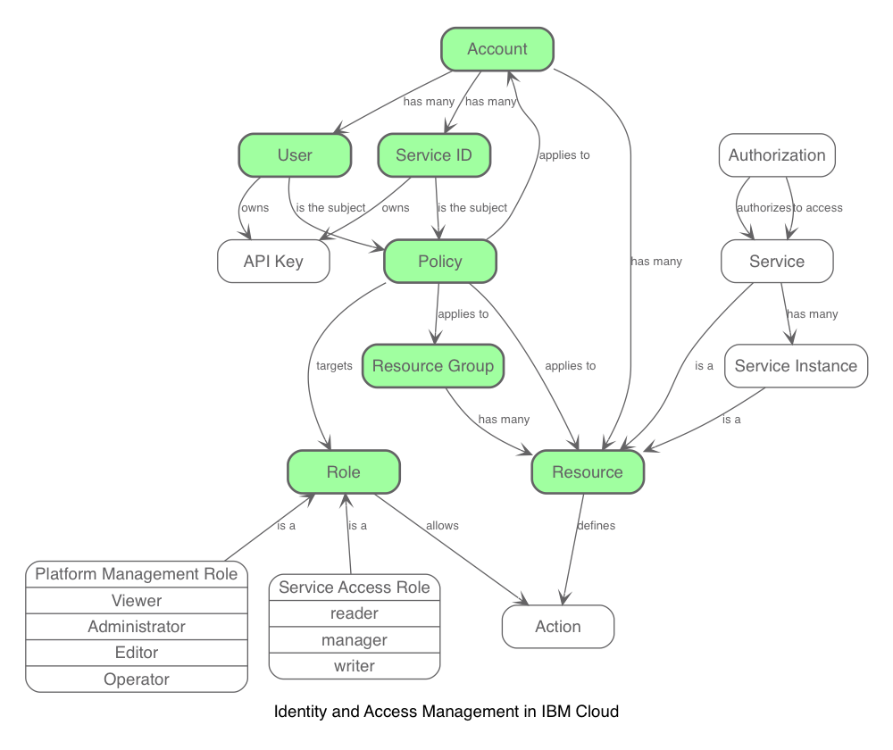

---
copyright:
  years: 2018
lastupdated: "2018-02-28"

---

{:java: #java .ph data-hd-programlang='java'}
{:swift: #swift .ph data-hd-programlang='swift'}
{:ios: #ios data-hd-operatingsystem="ios"}
{:android: #android data-hd-operatingsystem="android"}
{:shortdesc: .shortdesc}
{:new_window: target="_blank"}
{:codeblock: .codeblock}
{:screen: .screen}
{:tip: .tip}
{:pre: .pre}

# Best practices for organizing users, teams, applications

This tutorial gives an overview of the concepts available in IBM Cloud to manage identity and access management and how they can be implemented to support the multiple development stages of an application.

{:shortdesc}

## Objectives
{: #objectives}

* Learn about Identity and Access Management and Cloud Foundry access models
* Configure a project with clear separation between roles and environments

## Products
{: #products}

This tutorial uses the following products:
* [Identity and Access Management](https://console.bluemix.net/docs/iam/index.html)
* [Container Service](https://console.bluemix.net/containers-kubernetes/catalog/cluster)
* [Cloud Object Storage](https://console.bluemix.net/catalog/infrastructure/cloud-object-storage)
* [Cloud Foundry](https://console.bluemix.net/catalog/?category=cf-apps&search=foundry)
* [Cloudant NoSQL database](https://console.bluemix.net/catalog/services/cloudant-nosql-db)

<!-- ## Before you begin
{: #prereqs}

* [IBM Cloud Developer Tools](https://github.com/IBM-Cloud/ibm-cloud-developer-tools) - Script to install docker, kubectl, helm, bx cli and required plug-ins -->

## Define a project

When building an application, it is very common to define multiple environments reflecting the development lifecycle of a project from a developer committing code to the application code being made available to the end-users. *Sandbox*, *test*, *staging*, *UAT* (user acceptance testing), *pre-production*, *production* are typical names for these environments.

Isolating the underlying resources, implementing governance and access policies, protecting a production workload, validating changes before pushing them to production, are some of the reasons why you would want to create these separate environments.

Let's consider a sample project with the following components:
* several microservices deployed in Kubernetes,
* databases,
* file storage buckets.

In this project, we define three environments:
* *Development* - this environment is continuously updated with every commit, unit tests, smoke tests are executed. It gives access to the latest and greatest deployment of the project.
* *Testing* - this environment is built after a stable branch or tag of the code. This is where user acceptance testing is made. It is very close from the production environment, it is loaded with realistic data (anonymized production data as example).
* *Production* - this environment is updated with the version validated in the previous environment.

A build pipeline manages the progression of a build through the environment. It can be fully automated or include manual validation gates to promote approved builds between environments - this is really open and should be set up to match the company best practices and workflows.

When it comes to assigning responsibilities to the project team members, let's define the following roles and related permissions:

|           | Development | Testing | Production |
| --------- | ----------- | ------- | ---------- |
| Developer | <ul><li>can deploy/undeploy applications</li><li>can access log files</li><li>can view app and service configuration</li></ul> | <ul><li>can access log files</li><li>can view app and service configuration</li></ul> | <ul><li>no access</li></ul> |
| Tester    | <ul><li>use the deployed applications</li></ul> | <ul><li>use the deployed applications</li></ul> | <ul><li>no access</li></ul> |
| Operator  | <ul><li>can deploy/undeploy applications</li><li>can access log files</li><li>can view app and service configuration</li></ul> | <ul><li>can deploy/undeploy applications</li><li>can access log files</li><li>can view app and service configuration</li></ul> | <ul><li>can deploy/undeploy applications</li><li>can access log files</li><li>can view app and service configuration</li></ul> |

## Identity and Access Management (IAM)
{: #first_objective}

IBM Cloud Identity and Access Management (IAM) enables you to securely authenticate users for both platform and infrastructure services and control access to **resources** consistently across the IBM Cloud platform. A set of IBM Cloud services are enabled to use Cloud IAM for access control and are organized into **resource groups** within your **account** to enable giving **users** quick and easy access to more than one resource at a time. Cloud IAM access **policies** are used to assign users and **service IDs** access to the resources within your account.

A **policy** assigns a user or service ID one or more **roles** with a combination of attributes that define the scope of access. The policy can provide access to a single service down to the instance level, or the policy can apply to a set of resources organized together in a resource group. Depending on the user roles that you assign, the user or service ID is allowed varying levels of access for completing platform management tasks or accessing a service by using the UI or performing specific types of API calls.

  

Getting Started with IAM
https://console.bluemix.net/docs/iam/quickstart.html#getstarted

  At this time, not all services in the IBM Cloud catalog can be managed by using IAM. For these services, you can continue to use Cloud Foundry for these service instances by providing users access to the org and space to which the instance belongs with a Cloud Foundry role assigned to define the level of access that is allowed.
  {:tip}

## Mapping the project to IAM

Although the three environments needed by this sample project require different access rights and may need to be allocated different capacities, they share a common architecture pattern.

  

### Let's start with one environment

have a diagram showing where the resources are attached
  * cluster is under account
  * cloud foundry services under org/space
  * logging and monitoring send logs to a space - link to command to redirect logs to another space

  

Before you create a cluster, either through the IBM Cloud UI or through the command line, you must log into a specific IBM Cloud region, account, organization, and space. The space where you are logged in is the space where logging and monitoring data for the cluster and its resources is collected.

create org + space

monitoring needs role at account level
https://internal-ibmcloud.ideas.aha.io/ideas/IDEAINT-I-1082

* build the cluster
Access management for clusters
mapping between IAM roles and their permissions in cluster management and kubernetes resources
https://console.bluemix.net/docs/containers/cs_users.html#users

* create the cf services
*  use org and space https://console.bluemix.net/docs/iam/cfaccess.html#cfaccess
* build the cluster and cf services
* create a dedicated space for the cf services - will help with role setting
* create a resource group for the cluster and compatible service

### set roles

* assign roles to the users

* what roles to give dev/test/operator in IAM and in Cloud Foundry? Reuse the tables from IAM/CF docs

* use service ID in your application

* you create a resource group including all the resources making your app - not all services can be included into a resource group today

* you can assign policies to users in your account to define their permissions on these resources and resource groups

### then we replicate for multiple environments

  

* diagram of the project showing the environments, the separate clusters and services
* dev branch pushing to pipeline
* master branch pushing to test
* a "stable" tag pushing to production

* It depends on the organization and the application but, in general, keep separate clusters for different types of environments in a delivery pipeline.

* you would not want to mix test and production deployments in the same clusters

* prevent from having a pod going crazy in a test deployment and eating up all the resources that the production deployment may need to scale

* who has access and what are the update cycles would be very different for each of these environments/clusters

* you can isolate access between resources using namespaces but there are some resources which are global to the cluster

* someone could mess up and accidentally grant access to a namespace in prod that was not expected

* there’s no benefit to combining them since you pay for the capacity (via worker nodes) and you are likely to plan for the capacity you want to use in your clusters including resources for all environments

* since it is simple to get a cluster it is far better to separate clusters based on development lifecycles (at a minimum)

* defining resource limits is important in kubernetes - at the deployment/pod level, but there are also settings at the namespace level. See https://kubernetes.io/docs/tasks/administer-cluster/memory-default-namespace/ and the sibling articles.

## Clean up resources

Steps to take to remove the resources created in this tutorial

## Related information

* [Relevant links](https://blah)
