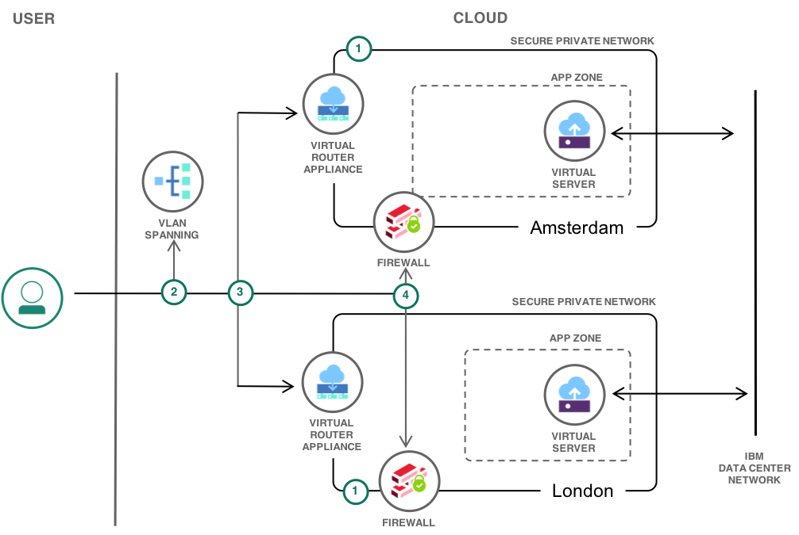

{:java: #java .ph data-hd-programlang='java'}
{:swift: #swift .ph data-hd-programlang='swift'}
{:ios: #ios data-hd-operatingsystem="ios"}
{:android: #android data-hd-operatingsystem="android"}
{:shortdesc: .shortdesc}
{:new_window: target="_blank"}
{:codeblock: .codeblock}
{:screen: .screen}
{:tip: .tip}
{:pre: .pre}

# Linking secure private networks over the IBM network
{: #vlan-spanning}

As the need for global reach and 24-7 operations of web application increases, the need to host services in multiple cloud data centers increases. Data centers across multiple locations provide resilience in the case of a geographic failure and also bring workloads closer to globally distributed users reducing latency and increasing perceived performance. The [{{site.data.keyword.Bluemix_notm}} network](https://www.ibm.com/cloud/data-centers/) enables users to link workloads hosted in secure private networks across data centers and locations.

This tutorial presents setup of a privately routed IP connection over the {{site.data.keyword.Bluemix_notm}} private network between two secure private networks hosted in different data centers. All resources are owned by one {{site.data.keyword.Bluemix_notm}} account. It uses the [Isolate workloads with a secure private network]( https://{DomainName}/docs/tutorials?topic=solution-tutorials-secure-network-enclosure#secure-network-enclosure) tutorial to deploy two private networks that are securely linked over the {{site.data.keyword.Bluemix_notm}} private network using the [VLAN Spanning]( https://{DomainName}/docs/infrastructure/vlans?topic=vlans-vlan-spanning#vlan-spanning) service. 
{:shortdesc}

## Objectives
{: #objectives}

- Link secure networks within an {{site.data.keyword.Bluemix_notm}} IaaS account
- Setup firewall rules for site to site access 
- Configure routing between sites

## Services used
{: #products}

This tutorial uses the following runtimes and services:
* [Virtual Router Appliance](https://{DomainName}/docs/infrastructure/virtual-router-appliance?topic=virtual-router-appliance-about-the-vra#about)
* [{{site.data.keyword.virtualmachinesshort}}]( https://{DomainName}/catalog/infrastructure/virtual-server-group)
* [VLAN Spanning]( https://{DomainName}/docs/infrastructure/vlans?topic=vlans-vlan-spanning#vlan-spanning)

This tutorial might incur costs. The VRA is only available on a monthly pricing plan.

## Architecture
{: #architecture}

<p style="text-align: center;">

  
</p>


1. Deploy secure private networks
2. Configure VLAN Spanning
3. Configure IP routing between private networks
4. Configure firewall rules for remote site access

## Before you begin
{: #prereqs}

This tutorial is based on the tutorial, [Isolate workloads with a secure private network]( https://{DomainName}/docs/tutorials?topic=solution-tutorials-secure-network-enclosure#isolate-workloads-with-a-secure-private-network). That tutorial and its prerequisites should be reviewed before commencing. 

## Configure secure private network sites
{: #private_network}

The tutorial [Isolate workloads with a secure private network]( https://{DomainName}/docs/tutorials?topic=solution-tutorials-secure-network-enclosure#isolate-workloads-with-a-secure-private-network) is utilised twice to implement private networks in two different data centers. There is no restriction on which two data centers can be utilised, apart from noting the impact of latency on any traffic or workloads that will communicate between the sites. 

The [Isolate workloads with a secure private network]( https://{DomainName}/docs/tutorials?topic=solution-tutorials-secure-network-enclosure#isolate-workloads-with-a-secure-private-network) tutorial can be followed without change for each selected data center, recording the following information for later steps. 

| Item  | Datacenter1 | Datacenter2 |
|:------ |:--- | :--- |
| Data center |  |  |
| VRA public IP address | <DC1 VRA Public IP Address> | <DC2 VRA Public IP Address> |
| VRA private IP address | <DC1 VRA Private IP Address> | <DC2 VRA Private IP Address> |
| VRA private subnet & CIDR |  |  |
| Private VLAN ID | &lt;DC1 Private VLAN ID&gt;  | &lt;DC2 Private VLAN ID&gt; |
| VSI private IP address | <DC1 VSI Private IP Address> | <DC2 VSI Private IP Address> |
| APP zone subnet & CIDR | <DC1 APP zone subnet/CIDR> | <DC2 APP zone subnet/CIDR> |

1. Proceed to the Gateway Details page for each VRA via the [Gateway Appliances](https://{DomainName}/classic/network/gatewayappliances) page.  
2. Locate the Gateway VLANs section and click on the Gateway [VLAN]( https://{DomainName}/classic/network/vlans) on the **Private** network to view the VLAN details. The name should contain the id, `bcrxxx`, standing for 'backend customer router' and be of the form `nnnxx.bcrxxx.xxxx`.
3. The provisioned VRA will be seen under the **Devices* section. From under the **Subnets** section, make a note of the VRA private subnet IP address and CIDR (/26). The subnet will be of type primary with 64 IPs. These details are required later for routing configuration. 
4. Again on the Gateway Details page, locate the **Associated VLANs** section and click on the [VLAN]( https://{DomainName}/classic/network/vlans) on the **Private** network that was associated to create the secure network and APP zone. 
5. The provisioned VSI will be seen under the **Devices* section. From under the **Subnets** section, make a note of the  VSI subnet IP address and CIDR (/26) as these are required for routing configuration. This VLAN and subnet is identified as the APP zone in both VRA firewall configurations and is recorded as the &lt;APP Zone subnet/CIDR&gt;.


## Configure VLAN Spanning 
{: #configure-vlan-spanning}

By default servers (and VRAs) on different VLANs and data centers, are unable to communicate with each other over the private network. In these tutorials, within a single data center VRA’s are used to link VLANs and subnets with classic IP routing and firewalls to create a private network for server communication across VLANs. While they can communicate in the same data center, in this configuration servers belonging to the same {{site.data.keyword.Bluemix_notm}}  account are unable to communicate across data centers. 

The [VLAN spanning]( https://{DomainName}/docs/infrastructure/vlans?topic=vlans-vlan-spanning#vlan-spanning) service lifts this restriction of communication between the VLANs and subnets that are **NOT** associated with VRAs. It must be noted that even when VLAN spanning is enabled, VLANs associated with VRAs can only communicate via their associated VRA, as determined by the VRA firewall and routing configuration. When VLAN spanning is enabled the VRAs owned by an {{site.data.keyword.Bluemix_notm}} account are connected over the private network and can communicate. 

VLANs not associated with the secure private networks created by the VRAs, are ‘spanned’ allowing interconnection of these ‘unassociated’ VLANs across data centers. This includes the VRA Gateway (transit) VLANs belonging to the same IBM Cloud account in different data centers. Hence allowing VRAs to communicate across data centers when VLAN spanning is enabled. With VRA to VRA connectivity, the VRA firewall and routing configuration enable servers within the secure networks to connect. 

Enable VLAN Spanning:

1. Proceed to the [VLANs]( https://{DomainName}/classic/network/vlans) page.
2. Select the **Span** tab at the top of the page
3. Select the VLAN Spanning ‘On’ radio button. This will take a number of minutes for the network change to complete.
4. Confirm that the two VRAs can now communicate:

   Login to data center 1 VRA and ping data center 2 VRA

   ```
   SSH vyatta@<DC1 VRA Private IP Address>
   ping <DC2 VRA Private IP Address>
   ```
   {: codeblock}

   Login to data center 2 VRA and ping data center 1 VRA
   ```
   SSH vyatta@<DC2 VRA Private IP Address>
   ping <DC1 VRA Private IP Address>
   ```
   {: codeblock}

## Configure VRA IP Routing 
{: #vra_routing}

Create the VRA routing in each data center to enable the VSIs in the APP zones in both data centers to communicate. 

1. Create static route in data center 1 to the APP zone private subnet in data center 2, in VRA edit mode.
   ```
   ssh vyatta@<DC1 VRA Private IP Address>
   conf
   set protocols static route <DC2 APP zone subnet/CIDR>  next-hop <DC2 VRA Private IP>
   commit
   ```
   {: codeblock}
2. Create static route in data center 2 to the APP zone private subnet in data center 1, in VRA edit mode.
   ```
   ssh vyatta@<DC2 VRA Private IP Address>
   conf
   set protocols static route <DC1 APP zone subnet/CIDR>  next-hop <DC1 VRA Private IP>
   commit
   ```
   {: codeblock}
2. Review the VRA routing table from the VRA command line. At this time the VSIs cannot communicate as no APP zone firewall rules exist to allow traffic between the two APP Zone subnets. Firewall rules are required for traffic initiated at either side.
   ```
   show ip route
   ```
   {: codeblock}

The new route to allow the APP zone to communicate via the IBM private network will be now seen. 

## VRA firewall configuration
{: #vra_firewall}

The existing APP zone firewall rules are only configured to allow traffic to and from this subnet to {{site.data.keyword.Bluemix_notm}} services on the {{site.data.keyword.Bluemix_notm}} private network and for public Internet access via NAT. Other subnets associated with VSIs on this VRA, or in other data centers are blocked. The next step is to update the `ibmprivate` resource group associated with the APP-TO-INSIDE firewall rule to allow explicit access to the subnet in the other data center. 

1. On the data center 1 VRA edit command mode, add the <DC2 APP zone subnet>/CIDR to the `ibmprivate` resource group
   ```
   set resources group address-group ibmprivate address <DC2 APP zone subnet/CIDR>
   commit
   save
   ```
   {: codeblock}
2. On the data center 2 VRA edit command mode, add the <DC1 APP zone subnet>/CIDR to the `ibmprivate` resource group
   ```
   set resources group address-group ibmprivate address <DC1 APP zone subnet/CIDR>
   commit
   save
   ```
   {: codeblock}
3. Verify that the VSIs in both data centers can now communicate
   ```bash
   ping <Remote Subnet Gateway IP>
   ssh root@<VSI Private IP>
   ping <Remote Subnet Gateway IP>
   ```
   {: codeblock}

   If the VSIs cannot communicate follow the instructions in the [Isolate workloads with a secure private network]( https://{DomainName}/docs/tutorials?topic=solution-tutorials-secure-network-enclosure#secure-network-enclosure) tutorial for monitoring traffic on the interfaces and reviewing the firewall logs. 

## Remove resources
{: #removeresources}

Steps to take to remove the resources created in this tutorial. 

The VRA is on a monthly paid plan. Cancellation does not result in a refund. It is suggested to only cancel if this VRA will not be required again in the next month. If a dual VRA High-Availability cluster is required, this single VRA can be upgraded on the [Gateway Details](https://{DomainName}/classic/network/gatewayappliances) page.
{:tip}

1. Cancel any virtual servers or bare-metal servers
2. Cancel the VRA
3. Cancel any additional VLANs by support ticket. 


## Extend the tutorial

This tutorial can be used in conjunction with the 
[VPN into a secure private network](https://{DomainName}/docs/tutorials?topic=solution-tutorials-configuring-IPSEC-VPN#vpn-into-a-secure-private-network) tutorial to link both secure networks to a users remote network over an IPSec VPN. VPN links can be established to both secure networks for increased resilience of access to the {{site.data.keyword.Bluemix_notm}} IaaS platform. Note IBM does not allow routing of user traffic between client data centers over the IBM private network. The routing configuration to avoid network loops is beyond the scope of this tutorial. 


## Related material
{:related}

1. Virtual Routing and Forwarding (VRF) is an alternative to the use of VLAN Spanning to connect networks across an {{site.data.keyword.Bluemix_notm}} Account. VRF is mandatory for all clients using  [{{site.data.keyword.BluDirectLink}}](https://{DomainName}/docs/infrastructure/direct-link?topic=direct-link-overview-of-virtual-routing-and-forwarding-vrf-on-ibm-cloud#customer-vrf-overview). [Overview of Virtual Routing and Forwarding (VRF) on IBM Cloud](https://{DomainName}/docs/infrastructure/direct-link?topic=direct-link-overview-of-virtual-routing-and-forwarding-vrf-on-ibm-cloud#customer-vrf-overview)
2. [The IBM Cloud network](https://www.ibm.com/cloud/data-centers/)
