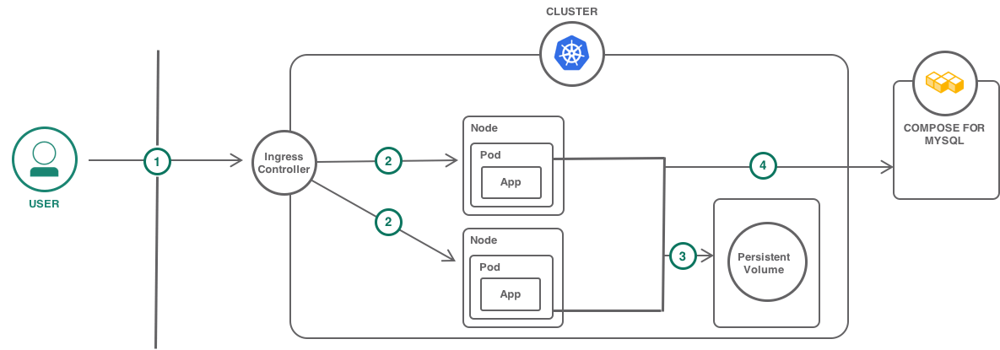
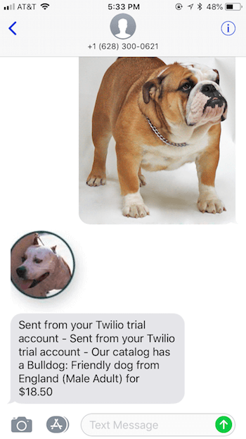

---
copyright:
  years: 2017, 2018
lastupdated: "2018-05-16"
---

{:shortdesc: .shortdesc}
{:new_window: target="_blank"}
{:codeblock: .codeblock}
{:screen: .screen}
{:tip: .tip}
{:pre: .pre}

# Understand how to move a VM based application to Kubernetes

This tutorial walks you through the process of moving a VM based application to a Kubernetes cluster on the IBM Cloud Container Service. You will learn how to take an existing application, containerize it, deploy it to a Kubernetes cluster, and then extend it using IBM Cloud services. Though migrating existing applications to Kubernetes can be different from an application to application, this tutorial aims to outline the path with an example. 

[Kubernetes](https://kubernetes.io/) is a container orchestrator to provision, manage, and scale applications. Kubernetes allows you to manage the lifecycle of containerized applications in a cluster of multiple worker machines called nodes. With Kubernetes you get built-in scaling features, load balancing, auto-recovery, quick deployment rollout and more. 

[IBM Cloud Container Service](https://console.bluemix.net/docs/containers/container_index.html) offers managed Kubernetes clusters with isolation and hardware choice, operational tools, integrated security insight into images and containers, and integration with Watson, IoT, and data. 

There are two options for moving an application to Kubernetes: 
- Identify single component of a large monolith application which can be separated into its own micro-service. Containerize and deploy micro-service to Kubernetes. Repeat. 
- Containerize the entire application and deploy it on a Kubernetes cluster. 

In this tutorial, you will exercise the latter option using a popular Java e-commerce application **JPetStore**. After moving it to Kubernetes, you will extend it using IBM Cloud services.

## Objectives:

{: #objectives}

- Understand how to map components between VMs and Kubernetes.
- Containerize application.
- Deploy the container to Kubernetes cluster on IBM Cloud Container Service.
- Extend the application with IBM Cloud services.

## Services used

{: #products}

This tutorial uses the following products:

- [{{site.data.keyword.containershort_notm}}](https://console.bluemix.net/containers-kubernetes/catalog/cluster)
- Compose For MySQL
- [{{site.data.keyword.visualrecognitionfull}}](https://console.bluemix.net/catalog/services/visual-recognition)
- [Twilio](https://www.twilio.com/)

This tutorial may incur costs. Use the [Pricing Calculator](https://console.bluemix.net/pricing/) to generate a cost estimate based on your projected usage.

## Architecture

{:#architecture}

The following diagram outlines a traditonal architecture of an application running on virtual machines. 

<p style="text-align: center;">


</p>

1. The user sends a request to the endpoint.
2. The Load Balancer selects one of the healthy application running in VM to handle the request.
3. The application server is backed by another VM running a database. 

**Components:**

- Two Java app VM's to host the application, application files stored within the VM.
- Load balancer service to load balance traffic between application servers.
- MySQL database installed on a Virtual Server.

With a modern Kubernetes architecture, this would look similar to:

<p style="text-align: center;">

</p>

1. The user sends a request to the endpoint.
2. Ingress load balances traffic to  workloads in the cluster
3. The data layer is an external managed database service.

**Components:**

- A cluster can have one or more worker nodes. A worker node is a virtual server, physical server or bare metal. Following this tutorial, you will set up a cluster with two worker nodes.
- Persistent volumes and other options available for saving and sharing data between app instances.
- Kubernetes ingress controller used to manage the load balancing between worker nodes. Ingress is a collection of rules that allow inbound connections to reach the cluster services. Ingress load balance the traffic between worker nodes internally.
- Compose For MySQL service to store the database. With Kubernetes you can run your own database inside the cluster, but it might be more favorable to use a managed database-as-a service for reasons such as operational simplicity, built-in backups and scaling. You can find many different types databases in IBM Cloud [catalog](https://console.bluemix.net/catalog/?category=data).

## VM's, containers and Kubernetes

IBM Cloud provides the capability to run applications in containers on Kubernetes. The IBM Cloud Container Service runs Kubernetes clusters that deliver the following tools and functions:

- Intuitive user experience and powerful tools
- Built-in security and isolation to enable rapid delivery of secure applications
- Cloud services that include cognitive capabilities from IBM® Watson™
- Ability to manage dedicated cluster resources for both stateless applications and stateful workloads

### Virtual machines vs containers 

**VM's**, traditional applications are run on native hardware.  A single application does not typically use the full resources of a single machine. Most organizations try to run multiple applications on a single machine to avoid wasting resources. You could run multiple copies of the same application, but to provide isolation, you can use VMs to run multiple application instances (VMs) on the same hardware. These VMs have full operating system stacks that make them relatively large and inefficient due to duplication both at runtime and on disk.

**Containers** are a standard way to package apps and all their dependencies so that you can seamlessly move the apps between environments. Unlike virtual machines, containers do not bundle the operating system. Only the app code, run time, system tools, libraries, and settings are packaged inside containers. Containers are more lightweight, portable, and efficient than virtual machines.

However, containers allow you to share the host OS. This reduces duplication while still providing the isolation. Containers also allow you to drop unneeded files such as system libraries and binaries to save space and reduce your attack surface. 

### Kubernetes orchestration

[Kubernetes](http://kubernetes.io) is a container orchestrator to manage the lifecycle of containerized applications in a cluster of nodes. Your applications might need many other resources to run such as Volumes, Networks, and Secrets that will help you connect to databases, talk to firewalled backends, and secure keys. Kubernetes helps you add these resources to your application. Infrastructure resources needed by applications are managed declaratively.

The key paradigm of Kubernetes is its declarative model. The user provides the desired state and Kubernetes will attempt to conform and maintain the described state. Kubernetes provides APIs and tooling for users to provide the desired state of your cluster including container images, networking, services, volumes, etc.

Run through this [lab](https://github.com/IBM/container-service-getting-started-wt) to get more hands on experience with Kubernetes. 

### Kubernetes basic components

Pod: A pod is the smallest object model that you can create and run. A pod typically represents a process in your cluster. Pods contain at least one container that runs the job and additionally might have other containers in it called sidecars for monitoring, logging, and so on. Essentially, a pod is an instance of a micro-service consisting of one or more containers that need to run together.  

Service: A Service defines how to expose your application as a DNS entry to have a stable reference. 

Kubectl: The Kubectl is a command line interface for running commands against Kubernetes clusters. Kubernetes provides a client interface through the kubectl command-line interface. Kubectl commands allow for managing applications and cluster resources.

Agile, Cost, etc. You don't have to go to Kube. You can lift and shift using VMWare on IBM Cloud.

## Plan the move

{: #plan_the_move}

In this section, you will learn what to consider when configuring a cluster, how to containerize the application and how to create Kubernetes deployment files. 

###Configure Resources

To run a production application in the Cloud using Kubernetes, there are few items in which you need to think about and these are:

1. How many clusters do you need? You may want to have three clusters, one for development, one testing and one for production.
2. What [hardware](https://console.bluemix.net/docs/containers/cs_clusters.html#planning_worker_nodes) do I need for my worker nodes?  Virtual machines or Bare Metal?
3. How many worker nodes do you need? This depends on the applications scale, it's true that the more nodes you have the more resiliency your application will have. 
4. When to increase the number of nodes? You can monitor the cluster usage and increase nodes when needed. Checkout the solution guide on how to [analyze logs and monitor the health of Kubernetes applications](analyze-logs-and-monitor-the-health-of-kubernetes-applications.html).

Above are some of the questions you need to think about before configuring your clusters. Assuming you want to run the JPetStore application in the Cloud for a production use, and expect a high load of traffic. Let's explore what resources you would need:

1. Setup three clusters, one for development, one testing and one for production.
2. Development and testing cluster can start with minimum RAM and CPU option such like 2 CPU's, 4GB of RAM and one worker node for each cluster.
3. For the production cluster, you may want to have more resources for performance, HA and resiliency. Choose Dedicated or Bare Metal options for better performance and at least 4 CPU's, 16GB of RAM, and two workers nodes.

## Managing Compute Resources 

When you specify a Pod, you can optionally specify how much CPU and memory (RAM) each Container needs. When Containers have resource requests specified, the scheduler can make better decisions about which nodes to place Pods on. And when Containers have their limits specified, contention for resources on a node can be handled in a specified manner. This can also help cost savings as well as not allowing pods to eat all of the resources.

 Each Container of a Pod can specify one or more of the following:

```bash
spec.containers[].resources.limits.cp
spec.containers[].resources.limits.memory
```

You can read more more compute resources [here](https://kubernetes.io/docs/concepts/configuration/manage-compute-resources-container/).

### Apply 12 factor principles to your app 

The twelve-factor principles is a methodology for building software-as-a-service apps that uses declarative formats for setup automation and to minimize time and cost. When moving applications to the container world and Kubernetes, you should consider applying the 12 factor principles. 

Here are some of the key must applied principles: 

- **Codebase** - Application code to live inside a Git repository so it can be easily tracked and version controlled. With this you can also integrate DevOps delivery pipeline to build and test the application before deploying to the cluster. Checkout the solution guide [Continuous Deployment to Kubernetes](continuous-deployment-to-kubernetes.html) to learn how to set up a continuous integration and delivery pipeline for containerized applications running in a Kubernetes cluster. This will cover the set up of source control, build, test and deploy stages as well as adding integrations such as security scanners, notifications, and analytics.
- **Config** - Store config in an environment variables, do not hardcode service credentials within the application. This is covered in more depth in the later section of this solution guide. 
- **Backing Services** - Your application code can talk to many services, like a database for example. A database can be installed locally in a separate node or a database as a service, in both cases the Database service is referenced by a simple endpoint (URL) with service credentials.  The point is, your code shouldn’t know the difference.

There are many more important 12 factor principles are covered in depth [here](https://12factor.net/) and you should read and consider apply them into your application. 

### Containerize the application 

To containerize your application, you need to create a Dockerfile inside the root of the application. A Dockerfile is a text document that contains commands which are executed by Docker to build an image.

To build one based on your existing application, you may use following common commands.

- FROM - to define an official runtime as parent image.
- ADD/COPY - to copy the current directory contents into the container
- WORKDIR - Set the working directory
- RUN - to Install any needed packages
- EXPOSE - Make port available to the world outside this container
- ENV NAME - Define the environment variable
- CMD - Run application when the container launches

For more information on creating a Dockerfile, checkout the docker [file reference](https://docs.docker.com/engine/reference/builder/#usage).

To containerize the JPetStore application, the following [Dockerfile](https://github.ibm.com/ibmcloud/ModernizeDemo/blob/master/jpetstore/Dockerfile) has been used.

```bash
# Build JPetStore war
FROM openjdk:8 as builder
COPY . /src
WORKDIR /src
RUN ./build.sh all

# Use WebSphere Liberty base image from the Docker Store
FROM websphere-liberty:latest

# Copy war from build stage and server.xml into image
COPY --from=builder /src/dist/jpetstore.war /opt/ibm/wlp/usr/servers/defaultServer/apps/
COPY --from=builder /src/server.xml /opt/ibm/wlp/usr/servers/defaultServer/
RUN mkdir -p /config/lib/global
COPY lib/mysql-connector-java-3.0.17-ga-bin.jar /config/lib/global
```

Once a Dockerfile created, next you would need to build and push the docker images. The docker images for each of the microservices need to be built and the images need to be pushed to a container registry. These steps are for building the image and pushing it IBM Cloud private registry, but you can also push them to a public registry.

1. Identify your registry namespace with `bx cr namespaces` or create a new one using `bx cr namespace-add <NAMESPACE>`

2. Build and push the **jpetstoreweb** image:

   ```bash
   $ docker build . -t registry.ng.bluemix.net/<NAMESPACE>/jpetstoreweb
   $ docker push registry.ng.bluemix.net/<NAMESPACE>/jpetstoreweb
   ```

### Modify your code

There are a few items which you must handle when moving to Kubernetes:

- Service credentials: How to handle sensitive service, databases credentials within the cluster.
- Storage: Where to store data in your cluster. 

**Service Credentials**

It's not a good practice to store credentials within the application. Kubernetes provides **[secrets](https://kubernetes.io/docs/tasks/inject-data-application/distribute-credentials-secure/)**, intended to hold sensitive information, such as passwords, OAuth tokens, and ssh keys. Putting this information in a `secret` is safer and more flexible than putting it verbatim in a `pod` definition or in a docker image. An application can have many different credentials like passwords, tokens, keys and more. These credentials should be distributed securely outside the application. 

Let's explore how to create a secret if you to add a Watson Visual Recognition service.

1. Create a new file called `watson-secrets.txt` and add the service credentials, you can get service credentials from the IBM Cloud dashboard or using the CLI.

   ```bash
   {
       "url": "https://gateway-a.watsonplatform.net/visual-recognition/api",
       "api_key": ""
   }
   ```

2. Create a secret from the file by running:

   ```bash
   kubectl create secret generic watson-visual-secret --from-file=watson-secrets.txt=./watson-secrets.txt
   ```

3. To verify secret been created, run the command: 

   ```bash
   kubectl get secrets
   ```

The secret created can now be referenced from the Kubernetes deployment file. You will later learn about the Kubernetes deployment files and how the secret been referenced.  

**Saving data in your cluster**

With the IBM Cloud Container Service, you can choose from several options to store your app data and share data across pods in your cluster. However, not all storage options offer the same level of persistence and availability in disaster situations.

Non-persistent data storage: Containers and pods are, by design, short-lived and can fail unexpectedly. However, you can write data to the local file system of the container to store data throughout the lifecycle of the container. Data inside a container cannot be shared with other containers or pods and is lost when the container crashes or is removed. 

Persistent data storage: Create a persistent volume claim (PVC) to provision NFS file storage or block storage for your cluster. Then, mount this claim to a persistent volume (PV) to ensure that data is available even if the pods crash or shut down.

The NFS file storage and block storage that backs the PV is clustered by IBM in order to provide high availability for your data. The storage classes describe the types of storage offerings available and define aspects such as the data retention policy, size in gigabytes, and IOPS when you create your PV.

In Kubernetes, the way this can is by using `PersistentVolume` to store the data in a [NFS-based file storage](https://www.ibm.com/cloud/file-storage/details) or [block storage](https://www.ibm.com/cloud/block-storage) and then use `PersistentVolumeClaim` to make that storage available to your pods. 

To create a PV and matching PVC, follow these steps below: 

1. Review the available storage classes. See full list of storage classes [here](https://console.bluemix.net/docs/containers/cs_storage.html#create) with storage capacity breakdown.

   ```bash
   kubectl get storageclasses
   ```

2. Run the command below to decide the storage class. 

   Note: The **retain** options means that the storage class will not be removed even after deleting the `PersistentVolumeClaim`. 

   ```bash
   kubectl describe storageclasses ibmc-file-retain-silver 
   ```

3. Create a new file called `mypvc.yaml` with the following contents:

   ```bash
   apiVersion: v1
   kind: PersistentVolumeClaim
   metadata:
     name: mypvc
     annotations:
       volume.beta.kubernetes.io/storage-class: "ibmc-file-retain-silver"
     labels:
       billingType: "monthly"
   spec:
     accessModes:
       - ReadWriteMany
     resources:
       requests:
         storage: 24Gi
   ```

4. Create the PVC.

   ```bash
   kubectl apply -f mypvc.yaml
   ```

5. Verify that your PVC is created and bound to the PV. This process can take a few minutes.

   ```bash
   kubectl describe pvc mypvc
   ```

For more details on creating custom storages classes checkout the cluster storage [documentation](https://console.bluemix.net/docs/containers/cs_storage.html#create).

**Setting up backup and restore solutions for NFS file shares and block storage**

File shares and block storage are provisioned into the same location as your cluster. The storage is hosted on clustered servers by IBM to provide availability in case a server goes down. However, file shares and block storage are not backed up automatically and might be inaccessible if the entire location fails. To protect your data from being lost or damaged, you can set up periodic backups that you can use to restore your data when needed.

Review the following [backup and restore](https://console.bluemix.net/docs/containers/cs_storage.html#backup_restore) options for your NFS file shares and block storage.

**Move existing data over**

Copy data to and from pods and containers

You can use the `kubectl cp` command to copy files and directories to and from pods or specific containers in your cluster.

You can use the command in various ways:

- Copy data from your local machine to a pod in your cluster: `kubectl cp <local_filepath>/<filename> <namespace>/<pod>:<pod_filepath>`
- Copy data from a pod in your cluster to your local machine: `kubectl cp <namespace>/<pod>:<pod_filepath>/<filename> <local_filepath>/<filename>`
- Copy data from a pod in your cluster to a specific container in another pod another: `kubectl cp<namespace>/<pod>:<pod_filepath> <namespace>/<other_pod>:<pod_filepath> -c<container>`

### Create Kubernetes deployment yaml

A *Deployment* controller provides declarative updates for Pods and ReplicaSets. You describe a *desired state* in a Deployment object, and the Deployment controller changes the actual state to the desired state at a controlled rate. You can define Deployments to create new ReplicaSets, or to remove existing Deployments and adopt all their resources with new Deployments. 

Note the following sections in the [JPetStore deployment YAML](https://github.ibm.com/ibmcloud/ModernizeDemo/blob/master/jpetstore/jpetstore.yaml) file

- Two deployments to create the database and the web micro-services
- Two services for exposing the micro-services
- Ingress controller to manage the traffic to the services.

You may have multiple deployment YAML files, one for each micro service. 

### Push Deployments  

You can create a deploying from the yaml file using the command:

```bash
kubectl create -f <yaml-file-name>.yaml
```

Verify your deployment and the associated pods and services by using: 

```bash
kubectl get deployments
kubectl get services
kubectl get pods
```

Now that you understand the fundamentals of moving application to Kubernetes, next you can run the JPetStore application in a Kubernetes cluster and use everything you learned so far.

## Run the JPetStore in your cluster   

{: #run_application} 

Follow the README in the JPetStore GitHub repository for steps to run the application in your cluster.  This application demo allows you to take an existing Java web application (JPetStore) that runs on WebSphere Application Server, containerize it and move it to Kubernetes, and then extend it with an Messaging interface using [Twilio](https://www.twilio.com/) to provide a Watson Visual Recognition capabilities.

Run the JPetStore using [this repo](https://github.ibm.com/ibmcloud/ModernizeDemo). 

## Extend the application 

{: #extend_application} 

Once an application is containerized and pushed to a Kubernetes cluster on IBM Cloud, the application can be easily extended. In this section you will learn how the **JPetStore** can be extended with the text messaging interface service [Twilio](https://www.twilio.com/) and [Watson Visual Recognition](https://console.bluemix.net/catalog/services/visual-recognition) service. 

You will extend the **JPetStore** application to be able to query for availability and price by simply sending a text message of a pet. The **JPetStore** has a list of pets in the database and no modifications is made to the core **JPetStore** application. This shows how you can enhance the application functionality by adding additional microservices on top of an existing application.

To extend **JPetStore** application you need to do the following: 

1. Visit [Twilio](http://twilio.com/) and sign up for a free account and **Buy a Number** with MMS capabilties then from the IBM Cloud catalog create a **Watson Visual Recognition** service.

2. Create two new files **mmsSearch and watson-secrets** and copy the JSON credentials to each file. Reference the [twilio-secrets](https://github.ibm.com/ibmcloud/ModernizeDemo/blob/master/mmsSearch/twilio-secrets) and [watson-secrets](https://github.ibm.com/ibmcloud/ModernizeDemo/blob/master/mmsSearch/watson-secrets) files here.

3. Run the command below to create secret objects in Kubernetes for the Watson and Twilio Service using the files. 

   ```bash
   # from the directory in which you created these two files
   $ kubectl create secret generic mms-secret \
     --from-file=watson-secrets=./watson-secrets --from-file=twilio-secrets=./twilio-secrets
   ```

4. Write the functionality to extend the application to allow responding to the user via a text message with a response if a pet is available or not. The user will send an image of a pet and get a response if the pet is available or not. This is done by using Twilio to process the messages and Watson visual recognition to verify the image. Use the GO sample to how this functionality been developed. Use the GO sample **[here](https://github.ibm.com/ibmcloud/ModernizeDemo/blob/master/mmsSearch/main.go).**

5. Create a **[Dockerfile](https://github.ibm.com/ibmcloud/ModernizeDemo/blob/master/mmsSearch/Dockerfile)** to package the GO application and a Kubernetes [deployment.yaml](https://github.ibm.com/ibmcloud/ModernizeDemo/blob/master/jpetstore/jpetstore-watson.yaml) file to deploy the GO micro service to Kubernetes.

6. Build and push the **mmssearch** image to IBM Cloud container registry and push it Kubernetes.

   ```bash
   // Build and push the mmssearch image 
   $ cd ../../mmsSearch
   $ docker build . -t registry.ng.bluemix.net/${MYNAMESPACE}/mmssearch
   $ docker push registry.ng.bluemix.net/${MYNAMESPACE}/mmssearch
   
   // Push to Kubernetes
   $ kubectl create -f jpetstore-watson.yaml
   ```

7. To verify, send a text message to your Twilio number with an image of a pet and you should receive a response. <p style="text-align: center;">

   
   </p>

   In summary, you were able to create a MMSSearch microservice written in a different language, deploy it and provide extended functionality without needing to modify the core Java PerStore application. For more detailed steps check out the JPetStore demo on **[GitHub](https://github.ibm.com/ibmcloud/ModernizeDemo)**.

## Expand the Tutorial

Do you want to learn more? Here are some ideas of what you can do next:

- [Analyze logs and monitor the health of Kubernetes applications using Kibana and Grafana](kubernetes-log-analysis-kibana.html).
- Set up [continuous integration and delivery pipeline](continuous-deployment-to-kubernetes.html) for containerized applications running in Kubernetes.
- Deploy the production cluster [across multiple regions](multi-region-webapp.html).
- Use [multiple clusters across multiple regions](https://console.bluemix.net/docs/containers/cs_regions.html#regions-and-locations) for high availability. 

## Remove Services

{: #clean_up_resources}

In this step, you will clean up the resources to remove what you created above.

- Delete Kubernetes deployments. 
- Delete Kubernetes secrets. 
- Delete the storage PV and PVC. 
- Delete Watson visual recognition service.
- Delete Twilio MMS.

## Related Content
{: #related_content}

- [Get started](https://developer.ibm.com/courses/all/get-started-kubernetes-ibm-cloud-container-service/) with Kubernetes and IBM Cloud Container Service.
- IBM Cloud Container Service labs on [GitHub](https://github.com/IBM/container-service-getting-started-wt).
- Kubernetes main [docs](http://kubernetes.io/).
- IBM Cloud [docs](https://console.bluemix.net/docs/containers/cs_storage.html) managing storage on a cluster.


