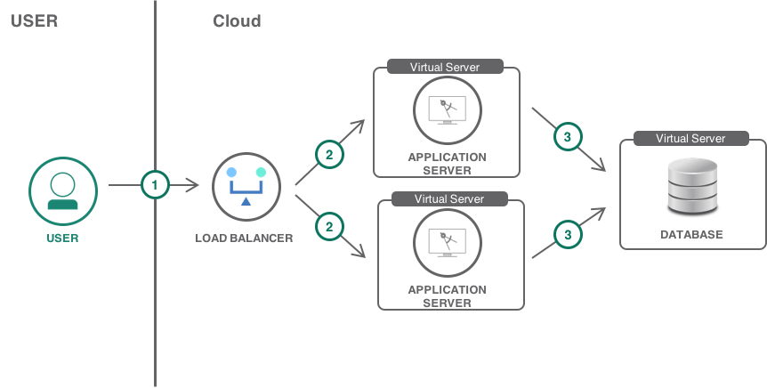

{:shortdesc: .shortdesc}
{:new_window: target="_blank"}
{:codeblock: .codeblock}
{:screen: .screen}
{:tip: .tip}
{:pre: .pre}

# Moving a VM based app to Kubernetes
{: #vm-to-containers-and-kubernetes}

This tutorial walks you through the process of moving a VM based app to a Kubernetes cluster by using {{site.data.keyword.containershort_notm}}. [{{site.data.keyword.containershort_notm}}](https://{DomainName}/docs/containers?topic=containers-container_index#container_index) delivers powerful tools by combining Docker and Kubernetes technologies, an intuitive user experience, and built-in security and isolation to automate the deployment, operation, scaling, and monitoring of containerized apps in a cluster of compute hosts.
{: shortdesc}

The lessons in this tutorial include concepts for how to take an existing app, containerize the app, and deploy the app to a Kubernetes cluster. To containerize your VM based app, you can choose between the following options.

1. Identify components of a large monolith app that can be separated into their own micro-service. You can containerize these micro-services and deploy them to a Kubernetes cluster.
2. Containerize the entire app and deploy the app to a Kubernetes cluster.

Depending on the type of app that you have, the steps to migrate your app might vary. You can use this tutorial to learn about the general steps that you have to take and things that you have to consider before migrating your app.

## Objectives
{: #objectives}

- Understand how to identify micro-services in a VM based app and learn how to map components between VMs and Kubernetes.
- Learn how to containerize a VM based app.
- Learn how to deploy the container to a Kubernetes cluster in {{site.data.keyword.containershort_notm}}.
- Put everything learned to practice, run the **JPetStore** app in your cluster.

## Services used
{: #products}

This tutorial uses the following runtimes and services:
* [{{site.data.keyword.containershort}}](https://{DomainName}/kubernetes/catalog/cluster)
* [{{site.data.keyword.registrylong_notm}}](https://{DomainName}/kubernetes/registry/main/private)

This tutorial may incur costs. Use the [Pricing Calculator](https://{DomainName}/estimator/review) to generate a cost estimate based on your projected usage.

## Architecture
{:#architecture}

### Traditional app architecture with VMs

The following diagram shows an example of a traditional app architecture that is based on virtual machines.

<p style="text-align: center;">
   
   
</p>

1. The user sends a request to the public endpoint of the app. The public endpoint is represented by a load balancer service that load balances incoming network traffic between available app server instances.
2. The load balancer selects one of the healthy app server instances that run on a VM and forwards the request.
3. The app server stores app data in a MySQL database that runs on a VM. App files, such as the app code, configuration files, and dependencies are stored on the VM.

### Containerized architecture

The following diagram shows an example of a modern container architecture that runs in a Kubernetes cluster.

<p style="text-align: center;">


</p>

1. The user sends a request to the public endpoint of the app. The public endpoint is represented by an Ingress application load balancer (ALB) that load balances incoming network traffic across app pods in the cluster. The ALB is a collection of rules that allow inbound network traffic to a publicly exposed app.
2. The ALB forwards the request to one of the available app pods in the cluster. App pods run on worker nodes that can be a virtual or physical machine.
3. App pods store data in persistent volumes. Persistent volumes can be used to share data between app instances or worker nodes.
4. App pods store data in an {{site.data.keyword.Bluemix_notm}} database service. You can run your own database inside the Kubernetes cluster, but using a managed database-as-a-service (DBaaS) is usually easier to configure and provides built-in backups and scaling. You can find many different types of databases in the [{{site.data.keyword.Bluemix_notm}} catalog](https://{DomainName}/catalog/?category=data).

### VMs, containers, and Kubernetes

{{site.data.keyword.containershort_notm}} provides the capability to run containerized apps in Kubernetes clusters and delivers the following tools and functions:

- Intuitive user experience and powerful tools
- Built-in security and isolation to enable rapid delivery of secure applications
- Cloud services that include cognitive capabilities from IBM® Watson™
- Ability to manage dedicated cluster resources for both stateless applications and stateful workloads

#### Virtual machines vs containers

**VMs**, traditional apps run on native hardware. A single app does not typically use the full resources of a single compute host. Most organizations try to run multiple apps on a single compute host to avoid wasting resources. You could run multiple copies of the same app, but to provide isolation, you can use VMs to run multiple app instances (VMs) on the same hardware. These VMs have full operating system stacks that make them relatively large and inefficient due to duplication both at runtime and on disk.

**Containers** are a standard way to package apps and all their dependencies so that you can seamlessly move the apps between environments. Unlike virtual machines, containers do not bundle the operating system. Only the app code, runtime, system tools, libraries, and settings are packaged inside containers. Containers are more lightweight, portable, and efficient than virtual machines.

In addition, containers allow you to share the host OS. This reduces duplication while still providing the isolation. Containers also allow you to drop unneeded files such as system libraries and binaries to save space and reduce your attack surface. Read more on virtual machines and containers [here](https://www.ibm.com/support/knowledgecenter/en/linuxonibm/com.ibm.linux.z.ldvd/ldvd_r_plan_container_vm.html).

#### Kubernetes orchestration

[Kubernetes](http://kubernetes.io/) is a container orchestrator to manage the lifecycle of containerized apps in a cluster of worker nodes. Your apps might need many other resources to run, such as volumes, networks, and secrets which will help you connect to other cloud services, and secure keys. Kubernetes helps you to add these resources to your app. The key paradigm of Kubernetes is its declarative model. The user provides the desired state and Kubernetes attempts to conform to, and then maintains the described state.

This [self-paced workshop](https://github.com/IBM/kube101/blob/master/workshop/README.md) can help you to get your first hands-on experience with Kubernetes. Additionally, check out the Kubernetes [concepts](https://kubernetes.io/docs/concepts/) documentation page to learn more about the concepts of Kubernetes.

### What IBM's doing for you

By using Kubernetes clusters with {{site.data.keyword.containerlong_notm}}, you get the following benefits:

- Multiple data centers where you can deploy your clusters.
- Support for ingress and load balancer networking options.
- Dynamic persistent volume support.
- Highly available, IBM-managed Kubernetes masters.

## Sizing clusters
{: #sizing_clusters}

As you design your cluster architecture, you want to balance costs against availability, reliability, complexity, and recovery. Kubernetes clusters in {{site.data.keyword.containerlong_notm}} provide architectural options based on the needs of your apps. With a bit of planning, you can get the most out of your cloud resources without over-architecting or over-spending. Even if you over or underestimate, you can easily scale up or down your cluster, by changing either the number or size of worker nodes.

To run a production app in the cloud by using Kubernetes, consider the following items:

1. Do you expect traffic from a specific geographic location? If yes, select the location that is physically closest to you for best performance.
2. How many replicas of your cluster do you want for higher availability? A good starting point might be three clusters, one for development, one for testing and one for production. Check out the [Best practices for organizing users, teams, applications](https://{DomainName}/docs/tutorials?topic=solution-tutorials-users-teams-applications#replicate-for-multiple-environments) solution guide for creating multiple environments.
3. What [hardware](https://{DomainName}/docs/containers?topic=containers-plan_clusters#planning_worker_nodes) do you need for the worker nodes? Virtual machines or bare metal?
4. How many worker nodes do you need? This depends highly on the apps scale, the more nodes you have the more resilient your app will be.
5. How many replicas should you have for higher availability? Deploy replica clusters in multiple locations to make your app more available and protect the app from being down due to a location failure.
6. Which is the minimal set of resources your app needs to startup? You might want to test your app for the amount of memory and CPU it requires to run. Your worker node should then have enough resources to deploy and start the app. Make sure to then set resource quotas as part of the pod specifications. This setting is what Kubernetes uses to select (or schedule) a worker node that has enough capacity to support the request. Estimate how many pods will run on the worker node and the resource requirements for those pods. At a minimum, your worker node must be large enough to support one pod for the app.
7. When to increase the number of worder nodes? You can monitor the cluster usage and increase nodes when needed. See this tutorial to understand how to [analyze logs and monitor the health of Kubernetes applications](https://{DomainName}/docs/tutorials?topic=solution-tutorials-kubernetes-log-analysis-kibana#kubernetes-log-analysis-kibana).
8. Do you need redundant, reliable storage? If yes, create a persistent volume claim for NFS storage or bind a IBM Cloud database service to your pod.
9. Do you need to deploy a cluster on [Virtual Private Cloud infrastructure](https://{DomainName}/docs/containers?topic=containers-plan_clusters#vpc_basics) or in [Classic infrastructure](https://{DomainName}/docs/containers?topic=containers-plan_clusters#plan_basics)? VPC gives you the security of a private cloud environment with the dynamic scalability of a public cloud.

To make the above more specific, let's assume you want to run a production web application in the cloud and expect a medium to high load of traffic. Let's explore what resources you would need:

1. Setup three clusters, one for development, one for testing and one for production.
2. The development and testing clusters can start with minimum RAM and CPU option (e.g. 2 CPU's, 4GB of RAM and one worker node for each cluster).
3. For the production cluster, you might want to have more resources for performance, high availability, and resiliency. We might choose a dedicated or even a bare metal option and have at least 4 CPU's, 16GB of RAM, and two workers nodes.

## Decide what Database option to use
{: #database_options}

With Kubernetes, you have two options for handling databases:

1. You can run your database inside the Kubernetes cluster, to do that you would need to create a microservice to run the database. For example, if you are using a MySQL database, you would need to complete the following steps:
   - Create a MySQL Dockerfile, see an example [MySQL Dockerfile](https://github.com/IBM-Cloud/jpetstore-kubernetes/blob/master/jpetstore/db/Dockerfile) here.
   - You would need to use secrets to store the database credential. See example of this [here](https://github.com/IBM-Cloud/jpetstore-kubernetes/blob/master/jpetstore/db/Dockerfile.secret).
   - You would need a `deployment.yaml` file with the configuration of your database to deployed to Kubernetes. See example of this [here](https://github.com/IBM-Cloud/jpetstore-kubernetes/blob/master/jpetstore/jpetstore.yaml).
2. The second option would be to use the managed database-as-a-service (DBaaS) option. This option is usually easier to configure and provides built-in backups and scaling. You can find many different types of databases in the  [{{site.data.keyword.Bluemix_notm}} catalog](https://{DomainName}/catalog/?category=data). To use this option, you would need to do the following:
   - Create a managed database-as-a-service (DBaaS) from the [{{site.data.keyword.Bluemix_notm}} catalog](https://{DomainName}/catalog/?category=data).
   - Store database credentials inside a secret. You will learn more on secrets in the "Store credentials in Kubernetes secrets" section.
   - Use the database-as-a-service (DBaaS) in your application.

## Decide where to store application files
{: #decide_where_to_store_data}

{{site.data.keyword.containershort_notm}} provides several options to store and share data across pods. Not all storage options offer the same level of persistence and availability in disaster situations.
{: shortdesc}

### Non-persistent data storage

Containers and pods are, by design, short-lived and can fail unexpectedly. You can store data in the local file system of a container. Data inside a container cannot be shared with other containers or pods and is lost when the container crashes or is removed.

### Learn how to create persistent data storage for your app

You can persist app data and container data on [NFS file storage](https://www.ibm.com/cloud/file-storage/details) or [block storage](https://www.ibm.com/cloud/block-storage) by using native Kubernetes persistent volumes.
{: shortdesc}

To provision NFS file storage or block storage, you must request storage for your pod by creating a persistent volume claim (PVC). In your PVC, you can choose from predefined storage classes that define the type of storage, storage size in gigabytes, IOPS, the data retention policy, and the read and write permissions for your storage. A PVC dynamically provisions a persistent volume (PV) that represents an actual storage device in {{site.data.keyword.Bluemix_notm}}. You can mount the PVC to your pod to read from and write to the PV. Data that is stored in PVs is available, even if the container crashes, or the pod reschedules. The NFS file storage and block storage that backs the PV is clustered by IBM in order to provide high availability for your data.

To learn how to create a PVC, follow the steps covered in the [{{site.data.keyword.containershort_notm}} storage documentation](https://{DomainName}/docs/containers?topic=containers-file_storage#file_storage).

### Learn how to move existing data to persistent storage

To copy data from your local machine to your persistent storage, you must mount the PVC to a pod. Then, you can copy data from your local machine to the persistent volume in your pod.
{: shortdesc}

1. To copy date, first, you would need to create a configuration that looks like something like this:

   ```
   kind: Pod
   apiVersion: v1
   metadata:
     name: task-pv-pod
   spec:
     volumes:
       - name: task-pv-storage
         persistentVolumeClaim:
          claimName: mypvc
     containers:
       - name: task-pv-container
         image: nginx
         ports:
           - containerPort: 80
             name: "http-server"
         volumeMounts:
           - mountPath: "/mnt/data"
             name: task-pv-storage
   ```
   {: codeblock}

2. Then, to copy data from your local machine to the pod you would use a command like this:
   ```sh
    kubectl cp <local_filepath>/<filename> <namespace>/<pod>:<pod_filepath>
   ```
   {: pre}

3. Copy data from a pod in your cluster to your local machine:
   ```sh
   kubectl cp <namespace>/<pod>:<pod_filepath>/<filename> <local_filepath>/<filename>
   ```
   {: pre}


### Set up backups for persistent storage

File shares and block storage are provisioned into the same location as your cluster. The storage itself is hosted on clustered servers by IBM to provide high availability. However, file shares and block storage are not backed up automatically and might be inaccessible if the entire location fails. To protect your data from being lost or damaged, you can set up periodic backups, which you can use to restore your data when needed.

For more information, see [backup and restore](https://{DomainName}/docs/containers?topic=containers-storage_planning#storage_planning) options for NFS file storage and block storage.

## Prepare your code
{: #prepare_code}

### Apply the 12-factor principles

The [twelve-factor app](https://12factor.net/) is a methodology for building cloud native apps. When you want to containerize an app, move this app to the cloud, and orchestrate the app with Kubernetes, it is important to understand and apply some of these principles. Some of these principles are required in {{site.data.keyword.Bluemix_notm}}.
{: shortdesc}

Here are some of the key principles required:

- **Codebase** - All source code and configuration files are tracked inside a version control system (for example a GIT repository), this is required if using DevOps pipeline for deployment.
- **Build, release, run** - The 12-factor app uses strict separation between the build, release, and run stages. This can be automated with an integrated DevOps delivery pipeline to build and test the app before deploying it to the cluster. Check out the [Continuous Deployment to Kubernetes tutorial](https://{DomainName}/docs/tutorials?topic=solution-tutorials-continuous-deployment-to-kubernetes#continuous-deployment-to-kubernetes) to learn how to set up a continuous integration and delivery pipeline. It covers the set up of source control, build, test and deploy stages and shows you how to add integrations such as security scanners, notifications, and analytics.
- **Config** - All configuration information is stored in environment variables. No service credentials are hard-coded within the app code. To store credentials, you can use Kubernetes secrets. More on credentials covered below.

### Store credentials in Kubernetes secrets
{: secrets}

It's never good practice to store credentials within the app code. Instead, Kubernetes provides so-called **["secrets"](https://kubernetes.io/docs/tasks/inject-data-application/distribute-credentials-secure/)** that hold sensitive information, such as passwords, OAuth tokens, or ssh keys. Kubernetes secrets are encrypted by default which makes secrets a safer and a more flexible option to store sensitive data than to store this data verbatim in a `pod` definition or in a docker image.

One way of using secrets in Kubernetes in by doing something like this:

1. Create a file called `watson-secrets.txt` and store the service credentials inside it.
   ```
   {
       "url": "https://gateway.watsonplatform.net/visual-recognition/api",
       "api_key": <API_Key>
   }
   ```
   {: codeblock}

2. Then, create a Kubernetes secret by running a command below and verify that the secret is created by using `kubectl get secrets` after running the command below:

   ```sh
   kubectl create secret generic watson-visual-secret --from-file=watson-secrets.txt=./watson-secrets.txt
   ```
   {: pre}

## Containerize your app
{: #build_docker_images}

To containerize your app, you must create a Docker image.
{: shortdesc}

An image is created from a [Dockerfile](https://docs.docker.com/engine/reference/builder/#usage), which is a file that contains instructions and commands to build the image. A Dockerfile might reference build artifacts in its instructions that are stored separately, such as an app, the app's configuration, and its dependencies.

To build your own Dockerfile for your existing app, you might use the following commands:

- FROM - Choose a parent image to define the container runtime.
- ADD/COPY - Copy the content of a directory into the container.
- WORKDIR - Set the working directory inside the container.
- RUN - Install software packages that the apps needs during runtime.
- EXPOSE - Make a port available outside the container.
- ENV NAME - Define environment variables.
- CMD - Define commands that run when the container launches.

Images are typically stored in a registry that can either be accessible by the public (public registry) or set up with limited access for a small group of users (private registry). Public registries, such as Docker Hub, can be used to get started with Docker and Kubernetes to create your first containerized app in a cluster. But when it comes to enterprise apps, use a private registry, like the one provided in {{site.data.keyword.registrylong_notm}} to protect your images from being used and changed by unauthorized users.

To containerize an app and store it in {{site.data.keyword.registrylong_notm}}:

1. You would need to create a Dockerfile, below is an example of a Dockerfile.
   ```
   # Build JPetStore war
   FROM openjdk:8 as builder
   COPY . /src
   WORKDIR /src
   RUN ./build.sh all

   # Use WebSphere Liberty base image from the Docker Store
   FROM websphere-liberty:latest

   # Copy war from build stage and server.xml into image
   COPY --from=builder /src/dist/jpetstore.war /opt/ibm/wlp/usr/servers/defaultServer/apps/
   COPY --from=builder /src/server.xml /opt/ibm/wlp/usr/servers/defaultServer/
   RUN mkdir -p /config/lib/global
   COPY lib/mysql-connector-java-3.0.17-ga-bin.jar /config/lib/global
   ```
   {: codeblock}

2. Once a Dockerfile is created, next you would need to build the container image and push it to {{site.data.keyword.registrylong_notm}}. You can build a container using a command like:
   ```sh
   ibmcloud cr build -t <image_name> <directory_of_Dockerfile>
   ```
   {: pre}

## Deploy your app to a Kubernetes cluster
{: #deploy_to_kubernetes}

After a container image is built and pushed to the cloud, next you need to deploy to your Kubernetes cluster. To do that you would need to create a deployment.yaml file.
{: shortdesc}

### Learn how to create a Kubernetes deployment yaml file

To create Kubernetes deployment.yaml files, you would need to do something like this:

1. Create a deployment.yaml file, here is an example of a [deployment YAML](https://github.com/ibm-cloud/ModernizeDemo/blob/master/jpetstore/jpetstore.yaml) file.

2. In your deployment.yaml file, you can define [resource quotas](https://kubernetes.io/docs/concepts/configuration/manage-compute-resources-container/) for your containers to specify how much CPU and memory each container needs to properly start. If containers have resource quotas specified, the Kubernetes scheduler can make better decisions about the worker node where to place your pods on.

3. Next, you can use below commands to create and view the deployment and services created:

   ```sh
   kubectl create -f <filepath/deployment.yaml>
   kubectl get deployments
   kubectl get services
   kubectl get pods
   ```
   {: pre}

## Summary
{: #summary}

In this tutorial, you learned the following:

- The differences between VMs, containers, and Kubernetes.
- How to define clusters for different environment types (dev, test, and production).
- How to handle data storage and the importance of persistent data storage.
- Apply the 12-factor principles to your app and use secrets for credentials in Kubernetes.
- Build docker images and push them to {{site.data.keyword.registrylong_notm}}.
- Create Kubernetes deployment files and deploy the Docker image to Kubernetes.

## Put everything learned to practice, run the JPetStore app in your cluster
{: #runthejpetstore}

To put everything you've learned in practice, follow the [demo](https://github.com/ibm-cloud/ModernizeDemo/) to run the **JPetStore** app on your cluster and apply the concepts learned. The JPetStore app has some extended functionality to allow you to extend an app in Kubernetes by IBM Watson services running as a separate microservice.

## Related Content
{: #related}

- [Get started](https://developer.ibm.com/gettingstarted/containers/) with Kubernetes and {{site.data.keyword.containershort_notm}}.
- {{site.data.keyword.containershort_notm}} labs on [GitHub](https://github.com/IBM/container-service-getting-started-wt).
- Kubernetes main [docs](http://kubernetes.io/).
- [Persistent storage](https://{DomainName}/docs/containers?topic=containers-storage_planning#storage_planning) in {{site.data.keyword.containershort_notm}}.
- [Best practices solution guide](https://{DomainName}/docs/tutorials?topic=solution-tutorials-users-teams-applications#users-teams-applications) for organizing users, teams and apps.
- [Analyze logs and monitor application health with LogDNA and Sysdig](https://{DomainName}/docs/tutorials?topic=solution-tutorials-application-log-analysis#application-log-analysis).
- Set up [continuous integration and delivery pipeline](https://{DomainName}/docs/tutorials?topic=solution-tutorials-continuous-deployment-to-kubernetes#continuous-deployment-to-kubernetes) for containerized apps that run in Kubernetes.
- Deploy the production cluster [across multiple locations](https://{DomainName}/docs/tutorials?topic=solution-tutorials-multi-region-webapp#multi-region-webapp).
- Use [multiple clusters across multiple locations](https://{DomainName}/docs/containers?topic=containers-regions-and-zones#regions-and-locations) for high availability.
