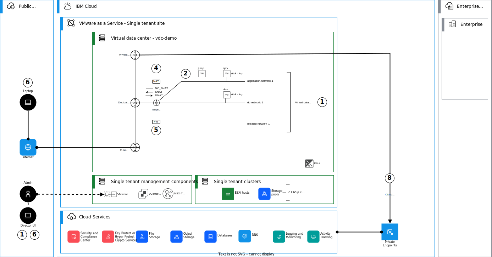

{:step: data-tutorial-type='step'}
{:java: #java .ph data-hd-programlang='java'}
{:swift: #swift .ph data-hd-programlang='swift'}
{:ios: #ios data-hd-operatingsystem="ios"}
{:android: #android data-hd-operatingsystem="android"}
{:shortdesc: .shortdesc}
{:new_window: target="_blank"}
{:codeblock: .codeblock}
{:screen: .screen}
{:tip: .tip}
{:pre: .pre}
{:important: .important}
{:note: .note}

# Creating a virtual data center in a {{site.data.keyword.vmware-service_short}} single tenant instance
{: #vmware-as-a-service-tf}
{: toc-content-type="tutorial"}
{: toc-services="vmware, schematics"}
{: toc-completion-time="2h"}

<!--##istutorial#-->
This tutorial may incur costs. Use the [Cost Estimator](https://{DomainName}/estimator/review) to generate a cost estimate based on your projected usage.
{: tip}

<!--#/istutorial#-->

## Objectives
{: #vmware-as-a-service-tf-objectives}

The objective of this tutorial is to demonstrate the basic steps to operationalize a {{site.data.keyword.vmware-service_full}} – single tenant instance after initial instance provisioning. This tutorial should take about 10-20 minutes to complete and assumes that [{{site.data.keyword.vmware-service_full}} – single tenant instance](https://{DomainName}/docs/vmware-service?topic=vmware-service-tenant-ordering) and [a virtual data center (VDC)](https://{DomainName}/docs/vmware-service?topic=vmware-service-vdc-adding) has already been provisioned. This tutorial uses an example `terraform` template, which can be customized and modified for your use case, if needed. 

In this tutorial, you will learn:

* How to create virtual data center (VDC) networks with `terraform`,
* How to create virtual machines into your create virtual data center networks with `terraform`, and
* How to configure network address translation (NAT) and firewall (FW) rules in your virtual data center edge gateway with `terraform`.

The following diagram presents an overview of the solution to be deployed.

{: class="center"}
{: style="text-align: center;"}

This guide is broken into the following steps:

1. [Clone examples repo](https://{DomainName}/docs/solution-tutorials?topic=solution-tutorials-vmware-as-a-service-tf#vmware-as-a-service-tf-clonerepo) 
2. [Obtain required basic information about your virtual data center](https://{DomainName}/docs/solution-tutorials?topic=solution-tutorials-vmware-as-a-service-tf#vmware-as-a-service-tf-vdcinfo)
3. [Configure tf.vars](https://{DomainName}/docs/solution-tutorials?topic=solution-tutorials-vmware-as-a-service-tf#vmware-as-a-service-tf-tfvars)
4. [Init, plan and apply](https://{DomainName}/docs/solution-tutorials?topic=solution-tutorials-vmware-as-a-service-tf#vmware-as-a-service-tf-apply)

An [alternative tutorial](https://{DomainName}/docs/solution-tutorials?topic=solution-tutorials-vmware-as-a-service-tf) using VMware Cloud Director Console is also available.
{:note}

## Before you begin
{: #vmware-as-a-service-tf-prereqs}

This tutorial requires:

* An {{site.data.keyword.cloud_notm}} [billable account](https://{DomainName}/docs/account?topic=account-accounts),
* [Pre-provisioned {{site.data.keyword.vmware-service_full}} - single tenant instance](https://{DomainName}/docs/vmware-service?topic=vmware-service-tenant-ordering),
* [Pre-provisioned virtual data center on the {{site.data.keyword.vmware-service_full}} - single tenant instance](https://{DomainName}/docs/vmware-service?topic=vmware-service-vdc-adding),
* {{site.data.keyword.cloud_notm}} CLI,
* `jq` to query JSON files, and
* `terraform` to use Infrastructure as Code to provision resources.

<!--##istutorial#-->
You will find instructions to download and install these tools for your operating environment in the [Getting started with tutorials](https://{DomainName}/docs/solution-tutorials?topic=solution-tutorials-tutorials) guide.

To avoid the installation of these tools you can use the [{{site.data.keyword.cloud-shell_short}}](https://{DomainName}/shell) from the {{site.data.keyword.cloud_notm}} console.
{: tip}
<!--#/istutorial#-->

## Clone examples repo
{: #vmware-as-a-service-vdc-clonerepo}
{: step}

## Obtain required basic information about your virtual data center
{: #vmware-as-a-service-vdc-vdcinfo}
{: step}

## Configure tf.vars
{: #vmware-as-a-service-vdc-tfvars}
{: step}

## Init, plan and apply
{: #vmware-as-a-service-vdc-apply}
{: step}

## Reference material
{: #vmware-as-a-service-tf-reference}

Check the following VMware Cloud Director™ Tenant Portal Guides for more detailed information about managing virtual data centers:

* [Managing Organization Virtual Data Center Networks](https://docs.vmware.com/en/VMware-Cloud-Director/10.4/VMware-Cloud-Director-Tenant-Portal-Guide/GUID-B208CDD2-5D46-4841-8F3C-BED9E4F27F07.html){:external}
* [Managing NSX Edge Gateways](https://docs.vmware.com/en/VMware-Cloud-Director/10.4/VMware-Cloud-Director-Tenant-Portal-Guide/GUID-45C0FEDF-84F2-4487-8DB8-3BC281EB25CD.html){:external
* [Working with Virtual Machines](https://docs.vmware.com/en/VMware-Cloud-Director/10.4/VMware-Cloud-Director-Tenant-Portal-Guide/GUID-DF0C111D-B638-4EC3-B805-CC33994F8D53.html){:external

Check the following `terraform` registry for more detailed information about the provider, resources and data sources:

* [VMware Cloud Director Provider](https://registry.terraform.io/providers/vmware/vcd/latest/docs){:external}

