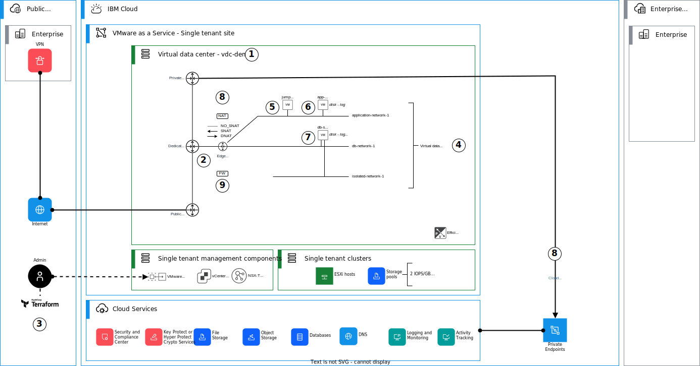
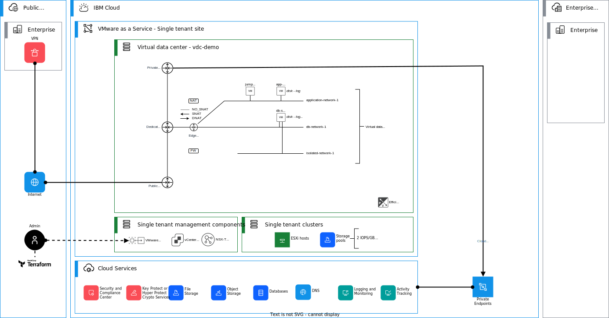

{:step: data-tutorial-type='step'}
{:java: #java .ph data-hd-programlang='java'}
{:swift: #swift .ph data-hd-programlang='swift'}
{:ios: #ios data-hd-operatingsystem="ios"}
{:android: #android data-hd-operatingsystem="android"}
{:shortdesc: .shortdesc}
{:new_window: target="_blank"}
{:codeblock: .codeblock}
{:screen: .screen}
{:tip: .tip}
{:pre: .pre}
{:important: .important}
{:note: .note}

# Creating a virtual data center in a {{site.data.keyword.vmware-service_short}} single tenant instance with Terraform
{: #vmware-as-a-service-tf}
{: toc-content-type="tutorial"}
{: toc-services="vmware, schematics"}
{: toc-completion-time="2h"}

<!--##istutorial#-->
This tutorial may incur costs. Use the [Cost Estimator](https://{DomainName}/estimator/review) to generate a cost estimate based on your projected usage.
{: tip}

<!--#/istutorial#-->


## Objectives
{: #vmware-as-a-service-tf-objectives}

The objective of this tutorial is to demonstrate the basic steps to operationalize a {{site.data.keyword.vmware-service_full}} – single tenant instance after initial instance provisioning. This tutorial should take about 10-20 minutes to complete and assumes that [{{site.data.keyword.vmware-service_full}} – single tenant instance](https://{DomainName}/docs/vmware-service?topic=vmware-service-tenant-ordering) and [a virtual data center (VDC)](https://{DomainName}/docs/vmware-service?topic=vmware-service-vdc-adding) has already been provisioned. This tutorial uses an example `terraform` template, which can be customized and modified for your use case, if needed. 

In this tutorial, you will learn:

* How to create virtual data center (VDC) networks with `terraform`,
* How to create virtual machines into your create virtual data center networks with `terraform`, and
* How to configure network address translation (NAT) and firewall (FW) rules in your virtual data center edge gateway with `terraform`.

The following diagram presents an overview of the solution to be deployed.

{: class="center"}
{: style="text-align: center;"}

1. Use IBM Cloud Console to create a virtual data center in your single tenant instance. Your instance may have one or more virtual data centers, so you can have a dedicated virtual data center for testing purposes. This example virtual data center uses only 2 IOPS/GB storage pool.
2. When a virtual data center is created, an edge gateway and external networks are created automatically. External network provides you internet access and an IP address block of `/29` with 6 usable public IP addresses is provided.
3. Terraform template is used to create virtual data center networks, virtual machines as well as firewall and network address translation rules. The creation is fully controlled though variables. Terraform authenticates to VMware Cloud Director API with user name and password. Access tokens will be supported in the future.
4. Three virtual data center networks are created: two routed (application and db) and one isolated (isolated). Routed virtual data center networks are attached to the edge gateway while isolated virtual data center network is a standalone network. You can create more networks based on your needs.
5. A jump server is created with Windows 2022 Operating System. The server it attached to the application network. You can access the virtual machine though the VM console, or using RDP though the DNAT rule created on the Edge Gateway.
6. One example virtual machine (`application-server-1`) is created on the application network. Application server has an additional disk e.g. for logging. You can create more VMs or disks based on your needs.
7. One example virtual machine (`db-server-1`) is created on the db network. Database server has two additional disks e.g. for data and logging. You can create more VMs or disks based on your needs.
8. Source NAT (SNAT) and destination NAT (DNAT) rules are created for public network access. SNAT to public internet is configured for all routed networks and DNAT is configured to access the application server. NO_SNAT rules are created for traffic directed to IBM Cloud Service Endpoints.
9. Firewall rules are provisioned to secure network access to the environment. To create firewall rules, Static Groups and IP Sets are created for networks and individual IP addresses.

This tutorial is broken into the following steps:

1. [Clone examples repo](https://{DomainName}/docs/solution-tutorials?topic=solution-tutorials-vmware-as-a-service-tf#vmware-as-a-service-tf-clonerepo) 
2. [Obtain the required information about your virtual data center](https://{DomainName}/docs/solution-tutorials?topic=solution-tutorials-vmware-as-a-service-tf#vmware-as-a-service-tf-vdcinfo)
3. [Configure tf.vars](https://{DomainName}/docs/solution-tutorials?topic=solution-tutorials-vmware-as-a-service-tf#vmware-as-a-service-tf-tfvars)
4. [Init, plan and apply](https://{DomainName}/docs/solution-tutorials?topic=solution-tutorials-vmware-as-a-service-tf#vmware-as-a-service-tf-apply)
5. [Connect to the VMware Cloud Director Console](https://{DomainName}/docs/solution-tutorials?topic=solution-tutorials-vmware-as-a-service-tf#vmware-as-a-service-tf-connect-to-console)
6. [Connect to the virtual machines though Internet and validate connectivity](https://{DomainName}/docs/solution-tutorials?topic=solution-tutorials-vmware-as-a-service-tf#vmware-as-a-service-tf-connect-to-vm)

An [alternative tutorial](https://{DomainName}/docs/solution-tutorials?topic=solution-tutorials-vmware-as-a-service-tf) using VMware Cloud Director Console is also available.
{:note}

## Before you begin
{: #vmware-as-a-service-tf-prereqs}

This tutorial requires:

* An {{site.data.keyword.cloud_notm}} [billable account](https://{DomainName}/docs/account?topic=account-accounts),
* Check for user permissions. Be sure that your user account has sufficient permissions [to create and manage VMware as a Service resources](https://{DomainName}/docs/vmware-service?topic=vmware-service-getting-started).
* [Pre-provisioned {{site.data.keyword.vmware-service_full}} - single tenant instance](https://{DomainName}/docs/vmware-service?topic=vmware-service-tenant-ordering),
* [Pre-provisioned virtual data center on the {{site.data.keyword.vmware-service_full}} - single tenant instance](https://{DomainName}/docs/vmware-service?topic=vmware-service-vdc-adding),
* {{site.data.keyword.cloud_notm}} CLI,
* [{{site.data.keyword.cloud_notm}} API KEY](https://{DomainName}/docs/account?topic=account-userapikey&interface=ui),
* `jq` to query JSON files, and
* `terraform` to use Infrastructure as Code to provision resources.

<!--##istutorial#-->
You will find instructions to download and install these tools for your operating environment in the [Getting started with tutorials](https://{DomainName}/docs/solution-tutorials?topic=solution-tutorials-tutorials) guide.
<!--#/istutorial#-->


## Clone examples repo
{: #vmware-as-a-service-vdc-clonerepo}
{: step}

The example terraform templates for {{site.data.keyword.vmware-service_full}} are located in [Git](https://github.com/IBM/vmwaas-terraform-examples).

Clone the examples repo into your local machine, for example laptop or a virtual server with Internet access. 

For example using GitHub CLI:

```bash
gh repo clone IBM/vmwaas-terraform-examples
```

Or using HTTPS with the following URL:

```bash
https://github.com/IBM/vmwaas-terraform-examples.git
```


## Obtain the required information about your virtual data center
{: #vmware-as-a-service-vdc-vdcinfo}
{: step}

As a prerequisite, use the [IBM Cloud Console](http://{DomainName}/vmware) to [create your {{site.data.keyword.vmware-service_full}} - single tenant instance](https://{DomainName}/docs/vmware-service?topic=vmware-service-tenant-ordering) and [one or more virtual data centers](https://{DomainName}/docs/vmware-service?topic=vmware-service-vdc-adding) on it.

Once the instance and virtual data center has been deployed, you can collect the required details and virtual data center IDs from the Console.

Log in to the {{site.data.keyword.vmware-service_full}} – single tenant instance's VMware Cloud Director Console:

1. In the VMware as a Service table, click a VMware as a Service instance name.
2. On the Summary tab, review the information.
3. On the VDC details page, click VMware Cloud Director Console to access the console.
4. Use the admin username and password to log in to the VMware Cloud Director Console for the first time.
5. After the admin is logged in to the VMware Cloud Director Console, you can create extra users who have roles that allow them to access the VMware Cloud Director Console.

You can login to the VMware Cloud Director Console to collect the required information for your Terraform deployment. You can alternatively use the provided `vmwaas.sh` shell script on the examples repo. The script will collect these values using {{site.data.keyword.vmware-service_full}} API.

To use the script, configure your region and API key with:

```bash
export IBMCLOUD_API_KEY=your-api-key-here
export IBMCLOUD_REGION=region-here 
```

The default region is `us-south`.
{:note}

Script usage:

```bash
% ./vmwaas.sh
USAGE : vmwaas [ ins | in | vdcs | vdc | vdcgw | tf | tfvars ]
```


To list your instances:

```bash
% ./vmwaas.sh ins
Get instances.


Instances:

NAME          DIRECTOR_SITE_ID                      LOCATION    STATUS
demo          b75efs1c-35df-40b3-b569-1124be37687d  us-south-1  ReadyToUse
```


To list your virtual data centers:

```bash
% ./vmwaas.sh vdcs           
Get virtual datacenters.


VDCs:

NAME             ID                                    DIRECTOR_SITE_ID                      CRN
vdc-demo         5e37ed2d-54cc-4798-96cf-c363de922ab4  b75efs1c-35df-40b3-b569-1124be37687d  crn:v1:bluemix:public:vmware:us-south:...
```

To get terraform TF_VARs for authentication:

```bash
% ./vmwaas.sh tfvars vdc-demo
Get variables for terraform in export format.


TF_VARs:

export TF_VAR_vmwaas_url="https://<your_url>.us-south.vmware.cloud.ibm.com/api"
export TF_VAR_vmwaas_org="f37f3422-e6c4-427e-b277-9fec334b99fb"
export TF_VAR_vmwaas_vdc_name="vdc-demo"
```

You can export these to your shell, or you can get the terraform.tfvars lines to be added to `terraform.tfvars` files as an output of the script using the `tfvars` option.

## Configure tf.vars
{: #vmware-as-a-service-vdc-tfvars}
{: step}

This example infrastructure terraform template is located in folder [`vcd-demo-infra`](https://github.com/IBM/vmwaas-terraform-examples/tree/main/vcd-demo-infra/).

This demo terraform deployment deploys the following example infrastructure, which consists of two routed and one isolated virtual data center networks, three virtual machines and example SNAT and DNAT and firewall rules.

{: class="center"}
{: style="text-align: center;"}

The terraform uses [VMware Cloud Director Provider](https://registry.terraform.io/providers/vmware/vcd/latest/docs){:external} and the main provider resources in the example used are:

* [vcd_network_routed_v2](https://registry.terraform.io/providers/vmware/vcd/latest/docs/resources/network_routed_v2)){:external
* [vcd_network_isolated_v2](https://registry.terraform.io/providers/vmware/vcd/latest/docs/resources/network_isolated_v2)){:external
* [vcd_vm](https://registry.terraform.io/providers/vmware/vcd/latest/docs/resources/vm)){:external
* [vcd_nsxt_ip_set](https://registry.terraform.io/providers/vmware/vcd/latest/docs/resources/nsxt_ip_set)){:external
* [vcd_nsxt_nat_rule](https://registry.terraform.io/providers/vmware/vcd/latest/docs/resources/nsxt_nat_rule)){:external
* [vcd_nsxt_firewall](https://registry.terraform.io/providers/vmware/vcd/latest/docs/resources/nsxt_firewall){:external}

In this example template, the creation is fully controlled though terraform variables - you do not need to change the actual terraform template, for example if you need more networks or virtual machines. An example `terraform.tfvars-example` file is provided and example values are provided with explanations.

Set the following common variable to access your instance and virtual data center.

```terraform
# Note. Variable values to access your Director instance. Use the Director portal
# to figure our your values here.

vmwaas_url = "put-your-director-url-here" # for example "https://abcxyz.us-south.vmware.cloud.ibm.com/api"
vmwaas_org = "put-your-org-id-here"
vmwaas_vdc_name = "put-your-vdc-name-here"

vmwaas_user = "put-your-username-here"
vmwaas_password = "put-your-password-here"
#vmwaas_api_token = ""                                  # Note. This will be supported in the future.
```

You can set a common name prefix to identify and separate your virtual data center networks, virtual machines and so on. 

```terraform
# Note. Use a common name prefix for each item. 

item_name_prefix = "demo"
```

You can use IBM Cloud Public DNS server in your virtual machines, or you can use your own. When using your own, make sure you have network connectivity to reach these.

```terraform
# Note. IBM Cloud DNS servers listed here. 
# You may also use your own here. 

dns_servers = ["161.26.1.10","161.26.1.11"] 
```

When creating virtual data center networks, use the map variable `vdc_networks` to define these.

```terraform
# Note. Create virtual data center networks of type `routed` or
# `isolated`. You can define one `static_ip_pool`and one
# `dhcp_ip_pool` for each.

vdc_networks = {
    application-network-1 = {
        description = "Application network 1"
        type = "routed"
        subnet = {
            cidr = "172.26.1.0/24"
            prefix_length = 24
            gateway = "172.26.1.1"
            static_ip_pool = {
                start_address = "172.26.1.10"
                end_address   = "172.26.1.100"
            }
            dhcp_ip_pool = {
                start_address = "172.26.1.101"
                end_address   = "172.26.1.199"
            }        
        }
    },
    db-network-1 = {
        description = "DB network 1"
        type = "routed"
        subnet = {
            cidr = "172.26.2.0/24"
            prefix_length = 24
            gateway = "172.26.2.1"
            static_ip_pool = {
                start_address = "172.26.2.10"
                end_address   = "172.26.2.100"
            }
            dhcp_ip_pool = {
                start_address = "172.26.2.101"
                end_address   = "172.26.2.199"
            }        
        }
    },
    isolated-network-1 = {
        description = "Isolated network 1"
        type = "isolated"
        subnet = {
            cidr = "172.26.3.0/24"
            prefix_length = 24
            gateway = "172.26.3.1"
            static_ip_pool = {
                start_address = "172.26.3.10"
                end_address   = "172.26.3.100"
            }
            dhcp_ip_pool = {} # leave empty for isolated network   
        }
    },
}
```

When creating virtual machines, use the map variable `virtual_machines` to define these.

```terraform
# Note. Create virtual machines inside your virtual data center.
# You can define each one idividually and attach multiple networks
# and disks. Individual disks are created for each additional disk.

# Note. Check the storage profile names and apply to your VMs / disks.
# If left empty, default profile is used.

virtual_machines = {
    app-server-1 = {
        image = {
            catalog_name  = "Public Catalog"
            template_name = "RedHat-8-Template-Official"
        }
        memory          = 8192
        cpus            = 2
        cpu_hot_add_enabled = true
        memory_hot_add_enabled = true
        storage_profile = "2 IOPS/GB"
        networks = {
            0 = {
                name = "application-network-1"
                ip_allocation_mode = "POOL"
                is_primary = true
                ip = ""
            },
        }
        disks = {
            0 = {
                name = "logDisk"
                size_in_mb = "100"
                bus_type = "SCSI"
                bus_sub_type = "VirtualSCSI"
                bus_number = 1
                storage_profile = ""
            },
        }
    },
    db-server-1 = {
        image = {
            catalog_name  = "Public Catalog"
            template_name = "RedHat-8-Template-Official"
        }
        memory        = 8192
        cpus          = 2
        cpu_hot_add_enabled = true
        memory_hot_add_enabled = true
        storage_profile = ""
        networks = {
            0 = {
                name = "db-network-1"
                ip_allocation_mode = "POOL"
                is_primary = true
                ip = ""
            },
            1 = {
                name = "isolated-network-1"
                ip_allocation_mode = "POOL"
                is_primary = false
                ip = ""
            },
        }
        disks = {
            0 = {
                name = "dbDisk"
                size_in_mb = "100"
                bus_type = "SCSI"
                bus_sub_type = "VirtualSCSI"
                bus_number = 1
                storage_profile = ""
            },
            1 = {
                name = "dbLogDisk"
                size_in_mb = "100"
                bus_type = "SCSI"
                bus_sub_type = "VirtualSCSI"
                bus_number = 1
                storage_profile = ""
            },
        }    
    },
    jump-server-1 = {
        image = {
            catalog_name  = "Public Catalog"
            template_name = "Windows-2022-Template-Official"
        }
        memory        = 8192
        cpus          = 2
        cpu_hot_add_enabled = true
        memory_hot_add_enabled = true
        storage_profile = ""
        networks = {
            0 = {
                name = "application-network-1"
                ip_allocation_mode = "POOL"
                is_primary = true
                ip = ""
            },
        },
        disks = {}
    },
}
```

The following variable `public_ips` is currently just an example, and it explains how these are used in the example and you can use the map key to define and use the index of the IP without actually specifying the IP address in the other variables.

```terraform
# Note. Map of available 6 public IPs. You can use these names
# in NAT rules. Do not change the map's keys here.

public_ips = {
    public-ip-0 = {
      name = "public-ip-0"
      description = ""
    },
    public-ip-1 = {
      name = "public-ip-1" 
      description = ""
    },
    public-ip-2 = {
      name = "public-ip-2" 
      description = ""
    },
    public-ip-3 = {
      name = "public-ip-3" 
      description = ""
    },
    public-ip-4 = {
      name = "public-ip-4" 
      description = ""
    },
    public-ip-5 = {
      name = "public-ip-5" 
      description = ""
    },
}
```

The variable `nat_rules` defines the NAT rules to be created. Check the examples and modify based on your needs.

```terraform
# Note. You can use `vdc_networks` or `virtual_machines` keys as 
# address_targets here. Terraform will pick the IP address of 
# the specific resource and use that in the actual NAT rule.

# Note. You can specify the desired actual public IP address 
# (`external_address`) in the rule, or you can use the 
# `external_address_list_index`, which will pick the IP 
# addresss from the allocated IP pool (`edge_gateway_allocated_ips`). 

# Note. Use Director UI to get the name for the Application
# profiles."

nat_rules = {
    no-snat-to-ibm-cloud-166-9 = {
        rule_type   = "NO_SNAT"
        description = "NO_SNAT rule to application-network-1"
        external_address_target = ""
        external_address = ""  
        internal_address_target = "application-network-1"
        internal_address = ""
        snat_destination_address = "166.9.0.0/16"
        logging = false
        priority = 10
    },
    no-snat-to-ibm-cloud-161-26 = {
        rule_type   = "NO_SNAT"
        description = "NO_SNAT rule to application-network-1"
        external_address_target = ""
        external_address = ""  
        internal_address_target = "application-network-1"
        internal_address = ""
        snat_destination_address = "161.26.0.0/16"
        logging = false
        priority = 10
    },
    dnat-to-app-1 = {
        rule_type   = "DNAT"
        description = "DNAT rule to app-server-1"
        external_address_target = "public-ip-1"
        external_address = "" 
        internal_address_target = "app-server-1"
        internal_address = ""
        dnat_external_port = ""
        app_port_profile = ""
        logging = false
        priority = 90
    },
    dnat-to-jump-1 = {
        rule_type   = "DNAT"
        description = "DNAT rule to jump-server-1"
        external_address_target = "public-ip-2"
        external_address = "" 
        internal_address_target = "jump-server-1"
        internal_address = ""
        dnat_external_port = ""
        app_port_profile = ""
        logging = false
        priority = 90
    },
    snat-to-internet-1 = {
        rule_type = "SNAT"
        description = "SNAT rule to application-network-1"
        external_address_target = "public-ip-0"
        external_address = ""  
        internal_address_target = "application-network-1"
        internal_address = ""
        snat_destination_address = ""
        logging = false
        priority = 100
    },    
    snat-to-internet-2 = {
        rule_type = "SNAT"
        description = "SNAT rule to db-network-1"
        external_address_target = "public-ip-0"
        external_address = ""  
        internal_address_target = "db-network-1"
        internal_address = ""
        snat_destination_address = ""
        logging = false
        priority = 100
    },  
  }  
```

The terraform creates IP Sets for the public IP addresses used in NAT rules, but you can define additional IP sets, for example for your on premises networks or other private or public IP addresses you need in the firewall rules.

```terraform
# Note. You need to create IP sets to be used in firewall rules.
# You can use the `public_ips`keys here as address_targets,
# you you can define `ip_addresses`.

ip_sets = {
    ip-set-on-public-ip-0 = {
      description = "Public IP 0 - used for SNAT"
      ip_addresses = []
      address_target = "public-ip-0"
    },
    ip-set-on-public-ip-1 = {
      description = "Public IP 1 - used for DNAT to app-server-1"
      ip_addresses = []
      address_target = "public-ip-1"
    },
    ip-set-on-public-ip-2 = {
      description = "Public IP 2 - used for DNAT to jump-server-1"
      ip_addresses = []
      address_target = "public-ip-2"
    },
    ip-set-on-public-ip-3 = {
      description = "Public IP 3"
      ip_addresses = []
      address_target = "public-ip-3"
    },
    ip-set-on-public-ip-4 = {
      description = "Public IP 4"
      ip_addresses = []
      address_target = "public-ip-4"
    },
    ip-set-on-public-ip-5 = {
      description = "Public IP 5"
      ip_addresses = []
      address_target = "public-ip-5"
    },
    ip-set-on-premises-networks = {
      description = "On-premises networks"
      ip_addresses = ["172.16.0.0/16",]
      address_target = ""
    },
}
```

You can also use Static Groups in firewall rules as sources and targets.

```terraform
# Note. You need to create Static Groups to be used in firewall rules.
# You can use `vdc_networks` as keys here.

security_groups = {
    sg-application-network-1 = {
      description = "Static Group for application-network-1"
      address_targets = ["application-network-1"]
    },
    sg-db-network-1 = {
      description = "Static Group for db-network-1"
      address_targets = ["db-network-1"]
    },
    sg-all-routed-networks = {
      description = "Static Group for all VDC networks"
      address_targets = ["application-network-1", "db-network-1"]
    },
}
```

The variable `firewall_rules` defines the firewall rules to be created. See the examples and modify based on your needs.

```terraform
# Note. Use "ALLOW or "DROP".

# Note. Use Director UI to get the name for the Application
# profiles."

firewall_rules = {
    app-1-egress = {
        action  = "ALLOW"
        direction = "OUT"
        ip_protocol = "IPV4"
        destinations = []                                          # These refer to IP sets (ip_sets or nat_rules) or Static Groups (vdc_networks)
        sources = ["sg-application-network-1", "sg-db-network-1"]  # These refer to IP sets (ip_sets or nat_rules) or Static Groups (vdc_networks)
        system_app_ports = []
        logging = false
        enabled = true
    },
    dnat-to-app-1-ingress = {
        action  = "ALLOW"
        direction = "IN"
        ip_protocol = "IPV4"
        destinations = ["ip-set-on-public-ip-1"]                   # These refer to IP sets (ip_sets or nat_rules) or Static Groups (vdc_networks)
        sources = []                                               # These refer to IP sets (ip_sets or nat_rules) or Static Groups (vdc_networks)
        system_app_ports = ["SSH","HTTPS","ICMP ALL"]
        logging = false
        enabled = true
    },
    dnat-to-jump-1-ingress = {
        action  = "ALLOW"
        direction = "IN"
        ip_protocol = "IPV4"
        destinations = ["ip-set-on-public-ip-2"]                   # These refer to IP sets (ip_sets or nat_rules) or Static Groups (vdc_networks)
        sources = []                                               # These refer to IP sets (ip_sets or nat_rules) or Static Groups (vdc_networks)
        system_app_ports = ["RDP"]
        logging = false
        enabled = true
    },
}
```

Before you begin, copy the example `terraform.tfvars-example` to `terraform.tfvars`, for example:

```bash
cp terraform.tfvars-example terraform.tfvars
```

You can use it as such, add more networks, more virtual machines and customize NAT or firewall rules and so on based on your needs.


## Init, plan and apply
{: #vmware-as-a-service-vdc-apply}
{: step}

To initialize your Terraform project, run `terraform init` command in the example directory and observe the output.

For example:

```bash
% terraform init

Initializing the backend...

Initializing provider plugins...
- Finding latest version of hashicorp/random...
- Finding latest version of vmware/vcd...
- Installing hashicorp/random v3.4.3...
- Installed hashicorp/random v3.4.3 (signed by HashiCorp)
- Installing vmware/vcd v3.8.2...
- Installed vmware/vcd v3.8.2 (signed by a HashiCorp partner, key ID 8BF53DB49CDB70B0)

Partner and community providers are signed by their developers.
If you'd like to know more about provider signing, you can read about it here:
https://www.terraform.io/docs/cli/plugins/signing.html

Terraform has created a lock file .terraform.lock.hcl to record the provider
selections it made above. Include this file in your version control repository
so that Terraform can guarantee to make the same selections by default when
you run "terraform init" in the future.

Terraform has been successfully initialized!

You may now begin working with Terraform. Try running "terraform plan" to see
any changes that are required for your infrastructure. All Terraform commands
should now work.

If you ever set or change modules or backend configuration for Terraform,
rerun this command to reinitialize your working directory. If you forget, other
commands will detect it and remind you to do so if necessary.
```

Next, you can run `terraform plan` to see what will be deployed.

```bash
% terraform plan
data.vcd_resource_list.list_of_vdcs: Reading...
data.vcd_resource_list.list_of_vdc_edges: Reading...
data.vcd_resource_list.list_of_catalog_items: Reading...
data.vcd_nsxt_app_port_profile.system["SSH"]: Reading...
data.vcd_nsxt_app_port_profile.system["HTTPS"]: Reading...
data.vcd_nsxt_app_port_profile.system["ICMP ALL"]: Reading...
data.vcd_org_vdc.org_vdc: Reading...

[output omitted]

Plan: 29 to add, 0 to change, 0 to destroy.
```

Check the output of your plan, and if all look as planned, you can run `terraform apply` to actually deploy assets. 

For example: 

```bash
% terraform apply --auto-approve
data.vcd_resource_list.list_of_vdcs: Reading...
data.vcd_resource_list.list_of_vdc_edges: Reading...
data.vcd_resource_list.list_of_catalog_items: Reading...
data.vcd_nsxt_app_port_profile.system["SSH"]: Reading...
data.vcd_nsxt_app_port_profile.system["HTTPS"]: Reading...
data.vcd_nsxt_app_port_profile.system["ICMP ALL"]: Reading...
data.vcd_org_vdc.org_vdc: Reading...

[output omitted]

Apply complete! Resources: 29 added, 0 changed, 0 destroyed.
```

In addition to the examples above, terraform provides a few variables as `outputs`. Check these`output` values to get, for example, IP addressing and other access information to access your virtual machines.

For example, to get access access information to your virtual machines:

```bash
% terraform output created_virtual_machines
{
  "app-server-1" = {
    "admin_password" = "<omitted>"
    "name" = "demo-app-server-1"
    "network" = [
      {
        "ip_address" = "172.26.1.10"
        "is_primary" = true
        "name" = "demo-application-network-1"
      },
    ]
  }
  "db-server-1" = {
    "admin_password" = "<omitted>"
    "name" = "demo-db-server-1"
    "network" = [
      {
        "ip_address" = "172.26.2.10"
        "is_primary" = true
        "name" = "demo-db-network-1"
      },
      {
        "ip_address" = "172.26.3.10"
        "is_primary" = false
        "name" = "demo-isolated-network-1"
      },
    ]
  }
  "jump-server-1" = {
    "admin_password" = "<omitted>"
    "name" = "demo-jump-server-1"
    "network" = [
      {
        "ip_address" = "172.26.1.11"
        "is_primary" = true
        "name" = "demo-application-network-1"
      },
    ]
  }
}
```

To get the NAT rules, and used public IP addresses:

```bash
% terraform output created_nat_rules
{
  "dnat-to-app-1" = {
    "dnat_external_port" = ""
    "external_address" = "xxx.yyy.zzz.19"
    "internal_address" = "172.26.1.10"
    "name" = "demo-dnat-to-app-1"
    "rule_type" = "DNAT"
    "snat_destination_address" = ""
  }
  "dnat-to-jump-1" = {
    "dnat_external_port" = ""
    "external_address" = "xxx.yyy.zzz.20"
    "internal_address" = "172.26.1.11"
    "name" = "demo-dnat-to-jump-1"
    "rule_type" = "DNAT"
    "snat_destination_address" = ""
  }
  "no-snat-to-ibm-cloud-161-26" = {
    "dnat_external_port" = ""
    "external_address" = ""
    "internal_address" = "172.26.1.0/24"
    "name" = "demo-no-snat-to-ibm-cloud-161-26"
    "rule_type" = "NO_SNAT"
    "snat_destination_address" = "161.26.0.0/16"
  }
  "no-snat-to-ibm-cloud-166-9" = {
    "dnat_external_port" = ""
    "external_address" = ""
    "internal_address" = "172.26.1.0/24"
    "name" = "demo-no-snat-to-ibm-cloud-166-9"
    "rule_type" = "NO_SNAT"
    "snat_destination_address" = "166.9.0.0/16"
  }
  "snat-to-internet-1" = {
    "dnat_external_port" = ""
    "external_address" = "xxx.yyy.zzz.18"
    "internal_address" = "172.26.1.0/24"
    "name" = "demo-snat-to-internet-1"
    "rule_type" = "SNAT"
    "snat_destination_address" = ""
  }
  "snat-to-internet-2" = {
    "dnat_external_port" = ""
    "external_address" = "xxx.yyy.zzz.18"
    "internal_address" = "172.26.2.0/24"
    "name" = "demo-snat-to-internet-2"
    "rule_type" = "SNAT"
    "snat_destination_address" = ""
  }
}
``` 

You can get the configured firewall rules though an output `created_fw_rules`, IP Sets with `created_ip_sets` and Static Groups with `created_static_groups`and so on.

After provisioning, please make sure you adjust the example firewall rules according to your standards and needs. They will expose publish access to your virtual machines, like `ssh` and `RDP`, which is configured here for demonstration purposes only.
{:important}


## Connect to the VMware Cloud Director Console
{: #vmware-as-a-service-tf-connect-to-console}
{: step}

Refer to the [alternative tutorial](https://{DomainName}/docs/solution-tutorials?topic=solution-tutorials-vmware-as-a-service-tf) how to use and access VMware Cloud Director Console. Check the deployed assets and how the Edge Gateway has been configured (FW and NAT rules).

Get the vistual machines' usernames and passwords from the terraform `output`, for example:

```bash
terraform output created_virtual_machines
```

To connect to the virtual machine with console in VMware Cloud Director Console:
1. Click on Launch Web Console to open a local console to the virtual machine.
2. Using the web console, log into the virtual machine using root as the user ID and the password you captured from the previous step.
3. You should then be able to ping Internet resources such as www.ibm.com, showing that the networking is complete and working.


## Connect to the virtual machines though Internet and validate connectivity
{: #vmware-as-a-service-tf-connect-to-vm}
{: step}

The final step is to connect the virtual machine validate the deployment.

To connect to the virtual machine through Public Internet:
1. You should be able to ping the public IP address `public-ip-1` and ssh to your `app-server-1` from your laptop or workstation, showing that the networking is complete and working.
2. You should be able to use RDP to connect to your Jump Server `jump-server-1` using the public IP address `public-ip-2` and the username and password collected in the previous step.
3. You can then disable the FW rule `dnat-to-app-1-ingress` created in the previous step by editing the rule and its State by sliding the State to Disabled (gray) using Console, or you can change the terraform variable in the specific rule to `Drop` and run `terraform apply --auto-approve`.
4. You can then disable the FW rule `dnat-to-jump-1-ingress` created in the previous step by editing the rule and its State by sliding the State to Disabled (gray) using Console, or you can change the terraform variable in the specific rule to `Drop` and run `terraform apply --auto-approve`.


## Reference material
{: #vmware-as-a-service-tf-reference}

Check the following VMware Cloud Director™ Tenant Portal Guides for more detailed information about managing virtual data centers:

* [Managing Organization Virtual Data Center Networks](https://docs.vmware.com/en/VMware-Cloud-Director/10.4/VMware-Cloud-Director-Tenant-Portal-Guide/GUID-B208CDD2-5D46-4841-8F3C-BED9E4F27F07.html){:external}
* [Managing NSX Edge Gateways](https://docs.vmware.com/en/VMware-Cloud-Director/10.4/VMware-Cloud-Director-Tenant-Portal-Guide/GUID-45C0FEDF-84F2-4487-8DB8-3BC281EB25CD.html){:external
* [Working with Virtual Machines](https://docs.vmware.com/en/VMware-Cloud-Director/10.4/VMware-Cloud-Director-Tenant-Portal-Guide/GUID-DF0C111D-B638-4EC3-B805-CC33994F8D53.html){:external

Check the following `terraform` registry for more detailed information about the provider, resources and data sources:

* [VMware Cloud Director Provider](https://registry.terraform.io/providers/vmware/vcd/latest/docs){:external}
