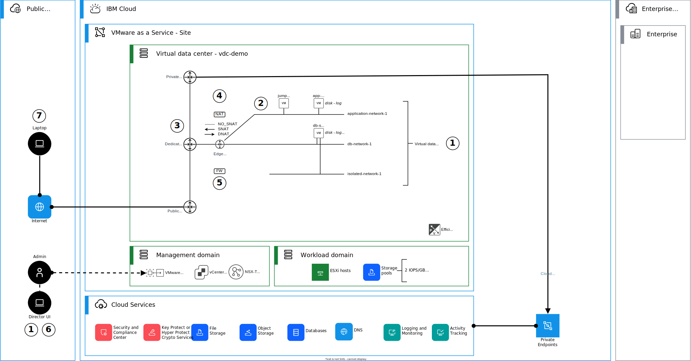

{:step: data-tutorial-type='step'}
{:java: #java .ph data-hd-programlang='java'}
{:swift: #swift .ph data-hd-programlang='swift'}
{:ios: #ios data-hd-operatingsystem="ios"}
{:android: #android data-hd-operatingsystem="android"}
{:shortdesc: .shortdesc}
{:new_window: target="_blank"}
{:codeblock: .codeblock}
{:screen: .screen}
{:tip: .tip}
{:pre: .pre}
{:important: .important}
{:note: .note}

# Creating a virtual data center in a {{site.data.keyword.vmware-service_short}} using the VMware Cloud Director Console
{: #vmware-as-a-service-vdc}
{: toc-content-type="tutorial"}
{: toc-services="vmware-service"}
{: toc-completion-time="1h"}

<!--##istutorial#-->
This tutorial may incur costs. Use the [Cost Estimator](https://{DomainName}/estimator/review) to generate a cost estimate based on your projected usage.
{: tip}

<!--#/istutorial#-->

## Objectives
{: #vmware-as-a-service-vdc-objectives}

The objective of this tutorial is to demonstrate the basic steps to operationalize an {{site.data.keyword.vmware-service_full}} – single tenant instance after initial instance provisioning. This tutorial should take about 30-60 minutes to complete and assumes that [{{site.data.keyword.vmware-service_full}} – single tenant instance](https://{DomainName}/docs/vmware-service?topic=vmware-service-tenant-ordering) and [a virtual data center (VDC)](https://{DomainName}/docs/vmware-service?topic=vmware-service-vdc-adding) have already been provisioned.

In this tutorial, you will learn:

* How to create virtual data center (VDC) networks inside your virtual data center,
* How to create virtual machines and attach them to your virtual data center network, and
* How to configure network address translation (NAT) and firewall (FW) rules on your virtual data center edge gateway.

The following diagram presents an overview of the solution to be deployed.

{: caption="Figure 1. Architecture diagram of the tutorial" caption-side="bottom"}
{: style="text-align: center;"}

This tutorial is divided into the following steps:

1. [Log in to the instance's VMware Cloud Director Console and deploy virtual data center networks](https://{DomainName}/docs/solution-tutorials?topic=solution-tutorials-vmware-as-a-service-vdc#vmware-as-a-service-vdc-deploy-network)
2. [Create virtual machines](https://{DomainName}/docs/solution-tutorials?topic=solution-tutorials-vmware-as-a-service-vdc#vmware-as-a-service-vdc-create-vm)
3. [Create IP Sets and Static Groups](https://{DomainName}/docs/solution-tutorials?topic=solution-tutorials-vmware-as-a-service-vdc#vmware-as-a-service-vdc-deploy-ip-set-sg) 
4. [Create NAT rules](https://{DomainName}/docs/solution-tutorials?topic=solution-tutorials-vmware-as-a-service-vdc#vmware-as-a-service-vdc-configure-nat)
5. [Create firewall rules](https://{DomainName}/docs/solution-tutorials?topic=solution-tutorials-vmware-as-a-service-vdc#vmware-as-a-service-vdc-configure-fw)
6. [Connect to the virtual machine using integrated web console](https://{DomainName}/docs/solution-tutorials?topic=solution-tutorials-vmware-as-a-service-vdc#vmware-as-a-service-vdc-connect-to-vmconsole)
7. [Connect to the virtual machine through the Internet and validate connectivity](https://{DomainName}/docs/solution-tutorials?topic=solution-tutorials-vmware-as-a-service-vdc#vmware-as-a-service-vdc-connect-to-vm)

An [alternative tutorial](https://{DomainName}/docs/solution-tutorials?topic=solution-tutorials-vmware-as-a-service-tf) with Terraform is also available.
{: note}

## Before you begin
{: #vmware-as-a-service-vdc-prereqs}

This tutorial requires:

* An {{site.data.keyword.cloud_notm}} [billable account](https://{DomainName}/docs/account?topic=account-accounts),
* Check for user permissions. Be sure that your user account has sufficient permissions [to create and manage VMware as a Service resources](https://{DomainName}/docs/vmware-service?topic=vmware-service-getting-started).
* [A pre-provisioned {{site.data.keyword.vmware-service_full}} - single tenant instance](https://{DomainName}/docs/vmware-service?topic=vmware-service-tenant-ordering), and
* [A pre-provisioned virtual data center on the {{site.data.keyword.vmware-service_full}} - single tenant instance](https://{DomainName}/docs/vmware-service?topic=vmware-service-vdc-adding).

## Log in to the instance and deploy the initial network
{: #vmware-as-a-service-vdc-deploy-network}
{: step}

The first step is to log in to your {{site.data.keyword.vmware-service_full}} – single tenant instance's VMware Cloud Director Console and deploy the initial networks that will be used for testing.

Log in to the {{site.data.keyword.vmware-service_full}} – single tenant instance's VMware Cloud Director Console:

1. In the **VMware as a Service** table, click a VMware as a Service instance name.
2. On the **Summary** tab, review the information.
3. If this is the first time that you access the VMware Cloud Director console for the VDC region, you must set the admin credentials to generate an initial, complex, and random password.
4. On the VDC details page, click **VMware Cloud Director Console** to access the console.
5. Use the admin username and password to log in to the VMware Cloud Director Console for the first time. 
6. After the admin is logged in to the VMware Cloud Director Console, you can create extra users who have roles that allow them to access the VMware Cloud Director Console.

Next, you will create the following virtual data center networks: 

| Network type     | Name                | IP subnet
| -----------------|---------------------|-------------------
| routed network   | `net-application`   | `192.168.100.1/24`
| routed network   | `net-db`            | `192.168.101.1/24`
| isolated         | `net-isolated-db`   | `192.168.102.1/24`
{: caption="Virtual data center networks" caption-side="bottom"}

Routed virtual data center networks are attached to the edge gateway while an isolated virtual data center network is a standalone network without any platform provided routing capabilities. You can create more networks based on your needs by following the same logic and steps.

The recommendation is to use RFC 1918 addresses, for example IP subnets from the `10.0.0.0/8`, `172.16.0.0/12` or `192.168.0.0/16` ranges.
{: note}

To create a virtual data center network:

1. In the top menu navigation, click on **Networking**. Then click on **New** to create a new virtual data center network. New Organization VDC Network wizard will appear. 
2. Select the **Organization Virtual Data Center** (Default) and then select the VDC you want to deploy the new network to. In most cases there will be a single VDC. Click **Next** to continue.
3. Select network type as **Routed** (default) for routed networks `net-application` and `net-db` and select **Isolated** for the isolated network `net-isolated-db`. Click **Next** to continue.
4. For **Edge Connection**, select the edge that was provisioned for you and leave all other settings as default. Isolated networks do not have a gateway connection. Click **Next** to continue.
5. Provide a name and the gateway CIDR for the new network. CIDR includes the IP address of the gateway and the network mask length, e.g. `192.168.100.1/24`. This IP address can either be related to your internal network or created specifically for {{site.data.keyword.cloud_notm}}. In this example, `net-application` is used as the name and `192.168.100.1/24` is used for the gateway CIDR. Click **Next** to continue.
6. Create a static IP pool for your new network. While optional, a static IP pool allows virtual machines to automatically be assigned an IP address upon provisioning. This pool should be part of the subnet created during the previous step, and for this example `192.168.100.10 – 192.168.100.19` is used for the `net-application` routed network. Follow the same logic for the other networks. To add a static IP pool, type the range in the box provided and click on **Add**. Click **Next** to continue when complete.
7. For DNS use the {{site.data.keyword.cloud_notm}} public DNS servers, which are `161.26.0.10` and `161.26.0.11` respectively. The DNS suffix can be left blank. Click **Next** to continue.
8. For Segment Profile, leave as default and Click **Next** to continue.
9. Review your input and click **Finish** to complete the New Organization VDC Network wizard and finish creating your first VDC network.

Upon completion of these tasks, your new network will be deployed and will appear in the networks tab. This may take a few seconds to complete. Repeat the process for the other two networks, or more if needed in your solution.

## Create virtual machines and connect to the virtual machine using console
{: #vmware-as-a-service-vdc-create-vm}
{: step}

In this step, you will create a few virtual machines inside your virtual data center and you will attach them to the virtual data center networks that were created in the previous step.

You will create the following virtual machines:

| Virtual machine name   | Operating System     | Networks
| -----------------------|----------------------|-------------------------------
| `jump-server-1`        | Windows Server 2022  | `net-application`
| `application-server-1` | RedHat Linux 8       | `net-application`
| `db-server-1`          | RedHat Linux 8       | `net-db`, `net-isolated-db`
{: caption="Virtual machines" caption-side="bottom"}

The first server will be used as a jump server, which you can optionally reach through the public Internet. The other two servers are examples of application and database servers.

To create a virtual machine:

1. In the top menu navigation click on **Applications**.
2. Click on **Virtual Machines** in the sub navigation tabs.
3. Click on **New VM** to launch the new virtual machine window.
4. Select the target virtual data center and click on **Next** to continue.
5. The new VM wizard will appear. There are five fields that must be filled out. Note depending on the size of your display you may need to scroll down to see all fields.
   1. **Name** – `jump-server-1`
   2. **Computer name** – This field is auto-populated from the name.
   3. **Templates** – For this example the `Windows 2022` template is used.
   4. **Storage policy** – The values here depend on what was provisioned in the instance. In this example, `4 IOPS/GB` is used (VDC Default).
   5. **NICs** – Check the box for connected and then in the drop-down field below network select the network created in the first step. In this example, `net-application` is used. In the drop-down below IP mode, select `Static-IP Pool`.
6. Leave all other values at their defaults and click **OK** when complete.

The new virtual machine will be created. Provisioning of the virtual machine may take several minutes to complete. Upon completion, the virtual machine will automatically power on. Repeat the process for the other virtual machines, `application-server-1` and `db-server-1`.

Virtual machine `db-server-1` requires two NICs, but as the default template only has one. So, you need to [add that post initial provisioning](https://docs.vmware.com/en/VMware-Cloud-Director/10.4/VMware-Cloud-Director-Tenant-Portal-Guide/GUID-FA8C101E-241E-41A5-A3C3-83BDBB4467F1.html). After the virtual machine has been created, click **Details**. Then select **NICs** under the Hardware, and you can add the 2nd NIC to the virtual machine and attach that to the correct network segment.
{: tip}

Review the other hardware options and see what you can change and how. See [Edit Virtual Machine Properties section on VMware Cloud Director Tenant Guide](https://docs.vmware.com/en/VMware-Cloud-Director/10.4/VMware-Cloud-Director-Tenant-Portal-Guide/GUID-FA8C101E-241E-41A5-A3C3-83BDBB4467F1.html){: external} for more details.  
{: tip}

## Create IP Sets and Static Groups
{: #vmware-as-a-service-vdc-deploy-ip-set-sg}
{: step}

IP Sets and Static Groups are used as part of configuration of the firewall rules are required. Unlike with some other firewalls, you must use Static Groups and IP Sets to configure firewalls to identify sources and destinations, IP addresses cannot be used directly in the rules.

Before configuring IP Sets, find out your Public IP addresses assigned for your virtual data center. [Use the {{site.data.keyword.cloud_notm}} portal](https://{DomainName}/docs/vmware-service?topic=vmware-service-vdc-view-delete) to obtain the allocated public IP addresses.

In these examples, `public-ip-0` refers to the first IP address provided in the list of available IP addresses, and should be noted as a normal IP address notation `aaa.bbb.ccc.ddd`. Likewise, `public-ip-1` refers to the second IP address and so on.
{: note}

You will create the following IP Sets and Static Groups:

| Type            | Name                  | Members or IP addresses
| ----------------|-----------------------|--------------------------------
| IP Set          | `ipset-dnat-to-jump`  | `public-ip-0`
| IP Set          | `ipset-snat`          | `public-ip-1`
| Static Group    | `sg-private-networks` | `net-application` and `net-db`
{: caption="IP Sets and Static Groups" caption-side="bottom"}

To create an IP Set:

1. In the top menu navigation, click on **Networking**.
2. Click on **Edge Gateways** and select your virtual data center's Edge Gateway.
3. Under **Security**, click **IP Sets**.
4. Click **New** to create a new IP Set.
5. In the new IP Set window, enter a name and the IP range for this IP Set. In this example, `ipset-dnat-to-jump` is used as the name and `public-ip-0` (the first actual public IP obtained in the previous task) is used.
6. Click **Add** to add the IP Set then click **Save** to complete the window.

Repeat the process for the other required IP Sets, or more if needed in your solution.

To create a Static Group:

1. In the top menu navigation, click on **Networking**.
2. Click on **Edge Gateways** and select your virtual data center's edge gateway.
3. Under **Security**, click **Static Groups**.
4. Click **New** to create a new Static Group. Enter the name and Click **Save**.
5. Select the created Static Group and click **Manage Members**. Select the `net-application` and `net-db`networks created in the previous step. Click **Save**.  

Upon completion of these tasks, the new IP Sets and Static Groups will be added.

## Create NAT rules to allow virtual machines to access the Internet
{: #vmware-as-a-service-vdc-configure-nat}
{: step}

The next step is to create NAT rules to allow your virtual machines to access the public Internet and you to access the virtual machines over the public Internet.

You will create the following NAT rules in this tutorial.

| Name               | Type            | External IP       | Internal IP         | Application
| -------------------|-----------------|-------------------|---------------------|-----------------------
| `dnat-to-jump`     | DNAT            | `public-ip-0`     | `192.168.100.10/32` | N/A
| `snat-to-inet-app` | SNAT            | `public-ip-1`     | `192.168.100.0/24`  | N/A
| `snat-to-inet-db`  | SNAT            | `public-ip-1`     | `192.168.101.0/24`  | N/A
{: caption="NAT rules" caption-side="bottom"}

Double-check the IP addresses of the virtual machines you created using the VMware Cloud Director Console.
{: important} 

To create a destination NAT (DNAT) rule:

1. In the top menu navigation, click on **Networking**.
2. Click on **Edge Gateways** and select your virtual data center's Edge Gateway.
3. In the left navigation under **Services**, click on **NAT**. 
4. Click on **New** to create a new NAT rule.
5. The Add NAT Rule wizard will appear. There are four fields that must be filled out. 
   1. **Name** – In this example, `dnat-to-jump` is used.
   2. **Interface type** – Select `DNAT` (destination NAT) as the interface type.
   3. **External IP** – Input one of the public IP addresses provided by {{site.data.keyword.cloud_notm}} to your instance. You may click on the information button to the right of the field to see these IP addresses. In this example, `public-ip-0` (the first actual public IP obtained in the previous step) is used.
   4. ** Internal IP** – This is the IP address of the virtual machines you created in the previous step. In this example, `192.168.100.10/32` is used.
   5. **Application** - Leave empty.
6. Click **Save** when complete.

The new NAT rule will be created. This may take a few seconds to complete. Repeat the process for other destination NAT rules, if needed in your solution.

To create a source NAT (SNAT) rule:

1. In the top menu navigation, click on **Networking**.
2. Click on **Edge Gateways** and select your virtual data center's Edge Gateway.
3. In the left navigation under **Services**, click on **NAT**.
4. Click on New to create a new NAT rule.
5. The Add NAT Rule wizard will appear. There are four fields that must be filled out. 
   1. **Name** – In this example, `snat-to-inet` is used.
   2. **Interface type** – Select `SNAT` (source NAT) as the interface type.
   3. **External IP** – Input one of the public IP addresses provided by {{site.data.keyword.cloud_notm}} to your instance. You may click on the information button to the right of the field to see these IP addresses. In this example, `public-ip-1` (the second actual public IP obtained in the previous step) is used.
   4. **Internal IP** – This is the CIDR range of the network you created in the previous step. In this example, `192.168.100.0/24` is used.
   5. **Application** - Leave empty.
6. Click **Save** when complete.

The new NAT rule will be created. This may take a few seconds to complete. Repeat the process for other source NAT rules, if needed in your solution.

## Create firewall rules
{: #vmware-as-a-service-vdc-configure-fw}
{: step}

The next step is to create firewall rules. By default, the {{site.data.keyword.vmware-service_full}} – single tenant instance has been provisioned with a default firewall rule that will drop all traffic for ensuring basic network security. Additional rules must be put in place to allow the traffic from the previously created network to access the Public Internet and for you to access the virtual machine from the Public Internet.

| Name             | Applications       | Source                | Destination          | Action     | IP protocol
| -----------------|--------------------|-----------------------|----------------------|------------|-----------
| `dnat-to-jump`   | `RDP`, `ICMP ALL`  | `Any`                 | `ipset-dnat-to-jump` | Allow      | IPv4
| `egress-to-inet` | N/A                | `sg-private-networks` | `Any`                | Allow      | IPv4
| `default_rule`   | N/A                | `Any`                 | `Any`                | Drop       | IPv4
{: caption="Firewall rules" caption-side="bottom"}

The `default_rule` has been pre-provisioned by {{site.data.keyword.cloud_notm}}. It is listed above just for illustration purposes.
{: note}

To create a firewall rule: 

1. In the top menu navigation, click on **Networking**.
2. Click on **Edge Gateways** and select your virtual data center's Edge Gateway.
3. In the left navigation under **Services**, click on **Firewall**.
4. Click on **Edit Rules**.
5. Click on **New** on Top to create a new firewall rule above the `default_rule` (drop any).
6. A new entry in the firewall rule list will be created. To complete the entry:
   1. **Name** – In this example, `dnat-to-jump` is used.
   2. **Application** - Click on the pencil icon next to Applications and select `RDP` and `ICMP ALL` from the applications list. You can filter with a name. Click on **Save** when complete.
   3. **Source** – Click on the pencil icon next to source and toggle the slider next to Any source to green (enabled). Click on **Keep** when complete.
   4. **Destination** – Click on the pencil icon next to destination and select IP Set `ipset-dnat-to-jump` (or Static Group if that would have been used). Click on **Keep** when complete.
7. Review the inputs and click on **Save** when complete.

The new firewall rule will be created. This may take a few seconds to complete. Repeat the process for the other firewall rules, or more if needed in your solution.

## Connect to the virtual machine using the web console
{: #vmware-as-a-service-vdc-connect-to-vmconsole}
{: step}

Prior to logging in to the virtual machine for the first time you will need to get the provisioned password.

To get the password:

1. Click on **Details** on the virtual machine.
2. Click on **Guest OS Customizations**.
3. Click on **Edit**. 
4. The password auto generated during virtual machine provisioning will be listed under **Specify Password**. Copy this password to a safe space to be used upon initial login. Click on **Discard** when this password has been saved.

To connect to the virtual machine using the web console:
1. Click on **Launch Web Console** to open a local console to the virtual machine.
2. Using the web console, log in to the virtual machine using root as the user ID and the password you captured from the previous step.
3. You should then be able to ping Internet resources such as `www.ibm.com`, showing that the networking is complete and working.

## Connect to the virtual machines though the Internet and validate connectivity
{: #vmware-as-a-service-vdc-connect-to-vm}
{: step}

The final step is to connect to the virtual machine through the Internet to validate the deployment and its network connectivity.

To connect to the virtual machine through the Internet:
1. You should be able to ping the public IP address `public-ip-0` from your laptop or workstation, showing that the networking is complete and working.
2. You should be able to use RDP to connect to your Jump Server using the public IP address `public-ip-0` and the username and password collected in the previous step.
3. You can then disable the FW rule `dnat-to-jump` created in the previous step by editing the rule and its State by sliding the State to Disabled (gray).

## Reference material
{: #vmware-as-a-service-vdc-reference}

Check the following VMware Cloud Director™ Tenant Portal Guides for more detailed information:

* [Managing Organization Virtual Data Center Networks](https://docs.vmware.com/en/VMware-Cloud-Director/10.4/VMware-Cloud-Director-Tenant-Portal-Guide/GUID-B208CDD2-5D46-4841-8F3C-BED9E4F27F07.html){: external}
* [Managing NSX Edge Gateways](https://docs.vmware.com/en/VMware-Cloud-Director/10.4/VMware-Cloud-Director-Tenant-Portal-Guide/GUID-45C0FEDF-84F2-4487-8DB8-3BC281EB25CD.html){: external}
* [Working with Virtual Machines](https://docs.vmware.com/en/VMware-Cloud-Director/10.4/VMware-Cloud-Director-Tenant-Portal-Guide/GUID-DF0C111D-B638-4EC3-B805-CC33994F8D53.html){: external}

