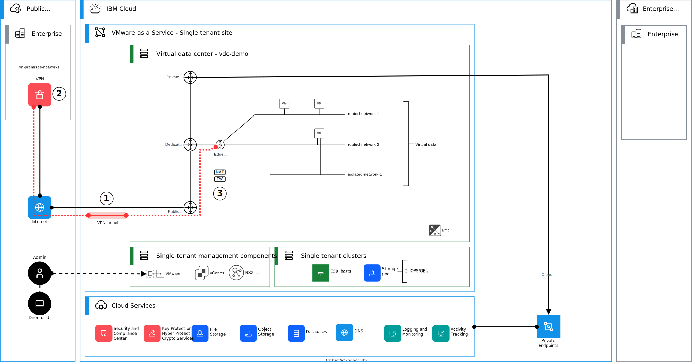

{{site.data.keyword.attribute-definition-list}}

# Creating a VPN between virtual data center edge gateway and on-premises VPN gateway
{: #vmware-as-a-service-vpn-vsrx}
{: toc-content-type="tutorial"}
{: toc-services="vmware-service"}
{: toc-completion-time="1h"}

<!--##istutorial#-->
This tutorial may incur costs. Use the [Cost Estimator](/estimator) to generate a cost estimate based on your projected usage.
{: tip}

<!--#/istutorial#-->

This tutorial is to demonstrate the basic steps of connecting via a Virtual Private Network (VPN) a {{site.data.keyword.vmware-service_full}} – single tenant instance with a Juniper vSRX. The vSRX can either be deployed in {{site.data.keyword.cloud_notm}} Classic Infrastructure or in a client data center. The steps that follow will create a basic working environment, providing a VPN and basic firewall implementation, with test virtual machines that can be used to verify  that the end-to-end environment is functional.
{: shortdesc}

## Objectives
{: #vmware-as-a-service-vpn-vsrx-objectives}

This tutorial should take about 30-60 minutes to complete and assumes that [{{site.data.keyword.vmware-service_full}} – single tenant instance](/docs/vmware-service?topic=vmware-service-tenant-ordering) and [a virtual data center (VDC)](/docs/vmware-service?topic=vmware-service-vdc-adding) have already been provisioned.

In this tutorial, you will learn:

* How to create VPNs in between virtual data center edge gateway and Juniper xSRX,
* How to create and configure matching IKE and IPsec tunnel proposals and profiles, and
* How to configure firewall (FW) rules on your virtual data center edge gateway and vSRX to allow VPN traffic.

The following diagram presents an overview of the solution to be deployed.

{: caption="Figure 1. Architecture diagram of the tutorial" caption-side="bottom"}
{: style="text-align: center;"}

This tutorial is divided into the following steps:

1. [Gather requirements](/docs/solution-tutorials?topic=solution-tutorials-vmware-as-a-service-vpn-vsrx#vmware-as-a-service-vpn-vsrx-gather-requirements)
2. [Configure vSRX](/docs/solution-tutorials?topic=solution-tutorials-vmware-as-a-service-vpn-vsrx#vmware-as-a-service-vpn-vsrx-config-vsrx)
3. [Configure {{site.data.keyword.vmware-service_full}} – single tenant edge gateway](/docs/solution-tutorials?topic=solution-tutorials-vmware-as-a-service-vpn-vsrx#vmware-as-a-service-vpn-vsrx-edge-gateway)


## Before you begin
{: #vmware-as-a-service-vpn-vsrx-prereqs}

This tutorial requires:

* An {{site.data.keyword.cloud_notm}} [billable account](/docs/account?topic=account-accounts),
* Check for user permissions. Be sure that your user account has sufficient permissions [to create and manage VMware as a Service resources](/docs/vmware-service?topic=vmware-service-getting-started).
* [A pre-provisioned {{site.data.keyword.vmware-service_full}} - single tenant instance](/docs/vmware-service?topic=vmware-service-tenant-ordering), and
* [A pre-provisioned virtual data center on the {{site.data.keyword.vmware-service_full}} - single tenant instance](/docs/vmware-service?topic=vmware-service-vdc-adding).


## Gather requirements
{: #vmware-as-a-service-vpn-vsrx-gather-requirements}
{: step}

It is important to design and collect the following information as these values must match on configuration on both sides.

1. Collect local and remote network information for the policy based tunnel

   The private interface of the vSRX is typically configured as follows:
   
   ```sh
   set interfaces reth2 unit <vlan-id> description "Your private network routed through Gateway Appliance"
   set interfaces reth2 unit <vlan-id> vlan-id <vlan-id>
   set interfaces reth2 unit <vlan-id> family inet address <private-IP address-of-the-vsrx>/26
   ```
      
   As your solution may differ, collect the local and remote network information for the policy based tunnel. Example values are provided as follows.
   
   Prefix                           | Value
   ---------------------------------|---------------------------
   Subnets on virtual data center   | 192.168.100.0/24
   Subnets behind vSRX              | 10.95.1.1/26
   {: caption="List of site prefixes or subnets to review before configuring the VPN." caption-side="bottom"}


2. Collect local and remote gateway IP address information for the tunnel

   Gateway IP address                 | Value
   -----------------------------------|---------------------------
   Public IP address of edge gateway  | `<public-IP address-of-the-vcd-edge-gateway>`
   Public IP address of vSRX          | `<public-IP address-of-the-vsrx>`
   {: caption="List of gateway IP addresses to review before configuring the VPN." caption-side="bottom"}
   
   The public IP address for the virtual data center gateway is provided though the IBM Cloud portal, see [Viewing and deleting VDCs](/docs/vmware-service?topic=vmware-service-vdc-view-delete#vdc-view-delete-details).
   
   The public interface IP of the vSRX is typically configured as follows in IBM Cloud:
   
   ```sh
   set interfaces reth1 unit 0 description "SL PUBLIC VLAN INTERFACE"
   set interfaces reth1 unit 0 family inet address <public-IP address-of-the-vsrx>/29
   ```
   
   As your solution may differ, collect the information for tunnel endpoints.
   
3. Design and decide IKE policy

   Design and decide IKE policy for your tunnel. The following table shows values used in this example.

   IKE policy                       | Value
   ---------------------------------|------------------
   Version                          | IKE v2
   Encryption                       | AES 256
   Digest                           | SHA 2 - 256
   Diffie-Hellman Group             | Group 14
   Association Life Time (seconds)  | 28800
   {: caption="List of IKE policy parameters to review before configuring the VPN." caption-side="bottom"}
   
   
4. Design and decide IPsec policy

   Design and decide IPsec (or tunnel) policy. The following table shows values used in this example.

   IPsec (or tunnel) policy         | Value
   ---------------------------------|------------------
   Perfect Forward Secrecy          | Enabled
   Defragmentation Policy           | Copy
   Encryption                       | AES 256
   Digest                           | SHA 2 - 256
   Diffie-Hellman Group             | Group 14
   Association Life Time (seconds)  | 3600
   {: caption="List of IPsec (or tunnel) policy parameters to review before configuring the VPN." caption-side="bottom"}
   
5. Design and decide dead peer detection (DPD) policy

   Design and decide DPD policy. The following table shows values used in this example.

   DPD                              | Value
   ---------------------------------|------------------
   Probe Interval (seconds)         | 60
   {: caption="List of dead peer detection (DPD) policy parameters to review before configuring the VPN." caption-side="bottom"}


## Configure vSRX
{: #vmware-as-a-service-vpn-vsrx-config-vsrx}
{: step}


```bash
set security ike proposal ike-phase1-vmwaas authentication-method pre-shared-keys
set security ike proposal ike-phase1-vmwaas dh-group group14
set security ike proposal ike-phase1-vmwaas authentication-algorithm sha-256
set security ike proposal ike-phase1-vmwaas encryption-algorithm aes-256-cbc
set security ike proposal ike-phase1-vmwaas lifetime-seconds 28800

set security ike policy ike-phase1-policy mode main
set security ike policy ike-phase1-policy proposals ike-phase1-vmwaas
set security ike policy ike-phase1-policy pre-shared-key ascii-text <your-psk>

```

```bash
set security ike gateway vmwaas ike-policy ike-phase1-policy
set security ike gateway vmwaas address <public-IP address-of-the-vcd-edge-gateway>


set security ike gateway vmwaas external-interface reth1.0
set security ike gateway vmwaas version v2-only
```

```bash
set security ipsec proposal ipsec-phase2-vmwaas protocol esp
set security ipsec proposal ipsec-phase2-vmwaas authentication-algorithm hmac-sha-256-128
set security ipsec proposal ipsec-phase2-vmwaas encryption-algorithm aes-256-cbc
set security ipsec proposal ipsec-phase2-vmwaas lifetime-seconds 3600

set security ipsec policy ipsec-phase2-policy perfect-forward-secrecy keys group14
set security ipsec policy ipsec-phase2-policy proposals ipsec-phase2-vmwaas
```

```bash
set interfaces st0 unit 0 family inet
set security ipsec vpn vmwaas-vpn-1 bind-interface st0.0
set security ipsec vpn vmwaas-vpn-1 ike gateway vmwaas
set security ipsec vpn vmwaas-vpn-1 ike ipsec-policy ipsec-phase2-policy
set security ipsec vpn vmwaas-vpn-1 traffic-selector pair1 local-ip 10.95.1.0/26
set security ipsec vpn vmwaas-vpn-1 traffic-selector pair1 remote-ip 192.168.100.0/24
set security ipsec vpn vmwaas-vpn-1 establish-tunnels immediately
set security ipsec vpn vmwaas-vpn-1 df-bit copy
```


```bash
set firewall filter PROTECT-IN term PING from destination-address 10.95.1.1/32
set firewall filter PROTECT-IN term PING from protocol icmp

set firewall filter PROTECT-IN term IPSec-IKE from destination-address <public-IP address-of-the-vsrx>/32
#set firewall filter PROTECT-IN term IPSec-IKE from source-address <public-IP address-of-the-vcd-edge-gateway>/32
set firewall filter PROTECT-IN term IPSec-IKE from protocol udp
set firewall filter PROTECT-IN term IPSec-IKE from port 500
set firewall filter PROTECT-IN term IPSec-IKE then accept

set firewall filter PROTECT-IN term IPSec-ESP from destination-address <public-IP address-of-the-vsrx>/32
#set firewall filter PROTECT-IN term IPSec-ESP from source-address <public-IP address-of-the-vcd-edge-gateway>/32
set firewall filter PROTECT-IN term IPSec-ESP from protocol esp
set firewall filter PROTECT-IN term IPSec-ESP then accept

set firewall filter PROTECT-IN term IPSec-4500 from destination-address <public-IP address-of-the-vsrx>/32
#set firewall filter PROTECT-IN term IPSec-4500 from source-address <public-IP address-of-the-vcd-edge-gateway>/32
set firewall filter PROTECT-IN term IPSec-4500 from protocol udp
set firewall filter PROTECT-IN term IPSec-4500 from port 4500
set firewall filter PROTECT-IN term IPSec-4500 then accept


```

```bash
set security zones security-zone vpn-vmwaas-tunnel interfaces st0.0
set security zones security-zone vsrx-vlan interfaces reth2.2498

set security policies from-zone vsrx-vlan to-zone vpn-vmwaas-tunnel policy vlan_to_vmwaas match source-address any
set security policies from-zone vsrx-vlan to-zone vpn-vmwaas-tunnel policy vlan_to_vmwaas match destination-address any
set security policies from-zone vsrx-vlan to-zone vpn-vmwaas-tunnel policy vlan_to_vmwaas match application any
set security policies from-zone vsrx-vlan to-zone vpn-vmwaas-tunnel policy vlan_to_vmwaas then permit

set security policies from-zone vpn-vmwaas-tunnel to-zone vsrx-vlan policy vmass_to_vlan match source-address any
set security policies from-zone vpn-vmwaas-tunnel to-zone vsrx-vlan policy vmass_to_vlan match destination-address any
set security policies from-zone vpn-vmwaas-tunnel to-zone vsrx-vlan policy vmass_to_vlan match application any
set security policies from-zone vpn-vmwaas-tunnel to-zone vsrx-vlan policy vmass_to_vlan then permit

```

```bash
set security flow tcp-mss ipsec-vpn mss 1360
```


## Configure {{site.data.keyword.vmware-service_full}} – single tenant edge gateway
{: #vmware-as-a-service-vpn-vsrx-config-edge-gateway}
{: step}


## Reference material
{: #vmware-as-a-service-vpn-vsrx-reference}

Check the following VMware Cloud Director™ Tenant Portal Guides for more detailed information:

* [Managing Organization Virtual Data Center Networks](https://docs.vmware.com/en/VMware-Cloud-Director/10.4/VMware-Cloud-Director-Tenant-Portal-Guide/GUID-B208CDD2-5D46-4841-8F3C-BED9E4F27F07.html){: external}
* [Managing NSX Edge Gateways](https://docs.vmware.com/en/VMware-Cloud-Director/10.4/VMware-Cloud-Director-Tenant-Portal-Guide/GUID-45C0FEDF-84F2-4487-8DB8-3BC281EB25CD.html){: external}
* [Working with Virtual Machines](https://docs.vmware.com/en/VMware-Cloud-Director/10.4/VMware-Cloud-Director-Tenant-Portal-Guide/GUID-DF0C111D-B638-4EC3-B805-CC33994F8D53.html){: external}

