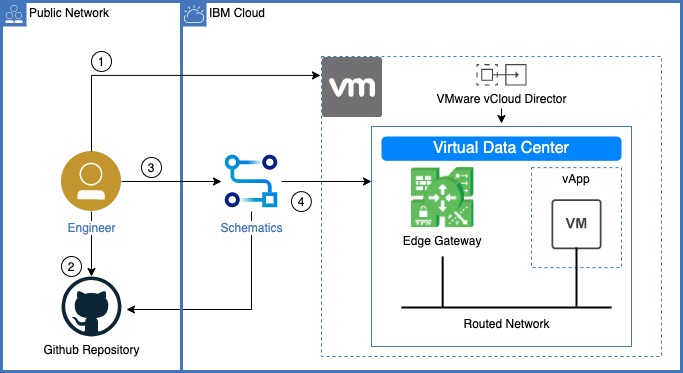

{:step: data-tutorial-type='step'}
{:java: #java .ph data-hd-programlang='java'}
{:swift: #swift .ph data-hd-programlang='swift'}
{:ios: #ios data-hd-operatingsystem="ios"}
{:android: #android data-hd-operatingsystem="android"}
{:shortdesc: .shortdesc}
{:new_window: target="_blank"}
{:codeblock: .codeblock}
{:screen: .screen}
{:tip: .tip}
{:pre: .pre}
{:important: .important}
{:note: .note}

# Review architecture and concepts
{: #vmware-onboarding-architecture-and-concepts}
{: toc-content-type="tutorial"}
{: toc-services="vmwaresolutions"}
{: toc-completion-time="1h"}

<!--##istutorial#-->
This tutorial may incur costs. Use the [Cost Estimator](https://{DomainName}/estimator/review) to generate a cost estimate based on your projected usage.
{: tip}

<!--#/istutorial#-->

This should show the big picture of what we are going to walk users through.  Mike has some of the content already from the Netifinity Journey boxnote.
{: shortdesc}

A tip if needed.
{: tip}

## Objectives (Example)
{: #vmware-onboarding-architecture-and-concepts-objectives}

* Create and explore a {{site.data.keyword.vmwaresolutions_short}} Shared instance in the {{site.data.keyword.Bluemix_notm}}.
* Create a {{site.data.keyword.bpshort}} workspace in the {{site.data.keyword.Bluemix_notm}} to run Infrastructure as Code(IaC) based on Terraform.
* Use {{site.data.keyword.bpshort}} to create a network, firewall, source network address translation (SNAT), destination network address translation (DNAT) rules, and deploy a virtual machine instance in VMware Virtual Data Center via a Terraform template.

{: class="center"}
{: style="text-align: center;"}

1. Create a {{site.data.keyword.vmwaresolutions_short}} Shared virtual data center (VDC) instance using the {{site.data.keyword.Bluemix_notm}} console. With each VDC created, an edge gateway is provided and is capable of routing traffic to the Internet and to the {{site.data.keyword.Bluemix_notm}} private network for connectivity to other {{site.data.keyword.Bluemix_notm}} services.
2. Review a Terraform template that will be used to configure and create resources in the VDC:
    - Create a routed network, this type of network provides controlled access to machines outside of the VDC via an edge gateway.
    - Create firewall and SNAT rules on the edge gateway to allow traffic to the Internet and to the {{site.data.keyword.Bluemix_notm}} private network.
    - Create a vApp and configure it to use the routed network.
    - Create a virtual machine instance inside of the vApp.
    - Create firewall and DNAT rules on the edge gateway to allow SSH from the Internet to the virtual machine.
3. Create a {{site.data.keyword.bpshort}} Workspace using the {{site.data.keyword.Bluemix_notm}} console.
4. Use the {{site.data.keyword.bplong_notm}} service to apply the Terraform template and create the resources in the VDC.

<!--##istutorial#-->
## Before you begin
{: #vmware-onboarding-architecture-and-concepts-prereqs}

This tutorial requires:
* An {{site.data.keyword.cloud_notm}} [billable account](https://{DomainName}/docs/account?topic=account-accounts), 

A GitHub account is optional and only required if you plan on modifying the provided Terraform template beyond the steps outlined in this tutorial.
{: tip}

<!--#/istutorial#-->

## Create services
{: #vmware-onboarding-architecture-and-concepts-create_services}
{: step}

Login to {{site.data.keyword.cloud_notm}} via a web browser to create the {{site.data.keyword.vmwaresolutions_short}} Shared virtual data center instance with the desired vCPU and RAM configuration.

### {{site.data.keyword.vmwaresolutions_short}} Shared
{: #vmware-onboarding-architecture-and-concepts-create-1}

1. Navigate to [{{site.data.keyword.vmwaresolutions_short}} Shared](https://{DomainName}/infrastructure/vmware-solutions/console).
2. In the **Start Provisioning** section, click the **VMware Solutions Shared** card.
3. For **Pricing Plans**, select `On-Demand`.
4. Enter the virtual data center name, i.e. `vmware-tutorial`.
5. Select the **Resource group** where to create the service instance.
6. Select the {{site.data.keyword.Bluemix_notm}} data center to host the instance, i.e. `Dallas`.
7. Scroll to **Virtual data center capacity** and set the **vCPU Limit** to `4 vCPU` and the **RAM Limit** to `16 GB`.  You may increase or reduce the capacity as needed later on. 
8. From the **Summary** pane on the right side of the screen, verify the configuration and estimated cost.
9. After having read and agreed to the third-party service agreements, click on **Create**. While waiting for the instance to create, proceed to review the Terraform template section of this tutorial and come back to perform access steps below once the instance is available.

## Next Steps
{: #vmware-onboarding-architecture-and-concepts-next-steps}

The next step in the tutorial series is:

* [Enable VRF and Service Endpoints](/docs/solution-tutorials?topic=solution-tutorials-vmware-onboarding-vrf-service-endpoints)
