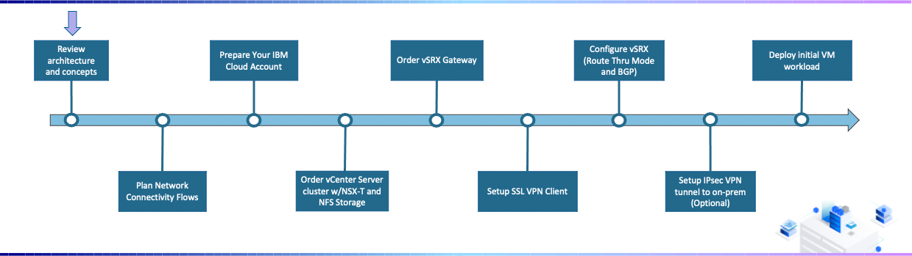
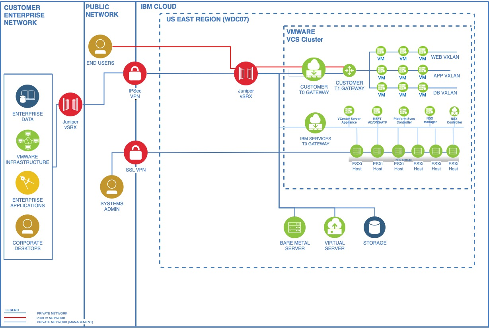

{:step: data-tutorial-type='step'}
{:java: #java .ph data-hd-programlang='java'}
{:swift: #swift .ph data-hd-programlang='swift'}
{:ios: #ios data-hd-operatingsystem="ios"}
{:android: #android data-hd-operatingsystem="android"}
{:shortdesc: .shortdesc}
{:new_window: target="_blank"}
{:codeblock: .codeblock}
{:screen: .screen}
{:tip: .tip}
{:pre: .pre}
{:important: .important}
{:note: .note}

# Deployment Journey Overview
{: #vmware-onboarding-architecture-and-concepts}
{: toc-content-type="tutorial"}
{: toc-services="vmwaresolutions"}
{: toc-completion-time="30m"}

<!--##istutorial#-->

<!--#/istutorial#-->

IBM Cloud for VMware Solutions makes it simpler for your organization to capitalize on the tremendous value of the cloud. The solution provides a path to migrate VMware workloads to the IBM Cloud while using existing tools, technologies and skills from your on-premises environment.  The information contained within this document is meant to serve as a technical guide for starting with a new IBM Cloud towards a fully configured VMware instance. 
{: shortdesc}

## Getting Started
{: #vmware-onboarding-architecture-and-concepts-overview}

{: class="center"}

1. 

<!--##istutorial#-->
## Technical Architure
{: #vmware-onboarding-architecture-and-concepts-prereqs}

{: class="center"}

This tutorial requires:

* An {{site.data.keyword.cloud_notm}} [billable account](https://{DomainName}/docs/account?topic=account-accounts), 

A GitHub account is optional and only required if you plan on modifying the provided Terraform template beyond the steps outlined in this tutorial.
{: tip}

<!--#/istutorial#-->

## Create services
{: #vmware-onboarding-architecture-and-concepts-create_services}
{: step}

Login to {{site.data.keyword.cloud_notm}} via a web browser to create the {{site.data.keyword.vmwaresolutions_short}} Shared virtual data center instance with the desired vCPU and RAM configuration.

6. Select the {{site.data.keyword.Bluemix_notm}} data center to host the instance, i.e. `Dallas`.
7. Scroll to **Virtual data center capacity** and set the **vCPU Limit** to `4 vCPU` and the **RAM Limit** to `16 GB`.  You may increase or reduce the capacity as needed later on. 
8. From the **Summary** pane on the right side of the screen, verify the configuration and estimated cost.
9. After having read and agreed to the third-party service agreements, click on **Create**. While waiting for the instance to create, proceed to review the Terraform template section of this tutorial and come back to perform access steps below once the instance is available.

## Next Steps
{: #vmware-onboarding-architecture-and-concepts-next-steps}

The next step in the tutorial series is:

* [Enable VRF and Service Endpoints](/docs/solution-tutorials?topic=solution-tutorials-vmware-onboarding-vrf-service-endpoints)
