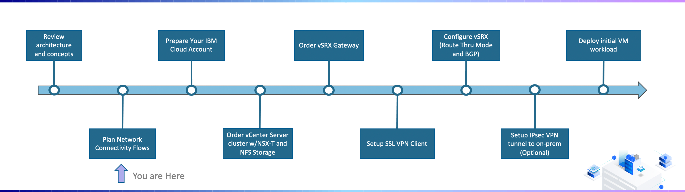
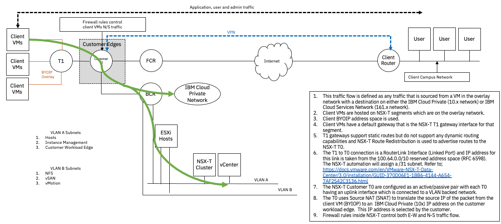
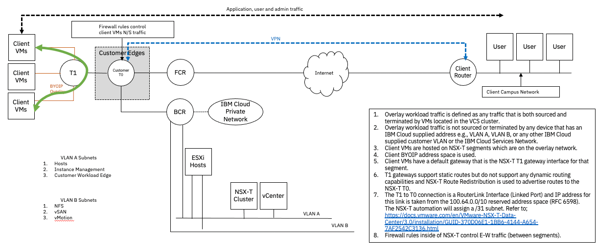
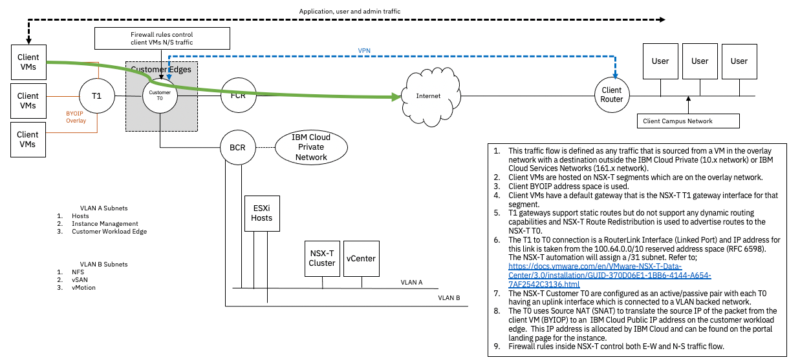
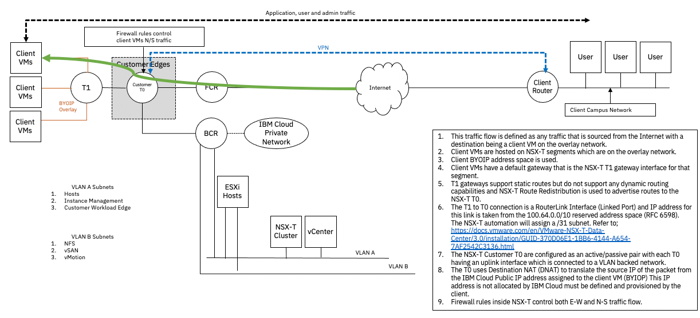
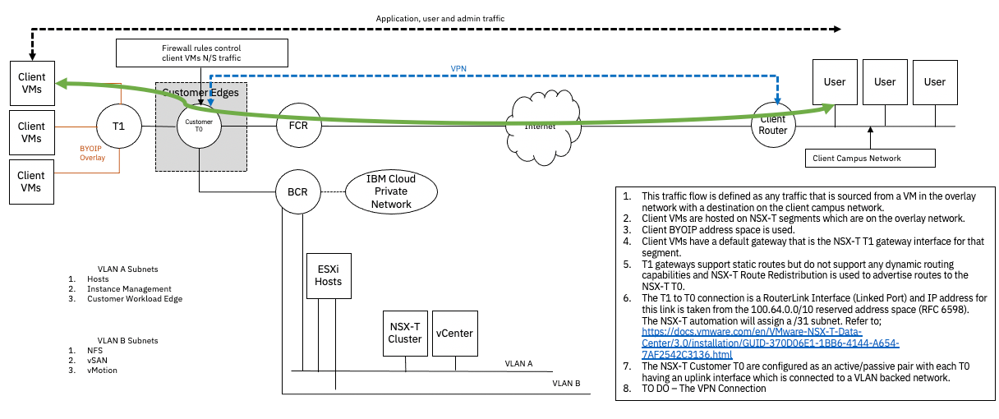

{:step: data-tutorial-type='step'}
{:java: #java .ph data-hd-programlang='java'}
{:swift: #swift .ph data-hd-programlang='swift'}
{:ios: #ios data-hd-operatingsystem="ios"}
{:android: #android data-hd-operatingsystem="android"}
{:shortdesc: .shortdesc}
{:new_window: target="_blank"}
{:codeblock: .codeblock}
{:screen: .screen}
{:tip: .tip}
{:pre: .pre}
{:important: .important}
{:note: .note}

# Plan Network Connectivity Flows
{: #vmware-onboarding-network-flows}
{: toc-content-type="tutorial"}
{: toc-services="vmwaresolutions"}
{: toc-completion-time="1h"}

<!--##istutorial#-->
Taking the time to understand and plan network fows is a key ingredient to successful deployment. As you review this section, consider the connectivity requirements you have today but may also need in the future.
{: tip}

<!--#/istutorial#-->

## Objectives
{: #vmware-onboarding-network-flows-objectives}

{: class="center"}

<!--##istutorial#-->
## Overview
{: #vmware-onboarding-network-flows-video-walkthrough}

By using NSX logical switches with your own IP addresses (BYOIP) you gain the greatest flexibility to manage and secure your workload network in the IBM Cloud. However, with BYOIP comes the additional requirement of devising a strategy for connectivity from within your instance. There are four major areas of connectivity that need to be addressed:

1. VM to VM connectivity. How your VMs will be able to communicate with each other over the NSX software defined network. Considerations here include routing and whether microsegmentation will be implemented.
2. VM to public network (Internet) connectivity. Will your virtual machines connect to the Internet directly, utilize a gateway appliance such as FortiGate or vSRX, or utilize proxy servers deployed in the IBM Cloud network or on your own network accessed via VPN or Direct Link.
3. VM to IBM Cloud Private connectivity. Will your virtual machines require connectivity to services such as Cloud Object Storage or IBM Databases as a Service, and will that connectivity be secured through a gateway appliance or leverage the network address capabilities of NSX-T.
4. VM to on premise connectivity. Key to connectivity between your BYOIP NSX environment and on premise is the ability to perform route exchange between the two environments. Devising a solution to exchange routes using such technologies as BGP or GRE is essential to a complete working solution.

<!--#/istutorial#-->

## Detailed Flows
{: #vmware-onboarding-network-flows-details}

In this section, detailed network flows will be reviewed. The following network architecture will be broken down into five different flows:

{: class="center"}

**Flow1: VM to VM traffic (overlay workload)**

{: class="center"}

**Flow2: VM to IBM Cloud Private (10.x & 161.x) networks**

{: class="center"}

**Flow3: VM to Internet**

{: class="center"}

**Flow4: Internet to VM**

{: class="center"}

**Flow5: VM to Client Campus Network over VPN**

{: class="center"}

## Next Steps
{: #vvmware-onboarding-network-flows-next-steps}

The next step in the series is:

* [Prepare Your Cloud Account](/docs/solution-tutorials?topic=solution-tutorials-vmware-onboarding-resource-groups-iam)
