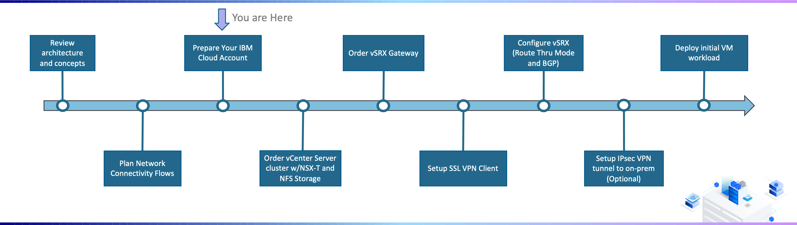

{:step: data-tutorial-type='step'}
{:java: #java .ph data-hd-programlang='java'}
{:swift: #swift .ph data-hd-programlang='swift'}
{:ios: #ios data-hd-operatingsystem="ios"}
{:android: #android data-hd-operatingsystem="android"}
{:shortdesc: .shortdesc}
{:new_window: target="_blank"}
{:codeblock: .codeblock}
{:screen: .screen}
{:tip: .tip}
{:pre: .pre}
{:important: .important}
{:note: .note}

# Prepare Your IBM Cloud Account
{: #vmware-onboarding-prepare-account}
{: toc-content-type="tutorial"}
{: toc-services="vmwaresolutions"}
{: toc-completion-time="1h"}

<!--##istutorial#-->
This tutorial may incur costs. Use the [Cost Estimator](https://{DomainName}/estimator/review) to generate a cost estimate based on your projected usage.
{: tip}

<!--#/istutorial#-->

## Objectives
{: #vmware-onboarding-resource-groups-iam-objectives}

In this section ...... 

{: class="center"}

<!--##istutorial#-->
## Enable VRF and Service Endpoints
{: #vmware-onboarding-prepare-account-vrf}

TODO. Lorem ipsum dolor sit amet, consectetur adipiscing elit. Fusce ipsum ipsum, vestibulum in odio sed, mollis ultricies felis. Suspendisse eget rutrum enim, sit amet tempus velit. Phasellus rhoncus ligula et eleifend interdum. Praesent sit amet urna ac lacus varius vehicula. Sed in quam auctor, vehicula quam sit amet, finibus ipsum. Vivamus ac sem id odio dictum tempor. Integer sollicitudin metus tellus, id vehicula nisi viverra eu. Quisque ac leo tristique, dignissim elit vel, gravida massa. Mauris quis ligula dui. Mauris dignissim, neque quis congue rhoncus, mi libero eleifend quam, et commodo urna orci sed tortor. Nam turpis justo, suscipit auctor lacus nec, bibendum aliquam lacus. Morbi commodo placerat nisi. Nam mattis, lorem quis tempor aliquet, turpis justo faucibus nisi, ut maximus leo diam id tortor. Aliquam non dui in diam finibus viverra eget sit amet justo.

<!--#/istutorial#-->

## Configure IAM
{: #vmware-onboarding-prepare-account-iam}

TODO. Lorem ipsum dolor sit amet, consectetur adipiscing elit. Fusce ipsum ipsum, vestibulum in odio sed, mollis ultricies felis. Suspendisse eget rutrum enim, sit amet tempus velit. Phasellus rhoncus ligula et eleifend interdum. Praesent sit amet urna ac lacus varius vehicula. Sed in quam auctor, vehicula quam sit amet, finibus ipsum. Vivamus ac sem id odio dictum tempor. Integer sollicitudin metus tellus, id vehicula nisi viverra eu. Quisque ac leo tristique, dignissim elit vel, gravida massa. Mauris quis ligula dui. Mauris dignissim, neque quis congue rhoncus, mi libero eleifend quam, et commodo urna orci sed tortor. Nam turpis justo, suscipit auctor lacus nec, bibendum aliquam lacus. Morbi commodo placerat nisi. Nam mattis, lorem quis tempor aliquet, turpis justo faucibus nisi, ut maximus leo diam id tortor. Aliquam non dui in diam finibus viverra eget sit amet justo.

<!--#/istutorial#-->

## Setup Resource Group
{: #vmware-onboarding-prepare-account-resource-groups}

TODO. Lorem ipsum dolor sit amet, consectetur adipiscing elit. Fusce ipsum ipsum, vestibulum in odio sed, mollis ultricies felis. Suspendisse eget rutrum enim, sit amet tempus velit. Phasellus rhoncus ligula et eleifend interdum. Praesent sit amet urna ac lacus varius vehicula. Sed in quam auctor, vehicula quam sit amet, finibus ipsum. Vivamus ac sem id odio dictum tempor. Integer sollicitudin metus tellus, id vehicula nisi viverra eu. Quisque ac leo tristique, dignissim elit vel, gravida massa. Mauris quis ligula dui. Mauris dignissim, neque quis congue rhoncus, mi libero eleifend quam, et commodo urna orci sed tortor. Nam turpis justo, suscipit auctor lacus nec, bibendum aliquam lacus. Morbi commodo placerat nisi. Nam mattis, lorem quis tempor aliquet, turpis justo faucibus nisi, ut maximus leo diam id tortor. Aliquam non dui in diam finibus viverra eget sit amet justo.

<!--#/istutorial#-->

Federate Active Directory

## Next Steps
{: #vmware-onboarding-resource-groups-iam-next-steps}

The next step in the tutorial series is:

* [Setup SSL VPN Client](/docs/solution-tutorials?topic=solution-tutorials-vmware-onboarding-ssl-vpn-client)
