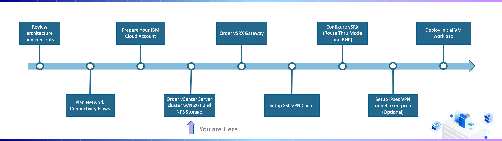
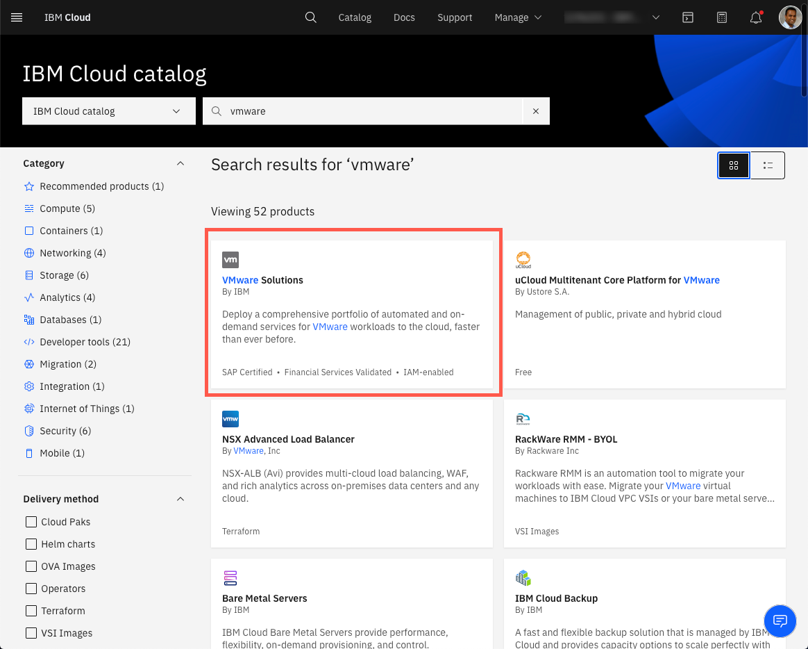
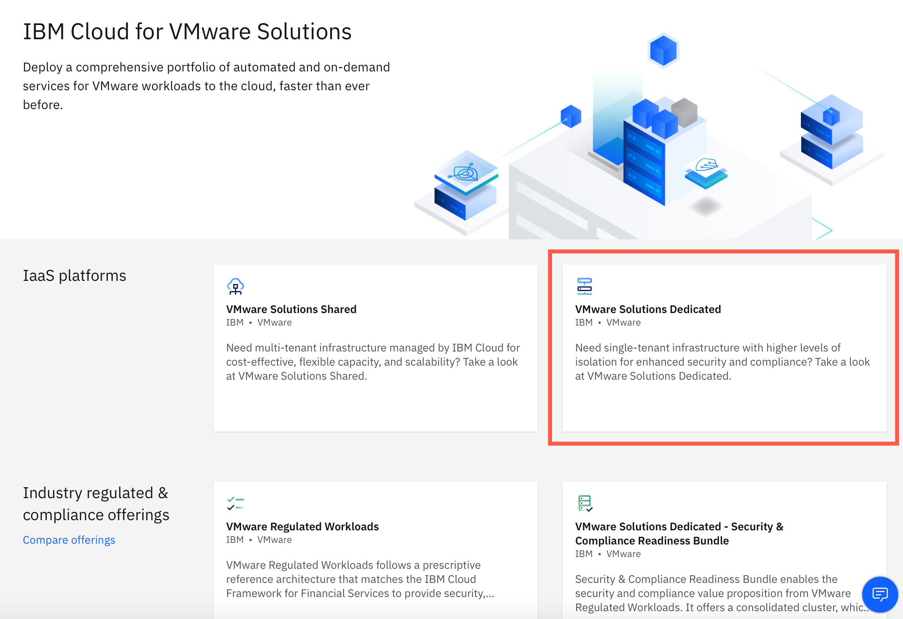
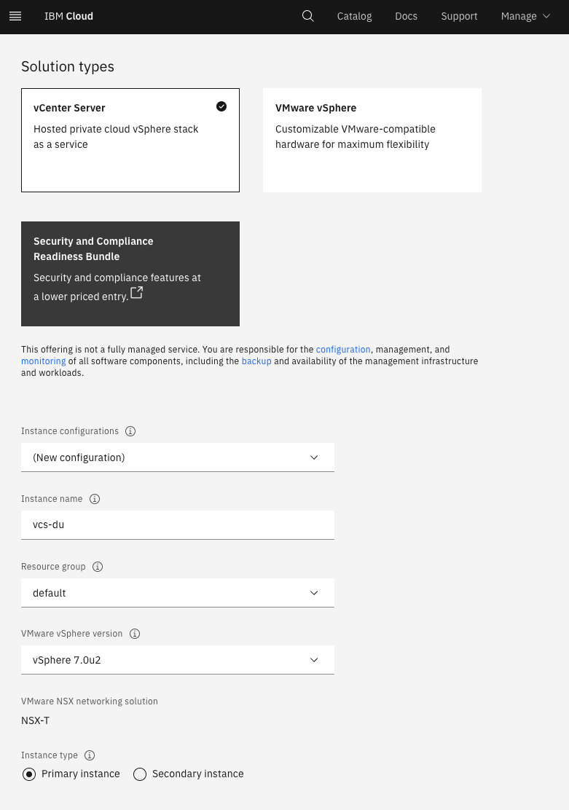
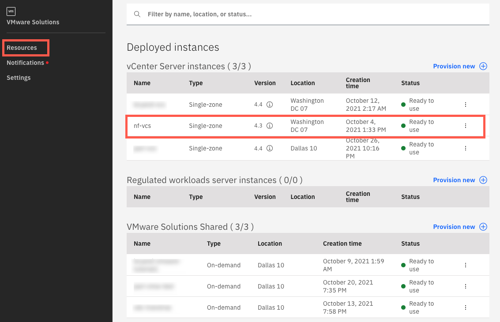

{:step: data-tutorial-type='step'}
{:java: #java .ph data-hd-programlang='java'}
{:swift: #swift .ph data-hd-programlang='swift'}
{:ios: #ios data-hd-operatingsystem="ios"}
{:android: #android data-hd-operatingsystem="android"}
{:shortdesc: .shortdesc}
{:new_window: target="_blank"}
{:codeblock: .codeblock}
{:screen: .screen}
{:tip: .tip}
{:pre: .pre}
{:important: .important}
{:note: .note}

# Order vCenter Server cluster w/NSX-T and Storage
{: #vmware-onboarding-order-cluster-storage}

## Journey Map
{: #vmware-onboarding-order-cluster-storage-map}

{: class="center"}

In this section of the deployment journey, a VCS environment ordered. The information below will focus on commonly used configuration. 

Ordering a VCS environment is accomplished via an ordering form in the IBM Cloud Catalog. Automated deployment will provision the required VLANs, bare metal servers, and VCS software. For the purposes of this guide, the following assumptions are being made:

- A single VMware instance (cluster) to be located in Washington 07 
- vSphere 7.0 with NSX-T
- 6 hosts (bare metal servers) each running Intel Xeon Gold 5218 with 192GB RAM
- 5TB of NFS storage 

<!--##istutorial#-->

## Detailed Steps
{: #vmware-onboarding-order-cluster-storage-provision}

{: step}

1. Login to the IBM Cloud and navigate to the IBM Cloud Catalog. Search for and click on the VMware Solutions tile:

   {: class="center"}
   
   
   
1. Select the VMware Solutions Dedicate resource.

   {: class="center"}
   
   
   
1. Based on the previously stated assumptions, the following options were selected during the ordering process. Please refer to the walk through video and/or documentation for additional considerations around the options selected.

   {: class="center"}

   

   **Solution type:**

   * Server Type: vCenter Server
   * Instance configuration: New Configuration
   * VMware vSphere Version: vSphere 7.0u2
   * Instance type: Primary instance

   **Licensing:**

   * vCenter Server - Standard: Include with purchase
   * vSphere Enterprise Plus:  Include with purchase
   * NSX:  Include with purchase, NSX-T Advanced license

   **Consolidated cluster:**

   - Location: <Select a zone for example wdc07>
   - CPU Generation: Cascade Lake
   - CPU model: Gold 5128
   - RAM: 192GB
   - Number of servers: 6
   - Storage: NFS storage
   - Configure shares individually: leave unchecked
   - Number of shares: 1
   - Size: 5000
   - Performance : 2IOPS/GB
   - Networking type: Public and private network
   - Uplink speed: 10GB
   - VLANs: Order new VLANs

   **Workload cluster:**

   - Include a separate, additional workload cluster: leave unchecked

   **Edge servers cluster:**

   - Edge services cluster: leave unchecked

   **Network interface:**

   - Hostname prefix: <enter a hostname for example esxi-0>
   - Domain name: <enter a domain name for example wdc07.mycompany.local>
   - DNS configuration: Single public Windows VSI for Active Directory/DNS

   **Recommended services:**

   - No recommended or optional services at this time
     

1. Once complete the provisioned instance will appear in the VMware Solutions Resources view. 

{: class="center"}

<!--#/istutorial#-->

## Next Steps
{: #vmware-onboarding-order-cluster-storage-next-steps}

The next step on the deployment journey is:

* [Order vSRX Gateway](/docs/solution-tutorials?topic=solution-tutorials-vmware-onboarding-vsrx-gateway)
