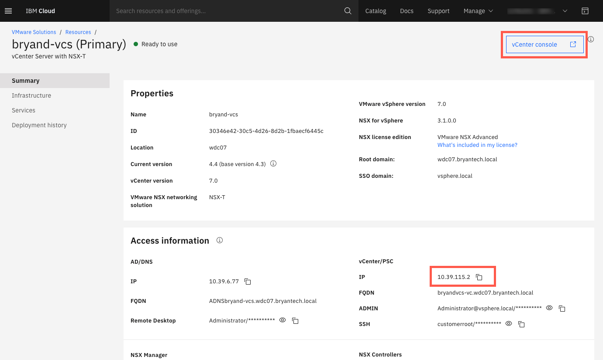

{:step: data-tutorial-type='step'}
{:java: #java .ph data-hd-programlang='java'}
{:swift: #swift .ph data-hd-programlang='swift'}
{:ios: #ios data-hd-operatingsystem="ios"}
{:android: #android data-hd-operatingsystem="android"}
{:shortdesc: .shortdesc}
{:new_window: target="_blank"}
{:codeblock: .codeblock}
{:screen: .screen}
{:tip: .tip}
{:pre: .pre}
{:important: .important}
{:note: .note}

# Setup SSL VPN Client
{: #vmware-onboarding-ssl-vpn-client}
{: toc-content-type="tutorial"}
{: toc-services="vmwaresolutions"}
{: toc-completion-time="1h"}

<!--##istutorial#-->
The SSL VPN client establishes connectivity with the IBM Cloud Classic Infra. This allows you to connect to the 10.x.x.x IPs of the  VCS Cluster for managemenet and configuration purposes.  For production, businesses will establish network connectivity to the IBM Cloud Classic Infra via Direct Link or Site-to-Site VPN, but having the SSL VPN client configured is useful for initial configuration and/or to serve as a backup.
{: tip}

<!--#/istutorial#-->

## Video Walk Through
{: #vmware-onboarding-ssl-vpn-client-video-intro}

<!--##istutorial#-->
## Detailed Instructions
{: #vmware-onboarding-ssl-vpn-client-instructions}

Complete the steps on the VPN [Getting started](https://{DomainName}/docs/iaas-vpn?topic=iaas-vpn-getting-started#enable-user-vpn-access) page to:

1. Enable SSL VPN access for your account
2. Set the SSL VPN password
3. Login to the VPN

Once connected, validate connectivity by pinging the vCenter IP and/or opening the vCenter console:

{: class="center"}

<!--#/istutorial#-->

## Next Steps
{: #vmware-onboarding-ssl-vpn-client-next-steps}

The next step in the tutorial series is:

* [Order vCenter Server cluster w/NSX-T and NFS Storage](/docs/solution-tutorials?topic=solution-tutorials-vmware-onboarding-order-cluster-storage)

