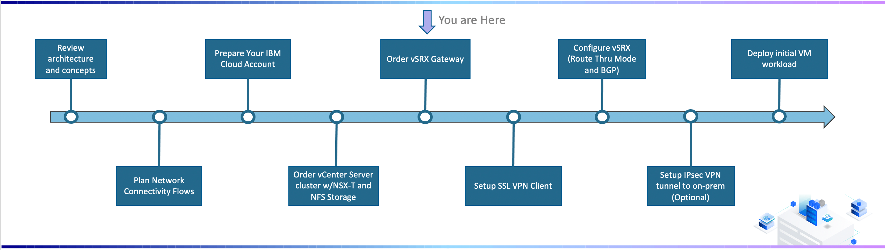
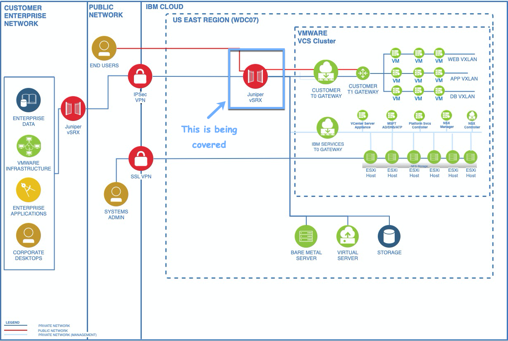
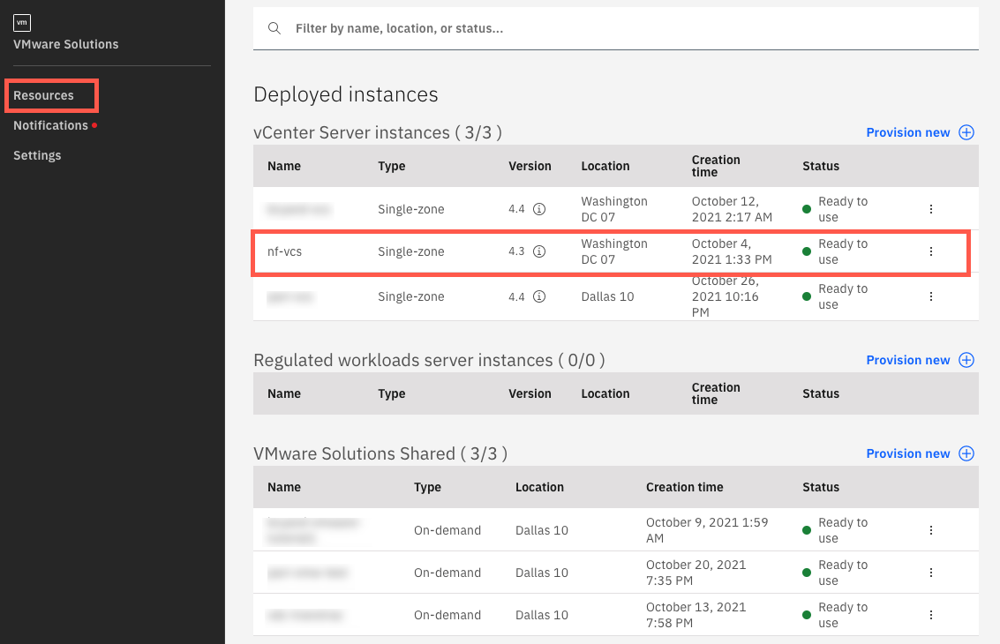
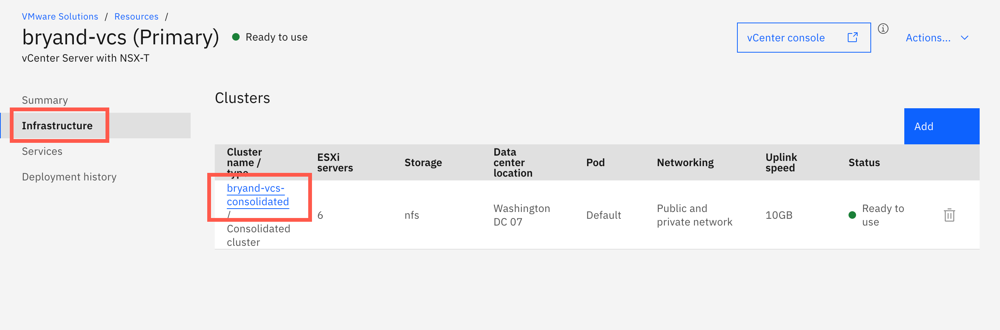
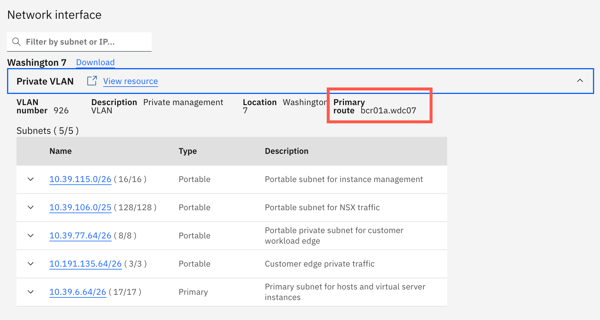
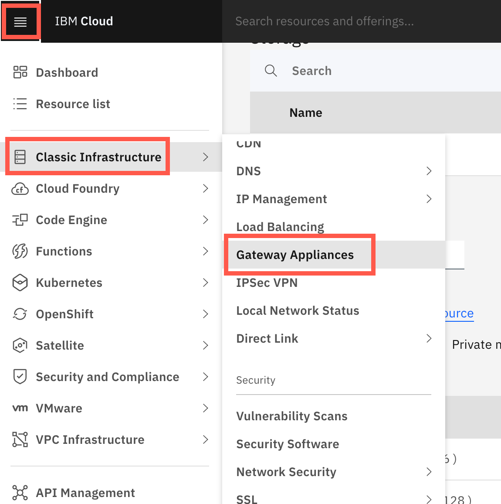
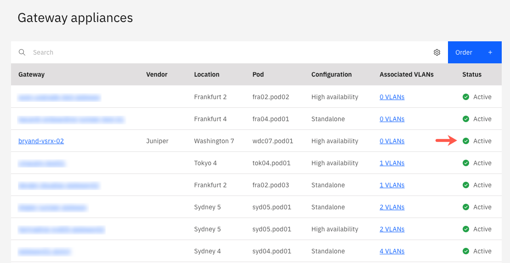

{:step: data-tutorial-type='step'}
{:java: #java .ph data-hd-programlang='java'}
{:swift: #swift .ph data-hd-programlang='swift'}
{:ios: #ios data-hd-operatingsystem="ios"}
{:android: #android data-hd-operatingsystem="android"}
{:shortdesc: .shortdesc}
{:new_window: target="_blank"}
{:codeblock: .codeblock}
{:screen: .screen}
{:tip: .tip}
{:pre: .pre}
{:important: .important}
{:note: .note}

# Order vSRX Gateway
{: #vmware-onboarding-vsrx-gateway}
{: toc-content-type="tutorial"}
{: toc-services="vmwaresolutions"}
{: toc-completion-time="1h"}

<!--##istutorial#-->
For this deployment journey, a vSRX device is used. Other gateway devices may also be used and similar concepts will apply..
{: tip}

<!--#/istutorial#-->

## Overview
{: #vmware-onboarding-vsrx-gateway-objectives}

In this section of the deployment journey, a gateway device is ordered. The information below will focus on one of our commonly used gateway devices, a vSRX. However, concepts can be applied to others as well.

{: class="center"}

<!--##istutorial#-->

The gateway device both provides a network boundary protecting all traffic entering and leaving the VCS environment as well as the ability to exchange the overlay network with your on-premise environment. 

{: class="center"}

## Detailed Steps

{: #vmware-onboarding-vsrx-gateway-prereqs}

{: step}

1. Go to the VMware Solutions Resources view and select the vCenter server instance.

   

1. Go to the Infrastructure tab and select the cluster.

   

1. Scroll down and under network interface expand private VLAN. You will see a field named primary route which will have a value like bcr01a.wdc07 in the example below. This designates that the VCS cluster is in Washington DC 07, POD 1. <u>Take note of this information as is will be needed for the vSRX order</u>.

   

1. From the hamburger menu choose Classic Infrastructure > Gateway Appliances (or go to https://{DomainName}/gen1/infrastructure/provision/gateway).
   

   

1. Choose to order a new gateway device.  
   

   **Resource details:**

   * Vendor: Juniper

   - Version: 20.4R2-S2 (which is the latest version at this time). While a 1Gpbs is available the VCS is 10Gbps.
   - License: Choose standard. 
   - Hostname: <enter a hostname for example nf-gw01>
   - Domain name: <enter a domain for example wdc07.mycompany.local>
   - High Availability: We strongly recommend High availability remain checked
   - HA hostname: <enter a hostname for example nf-gw02>
   - HA domain: <enter a domain for example wdc07.mycompany.local>

   **Location:**

   - Location: Choose the data center your VCS is deployed in (In the example WDC07 is selected as that matches the VCS.)

   * Pod: Choose the pod your VCS is deployed in. (In this example, wdc07.pod01 is selected because "bcr01a – pod01" was derived from the previous step.)

   **Server profile:**

   - Server profile: The default selection (Intel Xeon 5218) may be used.
   - RAM: the default selection (32GB) may be used.
   - SSH keys: As vSRX’s are shared devices between multiple administrators we recommend that no key be added at this time and keys be added manually later.

   **Server profile:**

   - Storage disks: The default selection can be used.

   **Network interface:**

   - Interface: Public and private
   - Port redunancy: Automatic
   - Port speed: 10Gbps

   **Add-ons:**

   - All the remaining fields can be left at default.

   

1. Review the order and when satisfied click create.  Once complete, your device will have an Active status (as shown in the figure below).

   

<!--#/istutorial#-->

## Next Steps
{: #vmware-onboarding-vsrx-gateway-next-steps}

The next step in the series is:

* [Configure the Network and vSRX routing (BGP)](/docs/solution-tutorials?topic=solution-tutorials-vmware-onboarding-bgp)
