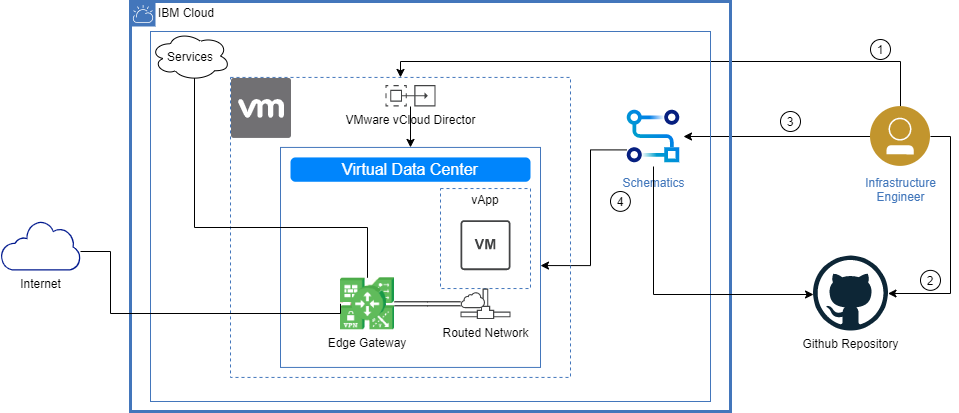
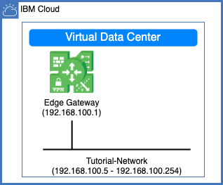
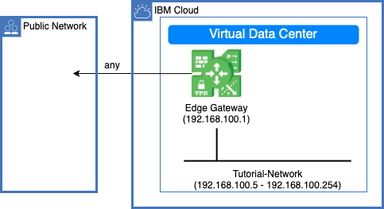
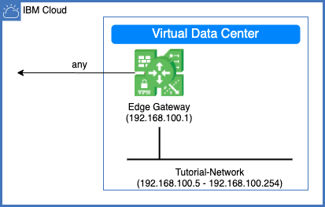
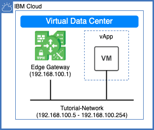
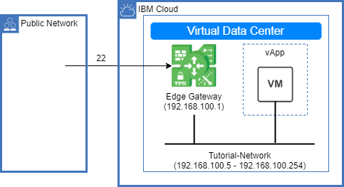

{:step: data-tutorial-type='step'}
{:java: #java .ph data-hd-programlang='java'}
{:swift: #swift .ph data-hd-programlang='swift'}
{:ios: #ios data-hd-operatingsystem="ios"}
{:android: #android data-hd-operatingsystem="android"}
{:shortdesc: .shortdesc}
{:new_window: target="_blank"}
{:codeblock: .codeblock}
{:screen: .screen}
{:tip: .tip}
{:pre: .pre}
{:important: .important}
{:note: .note}

# Getting Started with {{site.data.keyword.vmwaresolutions_short}} Shared
{: #vmware-solutions-shared-getting-started}
{: toc-content-type="tutorial"}
{: toc-services="vmwaresolutions, schematics"}
{: toc-completion-time="2h"}

<!--##istutorial#-->
This tutorial may incur costs. Use the [Cost Estimator](https://{DomainName}/estimator/review) to generate a cost estimate based on your projected usage.
{: tip}

<!--#/istutorial#-->

On {{site.data.keyword.Bluemix_notm}} there are a number of [deployment offerings](https://{DomainName}/docs/vmwaresolutions?topic=vmwaresolutions-getting-started#getting-started-depl-offerings) for VMware that you can choose from, with each providing a different level of abstraction. VMware Cloud Director (VCD) is offered under the banner of {{site.data.keyword.vmwaresolutions_short}} Shared. It is a multi-tenant service with elasticity and two subscription types: 
- On-demand where vCPU and RAM are allocated as needed and priced on an hourly basis.
- Reserved where vCPU and RAM are pre-allocated and priced monthly. 
{: shortdesc}

VMware changed the name of VMware **vCloud** Director to VMware **Cloud** Director, you may see references in the UI and/or related documentation of one or the other, they are the same product.
{: tip}

## Objectives
{: #vmware-solutions-shared-getting-started-objectives}

* Create and explore a {{site.data.keyword.vmwaresolutions_short}} Shared instance in the {{site.data.keyword.Bluemix_notm}}.
* Create a {{site.data.keyword.bpshort}} workspace in the {{site.data.keyword.Bluemix_notm}} to run Infrastructure as Code(IaC) based on Terraform.
* Use {{site.data.keyword.bpshort}} to create a network, firewall, source network address translation (SNAT), destination network address translation (DNAT) rules, and deploy a virtual machine instance in VMware Virtual Data Center via a Terraform template.


{: class="center"}
{: style="text-align: center;"}


1. Create a {{site.data.keyword.vmwaresolutions_short}} Shared virtual data center (VDC) instance using the {{site.data.keyword.Bluemix_notm}} console. With each VDC created, an edge gateway is provided and is capable of routing traffic to the Internet and to the {{site.data.keyword.Bluemix_notm}} private network for connectivity to other {{site.data.keyword.Bluemix_notm}} services.
2. Review a Terraform template that will be used to configure and create resources in the VDC:
    - Create a routed network, this type of network provides controlled access to machines outside of the VDC via an edge gateway.
    - Create firewall and SNAT rules on the edge gateway to allow traffic to the Internet and to the {{site.data.keyword.Bluemix_notm}} private network.
    - Create a vApp and configure it to use the routed network.
    - Create a virtual machine instance inside of the vApp.
    - Create firewall and DNAT rules on the edge gateway to allow SSH from the Internet to the virtual machine.
3. Create a {{site.data.keyword.bpshort}} Workspace using the {{site.data.keyword.Bluemix_notm}} console.
4. Use the {{site.data.keyword.bplong_notm}} service to apply the Terraform template and create the resources in the VDC.

<!--##istutorial#-->
## Before you begin
{: #vmware-solutions-shared-getting-started-prereqs}

This tutorial requires:
* An {{site.data.keyword.cloud_notm}} [billable account](https://{DomainName}/docs/account?topic=account-accounts), 
* Follow the steps outlined under the VMware Solutions documentation for [Setting up your environment for your first order](https://{DomainName}/docs/vmwaresolutions?topic=vmwaresolutions-completing_checklist).

A GitHub account is optional and only required if you plan on modifying the provided Terraform template beyond the steps outlined in this tutorial.
{: tip}

<!--#/istutorial#-->

## Create services
{: #vmware-solutions-shared-getting-started-create_services}
{: step}

Login to {{site.data.keyword.cloud_notm}} via a web browser to create the {{site.data.keyword.vmwaresolutions_short}} Shared virtual data center instance with the desired vCPU and RAM configuration.

### {{site.data.keyword.vmwaresolutions_short}} Shared
{: #vmware-solutions-shared-getting-started-create-vmware-solutions-shared}

1. Navigate to [{{site.data.keyword.vmwaresolutions_short}} Shared](https://{DomainName}/infrastructure/vmware-solutions/console).
2. In the **IaaS platforms** section, click the **VMware Solutions Shared** card.
3. For **Pricing Plans**, select `On-Demand`.
4. Enter the virtual data center name, i.e. `vmware-tutorial`.
5. Select the **Resource group** where to create the service instance.
6. Select the {{site.data.keyword.Bluemix_notm}} data center to host the instance, i.e. `Dallas`.
7. Scroll to **Virtual data center capacity** and set the **vCPU Limit** to `4 vCPU` and the **RAM Limit** to `16 GB`.  You may increase or reduce the capacity as needed later on. 
8. From the **Summary** pane on the right side of the screen, verify the configuration and estimated cost.
9. After having read and agreed to the third-party service agreements, click on **Create**. While waiting for the instance to create, proceed to review the Terraform template section of this tutorial and come back to perform access steps below once the instance is available.

### Access the {{site.data.keyword.vmwaresolutions_short}} Shared Instance
{: #vmware-solutions-shared-getting-started-access-vmware-solutions-shared}

1. Navigate to the [{{site.data.keyword.vmwaresolutions_short}} Shared instances](https://{DomainName}/infrastructure/vmware-solutions/console/instances) page.
2. Click on the newly created instance `vmware-tutorial`.
3. Click on **Set Organization Admin Password**, and copy the password (`vcd_password`) for the **admin** user (`vcd_user`) when it is presented on the screen.
4. With your password created, click on the **vCloud Director console** button found on the top right of the page and login with your credentials.
5. Select the virtual data center and in the left navigation click on **Edges** under the **Networking** category.  Take note of the name of the edge gateway (`vdc_edge_gateway_name`). 
6. Click on the radio button next to the edge gateway name, at the top of the page, click on **Enable Distributed Routing**. You can proceed to the next steps, however come back to confirm the status of distributed routing is **enabled** prior to running the [Terraform plan](#vmware-solutions-shared-getting-started-create-schematics).
7. Change to **Administration** from the main toolbar. Click on **General** under the **Settings** category and take note of the **Organization name**. It is your virtual cloud director organization (`vcd_org`).

| Name | Description | Default |
|----------|---------|---------|
| vcd_user | vCloud Director username |  |
| vcd_password | vCloud Director instance password |  |
| vcd_org | vCloud Director organization name |  |
| vcd_url | vCloud Director url | https://daldir01.vmware-solutions.cloud.ibm.com/api |
| vdc_edge_gateway_name | vCloud Director edge gateway name |  |
| vdc_name | vCloud Director virtual data center name/id | vmware-tutorial |
| allow_ssh | Set to false to not configure SSH into the VM | true |
{: caption="Table 1. Use the following table to confirm that you have all of the information you will need for use later on." caption-side="top"}

## Review the Terraform template
{: #vmware-solutions-shared-getting-started-review_terraform_template}
{: step}

[Terraform](https://www.terraform.io/) is an open-source infrastructure as code tool. It enables users to define and provision a data center infrastructure using a high-level configuration language known as Hashicorp Configuration Language (HCL). Configuration files (Terraform template) describe to Terraform the components needed to run a single application or your entire datacenter.  

In a previous step you created a virtual data center(VDC). This tutorial includes a Terraform template available in a [public Github repository](https://github.com/IBM-Cloud/vmware-solutions-shared) which will be used to configure and deploy resources in that VDC. 

The `main.tf` file contains most of the critical sections for this template.

### Create a routed network
{: #vmware-solutions-shared-getting-started-create_routed_network}

An organization VDC network with a routed connection provides controlled access to machines and networks outside of the organization VDC.  The following section creates a routed network and connects it to the existing edge gateway. The template also specifies a static IP pool and DNS servers for the network. 



```terraform
  resource "vcd_network_routed" "tutorial_network" {

    name         = "Tutorial-Network"
    edge_gateway = module.ibm_vmware_solutions_shared_instance.edge_gateway_name
    gateway      = "192.168.100.1"

    interface_type = "distributed"

    static_ip_pool {
      start_address = "192.168.100.5"
      end_address   = "192.168.100.254"
    }

    dns1 = "9.9.9.9"
    dns2 = "1.1.1.1"
  }
```

### Create a firewall and SNAT rule to access the Internet
{: #vmware-solutions-shared-getting-started-create_internet_rules}

You can create rules to allow or deny traffic, this section creates a firewall and SNAT rule to allow traffic from the VDC network to reach the Internet with no additional restrictions.



```terraform
  resource "vcd_nsxv_firewall_rule" "rule_internet" {
    edge_gateway = module.ibm_vmware_solutions_shared_instance.edge_gateway_name
    name         = "${vcd_network_routed.tutorial_network.name}-Internet"

    action = "accept"

    source {
      org_networks = [vcd_network_routed.tutorial_network.name]
    }

    destination {
      ip_addresses = []
    }

    service {
      protocol = "any"
    }
  }

  resource "vcd_nsxv_snat" "rule_internet" {
    edge_gateway = module.ibm_vmware_solutions_shared_instance.edge_gateway_name
    network_type = "ext"
    network_name = module.ibm_vmware_solutions_shared_instance.default_gateway_network

    original_address   = "${vcd_network_routed.tutorial_network.gateway}/24"
    translated_address = module.ibm_vmware_solutions_shared_instance.default_external_network_ip
  }
```

### Create a firewall rule to access the IBM Cloud private network
{: #vmware-solutions-shared-getting-started-create_private_rules}

You can create rules to allow or deny traffic, this section creates a rule to allow traffic from the VDC network to the IBM Cloud private network with no additional restrictions. This will enable your virtual machines to access other IBM Cloud services, such as AI, cloud databases, storage without going over the Internet. 



```terraform
  resource "vcd_nsxv_firewall_rule" "rule_ibm_private" {
    edge_gateway = module.ibm_vmware_solutions_shared_instance.edge_gateway_name
    name         = "${vcd_network_routed.tutorial_network.name}-IBM-Private"

    logging_enabled = "false"
    action          = "accept"

    source {
      org_networks = [vcd_network_routed.tutorial_network.name]
    }

    destination {
      gateway_interfaces = [module.ibm_vmware_solutions_shared_instance.external_networks_2]
    }

    service {
      protocol = "any"
    }
  }

  resource "vcd_nsxv_snat" "rule_ibm_private" {
    edge_gateway = module.ibm_vmware_solutions_shared_instance.edge_gateway_name
    network_type = "ext"
    network_name = module.ibm_vmware_solutions_shared_instance.external_networks_2

    original_address   = "${vcd_network_routed.tutorial_network.gateway}/24"
    translated_address = module.ibm_vmware_solutions_shared_instance.external_network_ips_2
  }
```

### Create vApp and VM
{: #vmware-solutions-shared-getting-started-create_vm}

A vApp consists of one or more virtual machines that communicate over a network and use resources and services in a deployed environment. This section creates a vApp, attaches the routed network, and adds a virtual machine to it. The virtual machine is configured with 8 GB of RAM, 2 vCPUs, and based on a CentOS template from the Public catalog.



```terraform
  resource "vcd_vapp" "vmware_tutorial_vapp" {
    name = "vmware-tutorial-vApp"
  }

  resource "vcd_vapp_org_network" "tutorial_network" {
    vapp_name        = vcd_vapp.vmware_tutorial_vapp.name
    org_network_name = vcd_network_routed.tutorial_network.name
  }

  resource "vcd_vapp_vm" "vm_1" {
    vapp_name     = vcd_vapp.vmware_tutorial_vapp.name
    name          = "vm-centos8-01"
    catalog_name  = "Public Catalog"
    template_name = "CentOS-8-Template-Official"
    memory        = 8192
    cpus          = 2

    guest_properties = {
      "guest.hostname" = "vm-centos8-01"
    }

    network {
      type               = "org"
      name               = vcd_vapp_org_network.tutorial_network.org_network_name
      ip_allocation_mode = "POOL"
      is_primary         = true
    }
  }
```

### Create a firewall rule to allow to SSH into the VM from the Internet
{: #vmware-solutions-shared-getting-started-create_ssh_rules}

You can create rules to allow or deny traffic, this section creates a rule to allow SSH from the Internet to the VM. 



This tutorial does not get into securing SSH, it is recommended that you configure the VM to use Public/Private keys for SSH authentication. The VM deployed in this tutorial is CentOS and you can read their [Securing SSH](https://wiki.centos.org/HowTos/Network/SecuringSSH) documentation.
{: tip}

In vCloud Director you can `Launch Web Console` or `Launch VM Remote Console` from the card of the VM.  If you prefer to use that facility to access the VM and do not want to configure SSH directly into the VM, set the `allow_ssh` variable in Terraform to false. You can also toggle it as needed and re-apply the plan in Schematics.
{: tip}

```terraform
  resource "vcd_nsxv_firewall_rule" "rule_internet_ssh" {
    count = var.allow_ssh == true ? 1 :0

    edge_gateway = module.ibm_vmware_solutions_shared_instance.edge_gateway_name
    name         = "${vcd_network_routed.tutorial_network.name}-Internet-SSH"

    action = "accept"

    source {
      ip_addresses = []
    }

    destination {
      ip_addresses = [module.ibm_vmware_solutions_shared_instance.default_external_network_ip]
    }

    service {
      protocol = "tcp"
      port     = 22
    }
  }

  resource "vcd_nsxv_dnat" "rule_internet_ssh" {
    count = var.allow_ssh == true ? 1 :0

    edge_gateway = module.ibm_vmware_solutions_shared_instance.edge_gateway_name
    network_type = "ext"
    network_name = module.ibm_vmware_solutions_shared_instance.default_gateway_network

    original_address = module.ibm_vmware_solutions_shared_instance.default_external_network_ip
    original_port    = 22

    translated_address = vcd_vapp_vm.vm_1.network[0].ip
    translated_port    = 22
    protocol           = "tcp"
  }
```

## Deploy using Schematics
{: #vmware-solutions-shared-getting-started-deploy_using_schematics}
{: step}

{{site.data.keyword.bplong_notm}} delivers Terraform-as-a-Service so that you can use a high-level scripting language to model the resources that you want in your {{site.data.keyword.Bluemix_notm}} environment, and enable Infrastructure as Code (IaC). You can organize your IBM Cloud resources across environments by using workspaces. Every workspace is connected to a GitHub repository that contains a set of Terraform configuration files, which build a Terraform template. Use {{site.data.keyword.bpshort}} to connect to the template hosted in GitHub which was reviewed above to configure networking and deploy a virtual machine.

### {{site.data.keyword.bplong_notm}}
{: #vmware-solutions-shared-getting-started-create-schematics}

1. Navigate to the [{{site.data.keyword.bplong_notm}}](https://{DomainName}/schematics/overview) overview page and click **Create a workspace**.
2. On the page, enter the link to our GitHub repository where our Terraform template for this tutorial is stored, `https://github.com/IBM-Cloud/vmware-solutions-shared`. 
3. Select `terraform_v0.15` as the **Terraform version**. Click **Next**.
4. Enter the workspace name for your workspace, i.e. `vmware-tutorial`.
5. Select the resource group and location of the workspace, you can also add tags and description as needed.
6. Click **Next** and then **Create** to create your workspace. Your workspace is created and the workspace Settings page opens.
7. In the Input variables section, enter the information that was previously captured from the VMware vCloud Director console. 

   Some values have defaults which are appropriate to keep for this tutorial.
   {: tip}

   Set the Sensitive flag for the **vcd-password** variable to that the value is not displayed in the workspace and/or logs.
   {: tip}

8. Scroll to the top of the page and click on **Generate Plan** to create the execution plan, review the logs and confirm it was successful.
9. Click on **Apply plan** to create the resources. Review the logs and confirm it was successful.  Capture the information provided under the **Outputs** section. 

## Access deployed virtual machine and test 
{: #vmware-solutions-shared-getting-started-access-virtual-machine}
{: step}

1. Connect to the virtual machine with `ssh` using the user `root` and the password as shown in the logs above. You are required to change the password on the first login.
2. Test connectivity to the Internet by pinging known addresses on the Internet, i.e. `ping 8.8.8.8`. 
3. Test connectivity to the IBM Cloud by pinging internal addresses, i.e. [IBM Cloud private DNS resolver endpoint](https://{DomainName}/docs/vpc?topic=vpc-service-endpoints-for-vpc#dns-domain-name-system-resolver-endpoints) or [Ubuntu and Debian APT Mirrors](https://{DomainName}/docs/vpc?topic=vpc-service-endpoints-for-vpc#ubuntu-apt-mirrors).

   If you did not allow_ssh as described under [Create a firewall rule to allow to SSH into the VM from the Internet](#create_ssh_rules), you can use the following steps instead to access the virtual machine.
    - Navigate to the [{{site.data.keyword.vmwaresolutions_short}} Shared instances](https://{DomainName}/infrastructure/vmware-solutions/console/instances) page.
    - Click on the instance `vmware-tutorial` instance.
    - Click on the **vCloud Director console** button found on the top right of the page.
    - Click on **Virtual Machines** 
    - On the card for the `vm-centos8-01` virtual machine, click on **Details** 
    - Scroll down to **Guest OS Customization** and expand the section. Capture the password for the instance. 
    - Back at the **Virtual Machines** page, click on **Actions**  and then **Launch Web Console**. 
    - Login to the instance using the user `root` and the password captured above. You will be required to change the password. Change it to a password of your choice and proceed to login.

## Remove resources
{: #vmware-solutions-shared-getting-started-removeresources}
{: step}

1. Navigate to [{{site.data.keyword.bpshort}}](https://{DomainName}/schematics/workspaces) workspaces and select your workspace.
2. Click on the **Actions...** drop down and click **Destroy** to clean up all the resources that were provisioned via Schematics.
3. Click on the **Actions...** drop down and click **Delete workspace** to delete the workspace.
4. Navigate to the [{{site.data.keyword.vmwaresolutions_short}} Resources](https://{DomainName}/infrastructure/vmware-solutions/console/instances).
5. Delete the `vmware-tutorial` instance listed under the **VMware Solutions Shared** section.

## Expand the tutorial 
{: #vmware-solutions-shared-getting-started-7}

Want to add to or change this tutorial? Here are some ideas:
- Create a fork of the `vmware-solutions-shared` repository and modify it to include additional virtual machines and create a new Schematics workspace to use it. 
- Add to the template to configure the virtual machine for secure SSH.

## Related content
{: #vmware-solutions-shared-getting-started-related}

* [{{site.data.keyword.vmwaresolutions_short}} docs](https://{DomainName}/docs/vmwaresolutions?topic=vmwaresolutions-shared_overview)
* [{{site.data.keyword.bpshort}} docs](https://{DomainName}/docs/schematics?topic=schematics-getting-started)
* [{{site.data.keyword.vmwaresolutions_short}}](https://www.ibm.com/cloud/vmware)
* [VMware Cloud Director Documentation](https://docs.vmware.com/en/VMware-Cloud-Director/index.html)
